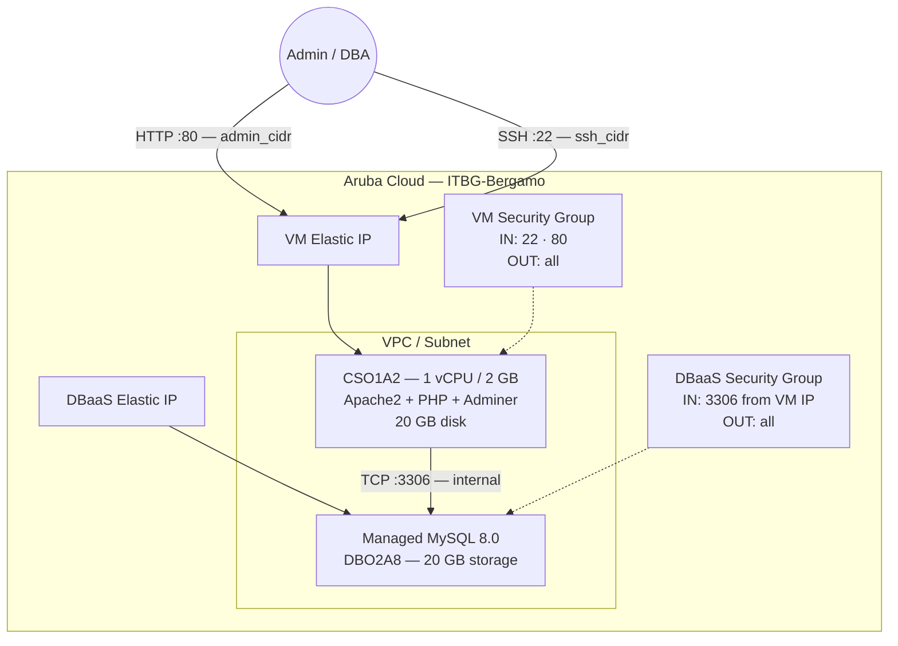

# Adminer on Aruba Cloud

Deploy [Adminer](https://www.adminer.org) — a lightweight, single-file PHP database administration tool — on Aruba Cloud using Terraform and cloud-init. This example provisions both the Adminer web interface and a ready-to-use managed MySQL DBaaS instance, so you can connect and start exploring your database immediately after `terraform apply`.

> **Provider version:** arubacloud/arubacloud `~> 0.5` | **Terraform:** ≥ 1.9

---

## Introduction

Adminer is a full-featured database management tool contained in a single PHP file. Compared to phpMyAdmin it is lighter, faster to deploy, and just as capable for day-to-day DB administration tasks. This example provisions:

- **Apache2 + PHP 8.1** — the smallest viable stack for Adminer
- **Adminer.php** downloaded directly from the official GitHub release
- **PHP database drivers** for MySQL (`php-mysql`), PostgreSQL (`php-pgsql`), and SQLite (`php-sqlite3`)
- **Managed MySQL 8.0 DBaaS** — a dedicated database instance with autoscaling storage
- **DBaaS user and database** — ready to connect out of the box
- Port 80 restricted to `admin_cidr` — Adminer is never exposed to the public internet

> **Security note:** Adminer has no built-in rate limiting or IP restriction. Always set `admin_cidr` to your specific management IP (e.g. `203.0.113.42/32`) and never deploy with the default `0.0.0.0/0` in production.

---

## Architecture Overview



---

## Infrastructure Created

| Resource | Name pattern | Description |
|----------|-------------|-------------|
| `arubacloud_project` | `adminer-prod` | Project container |
| `arubacloud_vpc` | `adminer-prod-vpc` | Virtual Private Cloud |
| `arubacloud_subnet` | `adminer-prod-subnet` | Subnet |
| `arubacloud_securitygroup` | `adminer-prod-vm-sg` | VM security group |
| `arubacloud_securitygroup` | `adminer-prod-dbaas-sg` | DBaaS security group |
| `arubacloud_securityrule` | `adminer-prod-vm-ssh` | SSH ingress (port 22) |
| `arubacloud_securityrule` | `adminer-prod-vm-admin-ui` | Adminer UI ingress (port 80) |
| `arubacloud_securityrule` | `adminer-prod-db-mysql` | MySQL ingress from VM IP only (port 3306) |
| `arubacloud_elasticip` | `adminer-prod-vm-eip` | VM public IP |
| `arubacloud_elasticip` | `adminer-prod-dbaas-eip` | DBaaS public IP |
| `arubacloud_blockstorage` | `adminer-prod-boot` | 20 GB boot disk (Performance) |
| `arubacloud_keypair` | `adminer-prod-keypair` | SSH public key |
| `arubacloud_cloudserver` | `adminer-prod-vm` | CloudServer VM |
| `arubacloud_dbaas` | `adminer-prod-dbaas` | Managed MySQL 8.0 instance |
| `arubacloud_database` | — | Default database inside the DBaaS |
| `arubacloud_dbaasuser` | — | DBaaS admin user |
| `arubacloud_databasegrant` | — | `liteadmin` grant on the default database |

---

## Estimated Monthly Cost

| Resource | Spec | Est. cost/mo |
|----------|------|-------------|
| CloudServer VM | CSO1A2 — 1 vCPU / 2 GB | ~€9 |
| Boot disk | 20 GB Performance | ~€3 |
| VM Elastic IP | — | ~€3 |
| Managed MySQL DBaaS | DBO2A8 — 20 GB | ~€30 |
| DBaaS Elastic IP | — | ~€3 |
| **Total** | | **~€48/mo** |

> Billed hourly when `billing_period = "Hour"`. Destroy the stack when not in use to avoid charges.

---

## Requirements

- Terraform ≥ 1.9
- ArubaCloud Terraform Provider `~> 0.5`
- An ArubaCloud account with OAuth2 API credentials

All other inputs (SSH key, passwords) have working defaults for try-out purposes.

---

## Variables

### Required

| Variable | Description |
|----------|-------------|
| `arubacloud_client_id` | ArubaCloud OAuth2 client ID |
| `arubacloud_client_secret` | ArubaCloud OAuth2 client secret |

### Optional

| Variable | Default | Description |
|----------|---------|-------------|
| `app_name` | `"adminer"` | Short name used in all resource names |
| `environment` | `"prod"` | Environment label |
| `location` | `"ITBG-Bergamo"` | ArubaCloud region |
| `zone` | `"ITBG-1"` | Availability zone |
| `billing_period` | `"Hour"` | `"Hour"` or `"Month"` |
| `vm_flavor` | `"CSO1A2"` | CloudServer flavor |
| `vm_image` | `"LU22-001"` | Boot disk image (Ubuntu 22.04 LTS) |
| `vm_disk_size_gb` | `20` | Boot disk size in GB |
| `ssh_public_key` | *(example key)* | SSH public key content |
| `ssh_cidr` | `"0.0.0.0/0"` | CIDR for SSH — restrict in production |
| `admin_cidr` | `"0.0.0.0/0"` | CIDR for Adminer UI — **always restrict** |
| `dbaas_flavor` | `"DBO2A8"` | Managed MySQL DBaaS flavor |
| `db_storage_gb` | `20` | Initial DBaaS storage in GB |
| `db_admin_user` | `"dbadmin"` | DBaaS admin username |
| `db_admin_password` | `"K7m@P4z!L9"` | DBaaS admin password (see password note below) |
| `db_name` | `"adminer"` | Default database name |
| `adminer_version` | `"4.8.1"` | Adminer release version |

> **Password note:** The ArubaCloud DBaaS API receives passwords base64-encoded and stores that base64 string as the MySQL password. The value you set in `db_admin_password` is the Terraform variable; the **actual MySQL password is its base64 encoding**. Use `terraform output -raw db_admin_password_mysql` to retrieve the correct password to enter in Adminer.

---

## Outputs

| Output | Description |
|--------|-------------|
| `adminer_url` | Adminer web interface URL |
| `vm_public_ip` | Public IP address of the VM |
| `ssh_command` | SSH command to connect to the VM |
| `dbaas_host` | Public IP of the managed MySQL instance |
| `db_admin_user` | DBaaS admin username |
| `db_name` | Default database name |
| `db_admin_password_mysql` | **Actual MySQL password** (base64 of `db_admin_password`) — sensitive, retrieve with `terraform output -raw db_admin_password_mysql` |
| `adminer_connection_hint` | One-line summary of connection parameters |

---

## Deployment Instructions

### 1. Clone and navigate

```bash
git clone https://github.com/arubacloud/terraform-arubacloud-examples.git
cd terraform-arubacloud-examples/adminer
```

### 2. Configure variables

```bash
cp terraform.tfvars.example terraform.tfvars
```

Set your credentials. For a quick try-out, only the two OAuth2 credentials are required — everything else has defaults:

```hcl
arubacloud_client_id     = "your-client-id"
arubacloud_client_secret = "your-client-secret"
```

For production, also restrict access:

```hcl
ssh_public_key   = "ssh-ed25519 AAAA..."
ssh_cidr         = "203.0.113.42/32"
admin_cidr       = "203.0.113.42/32"
db_admin_password = "YourStrongPassword123!"
```

### 3. Deploy

```bash
terraform init
terraform plan
terraform apply
```

Bootstrap takes approximately **8–10 minutes** (DBaaS provisioning dominates).

### 4. Retrieve the MySQL password

The actual MySQL password is the base64 encoding of `db_admin_password`:

```bash
terraform output -raw db_admin_password_mysql
```

### 5. Connect to the database

```bash
terraform output adminer_url
```

Open the URL in your browser and fill in the Adminer login form:

| Field | Value |
|-------|-------|
| **System** | MySQL |
| **Server** | `terraform output -raw dbaas_host` |
| **Username** | `terraform output -raw db_admin_user` |
| **Password** | `terraform output -raw db_admin_password_mysql` |
| **Database** | `terraform output -raw db_name` (or leave blank to list all) |

---

## Security Recommendations

1. **Always restrict `admin_cidr` to your management IP.** Adminer exposes database credentials in the browser and has no built-in brute-force protection.

2. **Do not store sensitive credentials in `terraform.tfvars`.** Use environment variables or a secrets manager in automated deployments:
   ```bash
   export TF_VAR_arubacloud_client_id="..."
   export TF_VAR_arubacloud_client_secret="..."
   export TF_VAR_db_admin_password="..."
   ```

3. **Add HTTP Basic Auth** for an extra authentication layer before Adminer loads:
   ```bash
   sudo htpasswd -c /etc/apache2/.htpasswd admin
   ```
   Add to `/etc/apache2/sites-enabled/000-default.conf` inside `<VirtualHost>`:
   ```apache
   <Directory /var/www/html>
       AuthType Basic
       AuthName "Restricted"
       AuthUserFile /etc/apache2/.htpasswd
       Require valid-user
   </Directory>
   ```
   Then: `sudo systemctl reload apache2`

4. **Use a VPN.** Keep `admin_cidr` locked to your WireGuard or other VPN tunnel CIDR and access Adminer only over VPN.

---

## Troubleshooting

### Adminer page not loading

```bash
# Check Apache is running
ssh ubuntu@$(terraform output -raw vm_public_ip) "sudo systemctl status apache2"

# Check Adminer PHP file exists
ssh ubuntu@$(terraform output -raw vm_public_ip) "ls -la /var/www/html/adminer.php"

# Check cloud-init completed successfully
ssh ubuntu@$(terraform output -raw vm_public_ip) "sudo tail -30 /var/log/cloud-init-output.log"
```

### Access denied when connecting in Adminer

The ArubaCloud DBaaS API stores the **base64 encoding** of your `db_admin_password` as the MySQL password — not the raw value. Always use:

```bash
terraform output -raw db_admin_password_mysql
```

### Cannot reach the DBaaS from the VM

```bash
ssh ubuntu@$(terraform output -raw vm_public_ip)
nc -zv $(terraform output -raw dbaas_host) 3306
```

If the connection is refused, check that the `dbaas_mysql` security rule allows inbound TCP 3306 from the VM's elastic IP.

---

## References

- [Adminer Documentation](https://www.adminer.org/en/plugins/)
- [Adminer GitHub Releases](https://github.com/vrana/adminer/releases)
- [ArubaCloud Terraform Provider](https://registry.terraform.io/providers/arubacloud/arubacloud/latest/docs)
