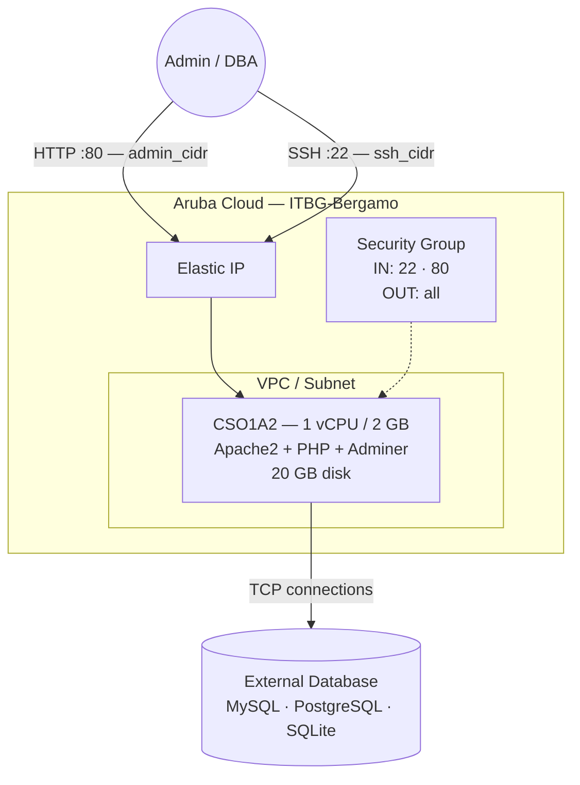

# Adminer on Aruba Cloud

Deploy [Adminer](https://www.adminer.org) — a lightweight, single-file PHP database administration tool — on Aruba Cloud using Terraform and cloud-init. Adminer supports MySQL, MariaDB, PostgreSQL, and SQLite from a single PHP file served by Apache.

> **Provider version:** arubacloud/arubacloud `~> 0.5` | **Terraform:** ≥ 1.9

---

## Introduction

Adminer is a full-featured database management tool contained in a single PHP file. Compared to phpMyAdmin it is lighter, faster to deploy, and just as capable for day-to-day DB administration tasks. This example provisions a minimal VM with:

- **Apache2 + PHP 8.1** — the smallest viable stack for Adminer
- **Adminer.php** downloaded directly from the official GitHub release
- **PHP database drivers** for MySQL (`php-mysql`), PostgreSQL (`php-pgsql`), and SQLite (`php-sqlite3`)
- Port 80 restricted to `admin_cidr` — Adminer is never exposed to the public internet

> **Security note:** Adminer has no built-in rate limiting or IP restriction. Always set `admin_cidr` to your specific management IP (e.g. `203.0.113.42/32`) and never deploy with the default `0.0.0.0/0` in production.

---

## Architecture Overview



---

## Infrastructure Created

| Resource | Name pattern | Description |
|----------|-------------|-------------|
| `arubacloud_project` | `adminer-prod` | Project container |
| `arubacloud_vpc` | `adminer-prod-vpc` | Virtual Private Cloud |
| `arubacloud_subnet` | `adminer-prod-subnet` | Basic subnet |
| `arubacloud_securitygroup` | `adminer-prod-vm-sg` | Security group |
| `arubacloud_securityrule` | `adminer-prod-vm-ssh` | SSH ingress |
| `arubacloud_securityrule` | `adminer-prod-vm-admin-ui` | Admin UI ingress TCP 80 |
| `arubacloud_elasticip` | `adminer-prod-vm-eip` | VM public IP |
| `arubacloud_blockstorage` | `adminer-prod-boot` | 20 GB boot disk (Performance) |
| `arubacloud_keypair` | `adminer-prod-keypair` | SSH public key |
| `arubacloud_cloudserver` | `adminer-prod-vm` | CloudServer VM |

---

## Estimated Monthly Cost

| Resource | Spec | Est. cost/mo |
|----------|------|-------------|
| CloudServer VM | CSO1A2 — 1 vCPU / 2 GB | ~€9 |
| Boot disk | 20 GB Performance | ~€3 |
| Elastic IP | — | ~€3 |
| **Total** | | **~€15/mo** |

---

## Requirements

- Terraform ≥ 1.9
- ArubaCloud Terraform Provider `~> 0.5`
- An ArubaCloud account with OAuth2 API credentials
- An SSH key pair
- A database server reachable from the VM (on the same VPC or via public IP)

---

## Variables

### Required

| Variable | Description |
|----------|-------------|
| `arubacloud_client_id` | ArubaCloud OAuth2 client ID |
| `arubacloud_client_secret` | ArubaCloud OAuth2 client secret |
| `ssh_public_key` | SSH public key content |

### Optional

| Variable | Default | Description |
|----------|---------|-------------|
| `app_name` | `"adminer"` | Short name used in all resource names |
| `environment` | `"prod"` | Environment label |
| `location` | `"ITBG-Bergamo"` | ArubaCloud region |
| `zone` | `"ITBG-1"` | Availability zone |
| `billing_period` | `"Hour"` | `"Hour"` or `"Month"` |
| `vm_flavor` | `"CSO1A2"` | CloudServer flavor |
| `vm_image` | `"LU22-001"` | Boot disk image (Ubuntu 22.04 LTS) |
| `vm_disk_size_gb` | `20` | Boot disk size in GB |
| `ssh_cidr` | `"0.0.0.0/0"` | CIDR for SSH — restrict in production |
| `admin_cidr` | `"0.0.0.0/0"` | CIDR for web UI — **always restrict** |
| `adminer_version` | `"4.8.1"` | Adminer release version |

---

## Outputs

| Output | Description |
|--------|-------------|
| `adminer_url` | Adminer web interface URL |
| `vm_public_ip` | Public IP address of the VM |
| `ssh_command` | SSH command to connect to the VM |

---

## Deployment Instructions

### 1. Clone and navigate

```bash
git clone https://github.com/arubacloud/terraform-arubacloud-examples.git
cd terraform-arubacloud-examples/adminer
```

### 2. Configure variables

```bash
cp terraform.tfvars.example terraform.tfvars
```

Set your credentials and **restrict CIDRs to your management IP**:

```hcl
arubacloud_client_id     = "your-client-id"
arubacloud_client_secret = "your-client-secret"
ssh_public_key           = "ssh-ed25519 AAAA..."
ssh_cidr                 = "203.0.113.42/32"
admin_cidr               = "203.0.113.42/32"
```

### 3. Deploy

```bash
terraform init
terraform plan
terraform apply
```

Bootstrap takes approximately **2–3 minutes**.

### 4. Connect to a database

```bash
terraform output adminer_url
```

Open the URL in your browser and enter:

- **Server:** hostname or IP of your database server
- **Username / Password:** your database credentials
- **Database:** database name (optional — leave blank to list all)

---

## Security Recommendations

1. **Always restrict `admin_cidr` to your management IP.** Adminer exposes database credentials in the browser and has no built-in brute-force protection. Default `0.0.0.0/0` is acceptable only for initial testing on a disposable VM.

2. **Do not store sensitive DB credentials in `terraform.tfvars`.** Use environment variables (`TF_VAR_*`) or a secrets manager when automating deployments.

3. **Consider adding HTTP Basic Auth.** For an additional authentication layer before Adminer loads, enable Apache Basic Auth:

   ```bash
   sudo htpasswd -c /etc/apache2/.htpasswd admin
   ```

   Then add the following to `/etc/apache2/sites-enabled/000-default.conf` inside the `<VirtualHost>` block:

   ```apache
   <Directory /var/www/html>
       AuthType Basic
       AuthName "Restricted"
       AuthUserFile /etc/apache2/.htpasswd
       Require valid-user
   </Directory>
   ```

   Reload Apache: `sudo systemctl reload apache2`

4. **Use a VPN.** The most secure approach is to keep `admin_cidr` locked to your WireGuard or other VPN tunnel CIDR, and access Adminer only over VPN.

---

## Troubleshooting

### Adminer page not loading

```bash
# Check Apache is running
sudo systemctl status apache2

# Check Adminer PHP file exists
ls -la /var/www/html/adminer.php

# Check cloud-init completed successfully
sudo cat /var/log/cloud-init-output.log | tail -30
```

### Cannot connect to database

Verify the database host is reachable from the VM:

```bash
ssh ubuntu@$(terraform output -raw vm_public_ip)
# For MySQL:
nc -zv <db-host> 3306
# For PostgreSQL:
nc -zv <db-host> 5432
```

Check the security group on your database server allows inbound connections from the Adminer VM's IP.

---

## References

- [Adminer Documentation](https://www.adminer.org/en/plugins/)
- [Adminer GitHub Releases](https://github.com/vrana/adminer/releases)
- [ArubaCloud Terraform Provider](https://registry.terraform.io/providers/arubacloud/arubacloud/latest/docs)
