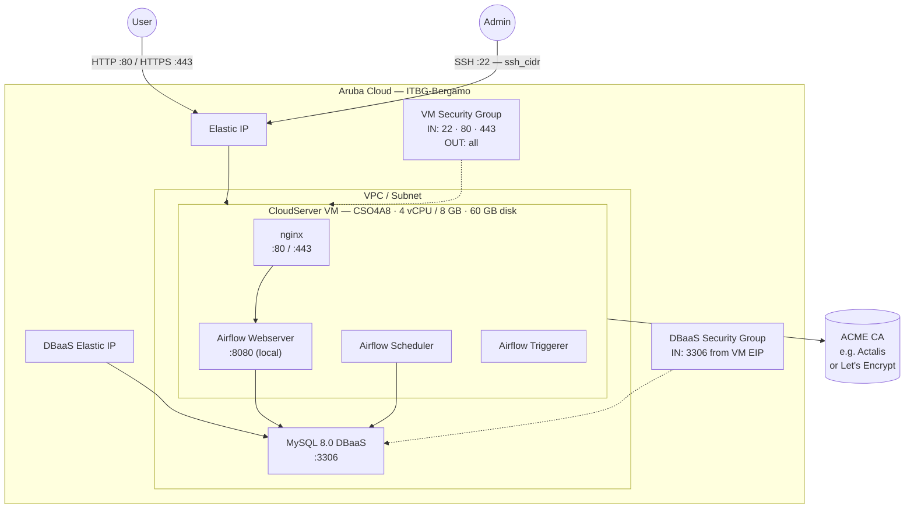

# Apache Airflow on Aruba Cloud

Deploy [Apache Airflow](https://airflow.apache.org) — the leading open-source workflow orchestration platform — on Aruba Cloud using Terraform and cloud-init. This example provisions Airflow with the **LocalExecutor**, a Managed MySQL DBaaS as the metadata store, and nginx as a reverse proxy with optional automatic HTTPS.

> **Provider version:** arubacloud/arubacloud `~> 1.0` | **Terraform:** ≥ 1.9

---

## Introduction

Apache Airflow lets you author, schedule, and monitor data pipelines as directed acyclic graphs (DAGs) written in Python. This example provisions:

| Component | Role | Port |
|-----------|------|------|
| **Airflow Webserver** | Web UI for DAG management and monitoring | 8080 (proxied by nginx) |
| **Airflow Scheduler** | Evaluates DAGs and triggers task execution | — |
| **Airflow Triggerer** | Handles deferred (async) operators | — |
| **MySQL DBaaS** | Airflow metadata database (DAG runs, task states, logs) | 3306 (DBaaS Elastic IP) |
| **nginx** | Reverse proxy on 80/443 | 80 / 443 |

The **LocalExecutor** runs tasks as subprocesses on the same VM — ideal for single-node deployments and teams with moderate workloads. Scale to the CeleryExecutor or KubernetesExecutor when needed.

> **Bootstrap time:** approximately **20–30 minutes** — the Airflow pip install with constraints downloads many dependencies.

---

## Architecture Overview



---

## Infrastructure Created

| Resource | Name pattern | Description |
|----------|-------------|-------------|
| `arubacloud_project` | `airflow-prod` | Project container |
| `arubacloud_vpc` | `airflow-prod-vpc` | Virtual Private Cloud |
| `arubacloud_subnet` | `airflow-prod-subnet` | Basic subnet |
| `arubacloud_securitygroup` | `airflow-prod-vm-sg` | VM security group |
| `arubacloud_securitygroup` | `airflow-prod-dbaas-sg` | DBaaS security group |
| `arubacloud_securityrule` | `airflow-prod-vm-ssh` | SSH ingress |
| `arubacloud_securityrule` | `airflow-prod-vm-http` | HTTP ingress TCP 80 |
| `arubacloud_securityrule` | `airflow-prod-vm-https` | HTTPS ingress TCP 443 |
| `arubacloud_securityrule` | `airflow-prod-db-mysql` | MySQL ingress from VM Elastic IP |
| `arubacloud_elasticip` | `airflow-prod-vm-eip` | VM public IP |
| `arubacloud_elasticip` | `airflow-prod-dbaas-eip` | DBaaS public IP |
| `arubacloud_blockstorage` | `airflow-prod-boot` | 60 GB boot disk (Performance) |
| `arubacloud_keypair` | `airflow-prod-keypair` | SSH public key |
| `arubacloud_dbaas` | `airflow-prod-dbaas` | Managed MySQL 8.0 DBaaS |
| `arubacloud_database` | `airflow` | Airflow metadata database |
| `arubacloud_dbaasuser` | `airflow` | Airflow DB user |
| `arubacloud_cloudserver` | `airflow-prod-vm` | CloudServer VM |

---

## Estimated Monthly Cost

| Resource | Spec | Est. cost/mo |
|----------|------|-------------|
| CloudServer VM | CSO4A8 — 4 vCPU / 8 GB | ~€36 |
| Boot disk | 60 GB Performance | ~€9 |
| Elastic IP (VM) | — | ~€3 |
| MySQL DBaaS | DBO2A8 | ~€35 |
| Elastic IP (DBaaS) | — | ~€3 |
| **Total** | | **~€86/mo** |

---

## Requirements

- Terraform ≥ 1.9
- ArubaCloud Terraform Provider `~> 1.0`
- An ArubaCloud account with OAuth2 API credentials
- An SSH key pair

---

## Variables

### Required

| Variable | Description |
|----------|-------------|
| `arubacloud_client_id` | ArubaCloud OAuth2 client ID |
| `arubacloud_client_secret` | ArubaCloud OAuth2 client secret |
| `ssh_public_key` | SSH public key content |
| `db_password` | MySQL password for the Airflow metadata DB user |
| `airflow_admin_password` | Password for the initial Airflow admin account |

### Optional

| Variable | Default | Description |
|----------|---------|-------------|
| `app_name` | `"airflow"` | Short name used in all resource names |
| `environment` | `"prod"` | Environment label |
| `location` | `"ITBG-Bergamo"` | ArubaCloud region |
| `zone` | `"ITBG-1"` | Availability zone |
| `billing_period` | `"Hour"` | `"Hour"` or `"Month"` |
| `vm_flavor` | `"CSO4A8"` | CloudServer flavor |
| `vm_disk_size_gb` | `60` | Boot disk size in GB |
| `ssh_cidr` | `"0.0.0.0/0"` | CIDR for SSH — **restrict to your IP in production** |
| `dbaas_flavor` | `"DBO2A8"` | DBaaS flavor |
| `db_storage_gb` | `20` | DBaaS initial storage in GB |
| `airflow_admin_user` | `"admin"` | Airflow admin username |
| `airflow_admin_email` | `"admin@example.com"` | Airflow admin email |
| `airflow_version` | `"2.10.4"` | Airflow version to install |
| `domain` | `""` | Custom domain for ACME HTTPS |

---

## Outputs

| Output | Description |
|--------|-------------|
| `airflow_url` | Airflow web interface URL |
| `vm_public_ip` | Public IP address of the VM |
| `ssh_command` | SSH command to connect to the VM |
| `airflow_admin_password` | Airflow admin password (sensitive) |

---

## Deployment Instructions

### 1. Clone and navigate

```bash
git clone https://github.com/arubacloud/terraform-arubacloud-examples.git
cd terraform-arubacloud-examples/airflow
```

### 2. Configure variables

```bash
cp terraform.tfvars.example terraform.tfvars
```

Set `db_password`, `airflow_admin_password`, your credentials, and SSH key.

### 3. Deploy

```bash
terraform init
terraform plan
terraform apply
```

> Bootstrap takes **20–30 minutes**. Monitor progress:
>
> ```bash
> ssh ubuntu@$(terraform output -raw vm_public_ip)
> sudo tail -f /var/log/cloud-init-output.log
> ```

### 4. Open Airflow

```bash
terraform output airflow_url
```

Log in with the `airflow_admin_user` (default: `admin`) and your `airflow_admin_password`.

---

## Adding DAGs

Place DAG files in `/opt/airflow/dags/` on the VM:

```bash
scp my_dag.py ubuntu@$(terraform output -raw vm_public_ip):/opt/airflow/dags/
```

Airflow's scheduler scans this directory every 30 seconds by default.

---

## Enabling HTTPS (ACME)

When `domain` is set to a real domain:

1. Create a DNS A record: `airflow.example.com → <vm_public_ip>`
2. Set `domain = "airflow.example.com"` in `terraform.tfvars`
3. Re-apply — Certbot provisions a certificate via an ACME provider such as [Actalis ACME Certificates](https://guide.actalis.com/it/ssl/attivazione/acme) or Let's Encrypt

---

## Security Recommendations

1. **Restrict SSH to your IP.** Set `ssh_cidr = "your.ip/32"`.
2. **Use HTTPS.** Set `domain` before exposing to the internet — Airflow credentials travel in cleartext over HTTP.
3. **Rotate the Fernet key** for existing deployments before adding sensitive connections in the Connections panel.
4. **Scale with CeleryExecutor** for high workloads: add Redis and additional worker VMs. Change `AIRFLOW__CORE__EXECUTOR=CeleryExecutor` in `/etc/airflow/airflow.env`.

---

## Troubleshooting

### Webserver not loading after 30 minutes

```bash
ssh ubuntu@$(terraform output -raw vm_public_ip)
sudo systemctl status airflow-webserver airflow-scheduler
sudo journalctl -u airflow-webserver -n 50
sudo tail -50 /var/log/cloud-init-output.log
```

### DAGs not appearing

```bash
ssh ubuntu@$(terraform output -raw vm_public_ip)
sudo -u airflow AIRFLOW_HOME=/opt/airflow \
  /opt/airflow-env/bin/airflow dags list
```

---

## References

- [Apache Airflow Documentation](https://airflow.apache.org/docs/)
- [Airflow Installation Guide](https://airflow.apache.org/docs/apache-airflow/stable/installation/index.html)
- [Airflow DAG Writing Best Practices](https://airflow.apache.org/docs/apache-airflow/stable/best-practices.html)
- [ArubaCloud Terraform Provider](https://registry.terraform.io/providers/arubacloud/arubacloud/latest/docs)
- [cloud-init Reference](https://cloudinit.readthedocs.io/)
