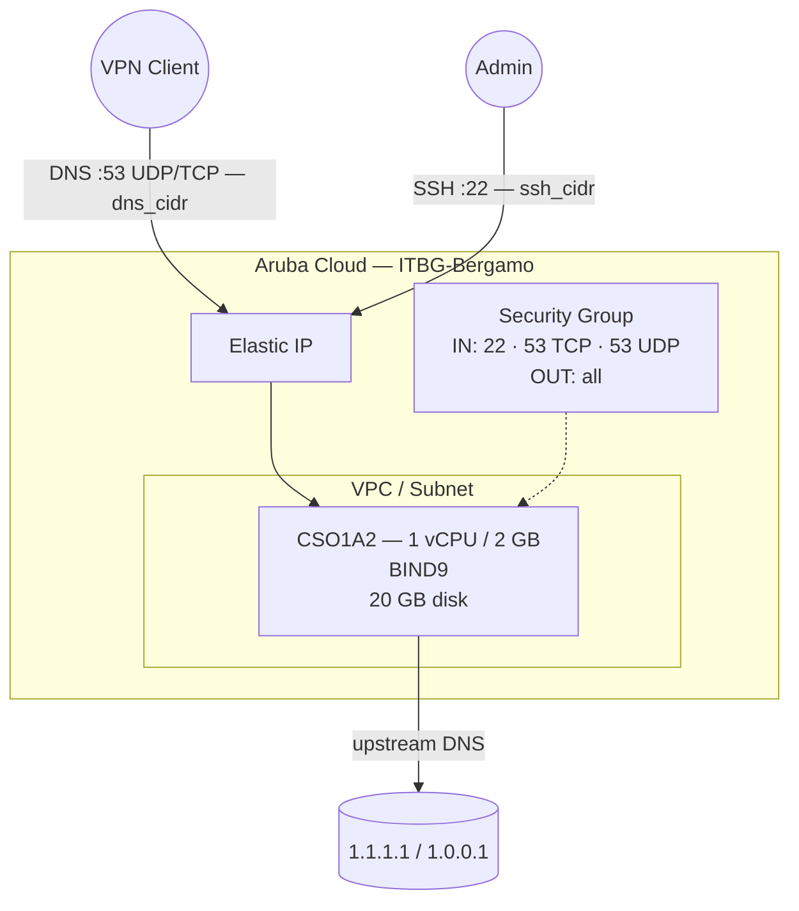

# Bind DNS on Aruba Cloud

Deploy [BIND9](https://www.isc.org/bind/) — the most widely deployed DNS server software — on Aruba Cloud using Terraform and cloud-init. BIND9 is configured as a caching recursive resolver with configurable upstream forwarders and built-in access control.

> **Provider version:** arubacloud/arubacloud `~> 0.5` | **Terraform:** ≥ 1.9

---

## Introduction

BIND9 (Berkeley Internet Name Domain) is the reference implementation of the DNS protocol and the most commonly deployed authoritative and recursive DNS server. This example provisions a caching resolver with:

- **BIND9** installed from Ubuntu 22.04 official packages
- Configured as a **caching forwarder** — queries are resolved via configurable upstream servers and cached locally
- **Access control** via both the security group (`dns_cidr`) and BIND9's `allow-query` / `allow-recursion` ACL — double protection against open-resolver abuse
- Port 53 (UDP + TCP) for DNS queries
- `systemd-resolved` stub listener disabled so BIND9 can own port 53

> **Choosing between DNS servers:** Use BIND9 when you need authoritative DNS hosting, complex zone management, or DNSSEC signing. For a simpler caching resolver, consider [CoreDNS](coredns.md), [Pi-hole](pi-hole.md), or [AdGuard Home](adguard-home.md).

---

## Architecture Overview



---

## Infrastructure Created

| Resource | Name pattern | Description |
|----------|-------------|-------------|
| `arubacloud_project` | `bind-prod` | Project container |
| `arubacloud_vpc` | `bind-prod-vpc` | Virtual Private Cloud |
| `arubacloud_subnet` | `bind-prod-subnet` | Basic subnet |
| `arubacloud_securitygroup` | `bind-prod-vm-sg` | Security group |
| `arubacloud_securityrule` | `bind-prod-vm-ssh` | SSH ingress |
| `arubacloud_securityrule` | `bind-prod-vm-dns-tcp` | DNS TCP 53 ingress |
| `arubacloud_securityrule` | `bind-prod-vm-dns-udp` | DNS UDP 53 ingress |
| `arubacloud_elasticip` | `bind-prod-vm-eip` | VM public IP |
| `arubacloud_blockstorage` | `bind-prod-boot` | 20 GB boot disk (Performance) |
| `arubacloud_keypair` | `bind-prod-keypair` | SSH public key |
| `arubacloud_cloudserver` | `bind-prod-vm` | CloudServer VM |

---

## Estimated Monthly Cost

| Resource | Spec | Est. cost/mo |
|----------|------|-------------|
| CloudServer VM | CSO1A2 — 1 vCPU / 2 GB | ~€9 |
| Boot disk | 20 GB Performance | ~€3 |
| Elastic IP | — | ~€3 |
| **Total** | | **~€15/mo** |

---

## Requirements

- Terraform ≥ 1.9
- ArubaCloud Terraform Provider `~> 0.5`
- An ArubaCloud account with OAuth2 API credentials
- An SSH key pair

---

## Variables

### Required

| Variable | Description |
|----------|-------------|
| `arubacloud_client_id` | ArubaCloud OAuth2 client ID |
| `arubacloud_client_secret` | ArubaCloud OAuth2 client secret |
| `ssh_public_key` | SSH public key content |

### Optional

| Variable | Default | Description |
|----------|---------|-------------|
| `app_name` | `"bind"` | Short name used in all resource names |
| `environment` | `"prod"` | Environment label |
| `location` | `"ITBG-Bergamo"` | ArubaCloud region |
| `zone` | `"ITBG-1"` | Availability zone |
| `billing_period` | `"Hour"` | `"Hour"` or `"Month"` |
| `vm_flavor` | `"CSO1A2"` | CloudServer flavor |
| `vm_image` | `"LU22-001"` | Boot disk image (Ubuntu 22.04 LTS) |
| `vm_disk_size_gb` | `20` | Boot disk size in GB |
| `ssh_cidr` | `"0.0.0.0/0"` | CIDR for SSH |
| `dns_cidr` | `"0.0.0.0/0"` | CIDR for DNS port 53 — **always restrict** |
| `upstream_dns_1` | `"1.1.1.1"` | Primary upstream resolver |
| `upstream_dns_2` | `"1.0.0.1"` | Secondary upstream resolver |

---

## Outputs

| Output | Description |
|--------|-------------|
| `dns_server` | DNS server IP address |
| `vm_public_ip` | Public IP address of the VM |
| `ssh_command` | SSH command to connect to the VM |

---

## Deployment Instructions

### 1. Clone and navigate

```bash
git clone https://github.com/arubacloud/terraform-arubacloud-examples.git
cd terraform-arubacloud-examples/bind-dns
```

### 2. Configure variables

```bash
cp terraform.tfvars.example terraform.tfvars
```

**Always restrict `dns_cidr`** to prevent your server from being used as an open resolver:

```hcl
dns_cidr = "10.8.0.0/24"       # WireGuard tunnel CIDR
ssh_cidr = "203.0.113.42/32"
```

### 3. Deploy

```bash
terraform init
terraform plan
terraform apply
```

Bootstrap takes approximately **1–2 minutes**.

### 4. Test the deployment

Run the checks below against the IP shown in `terraform output -raw dns_server`.

**Port reachability** — confirm port 53 is open on both transport protocols:

```bash
DNS=$(terraform output -raw dns_server)
nc -zv  "$DNS" 53     # TCP
nc -zvu "$DNS" 53     # UDP
```

Expected output:

```
Connection to <ip> 53 port [tcp/domain] succeeded!
Connection to <ip> 53 port [udp/domain] succeeded!
```

**DNS resolution** — send a real query and verify you get an answer:

```bash
dig @"$DNS" google.com
```

A healthy response looks like:

```
;; ->>HEADER<<- opcode: QUERY, status: NOERROR, ...
;; ANSWER SECTION:
google.com.   ...   IN   A   142.251.x.x
...
;; Query time: <low ms>
;; SERVER: <ip>#53
```

Key things to check: `status: NOERROR`, at least one record in the ANSWER SECTION, and a low query time (< 200 ms on the first hit, < 20 ms on a cached repeat).

**IPv6 resolution:**

```bash
dig @"$DNS" google.com AAAA
```

**Repeat query (cache hit):**

```bash
dig @"$DNS" google.com && dig @"$DNS" google.com
```

The second query time should drop significantly, confirming the cache is working.

### 5. Point clients

Set the output IP as the DNS server on your VPN clients or network devices.

---

## Customisation

The BIND9 configuration is at `/etc/bind/named.conf.options`. Reload after changes:

```bash
sudo named-checkconf && sudo systemctl reload bind9
```

### Add an authoritative zone

Create a zone file and add it to `/etc/bind/named.conf.local`:

```text
zone "example.internal" {
    type master;
    file "/etc/bind/db.example.internal";
};
```

Then create `/etc/bind/db.example.internal`:

```text
$TTL 300
@   IN  SOA ns1.example.internal. admin.example.internal. (
            2024010101 ; Serial
            3600       ; Refresh
            1800       ; Retry
            604800     ; Expire
            300 )      ; Minimum TTL

@       IN  NS  ns1.example.internal.
ns1     IN  A   <vm-ip>
host1   IN  A   10.0.0.1
```

### Enable DNSSEC validation

DNSSEC validation is already enabled (`dnssec-validation auto`). To also sign your own zones, install `dnssec-tools` and follow the [BIND9 DNSSEC guide](https://bind9.readthedocs.io/en/latest/dnssec-guide.html).

---

## Troubleshooting

### BIND9 not responding

```bash
sudo systemctl status bind9
sudo named-checkconf
sudo journalctl -u named -n 30
sudo ss -ulnp | grep :53
sudo ss -tlnp | grep :53
```

### Port 53 in use after install

```bash
sudo ss -ulnp sport = :53
grep DNSStubListener /etc/systemd/resolved.conf
sudo systemctl restart systemd-resolved && sudo systemctl restart bind9
```

### Test from client

See the full test suite in [Deployment Instructions → Test the deployment](#4-test-the-deployment). Quick one-liners:

```bash
dig @<vm-ip> google.com          # A record
dig @<vm-ip> google.com AAAA     # IPv6
nslookup google.com <vm-ip>      # alternative resolver
nc -zv  <vm-ip> 53               # TCP port check
nc -zvu <vm-ip> 53               # UDP port check
```

---

## References

- [BIND9 Documentation](https://bind9.readthedocs.io)
- [ISC BIND9 Downloads](https://www.isc.org/bind/)
- [WireGuard Example](wireguard.md)
- [CoreDNS Example](coredns.md)
- [ArubaCloud Terraform Provider](https://registry.terraform.io/providers/arubacloud/arubacloud/latest/docs)
