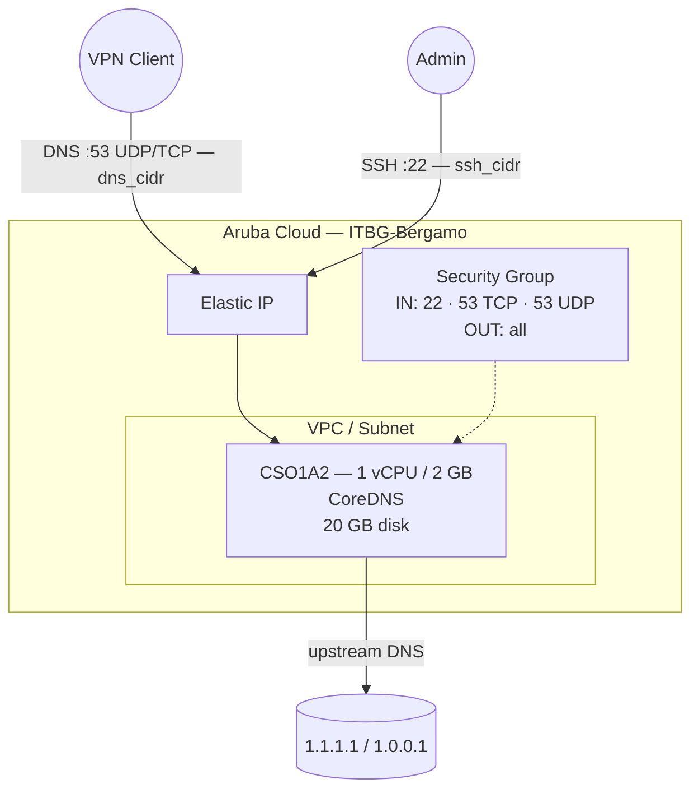

# CoreDNS on Aruba Cloud

Deploy [CoreDNS](https://coredns.io) — a fast, flexible, cloud-native DNS server — on Aruba Cloud using Terraform and cloud-init. CoreDNS is configured as a caching DNS forwarder, ideal for use as a private resolver inside a VPN network.

> **Provider version:** arubacloud/arubacloud `~> 0.5` | **Terraform:** ≥ 1.9

---

## Introduction

CoreDNS is a lightweight DNS server written in Go, used as the default DNS server in Kubernetes and widely adopted as a private resolver. This example provisions a CoreDNS instance configured as a caching forwarder with:

- CoreDNS installed from the **official GitHub release binary** (single binary, no dependencies)
- Port 53 (UDP + TCP) for DNS queries
- Configurable upstream resolvers (Cloudflare defaults)
- A 30-second DNS cache to reduce upstream query load
- Query logging and error reporting enabled
- Runs as an unprivileged `coredns` system user

> **Best practice:** Pair with the [WireGuard](wireguard.md) example. Set `dns_cidr` to your WireGuard tunnel CIDR and point VPN clients at the CoreDNS IP for a private, caching resolver.

---

## Architecture Overview



---

## Infrastructure Created

| Resource | Name pattern | Description |
|----------|-------------|-------------|
| `arubacloud_project` | `coredns-prod` | Project container |
| `arubacloud_vpc` | `coredns-prod-vpc` | Virtual Private Cloud |
| `arubacloud_subnet` | `coredns-prod-subnet` | Basic subnet |
| `arubacloud_securitygroup` | `coredns-prod-vm-sg` | Security group |
| `arubacloud_securityrule` | `coredns-prod-vm-ssh` | SSH ingress |
| `arubacloud_securityrule` | `coredns-prod-vm-dns-tcp` | DNS TCP 53 ingress |
| `arubacloud_securityrule` | `coredns-prod-vm-dns-udp` | DNS UDP 53 ingress |
| `arubacloud_elasticip` | `coredns-prod-vm-eip` | VM public IP |
| `arubacloud_blockstorage` | `coredns-prod-boot` | 20 GB boot disk (Performance) |
| `arubacloud_keypair` | `coredns-prod-keypair` | SSH public key |
| `arubacloud_cloudserver` | `coredns-prod-vm` | CloudServer VM |

---

## Estimated Monthly Cost

| Resource | Spec | Est. cost/mo |
|----------|------|-------------|
| CloudServer VM | CSO1A2 — 1 vCPU / 2 GB | ~€9 |
| Boot disk | 20 GB Performance | ~€3 |
| Elastic IP | — | ~€3 |
| **Total** | | **~€15/mo** |

---

## Requirements

- Terraform ≥ 1.9
- ArubaCloud Terraform Provider `~> 0.5`
- An ArubaCloud account with OAuth2 API credentials
- An SSH key pair

---

## Variables

### Required

| Variable | Description |
|----------|-------------|
| `arubacloud_client_id` | ArubaCloud OAuth2 client ID |
| `arubacloud_client_secret` | ArubaCloud OAuth2 client secret |
| `ssh_public_key` | SSH public key content |

### Optional

| Variable | Default | Description |
|----------|---------|-------------|
| `app_name` | `"coredns"` | Short name used in all resource names |
| `environment` | `"prod"` | Environment label |
| `location` | `"ITBG-Bergamo"` | ArubaCloud region |
| `zone` | `"ITBG-1"` | Availability zone |
| `billing_period` | `"Hour"` | `"Hour"` or `"Month"` |
| `vm_flavor` | `"CSO1A2"` | CloudServer flavor |
| `vm_image` | `"LU22-001"` | Boot disk image (Ubuntu 22.04 LTS) |
| `vm_disk_size_gb` | `20` | Boot disk size in GB |
| `ssh_cidr` | `"0.0.0.0/0"` | CIDR for SSH |
| `dns_cidr` | `"0.0.0.0/0"` | CIDR for DNS port 53 — **restrict to your VPN tunnel CIDR** |
| `upstream_dns_1` | `"1.1.1.1"` | Primary upstream resolver |
| `upstream_dns_2` | `"1.0.0.1"` | Secondary upstream resolver |
| `coredns_version` | `"1.11.3"` | CoreDNS release version |

---

## Outputs

| Output | Description |
|--------|-------------|
| `dns_server` | DNS server IP address |
| `vm_public_ip` | Public IP address of the VM |
| `ssh_command` | SSH command to connect to the VM |

---

## Deployment Instructions

### 1. Clone and navigate

```bash
git clone https://github.com/arubacloud/terraform-arubacloud-examples.git
cd terraform-arubacloud-examples/coredns
```

### 2. Configure variables

```bash
cp terraform.tfvars.example terraform.tfvars
```

In production, restrict DNS access to your VPN tunnel:

```hcl
dns_cidr = "10.8.0.0/24"       # WireGuard tunnel CIDR
ssh_cidr = "203.0.113.42/32"
```

### 3. Deploy

```bash
terraform init
terraform plan
terraform apply
```

Bootstrap takes approximately **2–3 minutes**.

### 4. Point clients at CoreDNS

```bash
terraform output dns_server
```

Set the output IP as the DNS server on your WireGuard clients or network devices.

---

## Customisation

The Corefile at `/etc/coredns/Corefile` controls all behaviour. Edit it and reload CoreDNS:

```bash
sudo systemctl reload coredns
```

### Add a local DNS zone

```
example.internal {
    file /etc/coredns/db.example.internal
    log
    errors
}

. {
    forward . 1.1.1.1 1.0.0.1
    cache 30
    log
    errors
}
```

### Enable DNSSEC validation

```
. {
    forward . 1.1.1.1 1.0.0.1 {
        policy sequential
    }
    dnssec
    cache 30
    log
    errors
}
```

### Enable DNS-over-TLS upstream

```
. {
    forward . tls://1.1.1.1 tls://1.0.0.1 {
        tls_servername cloudflare-dns.com
        health_check 5s
    }
    cache 30
    log
    errors
}
```

---

## Troubleshooting

### CoreDNS not responding

```bash
sudo systemctl status coredns
sudo journalctl -u coredns -n 30
# Check port 53 is listening:
sudo ss -ulnp | grep :53
sudo ss -tlnp | grep :53
```

### Port 53 already in use

```bash
sudo ss -ulnp sport = :53
cat /etc/systemd/resolved.conf | grep DNSStubListener
sudo systemctl restart systemd-resolved
sudo systemctl restart coredns
```

### Test DNS resolution

```bash
dig @<vm-ip> google.com
dig @<vm-ip> google.com A
```

---

## References

- [CoreDNS Documentation](https://coredns.io/manual/toc/)
- [Corefile Reference](https://coredns.io/plugins/)
- [CoreDNS GitHub Releases](https://github.com/coredns/coredns/releases)
- [WireGuard Example](wireguard.md)
- [ArubaCloud Terraform Provider](https://registry.terraform.io/providers/arubacloud/arubacloud/latest/docs)
