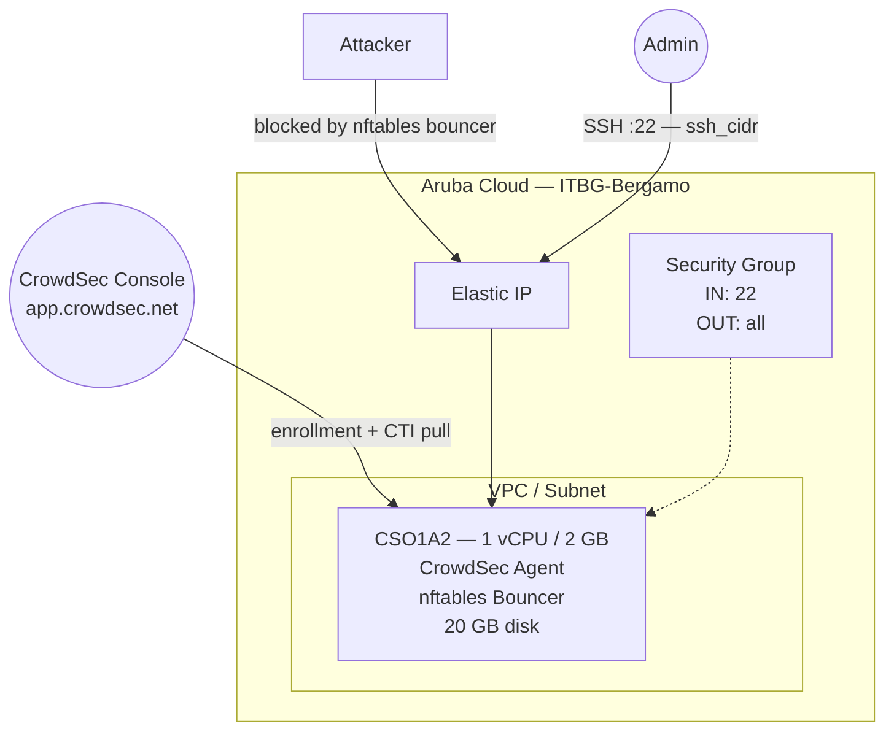

# CrowdSec on Aruba Cloud

Deploy [CrowdSec](https://www.crowdsec.net/) — collaborative threat intelligence and intrusion prevention — on Aruba Cloud using Terraform and cloud-init. Installs the CrowdSec agent and firewall bouncer from the official repository with configurable collections and optional CrowdSec Console enrollment.

> **Provider version:** arubacloud/arubacloud `~> 0.5` | **Terraform:** ≥ 1.9

---

## Introduction

CrowdSec is a lightweight, open-source security agent that analyses logs in real time using behaviour scenarios and blocks malicious IPs using bouncers. The community shares threat intelligence via the CrowdSec Console, making it a collaborative IDS/IPS. This example provisions:

- **CrowdSec agent** installed from the official package repository
- **Firewall bouncer** (`crowdsec-firewall-bouncer-nftables`) to enforce blocks at the OS level
- Configurable **collections** (parsers + scenarios for SSH, Linux, nginx, etc.)
- Optional **CrowdSec Console enrollment** for centralized management and community intelligence

> **Typical use case:** deploy CrowdSec as a sidecar on servers running Nginx, Apache, or Traefik by adding the relevant collection — or deploy it standalone as a dedicated security gateway with a firewall bouncer.

---

## Architecture Overview



---

## Infrastructure Created

| Resource | Name pattern | Description |
|----------|-------------|-------------|
| `arubacloud_project` | `cs-prod` | Project container |
| `arubacloud_vpc` | `cs-prod-vpc` | Virtual Private Cloud |
| `arubacloud_subnet` | `cs-prod-subnet` | Basic subnet |
| `arubacloud_securitygroup` | `cs-prod-vm-sg` | Security group |
| `arubacloud_securityrule` | `cs-prod-vm-ssh` | SSH ingress |
| `arubacloud_elasticip` | `cs-prod-vm-eip` | VM public IP |
| `arubacloud_blockstorage` | `cs-prod-boot` | 20 GB boot disk (Performance) |
| `arubacloud_keypair` | `cs-prod-keypair` | SSH public key |
| `arubacloud_cloudserver` | `cs-prod-vm` | CloudServer VM |

---

## Estimated Monthly Cost

| Resource | Spec | Est. cost/mo |
|----------|------|-------------|
| CloudServer VM | CSO1A2 — 1 vCPU / 2 GB | ~€8 |
| Boot disk | 20 GB Performance | ~€3 |
| Elastic IP | — | ~€3 |
| **Total** | | **~€14/mo** |

---

## Requirements

- Terraform ≥ 1.9
- ArubaCloud Terraform Provider `~> 0.5`
- An ArubaCloud account with OAuth2 API credentials
- An SSH key pair
- (Optional) A [CrowdSec Console](https://app.crowdsec.net/) account for enrollment

---

## Variables

### Required

| Variable | Description |
|----------|-------------|
| `arubacloud_client_id` | ArubaCloud OAuth2 client ID |
| `arubacloud_client_secret` | ArubaCloud OAuth2 client secret |
| `ssh_public_key` | SSH public key content |

### Optional

| Variable | Default | Description |
|----------|---------|-------------|
| `app_name` | `"cs"` | Short name used in all resource names |
| `environment` | `"prod"` | Environment label |
| `location` | `"ITBG-Bergamo"` | ArubaCloud region |
| `zone` | `"ITBG-1"` | Availability zone |
| `billing_period` | `"Hour"` | `"Hour"` or `"Month"` |
| `vm_flavor` | `"CSO1A2"` | CloudServer flavor |
| `vm_image` | `"LU22-001"` | Boot disk image (Ubuntu 22.04 LTS) |
| `vm_disk_size_gb` | `20` | Boot disk size in GB |
| `ssh_cidr` | `"0.0.0.0/0"` | CIDR for SSH |
| `enroll_key` | `""` | CrowdSec Console enrollment key (from app.crowdsec.net) |
| `collections` | `["crowdsecurity/linux", "crowdsecurity/sshd"]` | Collections to install |

---

## Outputs

| Output | Description |
|--------|-------------|
| `vm_public_ip` | Public IP address of the VM |
| `ssh_command` | SSH command to connect to the VM |
| `cscli_status` | Command to check CrowdSec status remotely |

---

## Deployment Instructions

### 1. Clone and navigate

```bash
git clone https://github.com/arubacloud/terraform-arubacloud-examples.git
cd terraform-arubacloud-examples/crowdsec
```

### 2. Configure variables

```bash
cp terraform.tfvars.example terraform.tfvars
```

Add your enrollment key and collections:

```hcl
enroll_key  = "your-console-enrollment-key"
collections = ["crowdsecurity/linux", "crowdsecurity/sshd", "crowdsecurity/nginx"]
```

### 3. Deploy

```bash
terraform init
terraform plan
terraform apply
```

Bootstrap takes approximately **2–3 minutes**.

### 4. Verify

```bash
ssh ubuntu@$(terraform output -raw vm_public_ip)
sudo cscli version
sudo cscli collections list
sudo cscli decisions list
```

---

## Adding CrowdSec to an Existing Server

CrowdSec is most powerful when deployed alongside the services it protects. To protect an Nginx server, add the collection:

```bash
sudo cscli collections install crowdsecurity/nginx
sudo systemctl reload crowdsec
```

Then configure Nginx to write access logs to the path CrowdSec monitors (`/var/log/nginx/access.log`).

---

## Available Collections

```bash
# Search available collections
sudo cscli hub list
sudo cscli collections list -a

# Common collections
sudo cscli collections install crowdsecurity/linux          # base Linux scenarios
sudo cscli collections install crowdsecurity/sshd           # SSH brute-force protection
sudo cscli collections install crowdsecurity/nginx          # Nginx log parsing
sudo cscli collections install crowdsecurity/apache2        # Apache log parsing
sudo cscli collections install crowdsecurity/traefik        # Traefik log parsing
sudo cscli collections install crowdsecurity/wordpress      # WordPress attack scenarios
```

---

## Troubleshooting

### CrowdSec not detecting attacks

```bash
sudo cscli metrics
# Check that the relevant acquisition sources are configured
cat /etc/crowdsec/acquis.yaml
# Tail logs
sudo journalctl -u crowdsec -f
```

### Firewall bouncer not blocking

```bash
sudo systemctl status crowdsec-firewall-bouncer
# Check nftables rules
sudo nft list ruleset
```

---

## References

- [CrowdSec Documentation](https://docs.crowdsec.net/)
- [CrowdSec Hub (collections)](https://hub.crowdsec.net/)
- [CrowdSec Console](https://app.crowdsec.net/)
- [ArubaCloud Terraform Provider](https://registry.terraform.io/providers/arubacloud/arubacloud/latest/docs)
