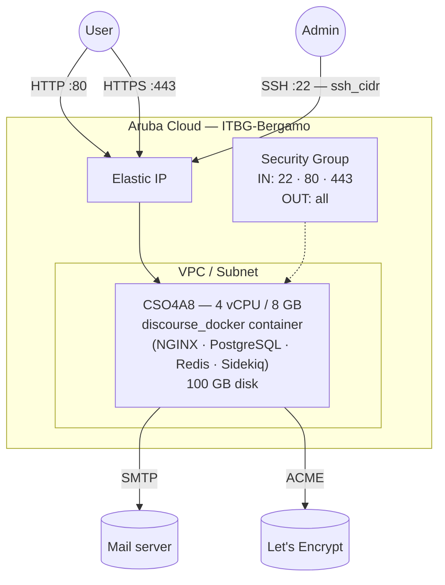

# Discourse on Aruba Cloud

Deploy [Discourse](https://www.discourse.org) — the leading open-source community forum platform — on Aruba Cloud using Terraform and cloud-init. Discourse is installed via the official `discourse_docker` launcher, which bundles PostgreSQL, Redis, and NGINX inside a single managed container.

> **Provider version:** arubacloud/arubacloud `~> 0.5` | **Terraform:** ≥ 1.9

---

## Introduction

Discourse is a modern, mobile-friendly discussion platform used by thousands of open-source projects and communities. This example uses the **official Docker-based installation** — the only method supported by the Discourse team for production — which provisions:

- **discourse_docker** launcher cloned from the official GitHub repository
- **PostgreSQL, Redis, NGINX, and Sidekiq** bundled inside the Discourse container
- SMTP configuration for outbound email (required for user registration)
- Ports 80 and 443 open to the internet
- Optional domain with SSL via Let's Encrypt (automatic inside the container when `hostname` is a real domain)

> **Bootstrap time:** The launcher builds a Docker image from source the first time. Expect **20–30 minutes** before the forum is accessible.
>
> **Email is required.** Discourse uses email for account confirmation. Configure SMTP before deploying — registrations without working email will fail.

---

## Architecture Overview



---

## Infrastructure Created

| Resource | Name pattern | Description |
|----------|-------------|-------------|
| `arubacloud_project` | `discourse-prod` | Project container |
| `arubacloud_vpc` | `discourse-prod-vpc` | Virtual Private Cloud |
| `arubacloud_subnet` | `discourse-prod-subnet` | Basic subnet |
| `arubacloud_securitygroup` | `discourse-prod-vm-sg` | Security group |
| `arubacloud_securityrule` | `discourse-prod-vm-ssh` | SSH ingress |
| `arubacloud_securityrule` | `discourse-prod-vm-http` | HTTP ingress TCP 80 |
| `arubacloud_securityrule` | `discourse-prod-vm-https` | HTTPS ingress TCP 443 |
| `arubacloud_elasticip` | `discourse-prod-vm-eip` | VM public IP |
| `arubacloud_blockstorage` | `discourse-prod-boot` | 100 GB boot disk (Performance) |
| `arubacloud_keypair` | `discourse-prod-keypair` | SSH public key |
| `arubacloud_cloudserver` | `discourse-prod-vm` | CloudServer VM |

---

## Estimated Monthly Cost

| Resource | Spec | Est. cost/mo |
|----------|------|-------------|
| CloudServer VM | CSO4A8 — 4 vCPU / 8 GB | ~€35 |
| Boot disk | 100 GB Performance | ~€15 |
| Elastic IP | — | ~€3 |
| **Total** | | **~€53/mo** |

---

## Requirements

- Terraform ≥ 1.9
- ArubaCloud Terraform Provider `~> 0.5`
- An ArubaCloud account with OAuth2 API credentials
- An SSH key pair
- An SMTP server for outbound email (Gmail App Password, Mailgun, etc.)
- (Recommended) A domain name with an A record pointing to the VM's Elastic IP

---

## Variables

### Required

| Variable | Description |
|----------|-------------|
| `arubacloud_client_id` | ArubaCloud OAuth2 client ID |
| `arubacloud_client_secret` | ArubaCloud OAuth2 client secret |
| `ssh_public_key` | SSH public key content |
| `admin_email` | Email for the initial Discourse admin account |
| `smtp_host` | SMTP server hostname |
| `smtp_user` | SMTP login username |
| `smtp_password` | SMTP login password |

### Optional

| Variable | Default | Description |
|----------|---------|-------------|
| `app_name` | `"discourse"` | Short name used in all resource names |
| `environment` | `"prod"` | Environment label |
| `location` | `"ITBG-Bergamo"` | ArubaCloud region |
| `zone` | `"ITBG-1"` | Availability zone |
| `billing_period` | `"Hour"` | `"Hour"` or `"Month"` |
| `vm_flavor` | `"CSO4A8"` | CloudServer flavor |
| `vm_image` | `"LU22-001"` | Boot disk image (Ubuntu 22.04 LTS) |
| `vm_disk_size_gb` | `100` | Boot disk size in GB (min 40 GB) |
| `ssh_cidr` | `"0.0.0.0/0"` | CIDR for SSH |
| `web_cidr` | `"0.0.0.0/0"` | CIDR for HTTP/HTTPS |
| `hostname` | auto | Domain name (defaults to VM Elastic IP) |
| `smtp_port` | `587` | SMTP port |

---

## Outputs

| Output | Description |
|--------|-------------|
| `site_url` | Discourse site URL |
| `vm_public_ip` | Public IP address of the VM |
| `ssh_command` | SSH command to connect to the VM |

---

## Deployment Instructions

### 1. Clone and navigate

```bash
git clone https://github.com/arubacloud/terraform-arubacloud-examples.git
cd terraform-arubacloud-examples/discourse
```

### 2. Configure variables

```bash
cp terraform.tfvars.example terraform.tfvars
```

Set credentials, admin email, SMTP settings, and optionally a domain:

```hcl
admin_email   = "admin@example.com"
hostname      = "forum.example.com"   # omit to use the Elastic IP
smtp_host     = "smtp.gmail.com"
smtp_port     = 587
smtp_user     = "you@gmail.com"
smtp_password = "your-app-password"
```

> For Gmail, create an **App Password** (not your account password) at <https://myaccount.google.com/apppasswords>.

### 3. Deploy

```bash
terraform init
terraform plan
terraform apply
```

> `terraform apply` returns quickly (VM provisioned in ~2 min). The Discourse bootstrap continues in the background for 20–30 minutes. Monitor progress:
>
> ```bash
> ssh ubuntu@$(terraform output -raw vm_public_ip)
> sudo tail -f /var/log/discourse-bootstrap.log
> ```

### 4. Create the admin account

```bash
terraform output site_url
```

Visit the URL and **register with the same email address** set in `admin_email`. Discourse automatically grants admin rights to the first user who registers with that email.

---

## Enabling HTTPS (Let's Encrypt)

When `hostname` is set to a real domain:

1. Create a DNS A record: `forum.example.com → <vm_public_ip>`
2. Set `hostname = "forum.example.com"` in `terraform.tfvars`
3. Re-apply — Discourse auto-obtains a Let's Encrypt certificate on bootstrap

No additional configuration is needed; the discourse_docker launcher handles ACME automatically.

---

## Upgrading Discourse

Discourse ships frequent updates. To upgrade:

```bash
ssh ubuntu@$(terraform output -raw vm_public_ip)
cd /var/discourse
git pull
./launcher rebuild app
```

The `rebuild` command pulls the latest image and restarts the container with zero downtime for the database.

---

## Troubleshooting

### Forum not loading after 30 minutes

```bash
ssh ubuntu@$(terraform output -raw vm_public_ip)
sudo tail -50 /var/log/discourse-bootstrap.log
cd /var/discourse && ./launcher logs app
```

### Emails not being sent

Check SMTP connectivity from the VM:

```bash
nc -zv smtp.gmail.com 587
```

Then from the Discourse admin panel: **Admin → Email → Test Email**.

---

## References

- [Discourse Official Install Guide](https://github.com/discourse/discourse/blob/main/docs/INSTALL-cloud.md)
- [discourse_docker Repository](https://github.com/discourse/discourse_docker)
- [Discourse Documentation](https://meta.discourse.org)
- [ArubaCloud Terraform Provider](https://registry.terraform.io/providers/arubacloud/arubacloud/latest/docs)
