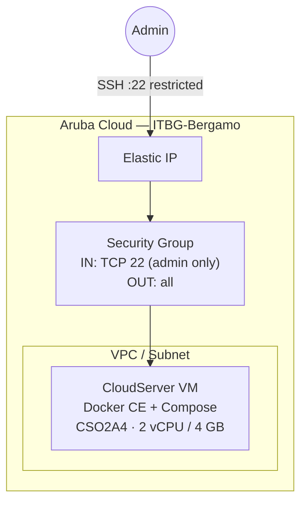

# Docker Host on Aruba Cloud

Provision a CloudServer VM with Docker CE and Docker Compose ready to use. This is the foundation for running any containerised workload on Aruba Cloud when a higher-level example doesn't fit your needs.

> **Provider version:** arubacloud/arubacloud `~> 0.5` | **Terraform:** ≥ 1.9

---

## Introduction

This example creates a clean Ubuntu 22.04 VM with Docker Engine installed from the official Docker APT repository. You can immediately pull images, run containers, and use Docker Compose — all via SSH or a remote Docker context.

Use this as the starting point for:

- Running Docker Compose stacks not covered by other examples
- Testing container images in an isolated Aruba Cloud environment
- Setting up a private Docker build agent

---

## Architecture Overview



---

## Infrastructure Created

| Resource | Name pattern | Description |
|----------|-------------|-------------|
| `arubacloud_project` | `docker-prod` | Project container |
| `arubacloud_vpc` | `docker-prod-vpc` | VPC |
| `arubacloud_subnet` | `docker-prod-subnet` | Subnet |
| `arubacloud_securitygroup` | `docker-prod-vm-sg` | Security group (SSH only) |
| `arubacloud_elasticip` | `docker-prod-vm-eip` | Public IP |
| `arubacloud_blockstorage` | `docker-prod-boot` | 50 GB boot disk |
| `arubacloud_keypair` | `docker-prod-keypair` | SSH key |
| `arubacloud_cloudserver` | `docker-prod-vm` | VM |

---

## VM Sizing

| Use case | vCPU | RAM | Disk | Flavor |
|----------|------|-----|------|--------|
| Light containers / CI | 2 | 4 GB | 50 GB | `CSO2A4` *(default)* |
| Medium workloads | 4 | 8 GB | 80 GB | `CSO4A8` |
| Heavy builds | 8 | 16 GB | 100 GB | `CSO8A16` |

---

## Estimated Monthly Cost

| Resource | Spec | Est. cost/mo |
|----------|------|-------------|
| CloudServer VM | CSO2A4 — 2 vCPU / 4 GB | ~€20 |
| Boot disk | 50 GB | ~€7 |
| Elastic IP | — | ~€5 |
| **Total** | | **~€32/mo** |

---

## Variables

### Required

| Variable | Description |
|----------|-------------|
| `arubacloud_client_id` | OAuth2 client ID |
| `arubacloud_client_secret` | OAuth2 client secret |
| `ssh_public_key` | SSH public key content |

### Optional

| Variable | Default | Description |
|----------|---------|-------------|
| `app_name` | `"docker"` | Resource name prefix |
| `environment` | `"prod"` | Environment label |
| `location` | `"ITBG-Bergamo"` | Region |
| `zone` | `"ITBG-1"` | Availability zone |
| `vm_flavor` | `"CSO2A4"` | VM flavor |
| `vm_disk_size_gb` | `50` | Disk size in GB |
| `ssh_cidr` | `"0.0.0.0/0"` | SSH source CIDR — **restrict to your IP** |
| `docker_users` | `[]` | Additional users to add to the docker group |
| `billing_period` | `"Hour"` | Billing period |

---

## Deployment

```bash
cd terraform-arubacloud-examples/docker-host
cp terraform.tfvars.example terraform.tfvars
# Edit terraform.tfvars
terraform init && terraform apply
```

After deployment:

```bash
# SSH into the host
ssh ubuntu@$(terraform output -raw public_ip)

# Or use a remote Docker context (no SSH session needed)
eval "$(terraform output -raw docker_context_command)"
docker context use aruba-docker
docker ps
```

---

## Destroy

```bash
terraform destroy
```

---

## Security Recommendations

1. **Never expose the Docker socket publicly.** The example only opens SSH. Use SSH tunnelling (`-L /tmp/docker.sock:/var/run/docker.sock`) or a Docker context over SSH for remote access.
2. **Restrict SSH to your IP.** Set `ssh_cidr = "your.ip/32"`.
3. **Use rootless Docker** for extra isolation: `dockerd-rootless-setuptool.sh install`.

---

## Troubleshooting

### `docker: permission denied`

Log out and log back in — group membership changes require a new session:

```bash
exit
ssh ubuntu@$(terraform output -raw public_ip)
```

### Docker daemon not started

```bash
sudo systemctl status docker
sudo journalctl -u docker -n 50
```

---

## References

- [Install Docker Engine on Ubuntu](https://docs.docker.com/engine/install/ubuntu/)
- [Docker Compose V2](https://docs.docker.com/compose/)
- [Docker contexts](https://docs.docker.com/engine/context/working-with-contexts/)
