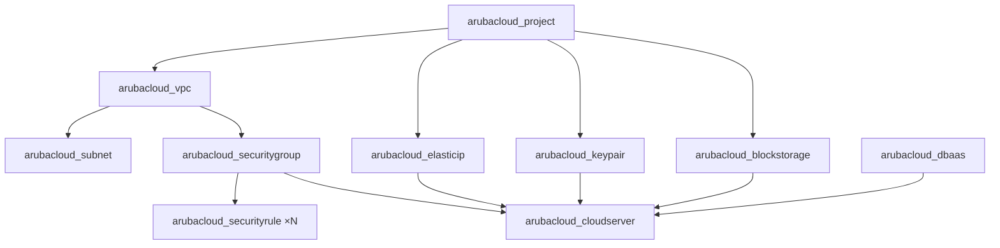

# Architecture Overview

Every example in this collection follows the same layered architecture pattern.

## Resource hierarchy



## Shared network module

The `modules/network` module is used by every example. It creates:

- One **VPC** and one **Basic subnet**
- A **security group** for the VM with configurable ingress rules
- An **Elastic IP** for the VM
- Optionally: a separate security group + Elastic IP for DBaaS

App-specific security rules (e.g. MySQL port 3306 restricted to the VM IP) are created in the example module, not in the shared module. This keeps the module generic.

## cloud-init bootstrap pattern

All examples use `templatefile()` to render a `cloud-init.yaml.tpl` file:

```hcl
user_data = templatefile("${path.module}/cloud-init.yaml.tpl", {
  db_host    = module.network.dbaas_elastic_ip_address
  db_name    = arubacloud_database.this.name
  # ...
})
```

The template uses `write_files` to write configuration files and `runcmd` to install and start services. This is entirely idempotent and requires no SSH access after deployment.

## Naming convention

All resource names follow `{app}-{environment}-{type}`, for example:

- `wp-prod-vpc`
- `wp-prod-vm-sg`
- `wp-prod-vm-eip`

This is controlled by the `app_name` and `environment` variables in each example.
