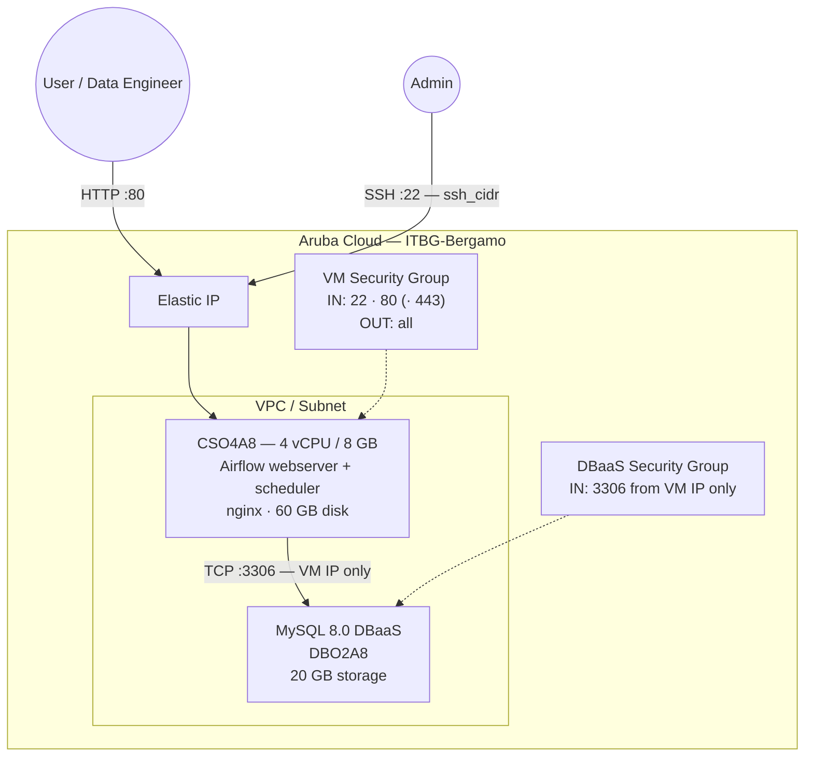

# Apache Airflow on Aruba Cloud

Deploy [Apache Airflow](https://airflow.apache.org/) — the leading open-source platform for authoring, scheduling, and monitoring data pipelines — on Aruba Cloud using Terraform and cloud-init. Uses Managed MySQL 8.0 as the metadata database and gunicorn behind nginx.

> **Provider version:** arubacloud/arubacloud `~> 1.0` | **Terraform:** ≥ 1.9

---

## Introduction

This example deploys:

- **Apache Airflow** (pip, native install) with the `LocalExecutor` on a CSO4A8 VM
- **Managed MySQL 8.0** (Aruba Cloud DBaaS) for Airflow metadata
- **nginx** reverse proxy on port **80**
- Pre-created admin user via `airflow users create`
- DAGs loaded from `/opt/airflow/dags/` on the VM
- Optional HTTPS via [Actalis](https://guide.actalis.com/it/ssl/attivazione/acme) (recommended for Italian deployments) or Let's Encrypt when a custom domain is provided

---

## Architecture Overview



---

## Variables

### Required

| Variable | Description |
|----------|-------------|
| `arubacloud_client_id` | ArubaCloud OAuth2 client ID |
| `arubacloud_client_secret` | ArubaCloud OAuth2 client secret |

### Optional

| Variable | Default | Description |
|----------|---------|-------------|
| `app_name` | `"airflow"` | Short name used in resource names (2–8 chars) |
| `environment` | `"prod"` | Environment label |
| `location` | `"ITBG-Bergamo"` | ArubaCloud region |
| `zone` | `"ITBG-1"` | Availability zone |
| `billing_period` | `"Hour"` | `"Hour"` or `"Month"` |
| `vm_flavor` | `"CSO4A8"` | CloudServer flavor — 4 vCPU / 8 GB recommended minimum |
| `vm_disk_size_gb` | `60` | Boot disk size — DAG files and logs stored here |
| `ssh_public_key` | project owner key | SSH public key content |
| `ssh_cidr` | `"0.0.0.0/0"` | CIDR for SSH access |
| `dbaas_flavor` | `"DBO2A8"` | Managed MySQL flavor |
| `db_storage_gb` | `20` | DBaaS initial storage in GB |
| `db_password` | pre-set default | MySQL password (min 8 chars, no newlines) |
| `airflow_admin_user` | `"admin"` | Airflow admin username |
| `airflow_admin_password` | pre-set default | Airflow admin password (min 8 chars, no newlines) |
| `airflow_admin_email` | `"admin@example.com"` | Airflow admin email |
| `airflow_version` | `"2.10.4"` | Apache Airflow version to install |
| `domain` | `""` | Custom domain for HTTPS (e.g. `airflow.example.com`); leave empty for HTTP over Elastic IP |
| `acme_eab_kid` | `""` | [Actalis](https://guide.actalis.com/it/ssl/attivazione/acme) ACME EAB key ID; leave empty to fall back to Let's Encrypt |
| `acme_eab_hmac_key` | `""` | Actalis ACME EAB HMAC key; required when `acme_eab_kid` is set |

---

## Outputs

| Output | Description |
|--------|-------------|
| `airflow_url` | Airflow web interface URL |
| `vm_public_ip` | Public IP of the VM |
| `ssh_command` | SSH command to connect |
| `airflow_admin_password` | Airflow admin password (sensitive) |

---

## Deployment Instructions

### 1. Clone and navigate

```bash
git clone https://github.com/arubacloud/terraform-arubacloud-examples.git
cd terraform-arubacloud-examples/airflow
```

### 2. Configure variables

```bash
cp terraform.tfvars.example terraform.tfvars
```

### 3. Deploy

```bash
terraform init
terraform plan
terraform apply
```

Bootstrap takes approximately **10–15 minutes**.

### 4. Access Airflow

Navigate to `http://<vm_public_ip>` and log in with `airflow_admin_user` / `airflow_admin_password`.

### 5. Deploy DAGs

Copy DAG files to the VM:

```bash
scp my_dag.py ubuntu@<vm_public_ip>:/opt/airflow/dags/
```

Airflow picks up new DAGs automatically within the configured scan interval.

---

## References

- [Apache Airflow Documentation](https://airflow.apache.org/docs/)
- [Apache Airflow on PyPI](https://pypi.org/project/apache-airflow/)
- [ArubaCloud Terraform Provider](https://registry.terraform.io/providers/arubacloud/arubacloud/latest/docs)
