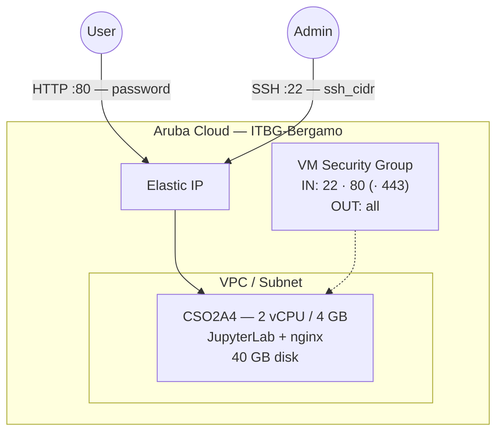

# JupyterLab on Aruba Cloud

Deploy [JupyterLab](https://jupyterlab.readthedocs.io/) — the next-generation web-based interactive development environment for notebooks, code, and data — on Aruba Cloud using Terraform and cloud-init. Runs as a password-protected service behind nginx on port 80.

> **Provider version:** arubacloud/arubacloud `~> 1.0` | **Terraform:** ≥ 1.9

---

## Introduction

This example deploys:

- **JupyterLab** (pip, native install) on a CSO2A4 VM
- **nginx** reverse proxy with WebSocket support on port **80**
- Password authentication via JupyterLab's built-in token/password system
- Optional HTTPS via [Actalis](https://guide.actalis.com/it/ssl/attivazione/acme) (recommended for Italian deployments) or Let's Encrypt when a custom domain is provided

No database is required — notebooks and data are stored on the VM disk.

---

## Architecture Overview



---

## Variables

### Required

| Variable | Description |
|----------|-------------|
| `arubacloud_client_id` | ArubaCloud OAuth2 client ID |
| `arubacloud_client_secret` | ArubaCloud OAuth2 client secret |

### Optional

| Variable | Default | Description |
|----------|---------|-------------|
| `app_name` | `"jupyter"` | Short name used in resource names (2–8 chars) |
| `environment` | `"prod"` | Environment label |
| `location` | `"ITBG-Bergamo"` | ArubaCloud region |
| `zone` | `"ITBG-1"` | Availability zone |
| `billing_period` | `"Hour"` | `"Hour"` or `"Month"` |
| `vm_flavor` | `"CSO2A4"` | CloudServer flavor; upgrade to CSO4A8 for heavy workloads |
| `vm_disk_size_gb` | `40` | Boot disk size — increase for large datasets |
| `ssh_public_key` | project owner key | SSH public key content |
| `ssh_cidr` | `"0.0.0.0/0"` | CIDR for SSH access |
| `jupyter_password` | pre-set default | JupyterLab access password (min 8 chars, no newlines) |
| `domain` | `""` | Custom domain for HTTPS (e.g. `notebooks.example.com`); leave empty for HTTP over Elastic IP |
| `acme_eab_kid` | `""` | [Actalis](https://guide.actalis.com/it/ssl/attivazione/acme) ACME EAB key ID; leave empty to fall back to Let's Encrypt |
| `acme_eab_hmac_key` | `""` | Actalis ACME EAB HMAC key; required when `acme_eab_kid` is set |

---

## Outputs

| Output | Description |
|--------|-------------|
| `app_url` | JupyterLab web interface URL |
| `vm_public_ip` | Public IP of the VM |
| `ssh_command` | SSH command to connect |

---

## Deployment Instructions

### 1. Clone and navigate

```bash
git clone https://github.com/arubacloud/terraform-arubacloud-examples.git
cd terraform-arubacloud-examples/jupyterlab
```

### 2. Configure variables

```bash
cp terraform.tfvars.example terraform.tfvars
```

### 3. Deploy

```bash
terraform init
terraform plan
terraform apply
```

Bootstrap takes approximately **5–8 minutes**.

### 4. Access JupyterLab

Navigate to `http://<vm_public_ip>` and log in with the password set in `jupyter_password`.

---

## References

- [JupyterLab Documentation](https://jupyterlab.readthedocs.io/)
- [JupyterLab on PyPI](https://pypi.org/project/jupyterlab/)
- [ArubaCloud Terraform Provider](https://registry.terraform.io/providers/arubacloud/arubacloud/latest/docs)
