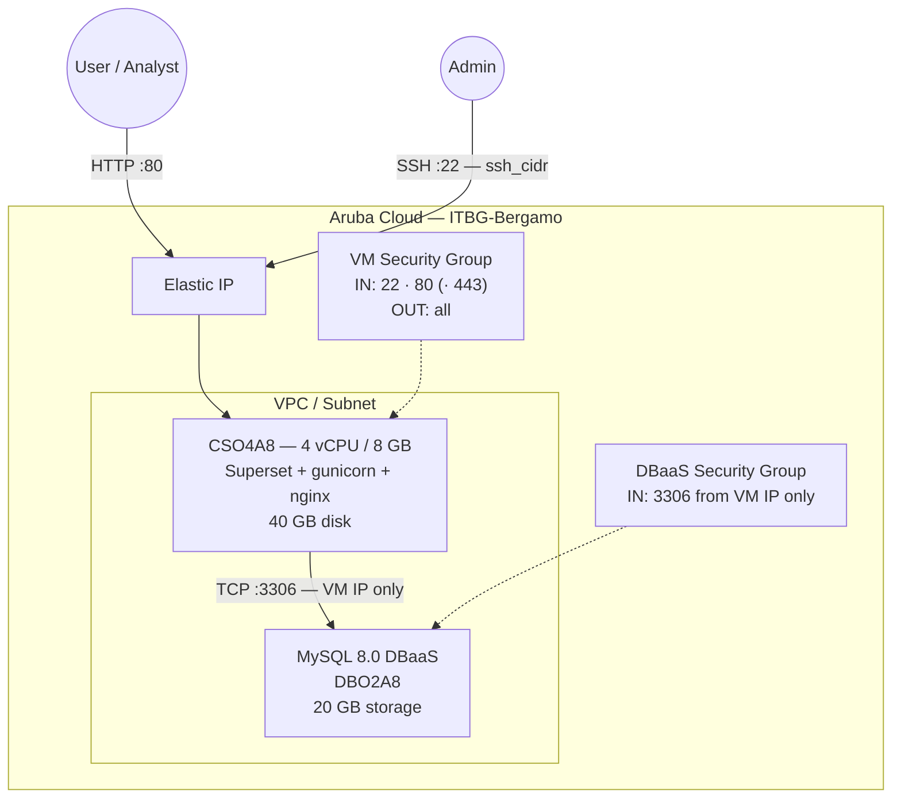

# Apache Superset on Aruba Cloud

Deploy [Apache Superset](https://superset.apache.org/) — a modern, enterprise-ready data exploration and visualisation platform — on Aruba Cloud using Terraform and cloud-init. Uses Managed MySQL 8.0 as the metadata database and gunicorn with gevent workers behind nginx.

> **Provider version:** arubacloud/arubacloud `~> 1.0` | **Terraform:** ≥ 1.9

---

## Introduction

This example deploys:

- **Apache Superset** (pip, native install) on a CSO4A8 VM
- **gunicorn** with 4 gevent workers bound to `127.0.0.1:8088`
- **Managed MySQL 8.0** (Aruba Cloud DBaaS) for Superset metadata
- **nginx** reverse proxy on port **80**
- Pre-created admin user via `superset fab create-admin`
- Optional HTTPS via [Actalis](https://guide.actalis.com/it/ssl/attivazione/acme) (recommended for Italian deployments) or Let's Encrypt when a custom domain is provided

Bootstrap takes **20–30 minutes** due to Superset's many Python dependencies.

---

## Architecture Overview



---

## Variables

### Required

| Variable | Description |
|----------|-------------|
| `arubacloud_client_id` | ArubaCloud OAuth2 client ID |
| `arubacloud_client_secret` | ArubaCloud OAuth2 client secret |

### Optional

| Variable | Default | Description |
|----------|---------|-------------|
| `app_name` | `"superset"` | Short name used in resource names (2–8 chars) |
| `environment` | `"prod"` | Environment label |
| `location` | `"ITBG-Bergamo"` | ArubaCloud region |
| `zone` | `"ITBG-1"` | Availability zone |
| `billing_period` | `"Hour"` | `"Hour"` or `"Month"` |
| `vm_flavor` | `"CSO4A8"` | CloudServer flavor — 4 vCPU / 8 GB recommended minimum |
| `vm_disk_size_gb` | `40` | Boot disk size in GB |
| `ssh_public_key` | project owner key | SSH public key content |
| `ssh_cidr` | `"0.0.0.0/0"` | CIDR for SSH access |
| `dbaas_flavor` | `"DBO2A8"` | Managed MySQL flavor |
| `db_storage_gb` | `20` | DBaaS initial storage in GB |
| `db_password` | pre-set default | MySQL password (min 8 chars, no newlines) |
| `admin_username` | `"admin"` | Superset admin username |
| `admin_password` | pre-set default | Superset admin password (min 8 chars, no newlines) |
| `admin_email` | `"admin@example.com"` | Superset admin email |
| `superset_version` | `"4.1.1"` | Apache Superset version to install |
| `domain` | `""` | Custom domain for HTTPS (e.g. `bi.example.com`); leave empty for HTTP over Elastic IP |
| `acme_eab_kid` | `""` | [Actalis](https://guide.actalis.com/it/ssl/attivazione/acme) ACME EAB key ID; leave empty to fall back to Let's Encrypt |
| `acme_eab_hmac_key` | `""` | Actalis ACME EAB HMAC key; required when `acme_eab_kid` is set |

---

## Outputs

| Output | Description |
|--------|-------------|
| `app_url` | Superset web interface URL |
| `vm_public_ip` | Public IP of the VM |
| `ssh_command` | SSH command to connect |
| `admin_password` | Superset admin password (sensitive) |

---

## Deployment Instructions

### 1. Clone and navigate

```bash
git clone https://github.com/arubacloud/terraform-arubacloud-examples.git
cd terraform-arubacloud-examples/superset
```

### 2. Configure variables

```bash
cp terraform.tfvars.example terraform.tfvars
```

### 3. Deploy

```bash
terraform init
terraform plan
terraform apply
```

Bootstrap takes approximately **20–30 minutes**. Monitor progress with:

```bash
ssh ubuntu@<vm_public_ip> "tail -f /var/log/cloud-init-output.log"
```

### 4. Access Superset

Navigate to `http://<vm_public_ip>` and log in with `admin_username` / `admin_password`.

---

## References

- [Apache Superset Documentation](https://superset.apache.org/docs/intro)
- [Apache Superset on PyPI](https://pypi.org/project/apache-superset/)
- [ArubaCloud Terraform Provider](https://registry.terraform.io/providers/arubacloud/arubacloud/latest/docs)
