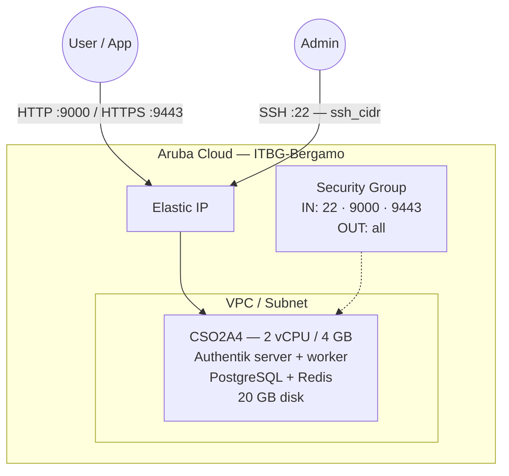

# Authentik on Aruba Cloud

Deploy [Authentik](https://goauthentik.io/) — a modern, open-source identity provider supporting SSO, OIDC, OAuth2, SAML, LDAP, and SCIM — on Aruba Cloud using Terraform and cloud-init. Deployed via Docker Compose with PostgreSQL and Redis.

> **Provider version:** arubacloud/arubacloud `~> 0.5` | **Terraform:** ≥ 1.9

---

## Introduction

Authentik is a lighter-weight alternative to Keycloak, providing a polished admin UI and flexible authentication flows. This example deploys:

- **Authentik server** and **worker** via the official Docker image
- **PostgreSQL 16** for persistent storage
- **Redis** for caching and task queuing
- Web UI on HTTP port 9000 and HTTPS port 9443 (self-signed cert)
- Setup wizard on first access

> **Keycloak comparison:** See the [Keycloak example](/examples/keycloak) for an alternative identity provider. Authentik excels at lightweight deployments and has a more modern UI; Keycloak is better for enterprise-grade federation and standards compliance.

---

## Architecture Overview



---

## Infrastructure Created

| Resource | Name pattern | Description |
|----------|-------------|-------------|
| `arubacloud_project` | `auth-prod` | Project container |
| `arubacloud_vpc` | `auth-prod-vpc` | Virtual Private Cloud |
| `arubacloud_subnet` | `auth-prod-subnet` | Basic subnet |
| `arubacloud_securitygroup` | `auth-prod-vm-sg` | Security group |
| `arubacloud_securityrule` | `auth-prod-vm-ssh` | SSH ingress |
| `arubacloud_securityrule` | `auth-prod-vm-http` | Authentik HTTP port 9000 |
| `arubacloud_securityrule` | `auth-prod-vm-https` | Authentik HTTPS port 9443 |
| `arubacloud_elasticip` | `auth-prod-vm-eip` | VM public IP |
| `arubacloud_blockstorage` | `auth-prod-boot` | 20 GB boot disk (Performance) |
| `arubacloud_keypair` | `auth-prod-keypair` | SSH public key |
| `arubacloud_cloudserver` | `auth-prod-vm` | CloudServer VM |

---

## Estimated Monthly Cost

| Resource | Spec | Est. cost/mo |
|----------|------|-------------|
| CloudServer VM | CSO2A4 — 2 vCPU / 4 GB | ~€20 |
| Boot disk | 20 GB Performance | ~€3 |
| Elastic IP | — | ~€3 |
| **Total** | | **~€26/mo** |

---

## Requirements

- Terraform ≥ 1.9
- ArubaCloud Terraform Provider `~> 0.5`
- An ArubaCloud account with OAuth2 API credentials
- An SSH key pair

---

## Variables

### Required

| Variable | Description |
|----------|-------------|
| `arubacloud_client_id` | ArubaCloud OAuth2 client ID |
| `arubacloud_client_secret` | ArubaCloud OAuth2 client secret |
| `ssh_public_key` | SSH public key content |
| `pg_password` | PostgreSQL password (min 12 characters) |
| `authentik_secret_key` | Authentik signing secret (min 32 chars — use `openssl rand -hex 32`) |

### Optional

| Variable | Default | Description |
|----------|---------|-------------|
| `app_name` | `"auth"` | Short name used in all resource names |
| `environment` | `"prod"` | Environment label |
| `location` | `"ITBG-Bergamo"` | ArubaCloud region |
| `zone` | `"ITBG-1"` | Availability zone |
| `billing_period` | `"Hour"` | `"Hour"` or `"Month"` |
| `vm_flavor` | `"CSO2A4"` | CloudServer flavor |
| `vm_disk_size_gb` | `20` | Boot disk size in GB |
| `ssh_cidr` | `"0.0.0.0/0"` | CIDR for SSH |
| `authentik_version` | `"latest"` | Authentik Docker image tag |

---

## Outputs

| Output | Description |
|--------|-------------|
| `authentik_url` | Authentik web UI URL (HTTP) |
| `authentik_url_https` | Authentik web UI URL (HTTPS) |
| `vm_public_ip` | Public IP address of the VM |
| `ssh_command` | SSH command to connect to the VM |

---

## Deployment Instructions

### 1. Clone and navigate

```bash
git clone https://github.com/arubacloud/terraform-arubacloud-examples.git
cd terraform-arubacloud-examples/authentik
```

### 2. Configure variables

```bash
cp terraform.tfvars.example terraform.tfvars
```

Generate a strong secret key:

```bash
openssl rand -hex 32
```

### 3. Deploy

```bash
terraform init
terraform plan
terraform apply
```

Bootstrap takes approximately **3–5 minutes**.

### 4. Initial setup

Navigate to `http://<IP>:9000/if/flow/initial-setup/` and create the admin account.

---

## References

- [Authentik Documentation](https://docs.goauthentik.io/)
- [Authentik Docker Install Guide](https://docs.goauthentik.io/docs/installation/docker-compose)
- [Keycloak Example](/examples/keycloak)
- [ArubaCloud Terraform Provider](https://registry.terraform.io/providers/arubacloud/arubacloud/latest/docs)

