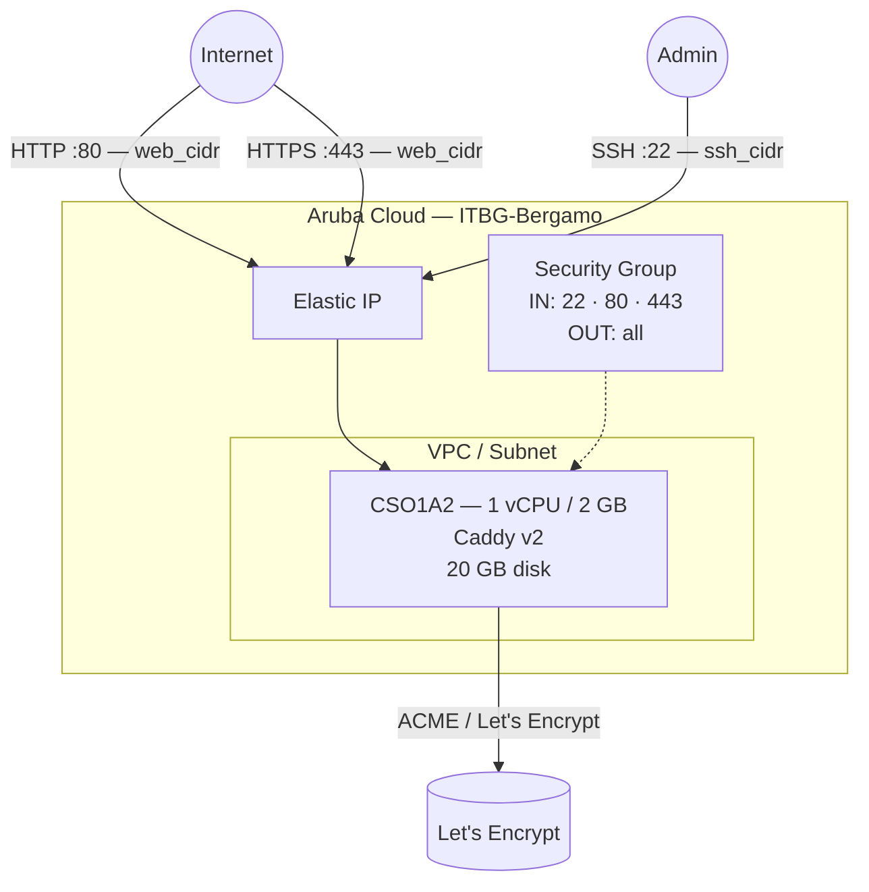

# Caddy on Aruba Cloud

Deploy [Caddy](https://caddyserver.com) — a modern, zero-config web server with automatic HTTPS — on Aruba Cloud using Terraform and cloud-init. Caddy obtains and renews Let's Encrypt certificates automatically when a domain name is provided, with no certbot or manual renewal needed.

> **Provider version:** arubacloud/arubacloud `~> 0.5` | **Terraform:** ≥ 1.9

---

## Introduction

Caddy v2 is a production-ready HTTP server that handles TLS lifecycle management natively. Unlike NGINX, no certbot, cron jobs, or renewal hooks are needed — Caddy manages certificates automatically. This example provisions a Caddy instance with:

- Caddy installed from the **official apt repository** (always up to date)
- A default **static HTML site** served from `/var/www/html`
- Ports 80 (HTTP) and 443 (HTTPS) open to `web_cidr`
- **Automatic HTTPS** via Let's Encrypt when `domain` is set — HTTP redirects to HTTPS automatically
- Certificate renewal handled by Caddy in the background

> **Note:** Without a `domain`, Caddy serves HTTP on port 80 only. Set `domain` to a DNS name pointing at the VM to enable automatic HTTPS — no other configuration needed.

---

## Architecture Overview



---

## Infrastructure Created

| Resource | Name pattern | Description |
|----------|-------------|-------------|
| `arubacloud_project` | `caddy-prod` | Project container |
| `arubacloud_vpc` | `caddy-prod-vpc` | Virtual Private Cloud |
| `arubacloud_subnet` | `caddy-prod-subnet` | Basic subnet |
| `arubacloud_securitygroup` | `caddy-prod-vm-sg` | Security group |
| `arubacloud_securityrule` | `caddy-prod-vm-ssh` | SSH ingress |
| `arubacloud_securityrule` | `caddy-prod-vm-http` | HTTP ingress TCP 80 |
| `arubacloud_securityrule` | `caddy-prod-vm-https` | HTTPS ingress TCP 443 |
| `arubacloud_elasticip` | `caddy-prod-vm-eip` | VM public IP |
| `arubacloud_blockstorage` | `caddy-prod-boot` | 20 GB boot disk (Performance) |
| `arubacloud_keypair` | `caddy-prod-keypair` | SSH public key |
| `arubacloud_cloudserver` | `caddy-prod-vm` | CloudServer VM |

---

## Estimated Monthly Cost

| Resource | Spec | Est. cost/mo |
|----------|------|-------------|
| CloudServer VM | CSO1A2 — 1 vCPU / 2 GB | ~€9 |
| Boot disk | 20 GB Performance | ~€3 |
| Elastic IP | — | ~€3 |
| **Total** | | **~€15/mo** |

---

## Requirements

- Terraform ≥ 1.9
- ArubaCloud Terraform Provider `~> 0.5`
- An ArubaCloud account with OAuth2 API credentials
- An SSH key pair
- (For HTTPS) A domain name with an A record pointing to the VM's Elastic IP

---

## Variables

### Required

| Variable | Description |
|----------|-------------|
| `arubacloud_client_id` | ArubaCloud OAuth2 client ID |
| `arubacloud_client_secret` | ArubaCloud OAuth2 client secret |
| `ssh_public_key` | SSH public key content |

### Optional

| Variable | Default | Description |
|----------|---------|-------------|
| `app_name` | `"caddy"` | Short name used in all resource names |
| `environment` | `"prod"` | Environment label |
| `location` | `"ITBG-Bergamo"` | ArubaCloud region |
| `zone` | `"ITBG-1"` | Availability zone |
| `billing_period` | `"Hour"` | `"Hour"` or `"Month"` |
| `vm_flavor` | `"CSO1A2"` | CloudServer flavor |
| `vm_image` | `"LU22-001"` | Boot disk image (Ubuntu 22.04 LTS) |
| `vm_disk_size_gb` | `20` | Boot disk size in GB |
| `ssh_cidr` | `"0.0.0.0/0"` | CIDR for SSH — restrict in production |
| `web_cidr` | `"0.0.0.0/0"` | CIDR for HTTP/HTTPS |
| `domain` | `""` | Domain for automatic Let's Encrypt HTTPS (DNS must point to VM first) |

---

## Outputs

| Output | Description |
|--------|-------------|
| `http_url` | HTTP URL of the web server |
| `https_url` | HTTPS URL (only valid when `domain` is set and certificate is issued) |
| `vm_public_ip` | Public IP address of the VM |
| `ssh_command` | SSH command to connect to the VM |

---

## Deployment Instructions

### 1. Clone and navigate

```bash
git clone https://github.com/arubacloud/terraform-arubacloud-examples.git
cd terraform-arubacloud-examples/caddy
```

### 2. Configure variables

```bash
cp terraform.tfvars.example terraform.tfvars
```

For HTTP-only, only credentials and the SSH key are needed. For automatic HTTPS:

```hcl
domain = "example.com"
```

> **Important:** The DNS A record for `domain` must already point to the VM's Elastic IP before Caddy can obtain a certificate. Get the IP first (`terraform apply` without `domain`), set your DNS record, then re-apply with `domain` set.

### 3. Deploy

```bash
terraform init
terraform plan
terraform apply
```

Bootstrap takes approximately **2–3 minutes**. Certificate issuance happens automatically in the background once DNS resolves.

### 4. Access the site

```bash
terraform output http_url
```

---

## Caddy vs NGINX

| Feature | Caddy | NGINX |
|---------|-------|-------|
| Automatic HTTPS | Built-in, zero config | Requires certbot + cron |
| Certificate renewal | Automatic | Manual or via systemd timer |
| Config syntax | Simple Caddyfile | nginx.conf (more verbose) |
| Performance | High | Higher (lower memory overhead) |
| Plugins / modules | Via `xcaddy` build | Via compile-time modules |

Choose **Caddy** for ease of use and zero-touch TLS. Choose **NGINX** if you need fine-grained config control or have an existing NGINX setup.

---

## Customisation

### Reverse proxy

Edit `/etc/caddy/Caddyfile` on the VM:

```caddyfile
example.com {
    reverse_proxy localhost:8080
}
```

Reload: `sudo systemctl reload caddy`

### Multiple sites

```caddyfile
site1.example.com {
    root * /var/www/site1
    file_server
}

site2.example.com {
    reverse_proxy localhost:3000
}
```

Caddy automatically gets a certificate for each domain.

---

## Troubleshooting

### Caddy not starting

```bash
sudo systemctl status caddy
sudo journalctl -u caddy -n 30
sudo caddy validate --config /etc/caddy/Caddyfile
```

### Certificate not issued

```bash
sudo journalctl -u caddy | grep -i acme
```

Common causes: DNS A record not propagated, port 80 blocked by `web_cidr`, or `domain` variable mistyped. Caddy retries automatically — check logs every few minutes.

---

## References

- [Caddy Documentation](https://caddyserver.com/docs/)
- [Caddyfile Quick-start](https://caddyserver.com/docs/quick-starts/caddyfile)
- [Caddy GitHub Releases](https://github.com/caddyserver/caddy/releases)
- [ArubaCloud Terraform Provider](https://registry.terraform.io/providers/arubacloud/arubacloud/latest/docs)

