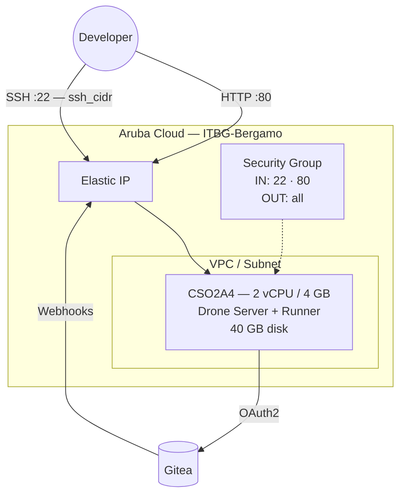

# Drone CI on Aruba Cloud

Deploy [Drone CI](https://www.drone.io) — a self-hosted continuous integration platform — on Aruba Cloud using Terraform and cloud-init. Drone integrates with Gitea via OAuth2 and runs build pipelines inside Docker containers.

> **Provider version:** arubacloud/arubacloud `~> 0.5` | **Terraform:** ≥ 1.9

---

## Introduction

Drone CI is a container-native CI/CD platform where every pipeline step runs in an isolated Docker container. This example provisions:

- **Drone Server** (Docker container) — web UI, API, and pipeline orchestration
- **Drone Docker Runner** (Docker container) — executes pipeline steps on the same VM
- **Docker** installed from the official Docker apt repository
- **Gitea OAuth2 integration** — users log in to Drone with their Gitea accounts
- Port 80 for the Drone web UI

> **Prerequisite:** A running Gitea instance is required. Use the [Gitea example](gitea.md) or [Forgejo example](forgejo.md) from this repository, then follow the OAuth2 setup steps below before running `terraform apply`.

---

## Architecture Overview



---

## Infrastructure Created

| Resource | Name pattern | Description |
|----------|-------------|-------------|
| `arubacloud_project` | `drone-prod` | Project container |
| `arubacloud_vpc` | `drone-prod-vpc` | Virtual Private Cloud |
| `arubacloud_subnet` | `drone-prod-subnet` | Basic subnet |
| `arubacloud_securitygroup` | `drone-prod-vm-sg` | Security group |
| `arubacloud_securityrule` | `drone-prod-vm-ssh` | SSH ingress |
| `arubacloud_securityrule` | `drone-prod-vm-http` | HTTP ingress TCP 80 |
| `arubacloud_elasticip` | `drone-prod-vm-eip` | VM public IP |
| `arubacloud_blockstorage` | `drone-prod-boot` | 40 GB boot disk (Performance) |
| `arubacloud_keypair` | `drone-prod-keypair` | SSH public key |
| `arubacloud_cloudserver` | `drone-prod-vm` | CloudServer VM |

---

## Estimated Monthly Cost

| Resource | Spec | Est. cost/mo |
|----------|------|-------------|
| CloudServer VM | CSO2A4 — 2 vCPU / 4 GB | ~€18 |
| Boot disk | 40 GB Performance | ~€6 |
| Elastic IP | — | ~€3 |
| **Total** | | **~€27/mo** |

---

## Requirements

- Terraform ≥ 1.9
- ArubaCloud Terraform Provider `~> 0.5`
- An ArubaCloud account with OAuth2 API credentials
- An SSH key pair
- A running **Gitea** (or Forgejo) instance reachable by the Drone VM

---

## Variables

### Required

| Variable | Description |
|----------|-------------|
| `arubacloud_client_id` | ArubaCloud OAuth2 client ID |
| `arubacloud_client_secret` | ArubaCloud OAuth2 client secret |
| `ssh_public_key` | SSH public key content |
| `gitea_url` | Base URL of your Gitea instance (e.g. `http://1.2.3.4:3000`) |
| `gitea_client_id` | OAuth2 client ID from the Gitea OAuth application |
| `gitea_client_secret` | OAuth2 client secret from the Gitea OAuth application |
| `drone_rpc_secret` | Shared secret between Drone server and runner |
| `drone_admin_user` | Gitea username to grant Drone admin privileges |

### Optional

| Variable | Default | Description |
|----------|---------|-------------|
| `app_name` | `"drone"` | Short name used in all resource names |
| `environment` | `"prod"` | Environment label |
| `location` | `"ITBG-Bergamo"` | ArubaCloud region |
| `zone` | `"ITBG-1"` | Availability zone |
| `billing_period` | `"Hour"` | `"Hour"` or `"Month"` |
| `vm_flavor` | `"CSO2A4"` | CloudServer flavor |
| `vm_image` | `"LU22-001"` | Boot disk image (Ubuntu 22.04 LTS) |
| `vm_disk_size_gb` | `40` | Boot disk size in GB |
| `ssh_cidr` | `"0.0.0.0/0"` | CIDR for SSH |
| `web_cidr` | `"0.0.0.0/0"` | CIDR for Drone web UI port 80 |

---

## Outputs

| Output | Description |
|--------|-------------|
| `drone_url` | Drone CI web UI URL |
| `gitea_oauth_redirect_url` | Redirect URL to enter when creating the Gitea OAuth application |
| `vm_public_ip` | Public IP address of the VM |
| `ssh_command` | SSH command to connect to the VM |

---

## Deployment Instructions

Drone CI requires a Gitea OAuth2 application before deployment. The redirect URL includes the Drone VM's Elastic IP, which is not known until after the first `terraform apply`. Use the **two-phase approach** below.

### Phase 1 — Get the Elastic IP

Apply with placeholder Gitea values to provision the VM and get its IP:

```bash
cp terraform.tfvars.example terraform.tfvars
# Fill in ArubaCloud credentials, ssh_public_key, and temporary placeholder values:
# gitea_url           = "http://placeholder"
# gitea_client_id     = "placeholder"
# gitea_client_secret = "placeholder"
# drone_rpc_secret    = "placeholderplaceholder"
# drone_admin_user    = "placeholder"

terraform init
terraform apply
terraform output gitea_oauth_redirect_url
# → http://<drone-ip>/login
```

### Phase 2 — Create Gitea OAuth application

In your Gitea instance: **Settings → Applications → OAuth2 Applications → Create**

- **Application name:** Drone CI
- **Redirect URI:** `http://<drone-ip>/login` (from Phase 1 output)

Copy the **Client ID** and **Client Secret**.

### Phase 3 — Re-apply with real credentials

Update `terraform.tfvars` with the real values:

```hcl
gitea_url           = "http://your-gitea-ip:3000"
gitea_client_id     = "real-client-id"
gitea_client_secret = "real-client-secret"
drone_rpc_secret    = "$(openssl rand -hex 16)"
drone_admin_user    = "your-gitea-username"
```

```bash
terraform apply
```

Terraform replaces the VM user_data and the VM is recreated with the correct configuration. Bootstrap takes approximately **3–5 minutes**.

### Phase 4 — Access Drone

```bash
terraform output drone_url
```

Open the URL in your browser and log in with your Gitea account. The `drone_admin_user` automatically receives admin privileges.

---

## Your first pipeline

Add a `.drone.yml` file to any Gitea repository:

```yaml
kind: pipeline
type: docker
name: default

steps:
  - name: test
    image: alpine
    commands:
      - echo "Hello from Drone CI!"
      - uname -a
```

Push to Gitea — Drone picks up the webhook and runs the pipeline automatically.

---

## Troubleshooting

### Drone UI not loading

```bash
ssh ubuntu@$(terraform output -raw vm_public_ip)
docker compose -f /opt/drone/docker-compose.yml ps
docker compose -f /opt/drone/docker-compose.yml logs drone-server
```

### OAuth login fails (redirect URI mismatch)

The redirect URI in Gitea must exactly match `http://<drone-ip>/login`. Check:

1. Gitea → Settings → Applications → your OAuth app → Redirect URIs
2. The value must be `http://<drone-ip>/login` (no trailing slash, correct IP)

### Runner not picking up jobs

```bash
docker compose -f /opt/drone/docker-compose.yml logs drone-runner
```

The runner connects to the server over the Docker internal network (`drone-server` hostname). Check that both containers are running:

```bash
docker compose -f /opt/drone/docker-compose.yml ps
```

---

## References

- [Drone CI Documentation](https://docs.drone.io)
- [Drone Gitea Integration](https://docs.drone.io/server/provider/gitea/)
- [Gitea Example](gitea.md)
- [Forgejo Example](forgejo.md)
- [ArubaCloud Terraform Provider](https://registry.terraform.io/providers/arubacloud/arubacloud/latest/docs)

