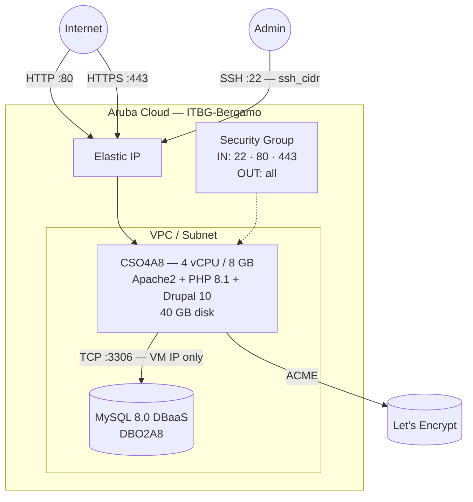

# Drupal on Aruba Cloud

Deploy [Drupal 10](https://www.drupal.org) — a flexible, enterprise-grade open-source CMS — on Aruba Cloud using Terraform and cloud-init. Drupal is installed via Composer with a managed MySQL 8.0 DBaaS backend, following the same production pattern as the WordPress example.

> **Provider version:** arubacloud/arubacloud `~> 0.5` | **Terraform:** ≥ 1.9

---

## Introduction

Drupal 10 is built on the `drupal/recommended-project` Composer template, which bundles Drupal core, Drush (the Drupal CLI), and sensible defaults for production. This example provisions:

- **Apache2 + PHP 8.1** with all Drupal-required extensions
- **Drupal 10** installed via Composer + Drush in fully unattended mode
- **Managed MySQL 8.0** via ArubaCloud DBaaS — Drupal never touches raw SQL
- Ports 80 and 443 open to the internet
- **Optional HTTPS** via Let's Encrypt when `domain` is set

> **Bootstrap time:** Composer downloads ~80 MB of PHP packages. Expect **15–20 minutes** before the site is reachable.

---

## Architecture Overview



---

## Infrastructure Created

| Resource | Name pattern | Description |
|----------|-------------|-------------|
| `arubacloud_project` | `drupal-prod` | Project container |
| `arubacloud_vpc` | `drupal-prod-vpc` | Virtual Private Cloud |
| `arubacloud_subnet` | `drupal-prod-subnet` | Basic subnet |
| `arubacloud_securitygroup` | `drupal-prod-vm-sg` | VM security group |
| `arubacloud_securitygroup` | `drupal-prod-dbaas-sg` | DBaaS security group |
| `arubacloud_securityrule` | `drupal-prod-vm-ssh` | SSH ingress |
| `arubacloud_securityrule` | `drupal-prod-vm-http` | HTTP ingress TCP 80 |
| `arubacloud_securityrule` | `drupal-prod-vm-https` | HTTPS ingress TCP 443 |
| `arubacloud_securityrule` | `drupal-prod-db-mysql` | MySQL ingress from VM IP only |
| `arubacloud_elasticip` | `drupal-prod-vm-eip` | VM public IP |
| `arubacloud_elasticip` | `drupal-prod-dbaas-eip` | DBaaS public IP |
| `arubacloud_blockstorage` | `drupal-prod-boot` | 40 GB boot disk (Performance) |
| `arubacloud_keypair` | `drupal-prod-keypair` | SSH public key |
| `arubacloud_dbaas` | `drupal-prod-dbaas` | Managed MySQL 8.0 |
| `arubacloud_database` | `drupal` | Drupal database |
| `arubacloud_dbaasuser` | `drupal` | Drupal DB user |
| `arubacloud_cloudserver` | `drupal-prod-vm` | CloudServer VM |

---

## Estimated Monthly Cost

| Resource | Spec | Est. cost/mo |
|----------|------|-------------|
| CloudServer VM | CSO4A8 — 4 vCPU / 8 GB | ~€35 |
| Boot disk | 40 GB Performance | ~€6 |
| Elastic IP (VM) | — | ~€3 |
| MySQL DBaaS | DBO2A8 + 20 GB | ~€30 |
| Elastic IP (DBaaS) | — | ~€3 |
| **Total** | | **~€77/mo** |

---

## Requirements

- Terraform ≥ 1.9
- ArubaCloud Terraform Provider `~> 0.5`
- An ArubaCloud account with OAuth2 API credentials
- An SSH key pair

---

## Variables

### Required

| Variable | Description |
|----------|-------------|
| `arubacloud_client_id` | ArubaCloud OAuth2 client ID |
| `arubacloud_client_secret` | ArubaCloud OAuth2 client secret |
| `ssh_public_key` | SSH public key content |
| `db_password` | Drupal MySQL user password (min 16 chars) |
| `admin_email` | Drupal admin email address |
| `admin_password` | Drupal admin password (min 16 chars) |

### Optional

| Variable | Default | Description |
|----------|---------|-------------|
| `app_name` | `"drupal"` | Short name used in all resource names |
| `environment` | `"prod"` | Environment label |
| `location` | `"ITBG-Bergamo"` | ArubaCloud region |
| `zone` | `"ITBG-1"` | Availability zone |
| `billing_period` | `"Hour"` | `"Hour"` or `"Month"` |
| `vm_flavor` | `"CSO4A8"` | CloudServer flavor |
| `vm_image` | `"LU22-001"` | Boot disk image (Ubuntu 22.04 LTS) |
| `vm_disk_size_gb` | `40` | Boot disk size in GB |
| `ssh_cidr` | `"0.0.0.0/0"` | CIDR for SSH — restrict in production |
| `dbaas_flavor` | `"DBO2A8"` | DBaaS instance flavor |
| `db_storage_gb` | `20` | DBaaS initial storage size in GB |
| `site_name` | `"My Drupal Site"` | Site display name |
| `admin_user` | `"admin"` | Drupal admin username |
| `domain` | `""` | Domain for automatic Let's Encrypt HTTPS |

---

## Outputs

| Output | Description |
|--------|-------------|
| `site_url` | Drupal site URL |
| `admin_url` | Drupal admin login URL |
| `vm_public_ip` | Public IP address of the VM |
| `ssh_command` | SSH command to connect to the VM |
| `db_host` | MySQL DBaaS host address |

---

## Deployment Instructions

### 1. Clone and navigate

```bash
git clone https://github.com/arubacloud/terraform-arubacloud-examples.git
cd terraform-arubacloud-examples/drupal
```

### 2. Configure variables

```bash
cp terraform.tfvars.example terraform.tfvars
```

Set credentials, passwords, and admin email:

```hcl
db_password    = "your-strong-db-password"
admin_email    = "admin@example.com"
admin_password = "your-strong-admin-password"
```

### 3. Deploy

```bash
terraform init
terraform plan
terraform apply
```

Bootstrap takes **15–20 minutes** — Composer downloads and DBaaS provisioning run in parallel.

### 4. Access Drupal

```bash
terraform output site_url
terraform output admin_url
```

Log in with `admin_user` and `admin_password`.

---

## Troubleshooting

### Site not loading after apply

The bootstrap is still running. Check progress:

```bash
ssh ubuntu@$(terraform output -raw vm_public_ip)
sudo tail -f /var/log/cloud-init-output.log
```

### Drush site:install failed

Check if DBaaS was reachable:

```bash
nc -zv $(terraform output -raw db_host) 3306
sudo cat /var/log/cloud-init-output.log | grep -A5 "ERROR\|Waiting"
```

---

## References

- [Drupal Documentation](https://www.drupal.org/docs)
- [Drush Documentation](https://www.drush.org)
- [ArubaCloud Terraform Provider](https://registry.terraform.io/providers/arubacloud/arubacloud/latest/docs)

