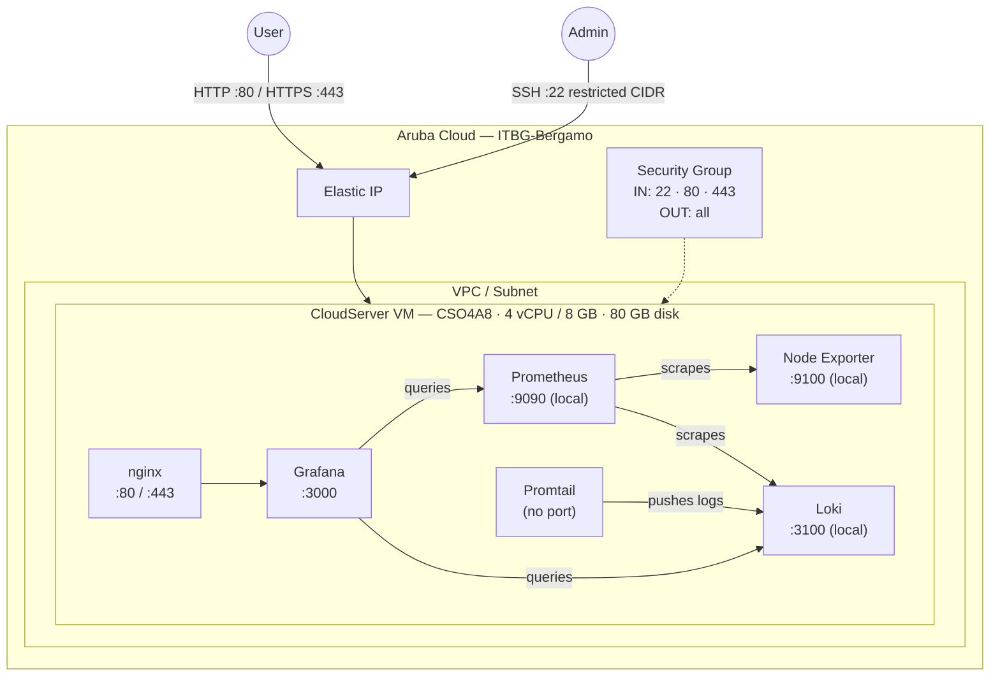

# Grafana + Prometheus + Loki on Aruba Cloud

Deploy a complete self-hosted observability stack — [Grafana](https://grafana.com), [Prometheus](https://prometheus.io), [Loki](https://grafana.com/oss/loki/), and [Promtail](https://grafana.com/docs/loki/latest/send-data/promtail/) — on Aruba Cloud using Terraform and cloud-init. Data sources are pre-provisioned; log in and start building dashboards immediately.

> **Provider version:** arubacloud/arubacloud `~> 0.5` | **Terraform:** ≥ 1.9

---

## Introduction

This example provisions a production-ready observability stack on a single Aruba Cloud VM with five components running as systemd services:

| Component | Role | Port |
|-----------|------|------|
| **Grafana** | Dashboard, alerting, and visualisation UI | 3000 (proxied by nginx on 80/443) |
| **Prometheus** | Metrics collection and storage (TSDB) | 9090 (localhost only) |
| **Node Exporter** | Host-level system metrics (CPU, RAM, disk, network) | 9100 (localhost only) |
| **Loki** | Log aggregation and storage | 3100 (localhost only) |
| **Promtail** | Log shipper — tails `/var/log` and ships to Loki | — |

Prometheus and Loki are bound to `127.0.0.1` and are **not** reachable from the internet. All external traffic goes through nginx (port 80/443) to Grafana on port 3000.

On first login, Prometheus and Loki are already configured as Grafana data sources — no manual setup required.

---

## Architecture Overview



---

## Infrastructure Created

| Resource | Name pattern | Description |
|----------|-------------|-------------|
| `arubacloud_project` | `grafana-prod` | Project container |
| `arubacloud_vpc` | `grafana-prod-vpc` | Virtual Private Cloud |
| `arubacloud_subnet` | `grafana-prod-subnet` | Basic subnet |
| `arubacloud_securitygroup` | `grafana-prod-vm-sg` | Security group |
| `arubacloud_securityrule` | `grafana-prod-vm-ssh` | SSH ingress (restricted CIDR) |
| `arubacloud_securityrule` | `grafana-prod-vm-http` | HTTP ingress |
| `arubacloud_securityrule` | `grafana-prod-vm-https` | HTTPS ingress |
| `arubacloud_elasticip` | `grafana-prod-vm-eip` | VM public IP |
| `arubacloud_blockstorage` | `grafana-prod-boot` | 80 GB boot disk (Performance) |
| `arubacloud_keypair` | `grafana-prod-keypair` | SSH public key |
| `arubacloud_cloudserver` | `grafana-prod-vm` | CloudServer VM |

---

## Estimated Monthly Cost

> Approximate prices for ITBG-Bergamo, hourly billing.

| Resource | Spec | Est. cost/mo |
|----------|------|-------------|
| CloudServer VM | CSO4A8 — 4 vCPU / 8 GB | ~€36 |
| Boot disk | 80 GB Performance | ~€10 |
| Elastic IP | — | ~€3 |
| **Total** | | **~€49/mo** |

Disk usage grows over time as Prometheus TSDB and Loki chunks accumulate. The default retention is **30 days** for Prometheus and **31 days** (744 h) for Loki. Increase `vm_disk_size_gb` or reduce retention for very high-volume environments.

---

## Requirements

- Terraform ≥ 1.9
- ArubaCloud Terraform Provider `~> 0.5`
- An ArubaCloud account with OAuth2 API credentials
- An SSH key pair

---

## Variables

### Required

| Variable | Description |
|----------|-------------|
| `arubacloud_client_id` | ArubaCloud OAuth2 client ID |
| `arubacloud_client_secret` | ArubaCloud OAuth2 client secret |
| `ssh_public_key` | SSH public key content |
| `grafana_admin_password` | Grafana admin password (min 8 chars) |

### Optional

| Variable | Default | Description |
|----------|---------|-------------|
| `app_name` | `"grafana"` | Short name used in all resource names |
| `environment` | `"prod"` | Environment label |
| `location` | `"ITBG-Bergamo"` | ArubaCloud region |
| `zone` | `"ITBG-1"` | Availability zone |
| `billing_period` | `"Hour"` | `"Hour"` or `"Month"` |
| `vm_flavor` | `"CSO4A8"` | CloudServer flavor |
| `vm_image` | `"LU22-001"` | Boot disk image (Ubuntu 22.04 LTS) |
| `vm_disk_size_gb` | `80` | Boot disk size in GB |
| `ssh_cidr` | `"0.0.0.0/0"` | CIDR for SSH — **restrict to your IP in production** |
| `domain` | `""` | Custom domain for HTTPS — leave empty to use the Elastic IP |
| `prometheus_version` | `"3.0.1"` | Prometheus binary version |
| `loki_version` | `"3.4.2"` | Loki + Promtail binary version |
| `node_exporter_version` | `"1.8.2"` | Node Exporter binary version |

---

## Outputs

| Output | Description |
|--------|-------------|
| `grafana_url` | Grafana web interface URL |
| `vm_public_ip` | Public IP address of the VM |
| `ssh_command` | SSH command to connect to the VM |
| `grafana_admin_password` | Grafana admin password (sensitive) |

---

## Deployment Instructions

### 1. Clone and navigate

```bash
git clone https://github.com/arubacloud/terraform-arubacloud-examples.git
cd terraform-arubacloud-examples/grafana
```

### 2. Configure variables

```bash
cp terraform.tfvars.example terraform.tfvars
```

Set `grafana_admin_password` to a strong value, along with your credentials and SSH key.

### 3. Deploy

```bash
terraform init
terraform plan
terraform apply
```

Bootstrap takes approximately **8–12 minutes** (Grafana installs via APT; Prometheus, Loki, Promtail, and Node Exporter download as binaries).

### 4. Log in to Grafana

```bash
terraform output grafana_url
```

Open the URL in your browser and log in with:

- **Username:** `admin`
- **Password:** the value of `grafana_admin_password`

### 5. Explore your data

- Go to **Explore** → select the **Prometheus** data source → query `node_cpu_seconds_total` or `node_memory_MemAvailable_bytes` for host metrics.
- Go to **Explore** → select the **Loki** data source → query `{job="varlogs"}` to see system logs.

---

## Destroy Instructions

```bash
terraform destroy
```

All resources including the boot disk (and all stored metrics and logs) are permanently deleted.

---

## Security Recommendations

1. **Restrict SSH to your IP.** Set `ssh_cidr = "your.ip/32"`.

2. **Use a custom domain with HTTPS.** Set the `domain` variable. Without TLS, the Grafana password is transmitted in cleartext.

3. **Change the admin password** after first login via **Profile → Change Password**.

4. **Do not expose Prometheus or Loki directly.** Both services bind to `127.0.0.1` by default in this example. Never add `0.0.0.0` listener addresses without authentication middleware.

5. **Configure Grafana authentication** for team access: LDAP, OAuth (Google, GitHub), or SAML are all supported and can be added to `grafana.ini`.

---

## Upgrade Considerations

### Grafana upgrade

```bash
ssh ubuntu@$(terraform output -raw vm_public_ip)
sudo apt-get update && sudo apt-get install --only-upgrade grafana
sudo systemctl restart grafana-server
```

### Prometheus / Loki / Node Exporter upgrade

Update the version variable in `terraform.tfvars` and run `terraform apply`. This replaces the VM and redeploys the stack. **Back up any data you need first** — TSDB data and Loki chunks on the boot disk will be lost.

For in-place upgrades without VM replacement:

```bash
ssh ubuntu@$(terraform output -raw vm_public_ip)

# Example: upgrade Prometheus to 3.1.0
VER=3.1.0
sudo systemctl stop prometheus
curl -sSfL \
  "https://github.com/prometheus/prometheus/releases/download/v$VER/prometheus-$VER.linux-amd64.tar.gz" \
  | sudo tar -xz -C /usr/local/bin --strip-components=1 \
    prometheus-$VER.linux-amd64/prometheus \
    prometheus-$VER.linux-amd64/promtool
sudo systemctl start prometheus
```

---

## Troubleshooting

### Grafana shows "data source not found"

The provisioning YAML files are loaded at Grafana start. Check that they were written correctly:

```bash
ssh ubuntu@$(terraform output -raw vm_public_ip)
cat /etc/grafana/provisioning/datasources/observability.yaml
sudo systemctl restart grafana-server
```

### Prometheus has no targets

```bash
# Check prometheus config is valid:
promtool check config /etc/prometheus/prometheus.yml

# View Prometheus targets in the UI (via SSH tunnel):
ssh -L 9090:localhost:9090 ubuntu@$(terraform output -raw vm_public_ip)
# Then open http://localhost:9090/targets in your browser
```

### Loki returns no logs in Grafana

Verify Promtail is running and has sent data:

```bash
sudo systemctl status promtail
sudo journalctl -u promtail -n 30
# Check Loki received data:
curl -s http://localhost:3100/ready
```

### cloud-init did not complete

```bash
ssh ubuntu@$(terraform output -raw vm_public_ip)
sudo tail -100 /var/log/cloud-init-output.log
sudo systemctl status cloud-init
```

---

## References

- [Grafana Documentation](https://grafana.com/docs/grafana/latest/)
- [Prometheus Documentation](https://prometheus.io/docs/)
- [Loki Documentation](https://grafana.com/docs/loki/latest/)
- [Promtail Documentation](https://grafana.com/docs/loki/latest/send-data/promtail/)
- [Node Exporter](https://github.com/prometheus/node_exporter)
- [ArubaCloud Terraform Provider](https://registry.terraform.io/providers/arubacloud/arubacloud/latest/docs)
- [cloud-init Reference](https://cloudinit.readthedocs.io/)

