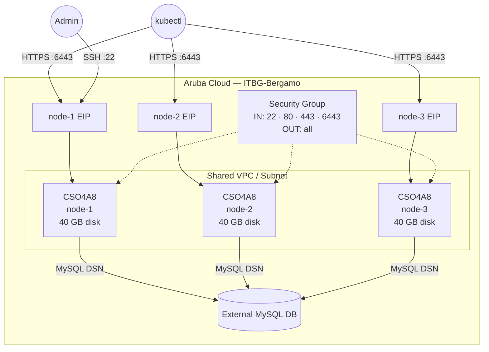

# k3s HA Cluster on Aruba Cloud

Deploy a **3-node k3s HA control-plane cluster** on Aruba Cloud using Terraform and cloud-init. Uses an external MySQL 8.0 database as the HA datastore via the embedded [kine](https://github.com/k3s-io/kine) shim.

> **Provider version:** arubacloud/arubacloud `~> 0.5` | **Terraform:** ≥ 1.9

---

## Introduction

[k3s](https://k3s.io/) is a lightweight, CNCF-certified Kubernetes distribution optimized for edge and resource-constrained environments. This example deploys a 3-node HA control-plane — all three nodes can serve the Kubernetes API and schedule workloads. It:

- Creates **three identical control-plane nodes** (each with its own Elastic IP)
- Uses an **external MySQL 8.0 datastore** for cluster state (Aruba Cloud DBaaS or bring your own)
- Opens SSH (22), Kubernetes API (6443), HTTP (80), and HTTPS (443)
- Disables the built-in ServiceLB (Klipper) — use an external LB or MetalLB instead

> **External DB required:** You must provision a MySQL 8.0 database separately before running `terraform apply`. Create a `k3s` database and a dedicated user with full privileges on it.

---

## Architecture Overview



---

## Infrastructure Created

| Resource | Count | Name pattern | Description |
|----------|-------|-------------|-------------|
| `arubacloud_project` | 1 | `k3sha-prod` | Project container |
| `arubacloud_vpc` | 1 | `k3sha-prod-vpc` | Virtual Private Cloud |
| `arubacloud_subnet` | 1 | `k3sha-prod-subnet` | Basic subnet |
| `arubacloud_securitygroup` | 1 | `k3sha-prod-sg` | Shared security group |
| `arubacloud_securityrule` | 5 | `k3sha-prod-{ssh,api,http,https,egress}` | Ingress/egress rules |
| `arubacloud_elasticip` | 3 | `k3sha-prod-node-{1,2,3}-eip` | One public IP per node |
| `arubacloud_blockstorage` | 3 | `k3sha-prod-node-{1,2,3}-boot` | 40 GB boot disk per node |
| `arubacloud_keypair` | 1 | `k3sha-prod-keypair` | Shared SSH public key |
| `arubacloud_cloudserver` | 3 | `k3sha-prod-node-{1,2,3}` | Control-plane VMs |

---

## Estimated Monthly Cost

| Resource | Spec | Est. cost/mo |
|----------|------|-------------|
| 3× CloudServer VM | CSO4A8 — 4 vCPU / 8 GB | ~€120 |
| 3× Boot disk | 40 GB Performance | ~€18 |
| 3× Elastic IP | — | ~€9 |
| External MySQL | Aruba Cloud DBaaS (varies) | ~€15 |
| **Total** | | **~€162/mo** |

---

## Requirements

- Terraform ≥ 1.9
- ArubaCloud Terraform Provider `~> 0.5`
- An ArubaCloud account with OAuth2 API credentials
- An SSH key pair
- An external **MySQL 8.0** database reachable from the VMs

---

## Variables

### Required

| Variable | Description |
|----------|-------------|
| `arubacloud_client_id` | ArubaCloud OAuth2 client ID |
| `arubacloud_client_secret` | ArubaCloud OAuth2 client secret |
| `ssh_public_key` | SSH public key content |
| `k3s_token` | Shared cluster token (generate with `openssl rand -hex 32`, min 16 chars) |
| `db_host` | MySQL 8.0 hostname or IP |
| `db_password` | MySQL password |

### Optional

| Variable | Default | Description |
|----------|---------|-------------|
| `k3s_version` | `"latest"` | k3s version (e.g. `"v1.32.0+k3s1"`) |
| `db_port` | `3306` | MySQL port |
| `db_name` | `"k3s"` | MySQL database name |
| `db_user` | `"k3s"` | MySQL username |
| `ssh_cidr` | `"0.0.0.0/0"` | CIDR for SSH access |
| `api_cidr` | `"0.0.0.0/0"` | CIDR for k3s API server (port 6443) — restrict in production |
| `app_name` | `"k3sha"` | Short name used in all resource names |
| `environment` | `"prod"` | Environment label |
| `location` | `"ITBG-Bergamo"` | ArubaCloud region |
| `zone` | `"ITBG-1"` | Availability zone |
| `billing_period` | `"Hour"` | `"Hour"` or `"Month"` |
| `vm_flavor` | `"CSO4A8"` | CloudServer flavor per node |
| `vm_disk_size_gb` | `40` | Boot disk size per node (min 20 GB) |

---

## Outputs

| Output | Description |
|--------|-------------|
| `node_public_ips` | Map of node name → public IP |
| `ssh_commands` | Map of node name → SSH command |
| `api_endpoints` | Map of node name → `https://<IP>:6443` |

---

## Deployment Instructions

### 1. Provision the external MySQL database

Create a MySQL 8.0 database before deploying:

```sql
CREATE DATABASE k3s;
CREATE USER 'k3s'@'%' IDENTIFIED BY 'your-password';
GRANT ALL PRIVILEGES ON k3s.* TO 'k3s'@'%';
FLUSH PRIVILEGES;
```

### 2. Clone and navigate

```bash
git clone https://github.com/arubacloud/terraform-arubacloud-examples.git
cd terraform-arubacloud-examples/k3s-ha
```

### 3. Configure variables

```bash
cp terraform.tfvars.example terraform.tfvars
```

### 4. Deploy

```bash
terraform init
terraform plan
terraform apply
```

The three nodes are created simultaneously. Each bootstraps in **2–5 minutes**.

### 5. Retrieve the kubeconfig

```bash
# SSH into node-1
ssh ubuntu@<node-1-ip>
sudo cat /etc/rancher/k3s/k3s.yaml
```

Copy the kubeconfig to your local machine and replace `127.0.0.1` with the node's public IP:

```bash
export KUBECONFIG=~/.kube/k3s-ha.yaml
kubectl get nodes
```

---

## References

- [k3s HA with External DB](https://docs.k3s.io/datastore/ha)
- [k3s Documentation](https://docs.k3s.io/)
- [kine — SQL datastore shim](https://github.com/k3s-io/kine)
- [ArubaCloud Terraform Provider](https://registry.terraform.io/providers/arubacloud/arubacloud/latest/docs)

