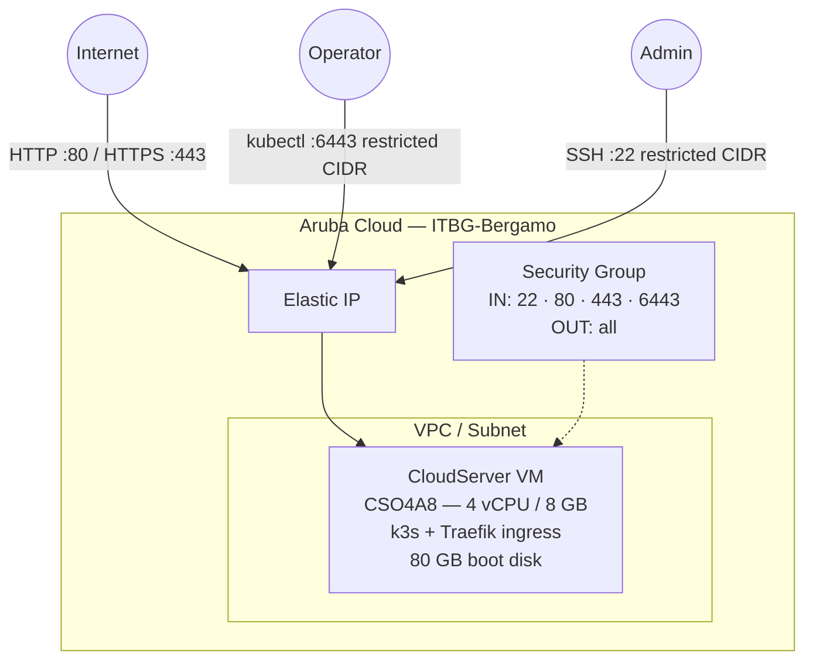

# k3s Single Node on Aruba Cloud

Deploy a production-ready [k3s](https://k3s.io) single-node Kubernetes cluster on Aruba Cloud using Terraform and cloud-init. Includes the built-in Traefik ingress controller — no manual configuration required.

> **Provider version:** arubacloud/arubacloud `~> 0.5` | **Terraform:** ≥ 1.9

---

## Introduction

k3s is a lightweight, CNCF-certified Kubernetes distribution packaged as a single binary. It is ideal for edge computing, homelabs, CI environments, and small production workloads. This example provisions a single-node k3s cluster on Aruba Cloud with:

- A **CloudServer VM** (CSO4A8 — 4 vCPU / 8 GB) running k3s, fully bootstrapped by cloud-init
- The **built-in Traefik v2 ingress controller** for routing HTTP/HTTPS traffic to services
- A dedicated **VPC, subnet, and security group** via the shared network module
- An **Elastic IP** pinned to the node for stable external access
- The Kubernetes API server pre-configured with the node's Elastic IP as a **TLS SAN** — so `kubectl` works immediately from your laptop without certificate errors
- A ready-to-use **kubeconfig** placed in `~ubuntu/.kube/config` on the node after boot

---

## Architecture Overview

k3s runs as a single systemd service combining the control plane and worker node. Traefik is installed by k3s as a DaemonSet and handles all Ingress resources.



---

## Infrastructure Created

| Resource | Name pattern | Description |
|----------|-------------|-------------|
| `arubacloud_project` | `k3s-prod` | Project container |
| `arubacloud_vpc` | `k3s-prod-vpc` | Virtual Private Cloud |
| `arubacloud_subnet` | `k3s-prod-subnet` | Basic subnet |
| `arubacloud_securitygroup` | `k3s-prod-vm-sg` | Security group |
| `arubacloud_securityrule` | `k3s-prod-vm-ssh` | SSH ingress (restricted CIDR) |
| `arubacloud_securityrule` | `k3s-prod-vm-http` | HTTP ingress (0.0.0.0/0) |
| `arubacloud_securityrule` | `k3s-prod-vm-https` | HTTPS ingress (0.0.0.0/0) |
| `arubacloud_securityrule` | `k3s-prod-vm-k8s-api` | Kubernetes API ingress (restricted CIDR) |
| `arubacloud_elasticip` | `k3s-prod-vm-eip` | Node public IP |
| `arubacloud_blockstorage` | `k3s-prod-boot` | 80 GB boot disk (Performance) |
| `arubacloud_keypair` | `k3s-prod-keypair` | SSH public key |
| `arubacloud_cloudserver` | `k3s-prod-vm` | CloudServer VM |

---

## VM Sizing Recommendation

| Workload | vCPU | RAM | Disk | Flavor |
|----------|------|-----|------|--------|
| Dev / CI / low-traffic | 4 | 8 GB | 80 GB | `CSO4A8` *(default)* |
| Medium production | 8 | 16 GB | 100 GB | `CSO8A16` |

A single-node cluster cannot reschedule pods on failure. For high availability, consider a multi-node setup (see the k3s HA example in Phase 3).

---

## Estimated Monthly Cost

> Approximate prices for ITBG-Bergamo, hourly billing. Actual prices may vary.

| Resource | Spec | Est. cost/mo |
|----------|------|-------------|
| CloudServer VM | CSO4A8 — 4 vCPU / 8 GB | ~€36 |
| Boot disk | 80 GB Performance | ~€10 |
| Elastic IP | — | ~€3 |
| **Total** | | **~€49/mo** |

---

## Requirements

- Terraform ≥ 1.9
- ArubaCloud Terraform Provider `~> 0.5`
- An ArubaCloud account with OAuth2 API credentials
- An SSH key pair
- `kubectl` installed locally to interact with the cluster

---

## Variables

### Required

| Variable | Description |
|----------|-------------|
| `arubacloud_client_id` | ArubaCloud OAuth2 client ID |
| `arubacloud_client_secret` | ArubaCloud OAuth2 client secret |
| `ssh_public_key` | SSH public key content |

### Optional

| Variable | Default | Description |
|----------|---------|-------------|
| `app_name` | `"k3s"` | Short name used in all resource names |
| `environment` | `"prod"` | Environment label |
| `location` | `"ITBG-Bergamo"` | ArubaCloud region |
| `zone` | `"ITBG-1"` | Availability zone |
| `billing_period` | `"Hour"` | `"Hour"` or `"Month"` |
| `vm_flavor` | `"CSO4A8"` | CloudServer flavor |
| `vm_image` | `"LU22-001"` | Boot disk image (Ubuntu 22.04 LTS) |
| `vm_disk_size_gb` | `80` | Boot disk size in GB |
| `ssh_cidr` | `"0.0.0.0/0"` | CIDR for SSH — **restrict to your IP in production** |
| `api_cidr` | `"0.0.0.0/0"` | CIDR for Kubernetes API (port 6443) — **restrict to your IP in production** |
| `k3s_version` | `"v1.32.3+k3s1"` | k3s release — check [github.com/k3s-io/k3s/releases](https://github.com/k3s-io/k3s/releases) |
| `cluster_domain` | `""` | Optional DNS name added as TLS SAN to the API server certificate |

---

## Outputs

| Output | Description |
|--------|-------------|
| `vm_public_ip` | Public IP address of the k3s node |
| `api_endpoint` | Kubernetes API server URL |
| `ssh_command` | SSH command to connect to the node |
| `kubeconfig_cmd` | One-liner to fetch the kubeconfig to your local machine |

---

## Deployment Instructions

### 1. Clone and navigate

```bash
git clone https://github.com/arubacloud/terraform-arubacloud-examples.git
cd terraform-arubacloud-examples/k3s-single
```

### 2. Configure variables

```bash
cp terraform.tfvars.example terraform.tfvars
```

Edit `terraform.tfvars` with your credentials and SSH key.

### 3. Initialize and deploy

```bash
terraform init
terraform plan
terraform apply
```

Bootstrap takes approximately **3–5 minutes** — k3s installs fast since it is a single binary.

### 4. Fetch kubeconfig

```bash
# Copy the one-liner from outputs:
terraform output -raw kubeconfig_cmd | bash

# Or manually:
ssh ubuntu@$(terraform output -raw vm_public_ip) \
  'cat ~/.kube/config' > ~/.kube/k3s-arubacloud.yaml
export KUBECONFIG=~/.kube/k3s-arubacloud.yaml
```

### 5. Verify the cluster

```bash
kubectl get nodes
# NAME          STATUS   ROLES                  AGE   VERSION
# k3s-prod-vm   Ready    control-plane,master   2m    v1.32.3+k3s1

kubectl get pods -A
# Traefik, CoreDNS, and metrics-server should all be Running.
```

### 6. Deploy a workload

```bash
kubectl create deployment hello --image=nginx --replicas=1
kubectl expose deployment hello --port=80 --type=ClusterIP

# Create an Ingress to route external traffic:
cat <<EOF | kubectl apply -f -
apiVersion: networking.k8s.io/v1
kind: Ingress
metadata:
  name: hello
  annotations:
    traefik.ingress.kubernetes.io/router.entrypoints: web
spec:
  rules:
  - http:
      paths:
      - path: /
        pathType: Prefix
        backend:
          service:
            name: hello
            port:
              number: 80
EOF

curl http://$(terraform output -raw vm_public_ip)
```

---

## Destroy Instructions

```bash
terraform destroy
```

All cloud resources are deleted. Any data stored in PersistentVolumes on the boot disk is lost.

---

## Security Recommendations

1. **Restrict `api_cidr` to your IP.** Exposing port 6443 to `0.0.0.0/0` allows anyone to attempt authentication against the API. Set `api_cidr = "your.ip/32"`.

2. **Restrict `ssh_cidr` to your IP.** Set `ssh_cidr = "your.ip/32"`.

3. **Rotate the node token periodically.** The k3s node token lives at `/var/lib/rancher/k3s/server/node-token`. Keep it secret.

4. **Use RBAC for workloads.** k3s ships with RBAC enabled. Create service accounts with least-privilege roles for each application.

5. **Enable TLS for Ingress.** Use cert-manager with Let's Encrypt to provision certificates for your Ingress resources, or configure Traefik's built-in ACME support.

---

## Upgrade Considerations

### k3s upgrade

k3s can be upgraded in-place using the same install script with a new version:

```bash
ssh ubuntu@$(terraform output -raw vm_public_ip)
curl -sfL https://get.k3s.io | INSTALL_K3S_VERSION="vX.Y.Z+k3s1" sh -
```

For zero-downtime upgrades in production, use the [System Upgrade Controller](https://github.com/rancher/system-upgrade-controller).

### Changing the node flavor

Changing `vm_flavor` or `vm_disk_size_gb` in `terraform.tfvars` and running `terraform apply` will **replace the VM**. Back up all PersistentVolume data first.

---

## Troubleshooting

### k3s is not running after apply

```bash
ssh ubuntu@$(terraform output -raw vm_public_ip)
sudo systemctl status k3s
sudo journalctl -u k3s -n 100
sudo tail -f /var/log/cloud-init-output.log
```

### kubectl returns certificate error

The API server certificate includes the node's Elastic IP as a SAN. If you set `cluster_domain`, ensure that DNS resolves to the Elastic IP and use the domain in your kubeconfig server URL.

### Pods stuck in Pending

Check node resources:

```bash
kubectl describe node
kubectl get events --sort-by='.lastTimestamp'
```

Single-node clusters run both control-plane and workloads on the same VM — ensure the flavor has enough memory for your workloads.

---

## References

- [k3s Documentation](https://docs.k3s.io/)
- [k3s Releases](https://github.com/k3s-io/k3s/releases)
- [Traefik on k3s](https://docs.k3s.io/networking/traefik-ingress)
- [ArubaCloud Terraform Provider](https://registry.terraform.io/providers/arubacloud/arubacloud/latest/docs)
- [cloud-init Reference](https://cloudinit.readthedocs.io/)

