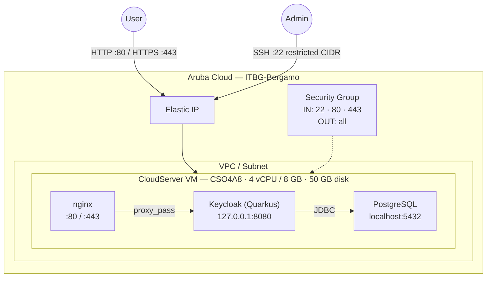

# Keycloak on Aruba Cloud

Deploy [Keycloak](https://www.keycloak.org) — enterprise identity and access management — on Aruba Cloud using Terraform and cloud-init. Keycloak runs in production Quarkus mode backed by a local PostgreSQL database.

> **Provider version:** arubacloud/arubacloud `~> 0.5` | **Terraform:** ≥ 1.9

---

## Introduction

Keycloak is a CNCF-graduated open-source IAM platform providing SSO, OIDC, OAuth2, and SAML 2.0. This example deploys Keycloak with:

- **Keycloak Quarkus distribution** in production server mode — not dev mode, no ephemeral H2 database
- **Local PostgreSQL** — Keycloak officially supports PostgreSQL and MariaDB. Managed MySQL from the ArubaCloud DBaaS is **not** on the Keycloak support matrix and is not used here
- **nginx reverse proxy** on ports 80/443 with correct forwarding headers (`X-Forwarded-*`), while Keycloak binds to `127.0.0.1:8080`
- **Admin user created automatically** on first start via systemd environment file — log in immediately after bootstrap
- Optional **Let's Encrypt HTTPS** when a custom domain is provided

---

## Architecture Overview



---

## Infrastructure Created

| Resource | Name pattern | Description |
|----------|-------------|-------------|
| `arubacloud_project` | `kc-prod` | Project container |
| `arubacloud_vpc` | `kc-prod-vpc` | Virtual Private Cloud |
| `arubacloud_subnet` | `kc-prod-subnet` | Basic subnet |
| `arubacloud_securitygroup` | `kc-prod-vm-sg` | Security group |
| `arubacloud_securityrule` | `kc-prod-vm-ssh` | SSH ingress |
| `arubacloud_securityrule` | `kc-prod-vm-http` | HTTP ingress |
| `arubacloud_securityrule` | `kc-prod-vm-https` | HTTPS ingress |
| `arubacloud_elasticip` | `kc-prod-vm-eip` | VM public IP |
| `arubacloud_blockstorage` | `kc-prod-boot` | 50 GB boot disk (Performance) |
| `arubacloud_keypair` | `kc-prod-keypair` | SSH public key |
| `arubacloud_cloudserver` | `kc-prod-vm` | CloudServer VM |

---

## Estimated Monthly Cost

| Resource | Spec | Est. cost/mo |
|----------|------|-------------|
| CloudServer VM | CSO4A8 — 4 vCPU / 8 GB | ~€36 |
| Boot disk | 50 GB Performance | ~€6 |
| Elastic IP | — | ~€3 |
| **Total** | | **~€45/mo** |

---

## Requirements

- Terraform ≥ 1.9
- ArubaCloud Terraform Provider `~> 0.5`
- An ArubaCloud account with OAuth2 API credentials
- An SSH key pair

---

## Variables

### Required

| Variable | Description |
|----------|-------------|
| `arubacloud_client_id` | ArubaCloud OAuth2 client ID |
| `arubacloud_client_secret` | ArubaCloud OAuth2 client secret |
| `ssh_public_key` | SSH public key content |
| `keycloak_admin_password` | Keycloak admin password (min 12 chars) |
| `db_password` | PostgreSQL Keycloak user password (min 16 chars) |

### Optional

| Variable | Default | Description |
|----------|---------|-------------|
| `app_name` | `"kc"` | Short name used in all resource names |
| `environment` | `"prod"` | Environment label |
| `location` | `"ITBG-Bergamo"` | ArubaCloud region |
| `zone` | `"ITBG-1"` | Availability zone |
| `billing_period` | `"Hour"` | `"Hour"` or `"Month"` |
| `vm_flavor` | `"CSO4A8"` | CloudServer flavor |
| `vm_image` | `"LU22-001"` | Boot disk image (Ubuntu 22.04 LTS) |
| `vm_disk_size_gb` | `50` | Boot disk size in GB |
| `ssh_cidr` | `"0.0.0.0/0"` | CIDR for SSH — **restrict to your IP** |
| `keycloak_admin` | `"admin"` | Keycloak admin username |
| `keycloak_version` | `"26.0.7"` | Keycloak release version |
| `domain` | `""` | Custom domain for HTTPS — leave empty to use the Elastic IP |

---

## Outputs

| Output | Description |
|--------|-------------|
| `keycloak_url` | Keycloak URL |
| `admin_console_url` | Keycloak Admin Console URL |
| `vm_public_ip` | Public IP of the VM |
| `ssh_command` | SSH command to connect |
| `keycloak_admin` | Admin username |

---

## Deployment Instructions

### 1. Clone and navigate

```bash
git clone https://github.com/arubacloud/terraform-arubacloud-examples.git
cd terraform-arubacloud-examples/keycloak
```

### 2. Configure variables

```bash
cp terraform.tfvars.example terraform.tfvars
```

Set `keycloak_admin_password` and `db_password`.

### 3. Deploy

```bash
terraform init
terraform plan
terraform apply
```

Bootstrap takes approximately **8–12 minutes** — Keycloak downloads ~120 MB and `kc.sh build` compiles the Quarkus app.

### 4. Access the Admin Console

```bash
terraform output admin_console_url
```

Log in with the admin username and `keycloak_admin_password`. Create your realms, clients, and users.

### 5. Monitor bootstrap progress

```bash
ssh ubuntu@$(terraform output -raw vm_public_ip)
sudo tail -f /var/log/cloud-init-output.log
# Or follow Keycloak logs:
sudo journalctl -u keycloak -f
```

---

## Security Recommendations

1. **Use HTTPS.** Set `domain` to enable Let's Encrypt TLS. Keycloak tokens transmitted over HTTP can be intercepted.

2. **Restrict SSH.** Set `ssh_cidr = "your.ip/32"`.

3. **Change the admin password** after first login to a strong unique value.

4. **Disable the master realm for production use.** Create a dedicated realm for your applications and disable direct access to the master realm.

5. **Enable brute-force protection.** In Realm Settings → Security Defenses → Brute Force Detection.

6. **Back up the PostgreSQL database** regularly — all realm, user, and client configuration is stored there.

---

## Upgrade Considerations

### Keycloak upgrade

Update `keycloak_version` in `terraform.tfvars` and run `terraform apply`. This **replaces the VM** and PostgreSQL data is lost unless you back it up first.

For in-place upgrades:

```bash
ssh ubuntu@$(terraform output -raw vm_public_ip)
KC_VERSION=X.Y.Z
sudo systemctl stop keycloak
sudo curl -sSfL \
  "https://github.com/keycloak/keycloak/releases/download/$KC_VERSION/keycloak-$KC_VERSION.tar.gz" \
  | sudo tar -xz -C /opt
sudo mv /opt/keycloak /opt/keycloak-old && sudo mv /opt/keycloak-$KC_VERSION /opt/keycloak
sudo cp /opt/keycloak-old/conf/keycloak.conf /opt/keycloak/conf/
sudo chown -R keycloak:keycloak /opt/keycloak
sudo -u keycloak /opt/keycloak/bin/kc.sh build --db=postgres --http-enabled=true
sudo systemctl start keycloak
```

Review the [Keycloak upgrade guide](https://www.keycloak.org/docs/latest/upgrading/) for breaking changes.

---

## Troubleshooting

### Keycloak not reachable after apply

```bash
sudo systemctl status keycloak
sudo journalctl -u keycloak -n 50
sudo tail -f /var/log/cloud-init-output.log
```

Keycloak takes 2–4 minutes to start the first time (`kc.sh build` must run first). Subsequent starts are faster.

### Admin console returns 403

Ensure the `hostname` in `keycloak.conf` matches the hostname you are accessing Keycloak from. With IP access and no domain, `hostname-strict=false` is already set.

### PostgreSQL connection refused

```bash
sudo systemctl status postgresql
sudo -u postgres psql -c "\l"   # list databases
sudo -u postgres psql -c "\du"  # list users
```

---

## References

- [Keycloak Documentation](https://www.keycloak.org/documentation)
- [Keycloak Server Configuration](https://www.keycloak.org/server/all-config)
- [Keycloak Production Deployment](https://www.keycloak.org/server/configuration-production)
- [Keycloak Releases](https://github.com/keycloak/keycloak/releases)
- [ArubaCloud Terraform Provider](https://registry.terraform.io/providers/arubacloud/arubacloud/latest/docs)

