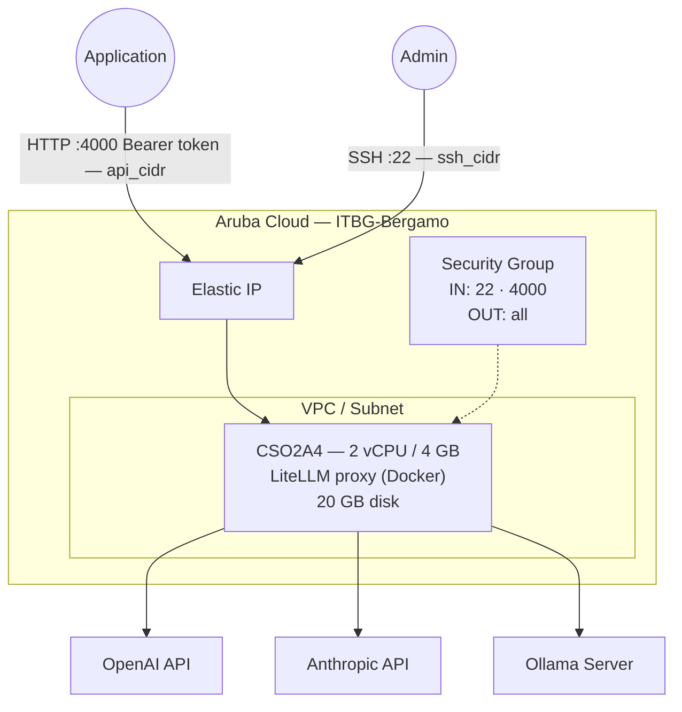

# LiteLLM on Aruba Cloud

Deploy [LiteLLM](https://litellm.ai/) — an OpenAI-compatible API proxy that routes requests to multiple LLM providers — on Aruba Cloud using Terraform and cloud-init. Supports OpenAI, Anthropic (Claude), Ollama, Azure OpenAI, and 100+ other providers through a single unified API.

> **Provider version:** arubacloud/arubacloud `~> 0.5` | **Terraform:** ≥ 1.9

---

## Introduction

LiteLLM translates OpenAI API calls to the format required by each provider, enabling applications to switch between models without code changes. This example deploys:

- **LiteLLM proxy** via Docker
- OpenAI-compatible REST API on port 4000
- Configurable provider routing (OpenAI, Anthropic, Ollama)
- Master key authentication

---

## Architecture Overview



---

## Infrastructure Created

| Resource | Name pattern | Description |
|----------|-------------|-------------|
| `arubacloud_project` | `llm-prod` | Project container |
| `arubacloud_vpc` | `llm-prod-vpc` | Virtual Private Cloud |
| `arubacloud_subnet` | `llm-prod-subnet` | Basic subnet |
| `arubacloud_securitygroup` | `llm-prod-vm-sg` | Security group |
| `arubacloud_securityrule` | `llm-prod-vm-ssh` | SSH ingress |
| `arubacloud_securityrule` | `llm-prod-vm-api` | LiteLLM proxy TCP 4000 |
| `arubacloud_elasticip` | `llm-prod-vm-eip` | VM public IP |
| `arubacloud_blockstorage` | `llm-prod-boot` | 20 GB boot disk (Performance) |
| `arubacloud_keypair` | `llm-prod-keypair` | SSH public key |
| `arubacloud_cloudserver` | `llm-prod-vm` | CloudServer VM |

---

## Estimated Monthly Cost

| Resource | Spec | Est. cost/mo |
|----------|------|-------------|
| CloudServer VM | CSO2A4 — 2 vCPU / 4 GB | ~€20 |
| Boot disk | 20 GB Performance | ~€3 |
| Elastic IP | — | ~€3 |
| **Total** | | **~€26/mo** |

---

## Requirements

- Terraform ≥ 1.9
- ArubaCloud Terraform Provider `~> 0.5`
- An ArubaCloud account with OAuth2 API credentials
- An SSH key pair
- At least one LLM provider API key or an Ollama server

---

## Variables

### Required

| Variable | Description |
|----------|-------------|
| `arubacloud_client_id` | ArubaCloud OAuth2 client ID |
| `arubacloud_client_secret` | ArubaCloud OAuth2 client secret |
| `ssh_public_key` | SSH public key content |
| `master_key` | LiteLLM master API key (prefix with `sk-`) |

### Optional

| Variable | Default | Description |
|----------|---------|-------------|
| `app_name` | `"llm"` | Short name used in all resource names |
| `environment` | `"prod"` | Environment label |
| `location` | `"ITBG-Bergamo"` | ArubaCloud region |
| `zone` | `"ITBG-1"` | Availability zone |
| `billing_period` | `"Hour"` | `"Hour"` or `"Month"` |
| `vm_flavor` | `"CSO2A4"` | CloudServer flavor |
| `vm_disk_size_gb` | `20` | Boot disk size in GB |
| `ssh_cidr` | `"0.0.0.0/0"` | CIDR for SSH |
| `api_cidr` | `"0.0.0.0/0"` | CIDR for proxy API port 4000 — **restrict to your app servers** |
| `openai_api_key` | `""` | OpenAI API key |
| `anthropic_api_key` | `""` | Anthropic API key |
| `ollama_base_url` | `""` | Ollama server URL |
| `litellm_version` | `"main"` | LiteLLM Docker image tag |

---

## Outputs

| Output | Description |
|--------|-------------|
| `litellm_url` | LiteLLM proxy API URL |
| `vm_public_ip` | Public IP address of the VM |
| `ssh_command` | SSH command to connect to the VM |
| `health_check` | `curl` command to verify the proxy is running |

---

## Deployment Instructions

### 1. Clone and navigate

```bash
git clone https://github.com/arubacloud/terraform-arubacloud-examples.git
cd terraform-arubacloud-examples/litellm
```

### 2. Configure variables

```bash
cp terraform.tfvars.example terraform.tfvars
```

Set your master key and provider credentials:

```hcl
master_key        = "sk-my-master-key"
openai_api_key    = "sk-..."
anthropic_api_key = "sk-ant-..."
ollama_base_url   = "http://10.0.0.10:11434"
```

### 3. Deploy

```bash
terraform init
terraform plan
terraform apply
```

### 4. Test

```bash
# Health check
curl http://$(terraform output -raw vm_public_ip):4000/health

# List models
curl -H "Authorization: Bearer sk-my-master-key" \
  http://$(terraform output -raw vm_public_ip):4000/models

# Chat completion (OpenAI-compatible)
curl -H "Authorization: Bearer sk-my-master-key" \
  -H "Content-Type: application/json" \
  -d '{"model":"gpt-4o","messages":[{"role":"user","content":"Hello!"}]}' \
  http://$(terraform output -raw vm_public_ip):4000/chat/completions
```

---

## References

- [LiteLLM Documentation](https://docs.litellm.ai/)
- [LiteLLM Supported Providers](https://docs.litellm.ai/docs/providers)
- [Ollama Example](../ollama/README.md)
- [ArubaCloud Terraform Provider](https://registry.terraform.io/providers/arubacloud/arubacloud/latest/docs)

