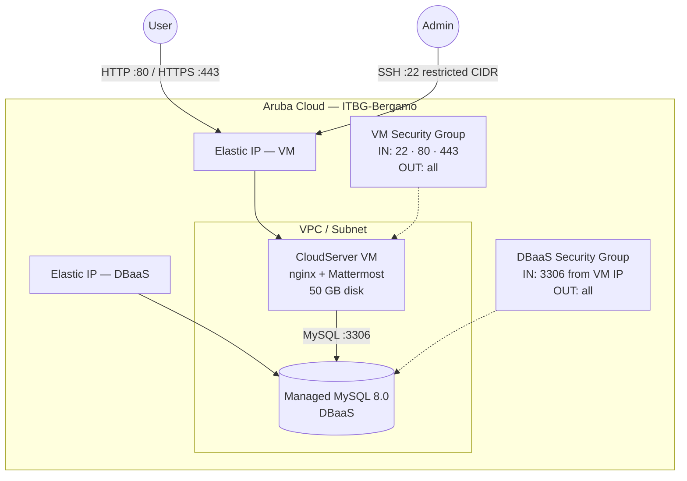

# Mattermost on Aruba Cloud

Deploy [Mattermost](https://mattermost.com) Team Edition — open-source team messaging — on Aruba Cloud using Terraform and cloud-init. Mattermost binary service + Managed MySQL 8.0 + nginx reverse proxy.

> **Provider version:** arubacloud/arubacloud `~> 0.5` | **Terraform:** ≥ 1.9

---

## Introduction

Mattermost is a self-hosted, Slack-compatible open-source messaging platform written in Go and React. This example provisions a production-ready Mattermost Team Edition stack with:

- A **CloudServer VM** (CSO4A8 — 4 vCPU / 8 GB) running the Mattermost Go binary as a systemd service behind nginx, fully bootstrapped by cloud-init
- A **Managed MySQL 8.0 DBaaS** instance with autoscaling storage
- A dedicated **VPC, subnet, and security groups** via the shared network module
- **Elastic IPs** for the VM and DBaaS
- Correct nginx **WebSocket proxying** for real-time messaging
- Optional **Let's Encrypt HTTPS** when a custom domain is provided

The first user to register on the instance automatically becomes the System Administrator.

---

## Architecture Overview



---

## Infrastructure Created

| Resource | Name pattern | Description |
|----------|-------------|-------------|
| `arubacloud_project` | `mm-prod` | Project container |
| `arubacloud_vpc` | `mm-prod-vpc` | Virtual Private Cloud |
| `arubacloud_subnet` | `mm-prod-subnet` | Basic subnet |
| `arubacloud_securitygroup` | `mm-prod-vm-sg` | VM security group |
| `arubacloud_securitygroup` | `mm-prod-db-sg` | DBaaS security group |
| `arubacloud_securityrule` | `mm-prod-vm-ssh` | SSH ingress |
| `arubacloud_securityrule` | `mm-prod-vm-http` | HTTP ingress |
| `arubacloud_securityrule` | `mm-prod-vm-https` | HTTPS ingress |
| `arubacloud_securityrule` | `mm-prod-db-mysql` | MySQL ingress from VM IP |
| `arubacloud_elasticip` | `mm-prod-vm-eip` | VM public IP |
| `arubacloud_elasticip` | `mm-prod-db-eip` | DBaaS public IP |
| `arubacloud_blockstorage` | `mm-prod-boot` | 50 GB boot disk (Performance) |
| `arubacloud_keypair` | `mm-prod-keypair` | SSH public key |
| `arubacloud_dbaas` | `mm-prod-dbaas` | Managed MySQL 8.0 |
| `arubacloud_database` | `mattermost` | Mattermost logical database |
| `arubacloud_dbaasuser` | `mattermost` | MySQL application user |
| `arubacloud_databasegrant` | — | liteadmin grant |
| `arubacloud_cloudserver` | `mm-prod-vm` | CloudServer VM |

---

## Estimated Monthly Cost

> Approximate prices for ITBG-Bergamo, hourly billing.

| Resource | Spec | Est. cost/mo |
|----------|------|-------------|
| CloudServer VM | CSO4A8 — 4 vCPU / 8 GB | ~€36 |
| Boot disk | 50 GB Performance | ~€6 |
| Managed MySQL | DBO2A8 — 2 vCPU / 8 GB | ~€35 |
| DBaaS storage | 20 GB | ~€3 |
| Elastic IP × 2 | — | ~€5 |
| **Total** | | **~€85/mo** |

---

## Requirements

- Terraform ≥ 1.9
- ArubaCloud Terraform Provider `~> 0.5`
- An ArubaCloud account with OAuth2 API credentials
- An SSH key pair

---

## Variables

### Required

| Variable | Description |
|----------|-------------|
| `arubacloud_client_id` | ArubaCloud OAuth2 client ID |
| `arubacloud_client_secret` | ArubaCloud OAuth2 client secret |
| `ssh_public_key` | SSH public key content |
| `db_password` | MySQL password for the Mattermost user (min 16 chars, no newlines) |

### Optional

| Variable | Default | Description |
|----------|---------|-------------|
| `app_name` | `"mm"` | Short name used in all resource names |
| `environment` | `"prod"` | Environment label |
| `location` | `"ITBG-Bergamo"` | ArubaCloud region |
| `zone` | `"ITBG-1"` | Availability zone |
| `billing_period` | `"Hour"` | `"Hour"` or `"Month"` |
| `vm_flavor` | `"CSO4A8"` | CloudServer flavor |
| `vm_image` | `"LU22-001"` | Boot disk image (Ubuntu 22.04 LTS) |
| `vm_disk_size_gb` | `50` | Boot disk size in GB |
| `ssh_cidr` | `"0.0.0.0/0"` | CIDR for SSH — **restrict to your IP** |
| `dbaas_flavor` | `"DBO2A8"` | DBaaS flavor |
| `db_storage_gb` | `20` | DBaaS initial storage in GB |
| `mattermost_version` | `"10.4.2"` | Mattermost Team Edition version |
| `domain` | `""` | Custom domain for HTTPS |

---

## Outputs

| Output | Description |
|--------|-------------|
| `site_url` | Mattermost URL |
| `vm_public_ip` | Public IP address of the VM |
| `ssh_command` | SSH command to connect to the VM |
| `dbaas_host` | DBaaS endpoint |
| `db_name` | Database name |
| `db_user` | Database username |

---

## Deployment Instructions

### 1. Clone and navigate

```bash
git clone https://github.com/arubacloud/terraform-arubacloud-examples.git
cd terraform-arubacloud-examples/mattermost
```

### 2. Configure variables

```bash
cp terraform.tfvars.example terraform.tfvars
```

Set `db_password` and your credentials.

### 3. Deploy

```bash
terraform init
terraform plan
terraform apply
```

Bootstrap takes approximately **15–20 minutes** — cloud-init waits up to 15 minutes for the DBaaS to become reachable before starting Mattermost.

### 4. Access Mattermost

```bash
terraform output site_url
```

Open the URL and **register the first account** — that user becomes System Administrator.

### 5. Monitor progress

```bash
ssh ubuntu@$(terraform output -raw vm_public_ip)
sudo tail -f /var/log/cloud-init-output.log
sudo journalctl -u mattermost -f
```

---

## Security Recommendations

1. **Restrict SSH to your IP.** Set `ssh_cidr = "your.ip/32"`.

2. **Use HTTPS.** Set `domain` to enable Let's Encrypt TLS. Without TLS, session tokens and messages are transmitted in cleartext.

3. **Register the admin account first.** The first registered user becomes System Administrator. Register immediately after deployment before sharing the URL.

4. **Restrict Team invitations.** In System Console → Authentication → Email, configure invite-only registration once your team is set up.

5. **Enable MFA.** In System Console → Authentication → MFA, require multi-factor authentication for all users.

---

## Upgrade Considerations

### Mattermost upgrade

```bash
ssh ubuntu@$(terraform output -raw vm_public_ip)

MM_VERSION=X.Y.Z
sudo systemctl stop mattermost
sudo mv /opt/mattermost /opt/mattermost-backup
curl -sSfL \
  "https://releases.mattermost.com/$MM_VERSION/mattermost-team-$MM_VERSION-linux-amd64.tar.gz" \
  | sudo tar -xz -C /opt
# Restore config and data
sudo cp /opt/mattermost-backup/config/config.json /opt/mattermost/config/ 2>/dev/null || true
sudo chown -R mattermost:mattermost /opt/mattermost
sudo systemctl start mattermost
```

Review the [Mattermost changelog](https://docs.mattermost.com/about/mattermost-changelog.html) before upgrading.

---

## Troubleshooting

### Mattermost not reachable

```bash
sudo systemctl status mattermost
sudo journalctl -u mattermost -n 50
sudo tail -100 /var/log/cloud-init-output.log
```

### WebSocket connection failed

Verify the nginx config includes the WebSocket location block for `/api/v[0-9]+/(users/)?websocket`:

```bash
sudo nginx -t
sudo cat /etc/nginx/sites-enabled/mattermost.conf
```

### MySQL connection error

```bash
mysql -u mattermost -p -h $(terraform output -raw dbaas_host) mattermost
```

---

## References

- [Mattermost Installation Guide](https://docs.mattermost.com/install/install-ubuntu.html)
- [Mattermost Releases](https://github.com/mattermost/mattermost/releases)
- [Mattermost Environment Variables](https://docs.mattermost.com/configure/environment-variables.html)
- [ArubaCloud Terraform Provider](https://registry.terraform.io/providers/arubacloud/arubacloud/latest/docs)

