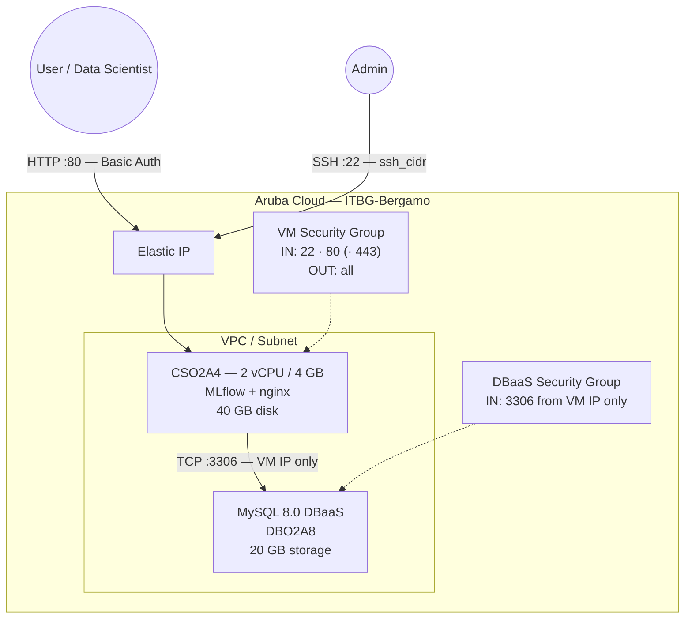

# MLflow on Aruba Cloud

Deploy [MLflow](https://mlflow.org/) — an open-source platform for managing the end-to-end ML lifecycle, including experiment tracking, model registry, and artifact storage — on Aruba Cloud using Terraform and cloud-init. Uses Managed MySQL 8.0 as the tracking backend and nginx with HTTP Basic Auth as a reverse proxy.

> **Provider version:** arubacloud/arubacloud `~> 1.0` | **Terraform:** ≥ 1.9

---

## Introduction

This example deploys:

- **MLflow tracking server** (pip, native install) on a CSO2A4 VM
- **Managed MySQL 8.0** (Aruba Cloud DBaaS) for experiment and run metadata
- **nginx** reverse proxy with HTTP Basic Auth on port **80**
- Artifact files (models, plots) stored locally on the VM disk
- Optional HTTPS via Let's Encrypt or Actalis ACME

---

## Architecture Overview



---

## Variables

### Required

| Variable | Description |
|----------|-------------|
| `arubacloud_client_id` | ArubaCloud OAuth2 client ID |
| `arubacloud_client_secret` | ArubaCloud OAuth2 client secret |

### Optional

| Variable | Default | Description |
|----------|---------|-------------|
| `app_name` | `"mlflow"` | Short name used in resource names (2–8 chars) |
| `environment` | `"prod"` | Environment label |
| `location` | `"ITBG-Bergamo"` | ArubaCloud region |
| `zone` | `"ITBG-1"` | Availability zone |
| `billing_period` | `"Hour"` | `"Hour"` or `"Month"` |
| `vm_flavor` | `"CSO2A4"` | CloudServer flavor (2 vCPU / 4 GB) |
| `vm_disk_size_gb` | `40` | Boot disk size — increase for large artifact storage |
| `ssh_public_key` | project owner key | SSH public key content |
| `ssh_cidr` | `"0.0.0.0/0"` | CIDR for SSH access |
| `dbaas_flavor` | `"DBO2A8"` | Managed MySQL flavor |
| `db_storage_gb` | `20` | DBaaS initial storage in GB |
| `db_password` | pre-set default | MySQL password (min 8 chars, no newlines) |
| `mlflow_admin_user` | `"admin"` | Username for HTTP Basic Auth |
| `mlflow_admin_password` | pre-set default | Password for HTTP Basic Auth (min 8 chars) |
| `mlflow_version` | `"2.16.0"` | MLflow version to install |
| `domain` | `""` | Custom domain for HTTPS; leave empty for HTTP over Elastic IP |
| `acme_eab_kid` | `""` | Actalis ACME EAB key ID (optional) |
| `acme_eab_hmac_key` | `""` | Actalis ACME EAB HMAC key (optional) |

---

## Outputs

| Output | Description |
|--------|-------------|
| `app_url` | MLflow tracking server URL |
| `mlflow_tracking_uri` | `MLFLOW_TRACKING_URI` to set in experiment code |
| `vm_public_ip` | Public IP of the VM |
| `ssh_command` | SSH command to connect |

---

## Deployment Instructions

### 1. Clone and navigate

```bash
git clone https://github.com/arubacloud/terraform-arubacloud-examples.git
cd terraform-arubacloud-examples/mlflow
```

### 2. Configure variables

```bash
cp terraform.tfvars.example terraform.tfvars
```

### 3. Deploy

```bash
terraform init
terraform plan
terraform apply
```

Bootstrap takes approximately **5–10 minutes**.

### 4. Connect your experiments

```python
import mlflow

mlflow.set_tracking_uri("http://<vm_public_ip>")  # or the domain
mlflow.set_experiment("my-experiment")

with mlflow.start_run():
    mlflow.log_param("alpha", 0.5)
    mlflow.log_metric("rmse", 0.82)
```

Set HTTP Basic Auth credentials in your environment:

```bash
export MLFLOW_TRACKING_USERNAME=admin
export MLFLOW_TRACKING_PASSWORD=<mlflow_admin_password>
```

---

## References

- [MLflow Documentation](https://mlflow.org/docs/latest/index.html)
- [MLflow on PyPI](https://pypi.org/project/mlflow/)
- [ArubaCloud Terraform Provider](https://registry.terraform.io/providers/arubacloud/arubacloud/latest/docs)
