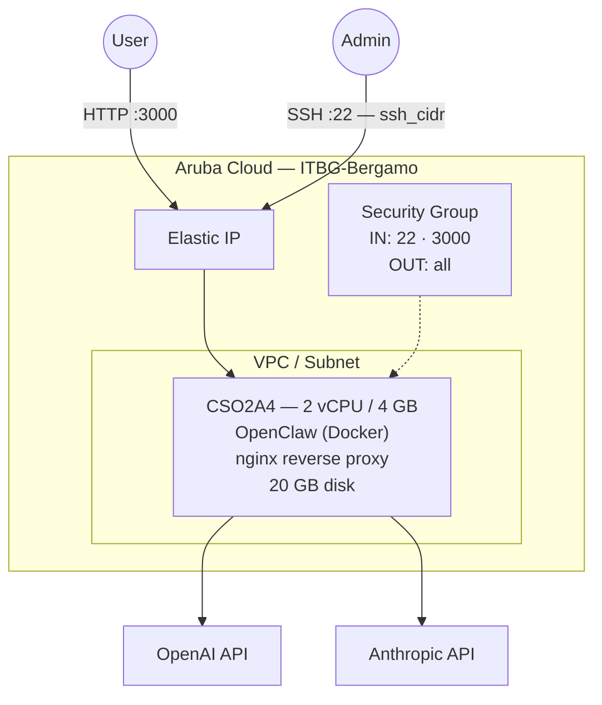

# OpenClaw on Aruba Cloud

Deploy [OpenClaw](https://openclaw.ai/) — a self-hosted personal AI agent with persistent memory and 29+ messaging channel integrations — on Aruba Cloud using Terraform and cloud-init. Deployed via Docker.

> **Provider version:** arubacloud/arubacloud `~> 0.5` | **Terraform:** ≥ 1.9

---

## Introduction

OpenClaw is a self-hosted AI agent platform that maintains persistent memory across conversations and integrates with messaging channels (Slack, Discord, Telegram, etc.). This example deploys:

- **OpenClaw** via Docker with persistent data storage
- **nginx** reverse proxy on port 3000
- Configurable OpenAI and Anthropic API keys

---

## Architecture Overview



---

## Infrastructure Created

| Resource | Name pattern | Description |
|----------|-------------|-------------|
| `arubacloud_project` | `oclaw-prod` | Project container |
| `arubacloud_vpc` | `oclaw-prod-vpc` | Virtual Private Cloud |
| `arubacloud_subnet` | `oclaw-prod-subnet` | Basic subnet |
| `arubacloud_securitygroup` | `oclaw-prod-vm-sg` | Security group |
| `arubacloud_securityrule` | `oclaw-prod-vm-ssh` | SSH ingress |
| `arubacloud_securityrule` | `oclaw-prod-vm-http` | OpenClaw web UI port 3000 |
| `arubacloud_elasticip` | `oclaw-prod-vm-eip` | VM public IP |
| `arubacloud_blockstorage` | `oclaw-prod-boot` | 20 GB boot disk (Performance) |
| `arubacloud_keypair` | `oclaw-prod-keypair` | SSH public key |
| `arubacloud_cloudserver` | `oclaw-prod-vm` | CloudServer VM |

---

## Estimated Monthly Cost

| Resource | Spec | Est. cost/mo |
|----------|------|-------------|
| CloudServer VM | CSO2A4 — 2 vCPU / 4 GB | ~€20 |
| Boot disk | 20 GB Performance | ~€3 |
| Elastic IP | — | ~€3 |
| **Total** | | **~€26/mo** |

---

## Requirements

- Terraform ≥ 1.9
- ArubaCloud Terraform Provider `~> 0.5`
- An ArubaCloud account with OAuth2 API credentials
- An SSH key pair
- At least one LLM API key (OpenAI or Anthropic)

---

## Variables

### Required

| Variable | Description |
|----------|-------------|
| `arubacloud_client_id` | ArubaCloud OAuth2 client ID |
| `arubacloud_client_secret` | ArubaCloud OAuth2 client secret |
| `ssh_public_key` | SSH public key content |

### Optional

| Variable | Default | Description |
|----------|---------|-------------|
| `app_name` | `"oclaw"` | Short name used in all resource names |
| `environment` | `"prod"` | Environment label |
| `location` | `"ITBG-Bergamo"` | ArubaCloud region |
| `zone` | `"ITBG-1"` | Availability zone |
| `billing_period` | `"Hour"` | `"Hour"` or `"Month"` |
| `vm_flavor` | `"CSO2A4"` | CloudServer flavor |
| `vm_disk_size_gb` | `20` | Boot disk size in GB |
| `ssh_cidr` | `"0.0.0.0/0"` | CIDR for SSH |
| `openai_api_key` | `""` | OpenAI API key |
| `anthropic_api_key` | `""` | Anthropic API key |

---

## Outputs

| Output | Description |
|--------|-------------|
| `openclaw_url` | OpenClaw web UI URL |
| `vm_public_ip` | Public IP address of the VM |
| `ssh_command` | SSH command to connect to the VM |

---

## Deployment Instructions

### 1. Clone and navigate

```bash
git clone https://github.com/arubacloud/terraform-arubacloud-examples.git
cd terraform-arubacloud-examples/openclaw
```

### 2. Configure variables

```bash
cp terraform.tfvars.example terraform.tfvars
```

Set your API keys:

```hcl
openai_api_key    = "sk-..."
anthropic_api_key = "sk-ant-..."
```

### 3. Deploy

```bash
terraform init
terraform plan
terraform apply
```

### 4. Access

Navigate to `http://<IP>:3000` to access the OpenClaw web interface.

---

## References

- [OpenClaw Website](https://openclaw.ai/)
- [ArubaCloud Terraform Provider](https://registry.terraform.io/providers/arubacloud/arubacloud/latest/docs)

