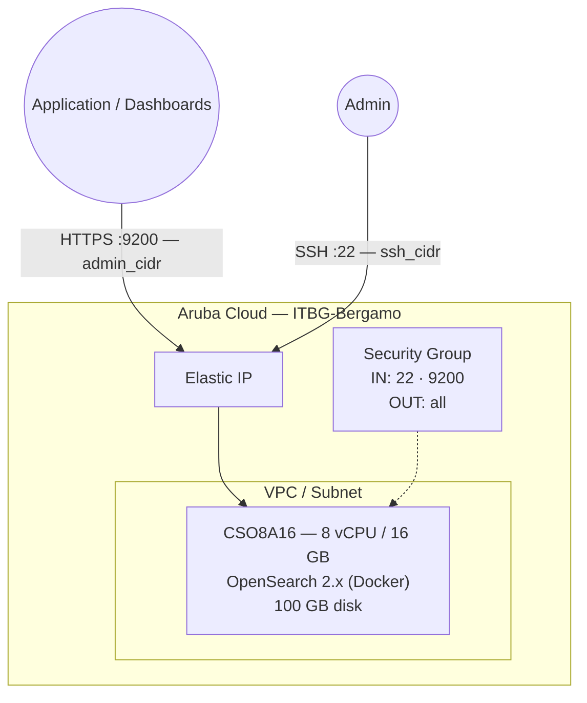

# OpenSearch on Aruba Cloud

Deploy [OpenSearch 2.x](https://opensearch.org/) — the community-driven open-source search and analytics suite — on Aruba Cloud using Terraform and cloud-init. Deployed via the official Docker image with TLS-secured REST API and the `admin` superuser password configured at bootstrap time.

> **Provider version:** arubacloud/arubacloud `~> 0.5` | **Terraform:** ≥ 1.9

---

## Introduction

OpenSearch is the Apache-2.0-licensed fork of Elasticsearch maintained by AWS and the open-source community. It provides full-text search, log analytics, and real-time data exploration at scale — with no SSPL licensing concerns. This example provisions a **single-node** OpenSearch instance with:

- **OpenSearch 2.x** via the official Docker image
- **TLS enabled** on the REST API (HTTPS port 9200) — all API requests require credentials
- `admin` superuser password set at bootstrap time
- `vm.max_map_count=262144` kernel tuning applied persistently
- REST API on HTTPS port 9200, restricted to `admin_cidr`

> **Elasticsearch note:** If Elastic's SSPL licence is not a concern for your use case, see the [Elasticsearch example](/examples/elasticsearch) in this repository.

---

## Architecture Overview



---

## Infrastructure Created

| Resource | Name pattern | Description |
|----------|-------------|-------------|
| `arubacloud_project` | `os-prod` | Project container |
| `arubacloud_vpc` | `os-prod-vpc` | Virtual Private Cloud |
| `arubacloud_subnet` | `os-prod-subnet` | Basic subnet |
| `arubacloud_securitygroup` | `os-prod-vm-sg` | Security group |
| `arubacloud_securityrule` | `os-prod-vm-ssh` | SSH ingress |
| `arubacloud_securityrule` | `os-prod-vm-api` | REST API ingress TCP 9200 |
| `arubacloud_elasticip` | `os-prod-vm-eip` | VM public IP |
| `arubacloud_blockstorage` | `os-prod-boot` | 100 GB boot disk (Performance) |
| `arubacloud_keypair` | `os-prod-keypair` | SSH public key |
| `arubacloud_cloudserver` | `os-prod-vm` | CloudServer VM |

---

## Estimated Monthly Cost

| Resource | Spec | Est. cost/mo |
|----------|------|-------------|
| CloudServer VM | CSO8A16 — 8 vCPU / 16 GB | ~€55 |
| Boot disk | 100 GB Performance | ~€15 |
| Elastic IP | — | ~€3 |
| **Total** | | **~€73/mo** |

---

## Requirements

- Terraform ≥ 1.9
- ArubaCloud Terraform Provider `~> 0.5`
- An ArubaCloud account with OAuth2 API credentials
- An SSH key pair

---

## Variables

### Required

| Variable | Description |
|----------|-------------|
| `arubacloud_client_id` | ArubaCloud OAuth2 client ID |
| `arubacloud_client_secret` | ArubaCloud OAuth2 client secret |
| `ssh_public_key` | SSH public key content |
| `admin_password` | Password for the `admin` user (8+ chars, uppercase + lowercase + digit + special) |

### Optional

| Variable | Default | Description |
|----------|---------|-------------|
| `app_name` | `"os"` | Short name used in all resource names |
| `environment` | `"prod"` | Environment label |
| `location` | `"ITBG-Bergamo"` | ArubaCloud region |
| `zone` | `"ITBG-1"` | Availability zone |
| `billing_period` | `"Hour"` | `"Hour"` or `"Month"` |
| `vm_flavor` | `"CSO8A16"` | CloudServer flavor |
| `vm_image` | `"LU22-001"` | Boot disk image (Ubuntu 22.04 LTS) |
| `vm_disk_size_gb` | `100` | Boot disk size in GB (min 50 GB) |
| `ssh_cidr` | `"0.0.0.0/0"` | CIDR for SSH |
| `admin_cidr` | `"0.0.0.0/0"` | CIDR for REST API port 9200 — **always restrict** |
| `cluster_name` | `"opensearch"` | OpenSearch cluster name |
| `opensearch_version` | `"2"` | OpenSearch Docker image tag |

---

## Outputs

| Output | Description |
|--------|-------------|
| `opensearch_url` | OpenSearch REST API URL (HTTPS) |
| `vm_public_ip` | Public IP address of the VM |
| `ssh_command` | SSH command to connect to the VM |
| `health_check` | `curl` command to verify the cluster is healthy |

---

## Deployment Instructions

### 1. Clone and navigate

```bash
git clone https://github.com/arubacloud/terraform-arubacloud-examples.git
cd terraform-arubacloud-examples/opensearch
```

### 2. Configure variables

```bash
cp terraform.tfvars.example terraform.tfvars
```

Set the password and restrict API access to your application servers:

```hcl
admin_password = "Change-Me-1!"    # must meet complexity requirements
admin_cidr     = "10.0.0.0/8"     # your app server CIDR
ssh_cidr       = "203.0.113.42/32"
```

### 3. Deploy

```bash
terraform init
terraform plan
terraform apply
```

Bootstrap takes approximately **3–5 minutes** (Docker image pull + OpenSearch initialisation).

### 4. Verify

```bash
curl -ku admin:<your-password> \
  "$(terraform output -raw opensearch_url)/_cluster/health?pretty"
```

Expected output:

```json
{
  "cluster_name" : "opensearch",
  "status" : "green",
  "number_of_nodes" : 1,
  ...
}
```

---

## Connecting OpenSearch Dashboards

To visualise and query data, deploy OpenSearch Dashboards separately and point it at this instance:

```yaml
# opensearch_dashboards.yml
opensearch.hosts: ["https://<os-ip>:9200"]
opensearch.username: "kibanaserver"
opensearch.password: "<kibanaserver-password>"
opensearch.ssl.verificationMode: none
```

---

## Security Recommendations

1. **Always restrict `admin_cidr`.** OpenSearch has no rate limiting on authentication — open port 9200 to `0.0.0.0/0` exposes your data to credential-stuffing attacks.

2. **Use dedicated roles.** Do not use the `admin` superuser for application connections. Create a least-privilege role:

   ```bash
   curl -ku admin:<password> -X PUT \
     "https://<ip>:9200/_plugins/_security/api/roles/app_role" \
     -H "Content-Type: application/json" \
     -d '{"index_permissions":[{"index_patterns":["app-*"],"allowed_actions":["read","write","create_index"]}]}'
   ```

3. **Consider a reverse proxy.** Place an NGINX or Caddy reverse proxy (in this repository) in front of OpenSearch to centralise access logging and TLS certificate management.

---

## Troubleshooting

### OpenSearch container not starting

```bash
docker logs opensearch
# Common cause: insufficient vm.max_map_count
cat /proc/sys/vm/max_map_count   # should be 262144
# Common cause: password does not meet complexity requirements (8+ chars, upper+lower+digit+special)
```

### Cannot connect to REST API

```bash
# Verify the container is running
docker ps
# Check port binding
ss -tlnp | grep 9200
# Test locally (from the VM)
curl -ku admin:<password> https://localhost:9200/_cluster/health
```

---

## References

- [OpenSearch Documentation](https://opensearch.org/docs/latest/)
- [OpenSearch Security Plugin](https://opensearch.org/docs/latest/security/)
- [OpenSearch Docker Image](https://hub.docker.com/r/opensearchproject/opensearch)
- [ArubaCloud Terraform Provider](https://registry.terraform.io/providers/arubacloud/arubacloud/latest/docs)

