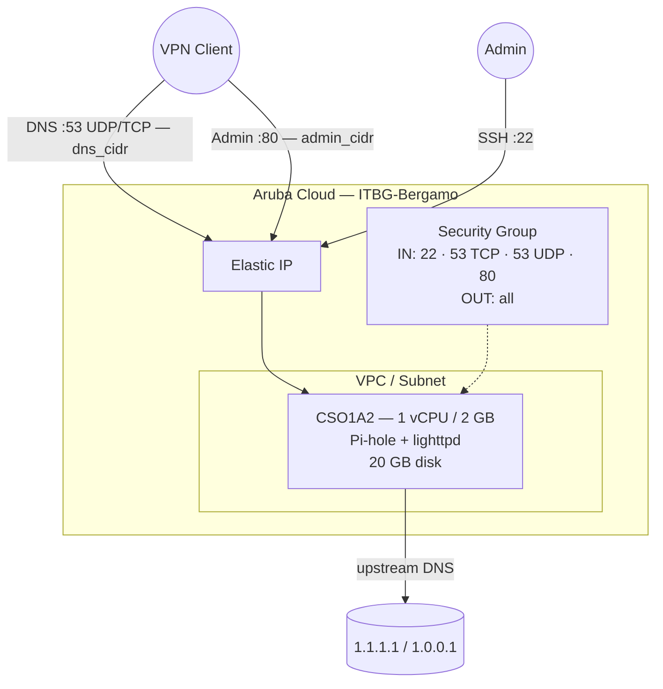

# Pi-hole on Aruba Cloud

Deploy [Pi-hole](https://pi-hole.net) — network-wide DNS filtering and ad-blocking — on Aruba Cloud using Terraform and cloud-init. Pi-hole pairs naturally with the [WireGuard example](wireguard.md): point your VPN clients at the Pi-hole DNS server and get ad-free browsing everywhere your VPN is active.

> **Provider version:** arubacloud/arubacloud `~> 0.5` | **Terraform:** ≥ 1.9

---

## Introduction

Pi-hole is a DNS sinkhole that blocks ads, trackers, and malicious domains at the network level, before they reach your device. This example provisions a lightweight Pi-hole instance on Aruba Cloud with:

- The **smallest available VM** (CSO1A2 — 1 vCPU / 2 GB) — Pi-hole is lean
- Pi-hole installed via the **official unattended installer**
- **DNS on port 53 (UDP + TCP)** — UDP for standard queries, TCP for large responses
- **Admin web UI on port 80** — both access-restricted by `admin_cidr`
- `systemd-resolved` stub listener disabled so Pi-hole can own port 53
- **No DBaaS** — Pi-hole stores query logs in SQLite on the boot disk

> **Best practice:** Deploy alongside the [WireGuard](wireguard.md) example. Set `dns_cidr` and `admin_cidr` to your WireGuard tunnel CIDR (e.g. `10.8.0.0/24`). Point VPN clients' DNS to the Pi-hole Elastic IP.

---

## Architecture Overview



---

## Infrastructure Created

| Resource | Name pattern | Description |
|----------|-------------|-------------|
| `arubacloud_project` | `pihole-prod` | Project container |
| `arubacloud_vpc` | `pihole-prod-vpc` | Virtual Private Cloud |
| `arubacloud_subnet` | `pihole-prod-subnet` | Basic subnet |
| `arubacloud_securitygroup` | `pihole-prod-vm-sg` | Security group |
| `arubacloud_securityrule` | `pihole-prod-vm-ssh` | SSH ingress |
| `arubacloud_securityrule` | `pihole-prod-vm-admin-ui` | Admin UI ingress TCP 80 |
| `arubacloud_securityrule` | `pihole-prod-vm-dns-tcp` | DNS TCP 53 ingress |
| `arubacloud_securityrule` | `pihole-prod-vm-dns-udp` | DNS UDP 53 ingress |
| `arubacloud_elasticip` | `pihole-prod-vm-eip` | VM public IP |
| `arubacloud_blockstorage` | `pihole-prod-boot` | 20 GB boot disk (Performance) |
| `arubacloud_keypair` | `pihole-prod-keypair` | SSH public key |
| `arubacloud_cloudserver` | `pihole-prod-vm` | CloudServer VM |

---

## Estimated Monthly Cost

| Resource | Spec | Est. cost/mo |
|----------|------|-------------|
| CloudServer VM | CSO1A2 — 1 vCPU / 2 GB | ~€9 |
| Boot disk | 20 GB Performance | ~€3 |
| Elastic IP | — | ~€3 |
| **Total** | | **~€15/mo** |

---

## Requirements

- Terraform ≥ 1.9
- ArubaCloud Terraform Provider `~> 0.5`
- An ArubaCloud account with OAuth2 API credentials
- An SSH key pair

---

## Variables

### Required

| Variable | Description |
|----------|-------------|
| `arubacloud_client_id` | ArubaCloud OAuth2 client ID |
| `arubacloud_client_secret` | ArubaCloud OAuth2 client secret |
| `ssh_public_key` | SSH public key content |
| `pihole_password` | Pi-hole admin web interface password (min 8 chars) |

### Optional

| Variable | Default | Description |
|----------|---------|-------------|
| `app_name` | `"pihole"` | Short name used in all resource names |
| `environment` | `"prod"` | Environment label |
| `location` | `"ITBG-Bergamo"` | ArubaCloud region |
| `zone` | `"ITBG-1"` | Availability zone |
| `billing_period` | `"Hour"` | `"Hour"` or `"Month"` |
| `vm_flavor` | `"CSO1A2"` | CloudServer flavor |
| `vm_image` | `"LU22-001"` | Boot disk image (Ubuntu 22.04 LTS) |
| `vm_disk_size_gb` | `20` | Boot disk size in GB |
| `ssh_cidr` | `"0.0.0.0/0"` | CIDR for SSH |
| `dns_cidr` | `"0.0.0.0/0"` | CIDR for DNS port 53 — **restrict to your VPN tunnel CIDR** |
| `admin_cidr` | `"0.0.0.0/0"` | CIDR for admin UI port 80 — **restrict to your VPN tunnel CIDR** |
| `upstream_dns_1` | `"1.1.1.1"` | Primary upstream resolver |
| `upstream_dns_2` | `"1.0.0.1"` | Secondary upstream resolver |

---

## Outputs

| Output | Description |
|--------|-------------|
| `admin_url` | Pi-hole admin web interface URL |
| `dns_server` | IP to use as DNS server on VPN clients |
| `vm_public_ip` | Public IP address of the VM |
| `ssh_command` | SSH command to connect to the VM |

---

## Deployment Instructions

### 1. Clone and navigate

```bash
git clone https://github.com/arubacloud/terraform-arubacloud-examples.git
cd terraform-arubacloud-examples/pi-hole
```

### 2. Configure variables

```bash
cp terraform.tfvars.example terraform.tfvars
```

Set `pihole_password`. In production, also set:

```hcl
dns_cidr   = "10.8.0.0/24"   # your WireGuard tunnel CIDR
admin_cidr = "10.8.0.0/24"
ssh_cidr   = "203.0.113.42/32"
```

### 3. Deploy

```bash
terraform init
terraform plan
terraform apply
```

Bootstrap takes approximately **5–8 minutes** (Pi-hole downloads blocklists on first install).

### 4. Point VPN clients at Pi-hole

```bash
terraform output dns_server
```

Use the output IP as the DNS server in your WireGuard client config:

```ini
# In your WireGuard client [Peer] section:
DNS = <output of dns_server>
```

Or set it as the DNS in your WireGuard server config so all VPN clients use it automatically.

### 5. Access the admin UI

```bash
terraform output admin_url
```

Log in with `pihole_password` to view query logs, manage blocklists, and whitelist domains.

---

## Security Recommendations

1. **Always restrict `dns_cidr` and `admin_cidr`.** Leaving port 53 open to `0.0.0.0/0` makes your Pi-hole an open DNS resolver — it will be abused for DNS amplification attacks. Set both CIDRs to your WireGuard tunnel CIDR.

2. **Do not expose the admin UI publicly.** Port 80 should only be reachable from VPN-connected clients.

3. **Use Pi-hole with WireGuard.** The intended deployment model: WireGuard VPN on the same or adjacent VM provides secure tunnel access, and clients route DNS through Pi-hole. See the [WireGuard example](wireguard.md).

---

## Upgrade Considerations

Pi-hole upgrades in-place:

```bash
ssh ubuntu@$(terraform output -raw vm_public_ip)
pihole -up
```

No VM replacement needed for Pi-hole version upgrades.

---

## Troubleshooting

### Pi-hole not responding to DNS queries

```bash
sudo systemctl status pihole-FTL
sudo pihole status
# Check port 53 is listening:
sudo ss -ulnp | grep :53
sudo ss -tlnp | grep :53
```

### Port 53 already in use after install

`systemd-resolved` stub listener was not disabled. Check:

```bash
sudo ss -ulnp sport = :53
cat /etc/systemd/resolved.conf | grep DNSStubListener
sudo systemctl restart systemd-resolved
sudo systemctl restart pihole-FTL
```

### Admin UI not loading

Verify lighttpd is running and port 80 is reachable from your current network:

```bash
sudo systemctl status lighttpd
curl -sv http://localhost/admin/
```

---

## References

- [Pi-hole Documentation](https://docs.pi-hole.net/)
- [Pi-hole Unattended Install](https://docs.pi-hole.net/main/post-install/)
- [WireGuard Example](wireguard.md)
- [ArubaCloud Terraform Provider](https://registry.terraform.io/providers/arubacloud/arubacloud/latest/docs)

