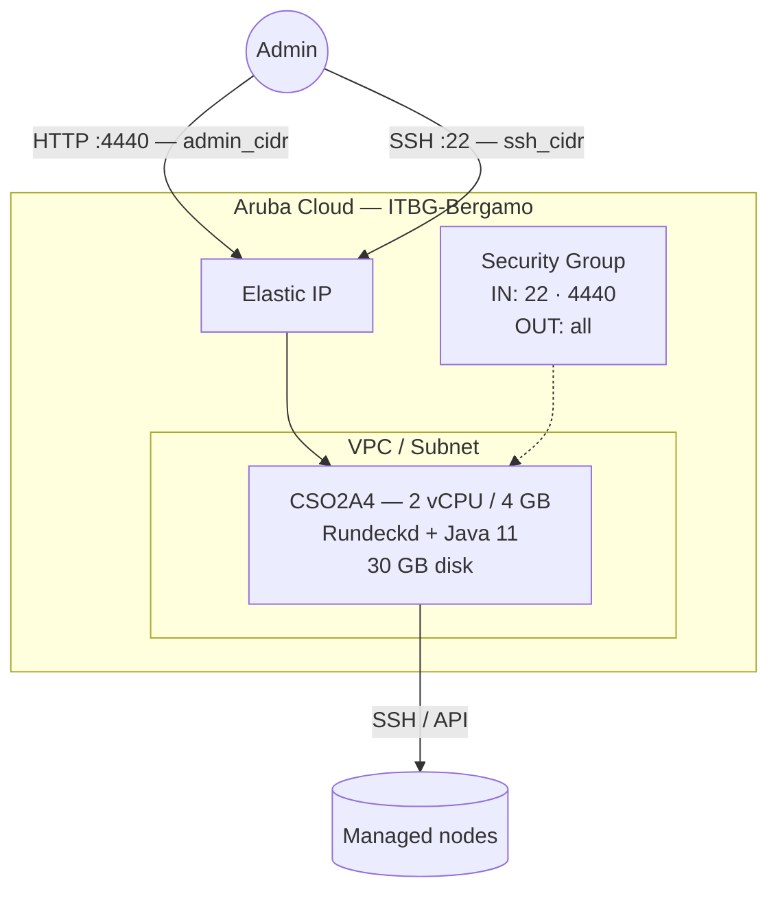

# Rundeck on Aruba Cloud

Deploy [Rundeck](https://www.rundeck.com) — an open-source job scheduler and runbook automation platform — on Aruba Cloud using Terraform and cloud-init. Rundeck lets you define, schedule, and audit operational jobs across your infrastructure from a central web UI.

> **Provider version:** arubacloud/arubacloud `~> 0.5` | **Terraform:** ≥ 1.9

---

## Introduction

Rundeck enables teams to automate routine operational tasks (deployments, backups, database maintenance, etc.) with fine-grained access control and a full audit log. This example provisions:

- **Rundeck** installed from the official packagecloud apt repository
- **OpenJDK 11** (Java runtime requirement)
- Admin password set at bootstrap time via MD5-hashed realm.properties
- Web UI on port 4440, restricted to `admin_cidr`
- External URL pre-configured so webhooks and links work correctly

> **Security note:** Rundeck has access to run arbitrary commands on any node it manages. Always restrict `admin_cidr` to your management IP and use a strong password.

---

## Architecture Overview



---

## Infrastructure Created

| Resource | Name pattern | Description |
|----------|-------------|-------------|
| `arubacloud_project` | `rundeck-prod` | Project container |
| `arubacloud_vpc` | `rundeck-prod-vpc` | Virtual Private Cloud |
| `arubacloud_subnet` | `rundeck-prod-subnet` | Basic subnet |
| `arubacloud_securitygroup` | `rundeck-prod-vm-sg` | Security group |
| `arubacloud_securityrule` | `rundeck-prod-vm-ssh` | SSH ingress |
| `arubacloud_securityrule` | `rundeck-prod-vm-admin-ui` | Web UI ingress TCP 4440 |
| `arubacloud_elasticip` | `rundeck-prod-vm-eip` | VM public IP |
| `arubacloud_blockstorage` | `rundeck-prod-boot` | 30 GB boot disk (Performance) |
| `arubacloud_keypair` | `rundeck-prod-keypair` | SSH public key |
| `arubacloud_cloudserver` | `rundeck-prod-vm` | CloudServer VM |

---

## Estimated Monthly Cost

| Resource | Spec | Est. cost/mo |
|----------|------|-------------|
| CloudServer VM | CSO2A4 — 2 vCPU / 4 GB | ~€18 |
| Boot disk | 30 GB Performance | ~€5 |
| Elastic IP | — | ~€3 |
| **Total** | | **~€26/mo** |

---

## Requirements

- Terraform ≥ 1.9
- ArubaCloud Terraform Provider `~> 0.5`
- An ArubaCloud account with OAuth2 API credentials
- An SSH key pair

---

## Variables

### Required

| Variable | Description |
|----------|-------------|
| `arubacloud_client_id` | ArubaCloud OAuth2 client ID |
| `arubacloud_client_secret` | ArubaCloud OAuth2 client secret |
| `ssh_public_key` | SSH public key content |
| `admin_password` | Rundeck admin password (min 8 chars) |

### Optional

| Variable | Default | Description |
|----------|---------|-------------|
| `app_name` | `"rundeck"` | Short name used in all resource names |
| `environment` | `"prod"` | Environment label |
| `location` | `"ITBG-Bergamo"` | ArubaCloud region |
| `zone` | `"ITBG-1"` | Availability zone |
| `billing_period` | `"Hour"` | `"Hour"` or `"Month"` |
| `vm_flavor` | `"CSO2A4"` | CloudServer flavor (min 4 GB RAM recommended) |
| `vm_image` | `"LU22-001"` | Boot disk image (Ubuntu 22.04 LTS) |
| `vm_disk_size_gb` | `30` | Boot disk size in GB |
| `ssh_cidr` | `"0.0.0.0/0"` | CIDR for SSH — restrict in production |
| `admin_cidr` | `"0.0.0.0/0"` | CIDR for web UI — **always restrict** |
| `rundeck_url` | auto | External URL override (default: `http://<elastic-ip>:4440`) |

---

## Outputs

| Output | Description |
|--------|-------------|
| `rundeck_url` | Rundeck web UI URL |
| `vm_public_ip` | Public IP address of the VM |
| `ssh_command` | SSH command to connect to the VM |

---

## Deployment Instructions

### 1. Clone and navigate

```bash
git clone https://github.com/arubacloud/terraform-arubacloud-examples.git
cd terraform-arubacloud-examples/rundeck
```

### 2. Configure variables

```bash
cp terraform.tfvars.example terraform.tfvars
```

Set credentials, password, and restrict CIDRs:

```hcl
admin_password = "your-strong-password"
admin_cidr     = "203.0.113.42/32"
ssh_cidr       = "203.0.113.42/32"
```

### 3. Deploy

```bash
terraform init
terraform plan
terraform apply
```

Bootstrap takes approximately **3–5 minutes**. Rundeck itself needs another **1–2 minutes** to start after cloud-init completes.

### 4. Access Rundeck

```bash
terraform output rundeck_url
```

Log in with `admin` / `admin_password`.

---

## Getting Started with Rundeck

### Add a node

In the Rundeck UI: **Project Settings → Edit Nodes → Add a new Node Source**

Add the Aruba Cloud VM or any SSH-accessible server as a node. Rundeck will use the SSH key on the Rundeck VM to connect.

### Create your first job

Navigate to **Jobs → Create Job** in the Rundeck UI.

Example: a job that runs `df -h` on all nodes to check disk usage:

- **Name:** Check disk usage
- **Workflow Step:** Command — `df -h`
- **Nodes:** All nodes

---

## Troubleshooting

### Rundeck web UI not loading

```bash
sudo systemctl status rundeckd
sudo journalctl -u rundeckd -n 50
# Rundeck logs:
sudo tail -f /var/log/rundeck/service.log
```

Rundeck starts slowly on first boot while it initialises the embedded H2 database. Wait 2–3 minutes and reload.

### Login rejected after correct password

The realm.properties MD5 hash may not have applied correctly:

```bash
sudo cat /etc/rundeck/realm.properties
# Should show: admin:MD5:<hash>,user,admin,...
sudo systemctl restart rundeckd
```

---

## References

- [Rundeck Documentation](https://docs.rundeck.com)
- [Rundeck apt Repository](https://packagecloud.io/pagerduty/rundeck)
- [ArubaCloud Terraform Provider](https://registry.terraform.io/providers/arubacloud/arubacloud/latest/docs)

