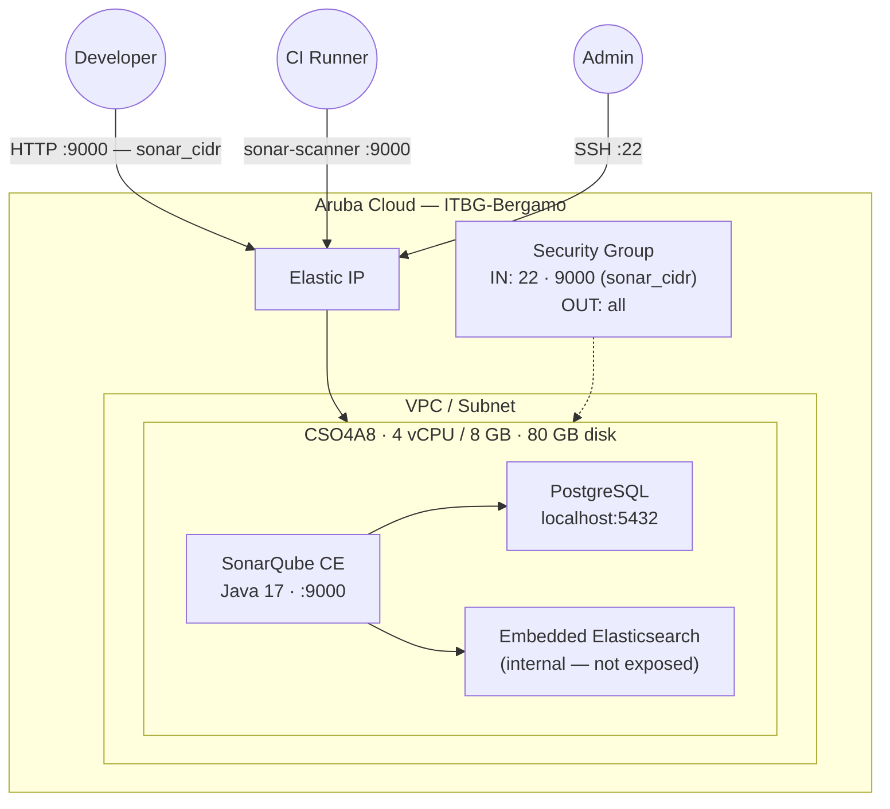

# SonarQube on Aruba Cloud

Deploy [SonarQube](https://www.sonarsource.com/products/sonarqube/) Community Edition — continuous code quality and security analysis — on Aruba Cloud using Terraform and cloud-init. Local PostgreSQL database, Java 17, direct access on port 9000.

> **Provider version:** arubacloud/arubacloud `~> 0.5` | **Terraform:** ≥ 1.9

---

## Introduction

SonarQube is the leading open-source platform for continuous inspection of code quality. It performs static analysis on 30+ languages, detecting bugs, vulnerabilities, and code smells as part of your CI/CD pipeline. This example provisions SonarQube Community Edition with:

- A **CloudServer VM** (CSO4A8 — 4 vCPU / 8 GB) running the SonarQube server on port 9000
- **Java 17** (OpenJDK) — required by SonarQube 10.x
- **Local PostgreSQL** — the recommended database (H2 is evaluation-only; MySQL is not supported)
- Critical **kernel tuning** (`vm.max_map_count=524288`, `fs.file-max=131072`) applied via sysctl — required by the embedded Elasticsearch that powers SonarQube's search

---

## Architecture Overview



---

## Infrastructure Created

| Resource | Name pattern | Description |
|----------|-------------|-------------|
| `arubacloud_project` | `sonar-prod` | Project container |
| `arubacloud_vpc` | `sonar-prod-vpc` | Virtual Private Cloud |
| `arubacloud_subnet` | `sonar-prod-subnet` | Basic subnet |
| `arubacloud_securitygroup` | `sonar-prod-vm-sg` | Security group |
| `arubacloud_securityrule` | `sonar-prod-vm-ssh` | SSH ingress |
| `arubacloud_securityrule` | `sonar-prod-vm-sonar` | SonarQube web UI (port 9000) |
| `arubacloud_elasticip` | `sonar-prod-vm-eip` | VM public IP |
| `arubacloud_blockstorage` | `sonar-prod-boot` | 80 GB boot disk (Performance) |
| `arubacloud_keypair` | `sonar-prod-keypair` | SSH public key |
| `arubacloud_cloudserver` | `sonar-prod-vm` | CloudServer VM |

---

## Estimated Monthly Cost

| Resource | Spec | Est. cost/mo |
|----------|------|-------------|
| CloudServer VM | CSO4A8 — 4 vCPU / 8 GB | ~€36 |
| Boot disk | 80 GB Performance | ~€10 |
| Elastic IP | — | ~€3 |
| **Total** | | **~€49/mo** |

For larger teams or monorepos, use `CSO8A16` (8 vCPU / 16 GB) — the Elasticsearch component benefits significantly from extra RAM.

---

## Requirements

- Terraform ≥ 1.9
- ArubaCloud Terraform Provider `~> 0.5`
- An ArubaCloud account with OAuth2 API credentials
- An SSH key pair

---

## Variables

### Required

| Variable | Description |
|----------|-------------|
| `arubacloud_client_id` | ArubaCloud OAuth2 client ID |
| `arubacloud_client_secret` | ArubaCloud OAuth2 client secret |
| `ssh_public_key` | SSH public key content |
| `db_password` | PostgreSQL password for the sonarqube user (min 16 chars) |

### Optional

| Variable | Default | Description |
|----------|---------|-------------|
| `app_name` | `"sonar"` | Short name used in all resource names |
| `environment` | `"prod"` | Environment label |
| `location` | `"ITBG-Bergamo"` | ArubaCloud region |
| `zone` | `"ITBG-1"` | Availability zone |
| `billing_period` | `"Hour"` | `"Hour"` or `"Month"` |
| `vm_flavor` | `"CSO4A8"` | CloudServer flavor |
| `vm_image` | `"LU22-001"` | Boot disk image (Ubuntu 22.04 LTS) |
| `vm_disk_size_gb` | `80` | Boot disk size in GB |
| `ssh_cidr` | `"0.0.0.0/0"` | CIDR for SSH |
| `sonar_cidr` | `"0.0.0.0/0"` | CIDR for port 9000 — **restrict to your office/VPN** |
| `sonarqube_version` | `"10.7.0.96327"` | SonarQube CE version (includes build number) |

---

## Outputs

| Output | Description |
|--------|-------------|
| `sonarqube_url` | SonarQube web interface URL |
| `vm_public_ip` | Public IP address |
| `ssh_command` | SSH command to connect |

---

## Deployment Instructions

### 1. Clone and navigate

```bash
git clone https://github.com/arubacloud/terraform-arubacloud-examples.git
cd terraform-arubacloud-examples/sonarqube
```

### 2. Configure variables

```bash
cp terraform.tfvars.example terraform.tfvars
```

Set `db_password`. Optionally restrict `sonar_cidr` to your office/VPN CIDR.

### 3. Deploy

```bash
terraform init
terraform plan
terraform apply
```

Bootstrap takes approximately **8–12 minutes** — SonarQube downloads ~280 MB and Elasticsearch needs time to initialise its indices.

### 4. Access SonarQube

```bash
terraform output sonarqube_url
```

Log in with `admin` / `admin`. You will be immediately prompted to change the password.

### 5. Integrate with your CI pipeline

Install the `sonar-scanner` CLI or use a CI plugin. Example for a Maven project:

```bash
mvn sonar:sonar \
  -Dsonar.host.url=$(terraform output -raw sonarqube_url) \
  -Dsonar.login=<your-token>
```

---

## Security Recommendations

1. **Restrict `sonar_cidr`.** Port 9000 should only be reachable from your development network, CI runners, or VPN. Leaving it open to `0.0.0.0/0` exposes your code analysis results publicly.

2. **Change the admin password** immediately after first login — SonarQube enforces this on first access.

3. **Create per-project tokens** for CI integration. Never use the admin account credentials in CI pipelines.

4. **Enable HTTPS.** Add an nginx reverse proxy with a Let's Encrypt certificate in front of SonarQube for encrypted access.

---

## Upgrade Considerations

### SonarQube upgrade

SonarQube upgrades require a database migration step. Always back up PostgreSQL first:

```bash
ssh ubuntu@$(terraform output -raw vm_public_ip)
sudo -u postgres pg_dump sonarqube > /tmp/sonarqube-backup.sql

SQ_VERSION=X.Y.Z.BUILD
sudo systemctl stop sonarqube
curl -sSfL \
  "https://binaries.sonarsource.com/Distribution/sonarqube/sonarqube-$SQ_VERSION.zip" \
  -o /tmp/sonarqube.zip
sudo unzip -q /tmp/sonarqube.zip -d /opt
sudo mv /opt/sonarqube /opt/sonarqube-old
sudo mv /opt/sonarqube-$SQ_VERSION /opt/sonarqube
sudo cp /opt/sonarqube-old/conf/sonar.properties /opt/sonarqube/conf/
sudo chown -R sonarqube:sonarqube /opt/sonarqube
sudo systemctl start sonarqube
# Visit http://<IP>:9000/setup to trigger database migration
```

---

## Troubleshooting

### SonarQube not reachable after apply

```bash
ssh ubuntu@$(terraform output -raw vm_public_ip)
sudo systemctl status sonarqube
sudo tail -100 /opt/sonarqube/logs/sonar.log
sudo tail -100 /var/log/cloud-init-output.log
```

### Elasticsearch fails to start — vm.max_map_count

Verify the sysctl value was applied:

```bash
sysctl vm.max_map_count
# Must be >= 524288
sudo sysctl -w vm.max_map_count=524288
sudo systemctl restart sonarqube
```

### Out of memory / Elasticsearch crashes

Upgrade to `CSO8A16` (8 vCPU / 16 GB) and adjust JVM heap sizes in `sonar.properties` accordingly (e.g. `sonar.search.javaOpts=-Xmx2g -Xms2g`).

---

## References

- [SonarQube Documentation](https://docs.sonarsource.com/sonarqube/latest/)
- [SonarQube Requirements](https://docs.sonarsource.com/sonarqube/latest/setup-and-upgrade/install-the-server/introduction/)
- [SonarQube Downloads](https://www.sonarsource.com/products/sonarqube/downloads/)
- [ArubaCloud Terraform Provider](https://registry.terraform.io/providers/arubacloud/arubacloud/latest/docs)

