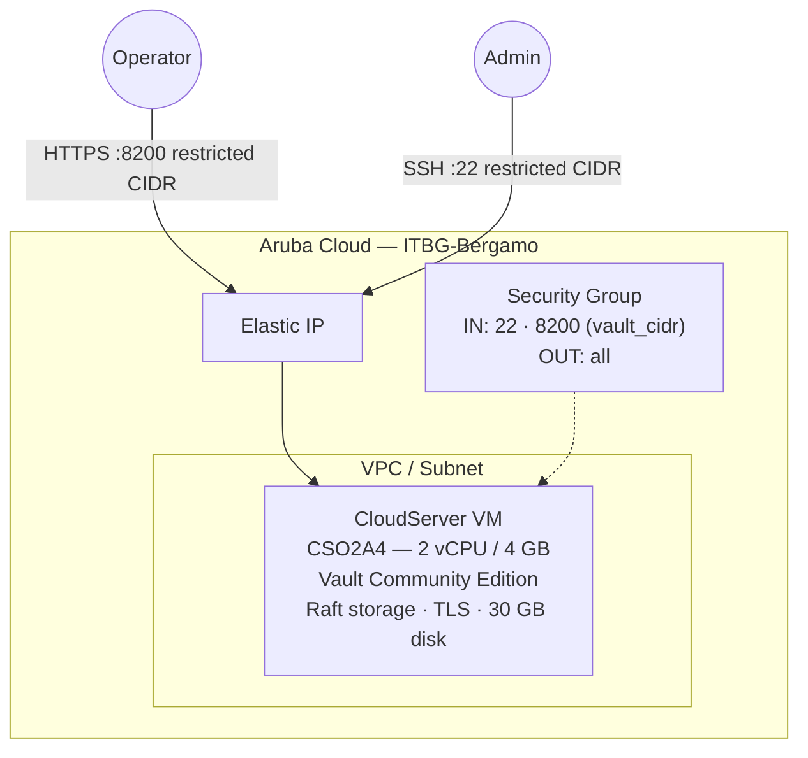

# HashiCorp Vault on Aruba Cloud

Deploy [HashiCorp Vault](https://www.vaultproject.io) Community Edition in production mode on Aruba Cloud using Terraform and cloud-init. Raft integrated storage — no external database required.

> **Provider version:** arubacloud/arubacloud `~> 0.5` | **Terraform:** ≥ 1.9

---

## Introduction

HashiCorp Vault is an identity-based secrets and encryption management system. It provides a unified interface to any secret — API keys, passwords, certificates, encryption keys — while providing tight access control and recording a detailed audit log. This example deploys Vault in **production server mode** with:

- **Raft integrated storage** — Vault's built-in consensus store; no external database or Consul cluster needed
- **TLS on port 8200** — a self-signed certificate is generated at boot; an optional `tls_san` adds a DNS name as a Subject Alternative Name
- **Automatic initialisation** — `vault operator init` runs on first boot, saving unseal keys and root token to `/root/vault-init.json`
- **Automatic unseal** — 3 of 5 Shamir unseal keys are applied after init so Vault is ready immediately
- Port 8200 **restricted by `vault_cidr`** — never expose Vault to `0.0.0.0/0` in production

> **Important:** This example automates initialisation for getting-started convenience. In production, remove the init output from the server immediately and use [Vault Auto-unseal](https://developer.hashicorp.com/vault/docs/concepts/seal#auto-unseal) with a cloud KMS.

---

## Architecture Overview



---

## Infrastructure Created

| Resource | Name pattern | Description |
|----------|-------------|-------------|
| `arubacloud_project` | `vault-prod` | Project container |
| `arubacloud_vpc` | `vault-prod-vpc` | Virtual Private Cloud |
| `arubacloud_subnet` | `vault-prod-subnet` | Basic subnet |
| `arubacloud_securitygroup` | `vault-prod-vm-sg` | Security group |
| `arubacloud_securityrule` | `vault-prod-vm-ssh` | SSH ingress (restricted CIDR) |
| `arubacloud_securityrule` | `vault-prod-vm-vault` | Vault API + UI (port 8200, restricted CIDR) |
| `arubacloud_elasticip` | `vault-prod-vm-eip` | VM public IP |
| `arubacloud_blockstorage` | `vault-prod-boot` | 30 GB boot disk (Performance) |
| `arubacloud_keypair` | `vault-prod-keypair` | SSH public key |
| `arubacloud_cloudserver` | `vault-prod-vm` | CloudServer VM |

---

## Estimated Monthly Cost

> Approximate prices for ITBG-Bergamo, hourly billing.

| Resource | Spec | Est. cost/mo |
|----------|------|-------------|
| CloudServer VM | CSO2A4 — 2 vCPU / 4 GB | ~€18 |
| Boot disk | 30 GB Performance | ~€4 |
| Elastic IP | — | ~€3 |
| **Total** | | **~€25/mo** |

---

## Requirements

- Terraform ≥ 1.9
- ArubaCloud Terraform Provider `~> 0.5`
- An ArubaCloud account with OAuth2 API credentials
- An SSH key pair
- `vault` CLI installed locally (optional, for interacting with Vault)

---

## Variables

### Required

| Variable | Description |
|----------|-------------|
| `arubacloud_client_id` | ArubaCloud OAuth2 client ID |
| `arubacloud_client_secret` | ArubaCloud OAuth2 client secret |
| `ssh_public_key` | SSH public key content |

### Optional

| Variable | Default | Description |
|----------|---------|-------------|
| `app_name` | `"vault"` | Short name used in all resource names |
| `environment` | `"prod"` | Environment label |
| `location` | `"ITBG-Bergamo"` | ArubaCloud region |
| `zone` | `"ITBG-1"` | Availability zone |
| `billing_period` | `"Hour"` | `"Hour"` or `"Month"` |
| `vm_flavor` | `"CSO2A4"` | CloudServer flavor |
| `vm_image` | `"LU22-001"` | Boot disk image (Ubuntu 22.04 LTS) |
| `vm_disk_size_gb` | `30` | Boot disk size in GB |
| `ssh_cidr` | `"0.0.0.0/0"` | CIDR for SSH — **restrict to your IP** |
| `vault_cidr` | `"0.0.0.0/0"` | CIDR for Vault API/UI (port 8200) — **restrict to your IP** |
| `vault_version` | `"1.18.4"` | Vault version from HashiCorp APT repo |
| `tls_san` | `""` | Extra DNS SAN for the self-signed TLS cert |

---

## Outputs

| Output | Description |
|--------|-------------|
| `vault_url` | Vault API and UI endpoint |
| `vm_public_ip` | Public IP address of the VM |
| `ssh_command` | SSH command to connect to the VM |
| `init_output_cmd` | SSH command to retrieve unseal keys + root token |
| `env_hint` | `VAULT_ADDR` and `VAULT_SKIP_VERIFY` environment variables |

---

## Deployment Instructions

### 1. Clone and navigate

```bash
git clone https://github.com/arubacloud/terraform-arubacloud-examples.git
cd terraform-arubacloud-examples/vault
```

### 2. Configure variables

```bash
cp terraform.tfvars.example terraform.tfvars
```

**Always** restrict `vault_cidr` to your IP before deploying to production:

```hcl
vault_cidr = "203.0.113.42/32"
ssh_cidr   = "203.0.113.42/32"
```

### 3. Deploy

```bash
terraform init
terraform plan
terraform apply
```

Bootstrap takes approximately **3–5 minutes**.

### 4. Set environment variables

```bash
eval "$(terraform output -raw env_hint)"
# Equivalent to:
# export VAULT_ADDR=https://<IP>:8200
# export VAULT_SKIP_VERIFY=true
```

### 5. Retrieve the init output

```bash
terraform output -raw init_output_cmd | bash | tee vault-init-KEEP-SAFE.json
```

> **Warning:** `/root/vault-init.json` on the server contains your Shamir unseal keys and root token in plaintext. Copy it to a secure offline location and delete the server copy:

```bash
ssh ubuntu@$(terraform output -raw vm_public_ip) \
  'sudo shred -u /root/vault-init.json'
```

### 6. Verify Vault

```bash
vault status
vault login   # use the root_token from vault-init.json
vault secrets list
```

### 7. Access the UI

Open `$(terraform output -raw vault_url)/ui` in your browser and log in with the root token. Accept the TLS warning (self-signed certificate).

---

## Destroy Instructions

```bash
terraform destroy
```

All resources and Vault data are permanently deleted.

---

## Security Recommendations

1. **Restrict `vault_cidr` immediately.** Vault holds your secrets — never leave port 8200 open to `0.0.0.0/0`.

2. **Remove the init output from the server.** After copying `vault-init.json` to a secure location, shred it on the VM (`sudo shred -u /root/vault-init.json`).

3. **Replace the root token.** After initial setup, create a properly-scoped token, revoke the root token, and store the unseal keys in separate secure locations (password manager, sealed envelope, HSM).

4. **Enable audit logging.** After login: `vault audit enable file file_path=/var/log/vault/audit.log`.

5. **Use Auto-unseal in production.** Manual unseal requires human intervention after every restart. Integrate with a cloud KMS (AWS KMS, GCP KMS, Azure Key Vault) for automatic unsealing. See [Vault Auto-unseal docs](https://developer.hashicorp.com/vault/docs/concepts/seal#auto-unseal).

6. **Enable TLS verification.** Replace the self-signed certificate with one signed by a trusted CA, then remove `VAULT_SKIP_VERIFY=true`.

---

## Upgrade Considerations

### Vault version upgrade

```bash
ssh ubuntu@$(terraform output -raw vm_public_ip)
sudo apt-get update
sudo apt-get install --only-upgrade vault
sudo systemctl restart vault
# Re-unseal if needed:
vault operator unseal <key1>
vault operator unseal <key2>
vault operator unseal <key3>
```

Review the [Vault upgrade guide](https://developer.hashicorp.com/vault/docs/upgrading) before upgrading across major versions.

---

## Troubleshooting

### Vault is sealed after a reboot

Manual unseal is required on every restart (unless Auto-unseal is configured):

```bash
eval "$(terraform output -raw env_hint)"
vault operator unseal <key1>
vault operator unseal <key2>
vault operator unseal <key3>
```

### TLS certificate errors

The self-signed certificate causes browser warnings and CLI errors. Either:

- Set `VAULT_SKIP_VERIFY=true` for testing
- Trust the certificate: `sudo cp /etc/vault.d/tls/vault.crt /usr/local/share/ca-certificates/ && sudo update-ca-certificates`
- Replace with a valid certificate signed by a trusted CA

### cloud-init did not complete

```bash
ssh ubuntu@$(terraform output -raw vm_public_ip)
sudo tail -100 /var/log/cloud-init-output.log
sudo systemctl status vault
sudo journalctl -u vault -n 30
```

---

## References

- [Vault Documentation](https://developer.hashicorp.com/vault/docs)
- [Vault Raft Storage](https://developer.hashicorp.com/vault/docs/configuration/storage/raft)
- [Vault Production Hardening](https://developer.hashicorp.com/vault/tutorials/operations/production-hardening)
- [Vault Auto-unseal](https://developer.hashicorp.com/vault/docs/concepts/seal#auto-unseal)
- [ArubaCloud Terraform Provider](https://registry.terraform.io/providers/arubacloud/arubacloud/latest/docs)

