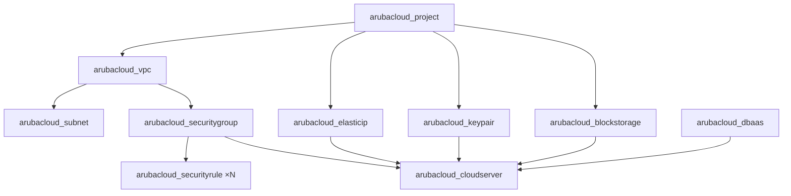

# Panoramica dell'Architettura

Ogni esempio in questa raccolta segue lo stesso schema architetturale a strati.

## Gerarchia delle risorse



## Modulo di rete condiviso

Il modulo `modules/network` è usato da ogni esempio. Crea:

- Una **VPC** e una **subnet Basic**
- Un **security group** per la VM con regole di ingresso configurabili
- Un **Elastic IP** per la VM
- Opzionalmente: un security group separato + Elastic IP per il DBaaS

Le regole di sicurezza specifiche per l'applicazione (es. porta MySQL 3306 limitata all'IP della VM) vengono create nel modulo dell'esempio, non nel modulo condiviso. Questo mantiene il modulo generico.

## Pattern di bootstrap cloud-init

Tutti gli esempi usano `templatefile()` per renderizzare un file `cloud-init.yaml.tpl`:

```hcl
user_data = templatefile("${path.module}/cloud-init.yaml.tpl", {
  db_host    = module.network.dbaas_elastic_ip_address
  db_name    = arubacloud_database.this.name
  # ...
})
```

Il template usa `write_files` per scrivere i file di configurazione e `runcmd` per installare e avviare i servizi. È completamente idempotente e non richiede accesso SSH dopo il deployment.

## Convenzione di denominazione

Tutti i nomi delle risorse seguono il formato `{app}-{environment}-{tipo}`, per esempio:

- `wp-prod-vpc`
- `wp-prod-vm-sg`
- `wp-prod-vm-eip`

Questo è controllato dalle variabili `app_name` e `environment` in ogni esempio.
