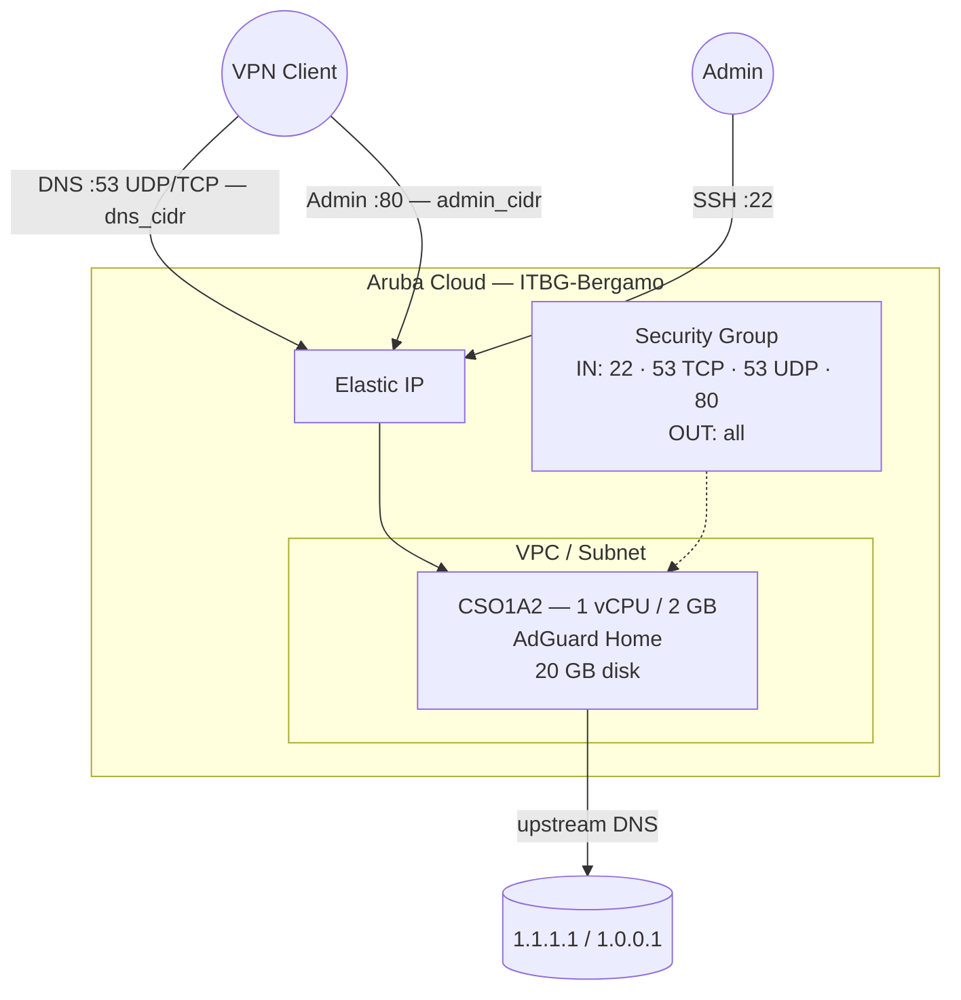

# AdGuard Home su Aruba Cloud

Esegui il deployment di [AdGuard Home](https://adguard.com/en/adguard-home/overview.html) — blocco degli annunci DNS a livello di rete e protezione della privacy — su Aruba Cloud tramite Terraform e cloud-init. AdGuard Home si abbina naturalmente all'[esempio WireGuard](wireguard.md): indirizza i client VPN verso il server DNS di AdGuard Home per una navigazione senza pubblicità e tracker ovunque la VPN sia attiva.

> **Versione provider:** arubacloud/arubacloud `~> 0.5` | **Terraform:** ≥ 1.9

---

## Introduzione

AdGuard Home è una soluzione di filtraggio DNS e blocco annunci a livello di rete. Come Pi-hole, funziona come DNS sinkhole — ma con una moderna interfaccia web, supporto integrato DoH/DoT e statistiche per client. Questo esempio esegue il provisioning di un'istanza leggera su Aruba Cloud con:

- AdGuard Home installato dal **binario ufficiale di GitHub** (senza Docker)
- **DNS sulla porta 53 (UDP + TCP)** — UDP per le query standard, TCP per le risposte di grandi dimensioni
- **Interfaccia web di amministrazione sulla porta 80** — con accesso limitato tramite `admin_cidr`
- Listener stub di `systemd-resolved` disabilitato in modo che AdGuard Home possa occupare la porta 53
- **Due liste di blocco predefinite** — filtro DNS AdGuard e AdAway

> **Best practice:** Esegui il deployment insieme all'esempio [WireGuard](wireguard.md). Imposta `dns_cidr` e `admin_cidr` sul CIDR del tunnel WireGuard (es. `10.8.0.0/24`). Configura il DNS dei client VPN sull'IP Elastico di AdGuard Home.

---

## Panoramica dell'architettura



---

## Infrastruttura creata

| Risorsa | Pattern del nome | Descrizione |
|---------|-----------------|-------------|
| `arubacloud_project` | `adguard-prod` | Contenitore del progetto |
| `arubacloud_vpc` | `adguard-prod-vpc` | Virtual Private Cloud |
| `arubacloud_subnet` | `adguard-prod-subnet` | Subnet base |
| `arubacloud_securitygroup` | `adguard-prod-vm-sg` | Security group |
| `arubacloud_securityrule` | `adguard-prod-vm-ssh` | Regola ingress SSH |
| `arubacloud_securityrule` | `adguard-prod-vm-admin-ui` | Regola ingress interfaccia admin TCP 80 |
| `arubacloud_securityrule` | `adguard-prod-vm-dns-tcp` | Regola ingress DNS TCP 53 |
| `arubacloud_securityrule` | `adguard-prod-vm-dns-udp` | Regola ingress DNS UDP 53 |
| `arubacloud_elasticip` | `adguard-prod-vm-eip` | IP pubblico della VM |
| `arubacloud_blockstorage` | `adguard-prod-boot` | Disco di boot da 20 GB (Performance) |
| `arubacloud_keypair` | `adguard-prod-keypair` | Chiave pubblica SSH |
| `arubacloud_cloudserver` | `adguard-prod-vm` | VM CloudServer |

---

## Costo mensile stimato

| Risorsa | Specifiche | Costo stimato/mese |
|---------|-----------|-------------------|
| VM CloudServer | CSO1A2 — 1 vCPU / 2 GB | ~€9 |
| Disco di boot | 20 GB Performance | ~€3 |
| Elastic IP | — | ~€3 |
| **Totale** | | **~€15/mese** |

---

## Requisiti

- Terraform ≥ 1.9
- ArubaCloud Terraform Provider `~> 0.5`
- Un account ArubaCloud con credenziali API OAuth2
- Una coppia di chiavi SSH

---

## Variabili

### Obbligatorie

| Variabile | Descrizione |
|-----------|-------------|
| `arubacloud_client_id` | Client ID OAuth2 di ArubaCloud |
| `arubacloud_client_secret` | Client secret OAuth2 di ArubaCloud |
| `ssh_public_key` | Contenuto della chiave pubblica SSH |
| `adguard_password` | Password admin di AdGuard Home (min 8 caratteri) |

### Opzionali

| Variabile | Default | Descrizione |
|-----------|---------|-------------|
| `app_name` | `"adguard"` | Nome breve usato in tutti i nomi delle risorse |
| `environment` | `"prod"` | Etichetta dell'ambiente |
| `location` | `"ITBG-Bergamo"` | Regione ArubaCloud |
| `zone` | `"ITBG-1"` | Zona di disponibilità |
| `billing_period` | `"Hour"` | `"Hour"` o `"Month"` |
| `vm_flavor` | `"CSO1A2"` | Flavor del CloudServer |
| `vm_image` | `"LU22-001"` | Immagine del disco di boot (Ubuntu 22.04 LTS) |
| `vm_disk_size_gb` | `20` | Dimensione del disco di boot in GB |
| `ssh_cidr` | `"0.0.0.0/0"` | CIDR per SSH |
| `dns_cidr` | `"0.0.0.0/0"` | CIDR per la porta DNS 53 — **limita al CIDR del tuo tunnel VPN** |
| `admin_cidr` | `"0.0.0.0/0"` | CIDR per l'interfaccia admin porta 80 — **limita al CIDR del tuo tunnel VPN** |
| `upstream_dns_1` | `"1.1.1.1"` | Resolver upstream primario |
| `upstream_dns_2` | `"1.0.0.1"` | Resolver upstream secondario |
| `adguardhome_version` | `"0.107.52"` | Versione di AdGuard Home |

---

## Output

| Output | Descrizione |
|--------|-------------|
| `admin_url` | URL dell'interfaccia web di amministrazione di AdGuard Home |
| `dns_server` | IP da usare come server DNS sui client VPN |
| `vm_public_ip` | Indirizzo IP pubblico della VM |
| `ssh_command` | Comando SSH per connettersi alla VM |

---

## Istruzioni di deployment

### 1. Clona e naviga

```bash
git clone https://github.com/arubacloud/terraform-arubacloud-examples.git
cd terraform-arubacloud-examples/adguard-home
```

### 2. Configura le variabili

```bash
cp terraform.tfvars.example terraform.tfvars
```

Imposta `adguard_password`. In produzione, imposta anche:

```hcl
dns_cidr   = "10.8.0.0/24"   # il CIDR del tuo tunnel WireGuard
admin_cidr = "10.8.0.0/24"
ssh_cidr   = "203.0.113.42/32"
```

### 3. Esegui il deployment

```bash
terraform init
terraform plan
terraform apply
```

Il bootstrap richiede circa **3–5 minuti** (download del binario + generazione hash bcrypt).

### 4. Configura il DNS dei client VPN

```bash
terraform output dns_server
```

Usa l'IP in output come server DNS nella configurazione del client WireGuard:

```ini
# Nella sezione [Peer] del tuo client WireGuard:
DNS = <output di dns_server>
```

### 5. Accedi all'interfaccia admin

```bash
terraform output admin_url
```

Accedi con il nome utente `admin` e la tua `adguard_password` per visualizzare i log delle query, gestire le liste di blocco e configurare le regole di filtraggio.

---

## Raccomandazioni di sicurezza

1. **Limita sempre `dns_cidr` e `admin_cidr`.** Lasciare la porta 53 aperta a `0.0.0.0/0` rende il tuo AdGuard Home un resolver DNS aperto — verrà sfruttato per attacchi di amplificazione DNS. Imposta entrambi i CIDR sul CIDR del tuo tunnel WireGuard.

2. **Non esporre pubblicamente l'interfaccia admin.** La porta 80 deve essere raggiungibile solo dai client connessi alla VPN.

3. **Usa AdGuard Home con WireGuard.** Il modello di deployment previsto: la VPN WireGuard fornisce un accesso sicuro tramite tunnel, e i client instradano il DNS attraverso AdGuard Home. Consulta l'[esempio WireGuard](wireguard.md).

---

## Considerazioni sull'aggiornamento

Per aggiornare AdGuard Home in-place, usa lo strumento di aggiornamento integrato dall'interfaccia admin (**Impostazioni → Aggiornamenti**), oppure via SSH:

```bash
ssh ubuntu@$(terraform output -raw vm_public_ip)
sudo systemctl stop AdGuardHome
sudo /opt/AdGuardHome/AdGuardHome --update
sudo systemctl start AdGuardHome
```

Per gli aggiornamenti di versione di AdGuard Home non è necessaria la sostituzione della VM.

---

## Risoluzione dei problemi

### AdGuard Home non risponde alle query DNS

```bash
sudo systemctl status AdGuardHome
# Verifica che la porta 53 sia in ascolto:
sudo ss -ulnp | grep :53
sudo ss -tlnp | grep :53
```

### Porta 53 già in uso dopo l'installazione

Il listener stub di `systemd-resolved` non è stato disabilitato. Verifica:

```bash
sudo ss -ulnp sport = :53
cat /etc/systemd/resolved.conf | grep DNSStubListener
sudo systemctl restart systemd-resolved
sudo systemctl restart AdGuardHome
```

### Interfaccia admin non carica

```bash
sudo systemctl status AdGuardHome
curl -sv http://localhost/
journalctl -u AdGuardHome -n 50
```

---

## Riferimenti

- [Documentazione AdGuard Home](https://github.com/AdguardTeam/AdGuardHome/wiki)
- [Release di AdGuard Home su GitHub](https://github.com/AdguardTeam/AdGuardHome/releases)
- [Esempio WireGuard](wireguard.md)
- [Esempio Pi-hole](pi-hole.md)
- [Provider Terraform ArubaCloud](https://registry.terraform.io/providers/arubacloud/arubacloud/latest/docs)
