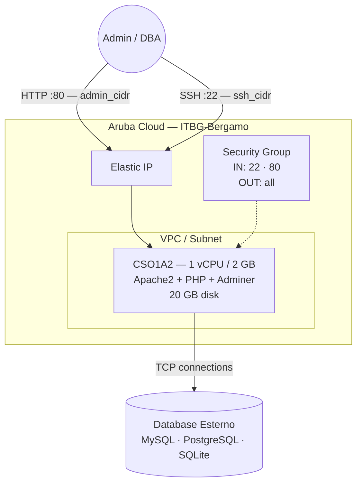

# Adminer su Aruba Cloud

Esegui il deployment di [Adminer](https://www.adminer.org) — uno strumento leggero di amministrazione database PHP in un singolo file — su Aruba Cloud tramite Terraform e cloud-init. Adminer supporta MySQL, MariaDB, PostgreSQL e SQLite da un unico file PHP servito da Apache.

> **Versione provider:** arubacloud/arubacloud `~> 0.5` | **Terraform:** ≥ 1.9

---

## Introduzione

Adminer è uno strumento completo per la gestione dei database contenuto in un singolo file PHP. Rispetto a phpMyAdmin è più leggero, più rapido da distribuire e altrettanto capace per le operazioni quotidiane di amministrazione DB. Questo esempio esegue il provisioning di una VM minimale con:

- **Apache2 + PHP 8.1** — lo stack minimo indispensabile per Adminer
- **Adminer.php** scaricato direttamente dalla release ufficiale su GitHub
- **Driver PHP per database** MySQL (`php-mysql`), PostgreSQL (`php-pgsql`) e SQLite (`php-sqlite3`)
- Porta 80 limitata a `admin_cidr` — Adminer non viene mai esposto a internet pubblico

> **Nota di sicurezza:** Adminer non ha rate limiting integrato né restrizioni IP. Imposta sempre `admin_cidr` sul tuo IP di gestione specifico (es. `203.0.113.42/32`) e non eseguire mai il deployment con il valore predefinito `0.0.0.0/0` in produzione.

---

## Panoramica dell'architettura



---

## Infrastruttura creata

| Risorsa | Pattern del nome | Descrizione |
|---------|-----------------|-------------|
| `arubacloud_project` | `adminer-prod` | Contenitore del progetto |
| `arubacloud_vpc` | `adminer-prod-vpc` | Virtual Private Cloud |
| `arubacloud_subnet` | `adminer-prod-subnet` | Subnet base |
| `arubacloud_securitygroup` | `adminer-prod-vm-sg` | Security group |
| `arubacloud_securityrule` | `adminer-prod-vm-ssh` | Regola ingress SSH |
| `arubacloud_securityrule` | `adminer-prod-vm-admin-ui` | Regola ingress interfaccia admin TCP 80 |
| `arubacloud_elasticip` | `adminer-prod-vm-eip` | IP pubblico della VM |
| `arubacloud_blockstorage` | `adminer-prod-boot` | Disco di boot da 20 GB (Performance) |
| `arubacloud_keypair` | `adminer-prod-keypair` | Chiave pubblica SSH |
| `arubacloud_cloudserver` | `adminer-prod-vm` | VM CloudServer |

---

## Costo mensile stimato

| Risorsa | Specifiche | Costo stimato/mese |
|---------|-----------|-------------------|
| VM CloudServer | CSO1A2 — 1 vCPU / 2 GB | ~€9 |
| Disco di boot | 20 GB Performance | ~€3 |
| Elastic IP | — | ~€3 |
| **Totale** | | **~€15/mese** |

---

## Requisiti

- Terraform ≥ 1.9
- ArubaCloud Terraform Provider `~> 0.5`
- Un account ArubaCloud con credenziali API OAuth2
- Una coppia di chiavi SSH
- Un server database raggiungibile dalla VM (sulla stessa VPC o tramite IP pubblico)

---

## Variabili

### Obbligatorie

| Variabile | Descrizione |
|-----------|-------------|
| `arubacloud_client_id` | Client ID OAuth2 di ArubaCloud |
| `arubacloud_client_secret` | Client secret OAuth2 di ArubaCloud |
| `ssh_public_key` | Contenuto della chiave pubblica SSH |

### Opzionali

| Variabile | Default | Descrizione |
|-----------|---------|-------------|
| `app_name` | `"adminer"` | Nome breve usato in tutti i nomi delle risorse |
| `environment` | `"prod"` | Etichetta dell'ambiente |
| `location` | `"ITBG-Bergamo"` | Regione ArubaCloud |
| `zone` | `"ITBG-1"` | Zona di disponibilità |
| `billing_period` | `"Hour"` | `"Hour"` o `"Month"` |
| `vm_flavor` | `"CSO1A2"` | Flavor del CloudServer |
| `vm_image` | `"LU22-001"` | Immagine del disco di boot (Ubuntu 22.04 LTS) |
| `vm_disk_size_gb` | `20` | Dimensione del disco di boot in GB |
| `ssh_cidr` | `"0.0.0.0/0"` | CIDR per SSH — limita in produzione |
| `admin_cidr` | `"0.0.0.0/0"` | CIDR per l'interfaccia web — **limita sempre** |
| `adminer_version` | `"4.8.1"` | Versione di Adminer |

---

## Output

| Output | Descrizione |
|--------|-------------|
| `adminer_url` | URL dell'interfaccia web di Adminer |
| `vm_public_ip` | Indirizzo IP pubblico della VM |
| `ssh_command` | Comando SSH per connettersi alla VM |

---

## Istruzioni di deployment

### 1. Clona e naviga

```bash
git clone https://github.com/arubacloud/terraform-arubacloud-examples.git
cd terraform-arubacloud-examples/adminer
```

### 2. Configura le variabili

```bash
cp terraform.tfvars.example terraform.tfvars
```

Imposta le credenziali e **limita i CIDR al tuo IP di gestione**:

```hcl
arubacloud_client_id     = "your-client-id"
arubacloud_client_secret = "your-client-secret"
ssh_public_key           = "ssh-ed25519 AAAA..."
ssh_cidr                 = "203.0.113.42/32"
admin_cidr               = "203.0.113.42/32"
```

### 3. Esegui il deployment

```bash
terraform init
terraform plan
terraform apply
```

Il bootstrap richiede circa **2–3 minuti**.

### 4. Connettiti a un database

```bash
terraform output adminer_url
```

Apri l'URL nel browser e inserisci:

- **Server:** hostname o IP del tuo server database
- **Nome utente / Password:** le tue credenziali del database
- **Database:** nome del database (opzionale — lascia vuoto per elencarli tutti)

---

## Raccomandazioni di sicurezza

1. **Limita sempre `admin_cidr` al tuo IP di gestione.** Adminer espone le credenziali del database nel browser e non ha protezione contro brute-force. Il valore predefinito `0.0.0.0/0` è accettabile solo per test iniziali su una VM temporanea.

2. **Non conservare credenziali DB sensibili in `terraform.tfvars`.** Usa variabili d'ambiente (`TF_VAR_*`) o un gestore di segreti quando automatizzi i deployment.

3. **Considera l'aggiunta di HTTP Basic Auth.** Per un ulteriore livello di autenticazione prima che Adminer si carichi, abilita Apache Basic Auth:

   ```bash
   sudo htpasswd -c /etc/apache2/.htpasswd admin
   ```

   Quindi aggiungi quanto segue a `/etc/apache2/sites-enabled/000-default.conf` all'interno del blocco `<VirtualHost>`:

   ```apache
   <Directory /var/www/html>
       AuthType Basic
       AuthName "Restricted"
       AuthUserFile /etc/apache2/.htpasswd
       Require valid-user
   </Directory>
   ```

   Ricarica Apache: `sudo systemctl reload apache2`

4. **Usa una VPN.** L'approccio più sicuro è mantenere `admin_cidr` bloccato sul CIDR del tuo tunnel WireGuard o altra VPN, e accedere ad Adminer solo tramite VPN.

---

## Risoluzione dei problemi

### La pagina di Adminer non si carica

```bash
# Verifica che Apache sia in esecuzione
sudo systemctl status apache2

# Verifica che il file PHP di Adminer esista
ls -la /var/www/html/adminer.php

# Verifica che cloud-init sia completato con successo
sudo cat /var/log/cloud-init-output.log | tail -30
```

### Impossibile connettersi al database

Verifica che l'host del database sia raggiungibile dalla VM:

```bash
ssh ubuntu@$(terraform output -raw vm_public_ip)
# Per MySQL:
nc -zv <db-host> 3306
# Per PostgreSQL:
nc -zv <db-host> 5432
```

Controlla che il security group sul tuo server database consenta connessioni inbound dall'IP della VM Adminer.

---

## Riferimenti

- [Documentazione Adminer](https://www.adminer.org/en/plugins/)
- [Release di Adminer su GitHub](https://github.com/vrana/adminer/releases)
- [Provider Terraform ArubaCloud](https://registry.terraform.io/providers/arubacloud/arubacloud/latest/docs)
