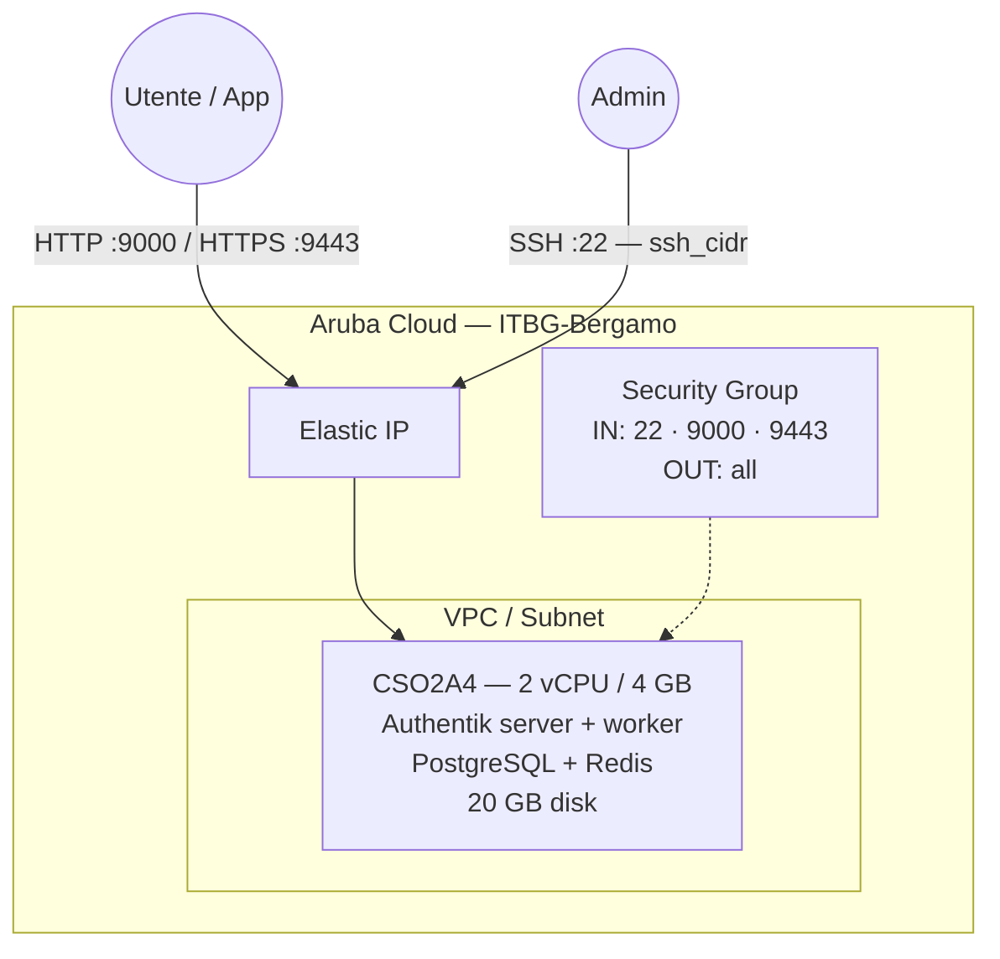

# Authentik su Aruba Cloud

Esegui il deployment di [Authentik](https://goauthentik.io/) — un provider di identità moderno e open-source con supporto a SSO, OIDC, OAuth2, SAML, LDAP e SCIM — su Aruba Cloud tramite Terraform e cloud-init. Distribuito via Docker Compose con PostgreSQL e Redis.

> **Versione provider:** arubacloud/arubacloud `~> 0.5` | **Terraform:** ≥ 1.9

---

## Introduzione

Authentik è un'alternativa più leggera a Keycloak, con un'interfaccia admin raffinata e flussi di autenticazione flessibili. Questo esempio esegue il deployment di:

- **Server Authentik** e **worker** tramite l'immagine Docker ufficiale
- **PostgreSQL 16** per la persistenza dei dati
- **Redis** per il caching e la gestione dei task
- Interfaccia web su HTTP porta 9000 e HTTPS porta 9443 (certificato autofirmato)
- Wizard di configurazione al primo accesso

> **Confronto con Keycloak:** Consulta l'[esempio Keycloak](/examples/keycloak) per un provider di identità alternativo. Authentik eccelle nei deployment leggeri e ha un'interfaccia più moderna; Keycloak è più adatto per federazione enterprise e conformità agli standard.

---

## Panoramica dell'architettura



---

## Infrastruttura creata

| Risorsa | Pattern del nome | Descrizione |
|---------|-----------------|-------------|
| `arubacloud_project` | `auth-prod` | Contenitore del progetto |
| `arubacloud_vpc` | `auth-prod-vpc` | Virtual Private Cloud |
| `arubacloud_subnet` | `auth-prod-subnet` | Subnet base |
| `arubacloud_securitygroup` | `auth-prod-vm-sg` | Security group |
| `arubacloud_securityrule` | `auth-prod-vm-ssh` | Regola ingress SSH |
| `arubacloud_securityrule` | `auth-prod-vm-http` | Porta HTTP 9000 di Authentik |
| `arubacloud_securityrule` | `auth-prod-vm-https` | Porta HTTPS 9443 di Authentik |
| `arubacloud_elasticip` | `auth-prod-vm-eip` | IP pubblico della VM |
| `arubacloud_blockstorage` | `auth-prod-boot` | Disco di boot da 20 GB (Performance) |
| `arubacloud_keypair` | `auth-prod-keypair` | Chiave pubblica SSH |
| `arubacloud_cloudserver` | `auth-prod-vm` | VM CloudServer |

---

## Costo mensile stimato

| Risorsa | Specifiche | Costo stimato/mese |
|---------|-----------|-------------------|
| VM CloudServer | CSO2A4 — 2 vCPU / 4 GB | ~€20 |
| Disco di boot | 20 GB Performance | ~€3 |
| Elastic IP | — | ~€3 |
| **Totale** | | **~€26/mese** |

---

## Requisiti

- Terraform ≥ 1.9
- ArubaCloud Terraform Provider `~> 0.5`
- Un account ArubaCloud con credenziali API OAuth2
- Una coppia di chiavi SSH

---

## Variabili

### Obbligatorie

| Variabile | Descrizione |
|-----------|-------------|
| `arubacloud_client_id` | Client ID OAuth2 di ArubaCloud |
| `arubacloud_client_secret` | Client secret OAuth2 di ArubaCloud |
| `ssh_public_key` | Contenuto della chiave pubblica SSH |
| `pg_password` | Password PostgreSQL (min 12 caratteri) |
| `authentik_secret_key` | Chiave di firma Authentik (min 32 caratteri — usa `openssl rand -hex 32`) |

### Opzionali

| Variabile | Default | Descrizione |
|-----------|---------|-------------|
| `app_name` | `"auth"` | Nome breve usato in tutti i nomi delle risorse |
| `environment` | `"prod"` | Etichetta dell'ambiente |
| `location` | `"ITBG-Bergamo"` | Regione ArubaCloud |
| `zone` | `"ITBG-1"` | Zona di disponibilità |
| `billing_period` | `"Hour"` | `"Hour"` o `"Month"` |
| `vm_flavor` | `"CSO2A4"` | Flavor del CloudServer |
| `vm_disk_size_gb` | `20` | Dimensione del disco di boot in GB |
| `ssh_cidr` | `"0.0.0.0/0"` | CIDR per SSH |
| `authentik_version` | `"latest"` | Tag dell'immagine Docker di Authentik |

---

## Output

| Output | Descrizione |
|--------|-------------|
| `authentik_url` | URL dell'interfaccia web di Authentik (HTTP) |
| `authentik_url_https` | URL dell'interfaccia web di Authentik (HTTPS) |
| `vm_public_ip` | Indirizzo IP pubblico della VM |
| `ssh_command` | Comando SSH per connettersi alla VM |

---

## Istruzioni di deployment

### 1. Clona e naviga

```bash
git clone https://github.com/arubacloud/terraform-arubacloud-examples.git
cd terraform-arubacloud-examples/authentik
```

### 2. Configura le variabili

```bash
cp terraform.tfvars.example terraform.tfvars
```

Genera una chiave segreta robusta:

```bash
openssl rand -hex 32
```

### 3. Esegui il deployment

```bash
terraform init
terraform plan
terraform apply
```

Il bootstrap richiede circa **3–5 minuti**.

### 4. Configurazione iniziale

Naviga su `http://<IP>:9000/if/flow/initial-setup/` e crea l'account amministratore.

---

## Riferimenti

- [Documentazione Authentik](https://docs.goauthentik.io/)
- [Guida all'installazione Docker di Authentik](https://docs.goauthentik.io/docs/installation/docker-compose)
- [Esempio Keycloak](/examples/keycloak)
- [Provider Terraform ArubaCloud](https://registry.terraform.io/providers/arubacloud/arubacloud/latest/docs)
