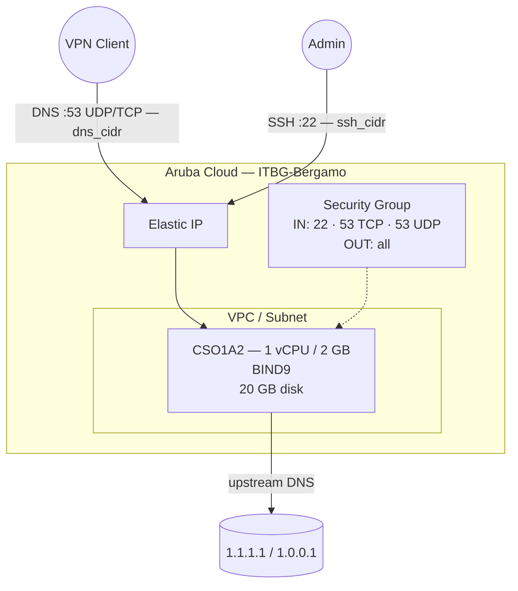

# Bind DNS su Aruba Cloud

Esegui il deployment di [BIND9](https://www.isc.org/bind/) — il software per server DNS più diffuso al mondo — su Aruba Cloud tramite Terraform e cloud-init. BIND9 è configurato come resolver ricorsivo con caching, con forwarder upstream configurabili e controllo degli accessi integrato.

> **Versione provider:** arubacloud/arubacloud `~> 0.5` | **Terraform:** ≥ 1.9

---

## Introduzione

BIND9 (Berkeley Internet Name Domain) è l'implementazione di riferimento del protocollo DNS e il server DNS autoritativo e ricorsivo più comunemente distribuito. Questo esempio esegue il provisioning di un resolver con caching con:

- **BIND9** installato dai pacchetti ufficiali di Ubuntu 22.04
- Configurato come **forwarder con caching** — le query vengono risolte tramite server upstream configurabili e memorizzate nella cache localmente
- **Controllo degli accessi** tramite sia il security group (`dns_cidr`) che le ACL `allow-query` / `allow-recursion` di BIND9 — doppia protezione contro l'abuso da open-resolver
- Porta 53 (UDP + TCP) per le query DNS
- Listener stub di `systemd-resolved` disabilitato in modo che BIND9 possa occupare la porta 53

> **Scelta tra server DNS:** Usa BIND9 quando hai bisogno di hosting DNS autoritativo, gestione complessa delle zone o firma DNSSEC. Per un semplice resolver con caching, considera [CoreDNS](coredns.md), [Pi-hole](pi-hole.md) o [AdGuard Home](adguard-home.md).

---

## Panoramica dell'architettura



---

## Infrastruttura creata

| Risorsa | Pattern del nome | Descrizione |
|---------|-----------------|-------------|
| `arubacloud_project` | `bind-prod` | Contenitore del progetto |
| `arubacloud_vpc` | `bind-prod-vpc` | Virtual Private Cloud |
| `arubacloud_subnet` | `bind-prod-subnet` | Subnet base |
| `arubacloud_securitygroup` | `bind-prod-vm-sg` | Security group |
| `arubacloud_securityrule` | `bind-prod-vm-ssh` | Regola ingress SSH |
| `arubacloud_securityrule` | `bind-prod-vm-dns-tcp` | Regola ingress DNS TCP 53 |
| `arubacloud_securityrule` | `bind-prod-vm-dns-udp` | Regola ingress DNS UDP 53 |
| `arubacloud_elasticip` | `bind-prod-vm-eip` | IP pubblico della VM |
| `arubacloud_blockstorage` | `bind-prod-boot` | Disco di boot da 20 GB (Performance) |
| `arubacloud_keypair` | `bind-prod-keypair` | Chiave pubblica SSH |
| `arubacloud_cloudserver` | `bind-prod-vm` | VM CloudServer |

---

## Costo mensile stimato

| Risorsa | Specifiche | Costo stimato/mese |
|---------|-----------|-------------------|
| VM CloudServer | CSO1A2 — 1 vCPU / 2 GB | ~€9 |
| Disco di boot | 20 GB Performance | ~€3 |
| Elastic IP | — | ~€3 |
| **Totale** | | **~€15/mese** |

---

## Requisiti

- Terraform ≥ 1.9
- ArubaCloud Terraform Provider `~> 0.5`
- Un account ArubaCloud con credenziali API OAuth2
- Una coppia di chiavi SSH

---

## Variabili

### Obbligatorie

| Variabile | Descrizione |
|-----------|-------------|
| `arubacloud_client_id` | Client ID OAuth2 di ArubaCloud |
| `arubacloud_client_secret` | Client secret OAuth2 di ArubaCloud |
| `ssh_public_key` | Contenuto della chiave pubblica SSH |

### Opzionali

| Variabile | Default | Descrizione |
|-----------|---------|-------------|
| `app_name` | `"bind"` | Nome breve usato in tutti i nomi delle risorse |
| `environment` | `"prod"` | Etichetta dell'ambiente |
| `location` | `"ITBG-Bergamo"` | Regione ArubaCloud |
| `zone` | `"ITBG-1"` | Zona di disponibilità |
| `billing_period` | `"Hour"` | `"Hour"` o `"Month"` |
| `vm_flavor` | `"CSO1A2"` | Flavor del CloudServer |
| `vm_image` | `"LU22-001"` | Immagine del disco di boot (Ubuntu 22.04 LTS) |
| `vm_disk_size_gb` | `20` | Dimensione del disco di boot in GB |
| `ssh_cidr` | `"0.0.0.0/0"` | CIDR per SSH |
| `dns_cidr` | `"0.0.0.0/0"` | CIDR per la porta DNS 53 — **limita sempre** |
| `upstream_dns_1` | `"1.1.1.1"` | Resolver upstream primario |
| `upstream_dns_2` | `"1.0.0.1"` | Resolver upstream secondario |

---

## Output

| Output | Descrizione |
|--------|-------------|
| `dns_server` | Indirizzo IP del server DNS |
| `vm_public_ip` | Indirizzo IP pubblico della VM |
| `ssh_command` | Comando SSH per connettersi alla VM |

---

## Istruzioni di deployment

### 1. Clona e naviga

```bash
git clone https://github.com/arubacloud/terraform-arubacloud-examples.git
cd terraform-arubacloud-examples/bind-dns
```

### 2. Configura le variabili

```bash
cp terraform.tfvars.example terraform.tfvars
```

**Limita sempre `dns_cidr`** per evitare che il tuo server venga usato come open resolver:

```hcl
dns_cidr = "10.8.0.0/24"       # CIDR del tunnel WireGuard
ssh_cidr = "203.0.113.42/32"
```

### 3. Esegui il deployment

```bash
terraform init
terraform plan
terraform apply
```

Il bootstrap richiede circa **1–2 minuti**.

### 4. Testa e configura i client

```bash
dig @$(terraform output -raw dns_server) google.com
```

Imposta l'IP in output come server DNS sui tuoi client VPN o dispositivi di rete.

---

## Personalizzazione

La configurazione di BIND9 si trova in `/etc/bind/named.conf.options`. Ricarica dopo le modifiche:

```bash
sudo named-checkconf && sudo systemctl reload bind9
```

### Aggiungi una zona autoritativa

Crea un file di zona e aggiungilo a `/etc/bind/named.conf.local`:

```text
zone "example.internal" {
    type master;
    file "/etc/bind/db.example.internal";
};
```

Quindi crea `/etc/bind/db.example.internal`:

```text
$TTL 300
@   IN  SOA ns1.example.internal. admin.example.internal. (
            2024010101 ; Serial
            3600       ; Refresh
            1800       ; Retry
            604800     ; Expire
            300 )      ; Minimum TTL

@       IN  NS  ns1.example.internal.
ns1     IN  A   <vm-ip>
host1   IN  A   10.0.0.1
```

### Abilita la validazione DNSSEC

La validazione DNSSEC è già abilitata (`dnssec-validation auto`). Per firmare anche le tue zone, installa `dnssec-tools` e segui la [guida DNSSEC di BIND9](https://bind9.readthedocs.io/en/latest/dnssec-guide.html).

---

## Risoluzione dei problemi

### BIND9 non risponde

```bash
sudo systemctl status bind9
sudo named-checkconf
sudo journalctl -u named -n 30
sudo ss -ulnp | grep :53
sudo ss -tlnp | grep :53
```

### Porta 53 in uso dopo l'installazione

```bash
sudo ss -ulnp sport = :53
grep DNSStubListener /etc/systemd/resolved.conf
sudo systemctl restart systemd-resolved && sudo systemctl restart bind9
```

### Test dal client

```bash
dig @<vm-ip> google.com
dig @<vm-ip> google.com AAAA
nslookup google.com <vm-ip>
```

---

## Riferimenti

- [Documentazione BIND9](https://bind9.readthedocs.io)
- [Download ISC BIND9](https://www.isc.org/bind/)
- [Esempio WireGuard](wireguard.md)
- [Esempio CoreDNS](coredns.md)
- [Provider Terraform ArubaCloud](https://registry.terraform.io/providers/arubacloud/arubacloud/latest/docs)
