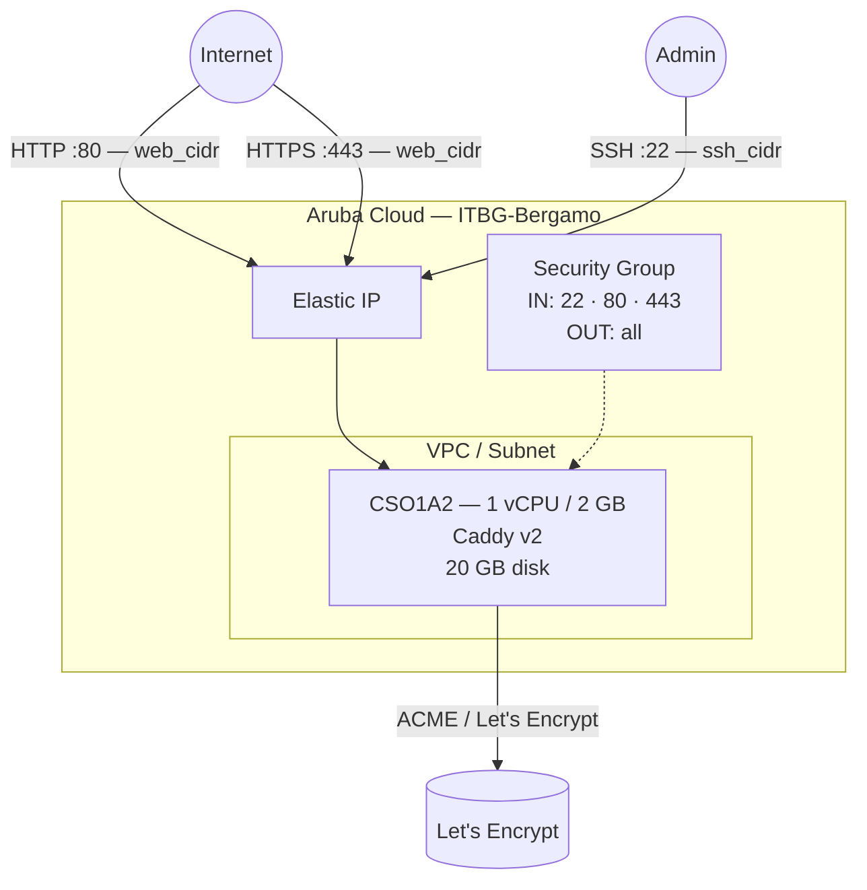

# Caddy su Aruba Cloud

Esegui il deployment di [Caddy](https://caddyserver.com) — un web server moderno con HTTPS automatico e configurazione zero — su Aruba Cloud tramite Terraform e cloud-init. Caddy ottiene e rinnova automaticamente i certificati Let's Encrypt quando viene fornito un nome di dominio, senza bisogno di certbot o rinnovi manuali.

> **Versione provider:** arubacloud/arubacloud `~> 0.5` | **Terraform:** ≥ 1.9

---

## Introduzione

Caddy v2 è un server HTTP pronto per la produzione che gestisce nativamente il ciclo di vita dei certificati TLS. A differenza di NGINX, non sono necessari certbot, cron job o hook di rinnovo — Caddy gestisce i certificati automaticamente. Questo esempio esegue il provisioning di un'istanza Caddy con:

- Caddy installato dal **repository apt ufficiale** (sempre aggiornato)
- Un **sito HTML statico** predefinito servito da `/var/www/html`
- Porte 80 (HTTP) e 443 (HTTPS) aperte a `web_cidr`
- **HTTPS automatico** tramite Let's Encrypt quando `domain` è impostato — HTTP reindirizza automaticamente a HTTPS
- Rinnovo dei certificati gestito da Caddy in background

> **Nota:** Senza `domain`, Caddy serve solo HTTP sulla porta 80. Imposta `domain` su un nome DNS che punta alla VM per abilitare HTTPS automatico — nessun'altra configurazione è necessaria.

---

## Panoramica dell'architettura



---

## Infrastruttura creata

| Risorsa | Pattern del nome | Descrizione |
|---------|-----------------|-------------|
| `arubacloud_project` | `caddy-prod` | Contenitore del progetto |
| `arubacloud_vpc` | `caddy-prod-vpc` | Virtual Private Cloud |
| `arubacloud_subnet` | `caddy-prod-subnet` | Subnet base |
| `arubacloud_securitygroup` | `caddy-prod-vm-sg` | Security group |
| `arubacloud_securityrule` | `caddy-prod-vm-ssh` | Regola ingress SSH |
| `arubacloud_securityrule` | `caddy-prod-vm-http` | Regola ingress HTTP TCP 80 |
| `arubacloud_securityrule` | `caddy-prod-vm-https` | Regola ingress HTTPS TCP 443 |
| `arubacloud_elasticip` | `caddy-prod-vm-eip` | IP pubblico della VM |
| `arubacloud_blockstorage` | `caddy-prod-boot` | Disco di boot da 20 GB (Performance) |
| `arubacloud_keypair` | `caddy-prod-keypair` | Chiave pubblica SSH |
| `arubacloud_cloudserver` | `caddy-prod-vm` | VM CloudServer |

---

## Costo mensile stimato

| Risorsa | Specifiche | Costo stimato/mese |
|---------|-----------|-------------------|
| VM CloudServer | CSO1A2 — 1 vCPU / 2 GB | ~€9 |
| Disco di boot | 20 GB Performance | ~€3 |
| Elastic IP | — | ~€3 |
| **Totale** | | **~€15/mese** |

---

## Requisiti

- Terraform ≥ 1.9
- ArubaCloud Terraform Provider `~> 0.5`
- Un account ArubaCloud con credenziali API OAuth2
- Una coppia di chiavi SSH
- (Per HTTPS) Un nome di dominio con un record A che punta all'Elastic IP della VM

---

## Variabili

### Obbligatorie

| Variabile | Descrizione |
|-----------|-------------|
| `arubacloud_client_id` | Client ID OAuth2 di ArubaCloud |
| `arubacloud_client_secret` | Client secret OAuth2 di ArubaCloud |
| `ssh_public_key` | Contenuto della chiave pubblica SSH |

### Opzionali

| Variabile | Default | Descrizione |
|-----------|---------|-------------|
| `app_name` | `"caddy"` | Nome breve usato in tutti i nomi delle risorse |
| `environment` | `"prod"` | Etichetta dell'ambiente |
| `location` | `"ITBG-Bergamo"` | Regione ArubaCloud |
| `zone` | `"ITBG-1"` | Zona di disponibilità |
| `billing_period` | `"Hour"` | `"Hour"` o `"Month"` |
| `vm_flavor` | `"CSO1A2"` | Flavor del CloudServer |
| `vm_image` | `"LU22-001"` | Immagine del disco di boot (Ubuntu 22.04 LTS) |
| `vm_disk_size_gb` | `20` | Dimensione del disco di boot in GB |
| `ssh_cidr` | `"0.0.0.0/0"` | CIDR per SSH — limita in produzione |
| `web_cidr` | `"0.0.0.0/0"` | CIDR per HTTP/HTTPS |
| `domain` | `""` | Dominio per HTTPS automatico con Let's Encrypt (il DNS deve puntare alla VM prima) |

---

## Output

| Output | Descrizione |
|--------|-------------|
| `http_url` | URL HTTP del web server |
| `https_url` | URL HTTPS (valido solo quando `domain` è impostato e il certificato è emesso) |
| `vm_public_ip` | Indirizzo IP pubblico della VM |
| `ssh_command` | Comando SSH per connettersi alla VM |

---

## Istruzioni di deployment

### 1. Clona e naviga

```bash
git clone https://github.com/arubacloud/terraform-arubacloud-examples.git
cd terraform-arubacloud-examples/caddy
```

### 2. Configura le variabili

```bash
cp terraform.tfvars.example terraform.tfvars
```

Per solo HTTP, sono necessarie solo le credenziali e la chiave SSH. Per HTTPS automatico:

```hcl
domain = "example.com"
```

> **Importante:** Il record DNS A per `domain` deve già puntare all'Elastic IP della VM prima che Caddy possa ottenere un certificato. Ottieni prima l'IP (`terraform apply` senza `domain`), imposta il tuo record DNS, quindi ri-applica con `domain` impostato.

### 3. Esegui il deployment

```bash
terraform init
terraform plan
terraform apply
```

Il bootstrap richiede circa **2–3 minuti**. L'emissione del certificato avviene automaticamente in background una volta che il DNS si propaga.

### 4. Accedi al sito

```bash
terraform output http_url
```

---

## Caddy vs NGINX

| Funzionalità | Caddy | NGINX |
|-------------|-------|-------|
| HTTPS automatico | Integrato, configurazione zero | Richiede certbot + cron |
| Rinnovo certificati | Automatico | Manuale o tramite timer systemd |
| Sintassi di configurazione | Caddyfile semplice | nginx.conf (più verboso) |
| Prestazioni | Elevate | Più elevate (minore overhead di memoria) |
| Plugin / moduli | Tramite build `xcaddy` | Tramite moduli in fase di compilazione |

Scegli **Caddy** per semplicità d'uso e TLS senza intervento manuale. Scegli **NGINX** se hai bisogno di un controllo granulare della configurazione o hai già una configurazione NGINX esistente.

---

## Personalizzazione

### Reverse proxy

Modifica `/etc/caddy/Caddyfile` sulla VM:

```caddyfile
example.com {
    reverse_proxy localhost:8080
}
```

Ricarica: `sudo systemctl reload caddy`

### Siti multipli

```caddyfile
site1.example.com {
    root * /var/www/site1
    file_server
}

site2.example.com {
    reverse_proxy localhost:3000
}
```

Caddy ottiene automaticamente un certificato per ogni dominio.

---

## Risoluzione dei problemi

### Caddy non si avvia

```bash
sudo systemctl status caddy
sudo journalctl -u caddy -n 30
sudo caddy validate --config /etc/caddy/Caddyfile
```

### Certificato non emesso

```bash
sudo journalctl -u caddy | grep -i acme
```

Cause comuni: record DNS A non propagato, porta 80 bloccata da `web_cidr`, o variabile `domain` errata. Caddy riprova automaticamente — controlla i log ogni pochi minuti.

---

## Riferimenti

- [Documentazione Caddy](https://caddyserver.com/docs/)
- [Guida rapida Caddyfile](https://caddyserver.com/docs/quick-starts/caddyfile)
- [Release di Caddy su GitHub](https://github.com/caddyserver/caddy/releases)
- [Provider Terraform ArubaCloud](https://registry.terraform.io/providers/arubacloud/arubacloud/latest/docs)
