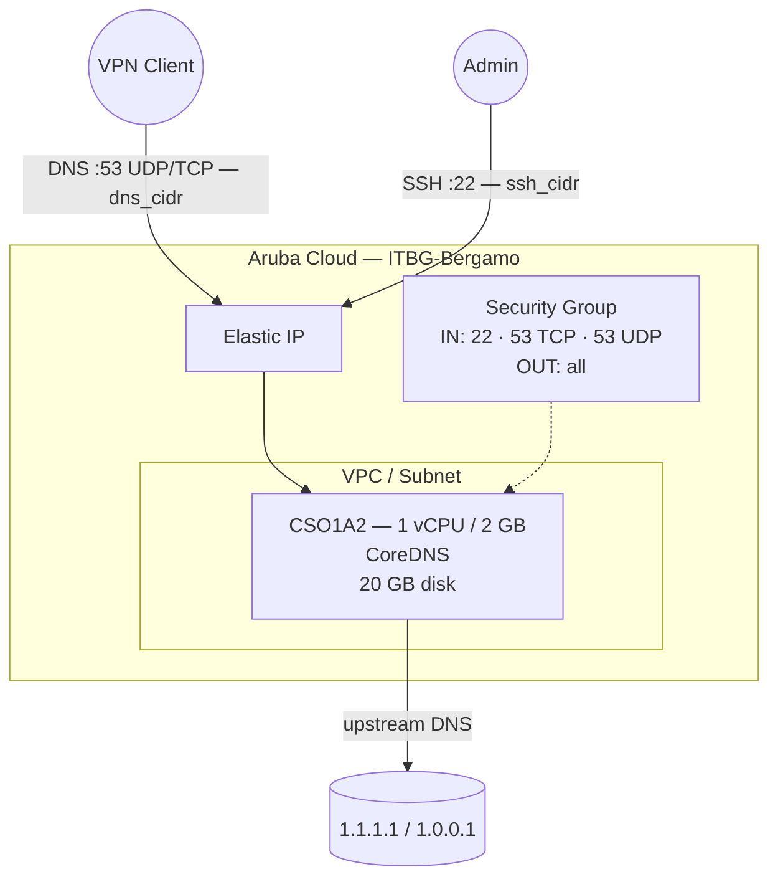

# CoreDNS su Aruba Cloud

Esegui il deployment di [CoreDNS](https://coredns.io) — un server DNS veloce, flessibile e cloud-native — su Aruba Cloud tramite Terraform e cloud-init. CoreDNS è configurato come forwarder DNS con caching, ideale come resolver privato all'interno di una rete VPN.

> **Versione provider:** arubacloud/arubacloud `~> 0.5` | **Terraform:** ≥ 1.9

---

## Introduzione

CoreDNS è un server DNS leggero scritto in Go, usato come server DNS predefinito in Kubernetes e ampiamente adottato come resolver privato. Questo esempio esegue il provisioning di un'istanza CoreDNS configurata come forwarder con caching con:

- CoreDNS installato dal **binario ufficiale di GitHub** (binario singolo, senza dipendenze)
- Porta 53 (UDP + TCP) per le query DNS
- Resolver upstream configurabili (default Cloudflare)
- Cache DNS da 30 secondi per ridurre il carico upstream
- Log delle query e segnalazione degli errori abilitati
- Esecuzione come utente di sistema `coredns` senza privilegi

> **Best practice:** Abbinalo all'esempio [WireGuard](wireguard.md). Imposta `dns_cidr` sul CIDR del tuo tunnel WireGuard e configura i client VPN sull'IP CoreDNS per un resolver privato con caching.

---

## Panoramica dell'architettura



---

## Infrastruttura creata

| Risorsa | Pattern del nome | Descrizione |
|---------|-----------------|-------------|
| `arubacloud_project` | `coredns-prod` | Contenitore del progetto |
| `arubacloud_vpc` | `coredns-prod-vpc` | Virtual Private Cloud |
| `arubacloud_subnet` | `coredns-prod-subnet` | Subnet base |
| `arubacloud_securitygroup` | `coredns-prod-vm-sg` | Security group |
| `arubacloud_securityrule` | `coredns-prod-vm-ssh` | Regola ingress SSH |
| `arubacloud_securityrule` | `coredns-prod-vm-dns-tcp` | Regola ingress DNS TCP 53 |
| `arubacloud_securityrule` | `coredns-prod-vm-dns-udp` | Regola ingress DNS UDP 53 |
| `arubacloud_elasticip` | `coredns-prod-vm-eip` | IP pubblico della VM |
| `arubacloud_blockstorage` | `coredns-prod-boot` | Disco di boot da 20 GB (Performance) |
| `arubacloud_keypair` | `coredns-prod-keypair` | Chiave pubblica SSH |
| `arubacloud_cloudserver` | `coredns-prod-vm` | VM CloudServer |

---

## Costo mensile stimato

| Risorsa | Specifiche | Costo stimato/mese |
|---------|-----------|-------------------|
| VM CloudServer | CSO1A2 — 1 vCPU / 2 GB | ~€9 |
| Disco di boot | 20 GB Performance | ~€3 |
| Elastic IP | — | ~€3 |
| **Totale** | | **~€15/mese** |

---

## Requisiti

- Terraform ≥ 1.9
- ArubaCloud Terraform Provider `~> 0.5`
- Un account ArubaCloud con credenziali API OAuth2
- Una coppia di chiavi SSH

---

## Variabili

### Obbligatorie

| Variabile | Descrizione |
|-----------|-------------|
| `arubacloud_client_id` | Client ID OAuth2 di ArubaCloud |
| `arubacloud_client_secret` | Client secret OAuth2 di ArubaCloud |
| `ssh_public_key` | Contenuto della chiave pubblica SSH |

### Opzionali

| Variabile | Default | Descrizione |
|-----------|---------|-------------|
| `app_name` | `"coredns"` | Nome breve usato in tutti i nomi delle risorse |
| `environment` | `"prod"` | Etichetta dell'ambiente |
| `location` | `"ITBG-Bergamo"` | Regione ArubaCloud |
| `zone` | `"ITBG-1"` | Zona di disponibilità |
| `billing_period` | `"Hour"` | `"Hour"` o `"Month"` |
| `vm_flavor` | `"CSO1A2"` | Flavor del CloudServer |
| `vm_image` | `"LU22-001"` | Immagine del disco di boot (Ubuntu 22.04 LTS) |
| `vm_disk_size_gb` | `20` | Dimensione del disco di boot in GB |
| `ssh_cidr` | `"0.0.0.0/0"` | CIDR per SSH |
| `dns_cidr` | `"0.0.0.0/0"` | CIDR per la porta DNS 53 — **limita al CIDR del tuo tunnel VPN** |
| `upstream_dns_1` | `"1.1.1.1"` | Resolver upstream primario |
| `upstream_dns_2` | `"1.0.0.1"` | Resolver upstream secondario |
| `coredns_version` | `"1.11.3"` | Versione di CoreDNS |

---

## Output

| Output | Descrizione |
|--------|-------------|
| `dns_server` | Indirizzo IP del server DNS |
| `vm_public_ip` | Indirizzo IP pubblico della VM |
| `ssh_command` | Comando SSH per connettersi alla VM |

---

## Istruzioni di deployment

### 1. Clona e naviga

```bash
git clone https://github.com/arubacloud/terraform-arubacloud-examples.git
cd terraform-arubacloud-examples/coredns
```

### 2. Configura le variabili

```bash
cp terraform.tfvars.example terraform.tfvars
```

In produzione, limita l'accesso DNS al tuo tunnel VPN:

```hcl
dns_cidr = "10.8.0.0/24"       # CIDR del tunnel WireGuard
ssh_cidr = "203.0.113.42/32"
```

### 3. Esegui il deployment

```bash
terraform init
terraform plan
terraform apply
```

Il bootstrap richiede circa **2–3 minuti**.

### 4. Configura i client su CoreDNS

```bash
terraform output dns_server
```

Imposta l'IP in output come server DNS sui tuoi client WireGuard o dispositivi di rete.

---

## Personalizzazione

Il Corefile in `/etc/coredns/Corefile` controlla tutto il comportamento. Modificalo e ricarica CoreDNS:

```bash
sudo systemctl reload coredns
```

### Aggiungi una zona DNS locale

```caddyfile
example.internal {
    file /etc/coredns/db.example.internal
    log
    errors
}

. {
    forward . 1.1.1.1 1.0.0.1
    cache 30
    log
    errors
}
```

### Abilita la validazione DNSSEC

```caddyfile
. {
    forward . 1.1.1.1 1.0.0.1 {
        policy sequential
    }
    dnssec
    cache 30
    log
    errors
}
```

### Abilita DNS-over-TLS upstream

```caddyfile
. {
    forward . tls://1.1.1.1 tls://1.0.0.1 {
        tls_servername cloudflare-dns.com
        health_check 5s
    }
    cache 30
    log
    errors
}
```

---

## Risoluzione dei problemi

### CoreDNS non risponde

```bash
sudo systemctl status coredns
sudo journalctl -u coredns -n 30
# Verifica che la porta 53 sia in ascolto:
sudo ss -ulnp | grep :53
sudo ss -tlnp | grep :53
```

### Porta 53 già in uso

```bash
sudo ss -ulnp sport = :53
cat /etc/systemd/resolved.conf | grep DNSStubListener
sudo systemctl restart systemd-resolved
sudo systemctl restart coredns
```

### Test della risoluzione DNS

```bash
dig @<vm-ip> google.com
dig @<vm-ip> google.com A
```

---

## Riferimenti

- [Documentazione CoreDNS](https://coredns.io/manual/toc/)
- [Riferimento Corefile](https://coredns.io/plugins/)
- [Release di CoreDNS su GitHub](https://github.com/coredns/coredns/releases)
- [Esempio WireGuard](wireguard.md)
- [Provider Terraform ArubaCloud](https://registry.terraform.io/providers/arubacloud/arubacloud/latest/docs)
