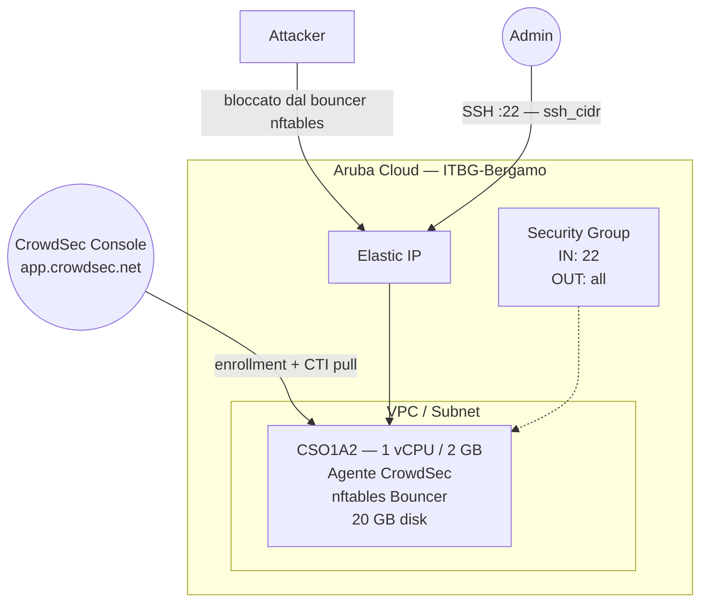

# CrowdSec su Aruba Cloud

Esegui il deployment di [CrowdSec](https://www.crowdsec.net/) — threat intelligence collaborativa e prevenzione delle intrusioni — su Aruba Cloud tramite Terraform e cloud-init. Installa l'agente CrowdSec e il firewall bouncer dal repository ufficiale con collection configurabili e registrazione opzionale alla CrowdSec Console.

> **Versione provider:** arubacloud/arubacloud `~> 0.5` | **Terraform:** ≥ 1.9

---

## Introduzione

CrowdSec è un agente di sicurezza leggero e open-source che analizza i log in tempo reale usando scenari comportamentali e blocca gli IP malevoli tramite bouncer. La community condivide l'intelligence sulle minacce tramite la CrowdSec Console, rendendola un IDS/IPS collaborativo. Questo esempio esegue il provisioning di:

- **Agente CrowdSec** installato dal repository di pacchetti ufficiale
- **Firewall bouncer** (`crowdsec-firewall-bouncer-nftables`) per applicare i blocchi a livello OS
- **Collection** configurabili (parser + scenari per SSH, Linux, nginx, ecc.)
- **Registrazione opzionale alla CrowdSec Console** per gestione centralizzata e intelligence dalla community

> **Caso d'uso tipico:** distribuisci CrowdSec come componente aggiuntivo su server che eseguono Nginx, Apache o Traefik aggiungendo la collection rilevante — oppure distribuiscilo autonomamente come gateway di sicurezza dedicato con firewall bouncer.

---

## Panoramica dell'architettura



---

## Infrastruttura creata

| Risorsa | Pattern del nome | Descrizione |
|---------|-----------------|-------------|
| `arubacloud_project` | `cs-prod` | Contenitore del progetto |
| `arubacloud_vpc` | `cs-prod-vpc` | Virtual Private Cloud |
| `arubacloud_subnet` | `cs-prod-subnet` | Subnet base |
| `arubacloud_securitygroup` | `cs-prod-vm-sg` | Security group |
| `arubacloud_securityrule` | `cs-prod-vm-ssh` | Regola ingress SSH |
| `arubacloud_elasticip` | `cs-prod-vm-eip` | IP pubblico della VM |
| `arubacloud_blockstorage` | `cs-prod-boot` | Disco di boot da 20 GB (Performance) |
| `arubacloud_keypair` | `cs-prod-keypair` | Chiave pubblica SSH |
| `arubacloud_cloudserver` | `cs-prod-vm` | VM CloudServer |

---

## Costo mensile stimato

| Risorsa | Specifiche | Costo stimato/mese |
|---------|-----------|-------------------|
| VM CloudServer | CSO1A2 — 1 vCPU / 2 GB | ~€8 |
| Disco di boot | 20 GB Performance | ~€3 |
| Elastic IP | — | ~€3 |
| **Totale** | | **~€14/mese** |

---

## Requisiti

- Terraform ≥ 1.9
- ArubaCloud Terraform Provider `~> 0.5`
- Un account ArubaCloud con credenziali API OAuth2
- Una coppia di chiavi SSH
- (Opzionale) Un account [CrowdSec Console](https://app.crowdsec.net/) per la registrazione

---

## Variabili

### Obbligatorie

| Variabile | Descrizione |
|-----------|-------------|
| `arubacloud_client_id` | Client ID OAuth2 di ArubaCloud |
| `arubacloud_client_secret` | Client secret OAuth2 di ArubaCloud |
| `ssh_public_key` | Contenuto della chiave pubblica SSH |

### Opzionali

| Variabile | Default | Descrizione |
|-----------|---------|-------------|
| `app_name` | `"cs"` | Nome breve usato in tutti i nomi delle risorse |
| `environment` | `"prod"` | Etichetta dell'ambiente |
| `location` | `"ITBG-Bergamo"` | Regione ArubaCloud |
| `zone` | `"ITBG-1"` | Zona di disponibilità |
| `billing_period` | `"Hour"` | `"Hour"` o `"Month"` |
| `vm_flavor` | `"CSO1A2"` | Flavor del CloudServer |
| `vm_image` | `"LU22-001"` | Immagine del disco di boot (Ubuntu 22.04 LTS) |
| `vm_disk_size_gb` | `20` | Dimensione del disco di boot in GB |
| `ssh_cidr` | `"0.0.0.0/0"` | CIDR per SSH |
| `enroll_key` | `""` | Chiave di registrazione alla CrowdSec Console (da app.crowdsec.net) |
| `collections` | `["crowdsecurity/linux", "crowdsecurity/sshd"]` | Collection da installare |

---

## Output

| Output | Descrizione |
|--------|-------------|
| `vm_public_ip` | Indirizzo IP pubblico della VM |
| `ssh_command` | Comando SSH per connettersi alla VM |
| `cscli_status` | Comando per verificare lo stato di CrowdSec da remoto |

---

## Istruzioni di deployment

### 1. Clona e naviga

```bash
git clone https://github.com/arubacloud/terraform-arubacloud-examples.git
cd terraform-arubacloud-examples/crowdsec
```

### 2. Configura le variabili

```bash
cp terraform.tfvars.example terraform.tfvars
```

Aggiungi la tua chiave di registrazione e le collection:

```hcl
enroll_key  = "your-console-enrollment-key"
collections = ["crowdsecurity/linux", "crowdsecurity/sshd", "crowdsecurity/nginx"]
```

### 3. Esegui il deployment

```bash
terraform init
terraform plan
terraform apply
```

Il bootstrap richiede circa **2–3 minuti**.

### 4. Verifica

```bash
ssh ubuntu@$(terraform output -raw vm_public_ip)
sudo cscli version
sudo cscli collections list
sudo cscli decisions list
```

---

## Aggiunta di CrowdSec a un server esistente

CrowdSec è più potente quando distribuito insieme ai servizi che protegge. Per proteggere un server Nginx, aggiungi la collection:

```bash
sudo cscli collections install crowdsecurity/nginx
sudo systemctl reload crowdsec
```

Quindi configura Nginx per scrivere i log di accesso nel percorso monitorato da CrowdSec (`/var/log/nginx/access.log`).

---

## Collection disponibili

```bash
# Cerca le collection disponibili
sudo cscli hub list
sudo cscli collections list -a

# Collection comuni
sudo cscli collections install crowdsecurity/linux          # scenari base Linux
sudo cscli collections install crowdsecurity/sshd           # protezione brute-force SSH
sudo cscli collections install crowdsecurity/nginx          # parsing log Nginx
sudo cscli collections install crowdsecurity/apache2        # parsing log Apache
sudo cscli collections install crowdsecurity/traefik        # parsing log Traefik
sudo cscli collections install crowdsecurity/wordpress      # scenari di attacco WordPress
```

---

## Risoluzione dei problemi

### CrowdSec non rileva gli attacchi

```bash
sudo cscli metrics
# Verifica che le sorgenti di acquisizione rilevanti siano configurate
cat /etc/crowdsec/acquis.yaml
# Segui i log
sudo journalctl -u crowdsec -f
```

### Il firewall bouncer non blocca

```bash
sudo systemctl status crowdsec-firewall-bouncer
# Controlla le regole nftables
sudo nft list ruleset
```

---

## Riferimenti

- [Documentazione CrowdSec](https://docs.crowdsec.net/)
- [Hub CrowdSec (collection)](https://hub.crowdsec.net/)
- [CrowdSec Console](https://app.crowdsec.net/)
- [Provider Terraform ArubaCloud](https://registry.terraform.io/providers/arubacloud/arubacloud/latest/docs)
