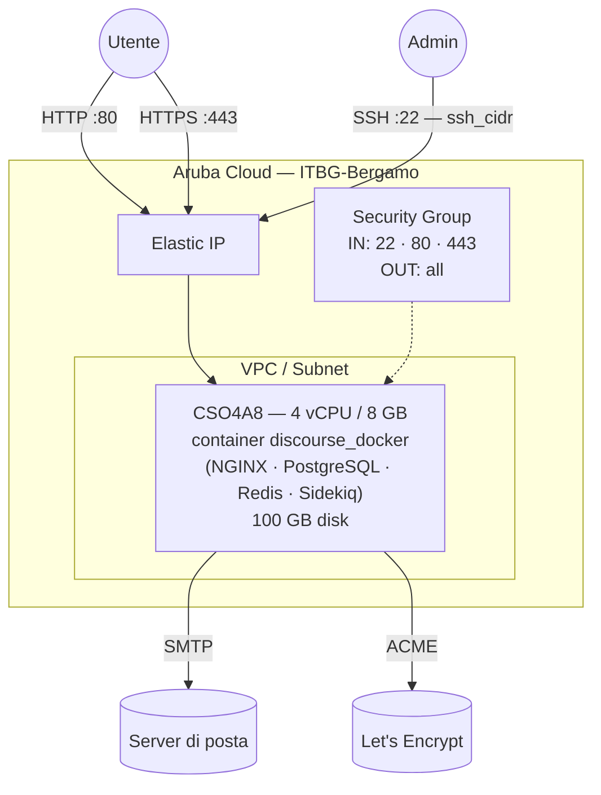

# Discourse su Aruba Cloud

Esegui il deployment di [Discourse](https://www.discourse.org) — la piattaforma forum community open-source leader — su Aruba Cloud tramite Terraform e cloud-init. Discourse viene installato tramite il launcher ufficiale `discourse_docker`, che raggruppa PostgreSQL, Redis e NGINX all'interno di un singolo container gestito.

> **Versione provider:** arubacloud/arubacloud `~> 0.5` | **Terraform:** ≥ 1.9

---

## Introduzione

Discourse è una piattaforma di discussione moderna e ottimizzata per mobile, utilizzata da migliaia di progetti open-source e community. Questo esempio usa l'**installazione ufficiale basata su Docker** — l'unico metodo supportato dal team Discourse per la produzione — che esegue il provisioning di:

- Launcher **discourse_docker** clonato dal repository GitHub ufficiale
- **PostgreSQL, Redis, NGINX e Sidekiq** inclusi nel container Discourse
- Configurazione SMTP per le email in uscita (necessaria per la registrazione degli utenti)
- Porte 80 e 443 aperte a internet
- Dominio opzionale con SSL tramite Let's Encrypt (automatico nel container quando `hostname` è un dominio reale)

> **Tempo di bootstrap:** Il launcher costruisce un'immagine Docker dal sorgente la prima volta. Prevedi **20–30 minuti** prima che il forum sia accessibile.
>
> **L'email è obbligatoria.** Discourse usa l'email per la conferma dell'account. Configura SMTP prima del deployment — le registrazioni senza email funzionante falliranno.

---

## Panoramica dell'architettura



---

## Infrastruttura creata

| Risorsa | Pattern del nome | Descrizione |
|---------|-----------------|-------------|
| `arubacloud_project` | `discourse-prod` | Contenitore del progetto |
| `arubacloud_vpc` | `discourse-prod-vpc` | Virtual Private Cloud |
| `arubacloud_subnet` | `discourse-prod-subnet` | Subnet base |
| `arubacloud_securitygroup` | `discourse-prod-vm-sg` | Security group |
| `arubacloud_securityrule` | `discourse-prod-vm-ssh` | Regola ingress SSH |
| `arubacloud_securityrule` | `discourse-prod-vm-http` | Regola ingress HTTP TCP 80 |
| `arubacloud_securityrule` | `discourse-prod-vm-https` | Regola ingress HTTPS TCP 443 |
| `arubacloud_elasticip` | `discourse-prod-vm-eip` | IP pubblico della VM |
| `arubacloud_blockstorage` | `discourse-prod-boot` | Disco di boot da 100 GB (Performance) |
| `arubacloud_keypair` | `discourse-prod-keypair` | Chiave pubblica SSH |
| `arubacloud_cloudserver` | `discourse-prod-vm` | VM CloudServer |

---

## Costo mensile stimato

| Risorsa | Specifiche | Costo stimato/mese |
|---------|-----------|-------------------|
| VM CloudServer | CSO4A8 — 4 vCPU / 8 GB | ~€35 |
| Disco di boot | 100 GB Performance | ~€15 |
| Elastic IP | — | ~€3 |
| **Totale** | | **~€53/mese** |

---

## Requisiti

- Terraform ≥ 1.9
- ArubaCloud Terraform Provider `~> 0.5`
- Un account ArubaCloud con credenziali API OAuth2
- Una coppia di chiavi SSH
- Un server SMTP per le email in uscita (Gmail App Password, Mailgun, ecc.)
- (Consigliato) Un nome di dominio con un record A che punta all'Elastic IP della VM

---

## Variabili

### Obbligatorie

| Variabile | Descrizione |
|-----------|-------------|
| `arubacloud_client_id` | Client ID OAuth2 di ArubaCloud |
| `arubacloud_client_secret` | Client secret OAuth2 di ArubaCloud |
| `ssh_public_key` | Contenuto della chiave pubblica SSH |
| `admin_email` | Email per l'account admin iniziale di Discourse |
| `smtp_host` | Hostname del server SMTP |
| `smtp_user` | Nome utente di login SMTP |
| `smtp_password` | Password di login SMTP |

### Opzionali

| Variabile | Default | Descrizione |
|-----------|---------|-------------|
| `app_name` | `"discourse"` | Nome breve usato in tutti i nomi delle risorse |
| `environment` | `"prod"` | Etichetta dell'ambiente |
| `location` | `"ITBG-Bergamo"` | Regione ArubaCloud |
| `zone` | `"ITBG-1"` | Zona di disponibilità |
| `billing_period` | `"Hour"` | `"Hour"` o `"Month"` |
| `vm_flavor` | `"CSO4A8"` | Flavor del CloudServer |
| `vm_image` | `"LU22-001"` | Immagine del disco di boot (Ubuntu 22.04 LTS) |
| `vm_disk_size_gb` | `100` | Dimensione del disco di boot in GB (min 40 GB) |
| `ssh_cidr` | `"0.0.0.0/0"` | CIDR per SSH |
| `web_cidr` | `"0.0.0.0/0"` | CIDR per HTTP/HTTPS |
| `hostname` | auto | Nome di dominio (default: IP Elastico della VM) |
| `smtp_port` | `587` | Porta SMTP |

---

## Output

| Output | Descrizione |
|--------|-------------|
| `site_url` | URL del sito Discourse |
| `vm_public_ip` | Indirizzo IP pubblico della VM |
| `ssh_command` | Comando SSH per connettersi alla VM |

---

## Istruzioni di deployment

### 1. Clona e naviga

```bash
git clone https://github.com/arubacloud/terraform-arubacloud-examples.git
cd terraform-arubacloud-examples/discourse
```

### 2. Configura le variabili

```bash
cp terraform.tfvars.example terraform.tfvars
```

Imposta credenziali, email admin, impostazioni SMTP e opzionalmente un dominio:

```hcl
admin_email   = "admin@example.com"
hostname      = "forum.example.com"   # ometti per usare l'IP Elastico
smtp_host     = "smtp.gmail.com"
smtp_port     = 587
smtp_user     = "you@gmail.com"
smtp_password = "your-app-password"
```

> Per Gmail, crea una **App Password** (non la password del tuo account) su <https://myaccount.google.com/apppasswords>.

### 3. Esegui il deployment

```bash
terraform init
terraform plan
terraform apply
```

> `terraform apply` termina rapidamente (VM provisioning in ~2 min). Il bootstrap di Discourse continua in background per 20–30 minuti. Monitora il progresso:
>
> ```bash
> ssh ubuntu@$(terraform output -raw vm_public_ip)
> sudo tail -f /var/log/discourse-bootstrap.log
> ```

### 4. Crea l'account admin

```bash
terraform output site_url
```

Visita l'URL e **registrati con lo stesso indirizzo email** impostato in `admin_email`. Discourse concede automaticamente i diritti di amministratore al primo utente che si registra con quella email.

---

## Abilitazione HTTPS (Let's Encrypt)

Quando `hostname` è impostato su un dominio reale:

1. Crea un record DNS A: `forum.example.com → <vm_public_ip>`
2. Imposta `hostname = "forum.example.com"` in `terraform.tfvars`
3. Ri-applica — Discourse ottiene automaticamente un certificato Let's Encrypt al bootstrap

Nessuna configurazione aggiuntiva è necessaria; il launcher discourse_docker gestisce ACME automaticamente.

---

## Aggiornamento di Discourse

Discourse fornisce aggiornamenti frequenti. Per aggiornare:

```bash
ssh ubuntu@$(terraform output -raw vm_public_ip)
cd /var/discourse
git pull
./launcher rebuild app
```

Il comando `rebuild` scarica l'immagine più recente e riavvia il container senza downtime per il database.

---

## Risoluzione dei problemi

### Forum non accessibile dopo 30 minuti

```bash
ssh ubuntu@$(terraform output -raw vm_public_ip)
sudo tail -50 /var/log/discourse-bootstrap.log
cd /var/discourse && ./launcher logs app
```

### Email non inviate

Verifica la connettività SMTP dalla VM:

```bash
nc -zv smtp.gmail.com 587
```

Poi dal pannello admin di Discourse: **Admin → Email → Test Email**.

---

## Riferimenti

- [Guida ufficiale all'installazione di Discourse](https://github.com/discourse/discourse/blob/main/docs/INSTALL-cloud.md)
- [Repository discourse_docker](https://github.com/discourse/discourse_docker)
- [Documentazione Discourse](https://meta.discourse.org)
- [Provider Terraform ArubaCloud](https://registry.terraform.io/providers/arubacloud/arubacloud/latest/docs)
