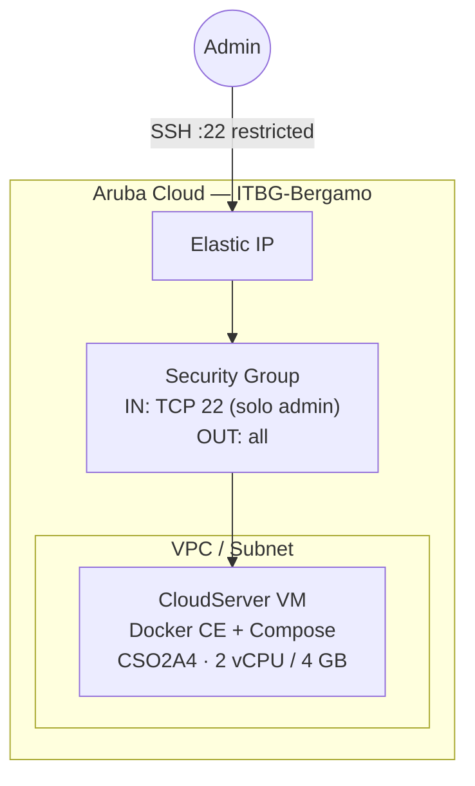

# Docker Host su Aruba Cloud

Esegui il provisioning di una VM CloudServer con Docker CE e Docker Compose pronti all'uso. È la base per eseguire qualsiasi workload containerizzato su Aruba Cloud quando un esempio più specifico non soddisfa le tue esigenze.

> **Versione provider:** arubacloud/arubacloud `~> 0.5` | **Terraform:** ≥ 1.9

---

## Introduzione

Questo esempio crea una VM Ubuntu 22.04 pulita con Docker Engine installato dal repository APT ufficiale di Docker. Puoi immediatamente scaricare immagini, eseguire container e usare Docker Compose — tutto tramite SSH o un contesto Docker remoto.

Usa questo come punto di partenza per:

- Eseguire stack Docker Compose non coperti dagli altri esempi
- Testare immagini container in un ambiente Aruba Cloud isolato
- Configurare un agente di build Docker privato

---

## Panoramica dell'architettura



---

## Infrastruttura creata

| Risorsa | Pattern del nome | Descrizione |
|---------|-----------------|-------------|
| `arubacloud_project` | `docker-prod` | Contenitore del progetto |
| `arubacloud_vpc` | `docker-prod-vpc` | VPC |
| `arubacloud_subnet` | `docker-prod-subnet` | Subnet |
| `arubacloud_securitygroup` | `docker-prod-vm-sg` | Security group (solo SSH) |
| `arubacloud_elasticip` | `docker-prod-vm-eip` | IP pubblico |
| `arubacloud_blockstorage` | `docker-prod-boot` | Disco di boot da 50 GB |
| `arubacloud_keypair` | `docker-prod-keypair` | Chiave SSH |
| `arubacloud_cloudserver` | `docker-prod-vm` | VM |

---

## Dimensionamento VM

| Caso d'uso | vCPU | RAM | Disco | Flavor |
|-----------|------|-----|-------|--------|
| Container leggeri / CI | 2 | 4 GB | 50 GB | `CSO2A4` *(default)* |
| Workload medi | 4 | 8 GB | 80 GB | `CSO4A8` |
| Build pesanti | 8 | 16 GB | 100 GB | `CSO8A16` |

---

## Costo mensile stimato

| Risorsa | Specifiche | Costo stimato/mese |
|---------|-----------|-------------------|
| VM CloudServer | CSO2A4 — 2 vCPU / 4 GB | ~€20 |
| Disco di boot | 50 GB | ~€7 |
| Elastic IP | — | ~€5 |
| **Totale** | | **~€32/mese** |

---

## Variabili

### Obbligatorie

| Variabile | Descrizione |
|-----------|-------------|
| `arubacloud_client_id` | Client ID OAuth2 |
| `arubacloud_client_secret` | Client secret OAuth2 |
| `ssh_public_key` | Contenuto della chiave pubblica SSH |

### Opzionali

| Variabile | Default | Descrizione |
|-----------|---------|-------------|
| `app_name` | `"docker"` | Prefisso dei nomi delle risorse |
| `environment` | `"prod"` | Etichetta dell'ambiente |
| `location` | `"ITBG-Bergamo"` | Regione |
| `zone` | `"ITBG-1"` | Zona di disponibilità |
| `vm_flavor` | `"CSO2A4"` | Flavor VM |
| `vm_disk_size_gb` | `50` | Dimensione disco in GB |
| `ssh_cidr` | `"0.0.0.0/0"` | CIDR sorgente SSH — **limita al tuo IP** |
| `docker_users` | `[]` | Utenti aggiuntivi da aggiungere al gruppo docker |
| `billing_period` | `"Hour"` | Periodo di fatturazione |

---

## Deployment

```bash
cd terraform-arubacloud-examples/docker-host
cp terraform.tfvars.example terraform.tfvars
# Modifica terraform.tfvars
terraform init && terraform apply
```

Dopo il deployment:

```bash
# SSH nell'host
ssh ubuntu@$(terraform output -raw public_ip)

# Oppure usa un contesto Docker remoto (senza sessione SSH)
eval "$(terraform output -raw docker_context_command)"
docker context use aruba-docker
docker ps
```

---

## Distruzione

```bash
terraform destroy
```

---

## Raccomandazioni di sicurezza

1. **Non esporre mai il socket Docker pubblicamente.** L'esempio apre solo SSH. Usa l'SSH tunneling (`-L /tmp/docker.sock:/var/run/docker.sock`) o un contesto Docker via SSH per l'accesso remoto.
2. **Limita SSH al tuo IP.** Imposta `ssh_cidr = "your.ip/32"`.
3. **Usa Docker rootless** per un isolamento extra: `dockerd-rootless-setuptool.sh install`.

---

## Risoluzione dei problemi

### `docker: permission denied`

Disconnettiti e riconnettiti — le modifiche all'appartenenza ai gruppi richiedono una nuova sessione:

```bash
exit
ssh ubuntu@$(terraform output -raw public_ip)
```

### Il daemon Docker non si è avviato

```bash
sudo systemctl status docker
sudo journalctl -u docker -n 50
```

---

## Riferimenti

- [Installazione Docker Engine su Ubuntu](https://docs.docker.com/engine/install/ubuntu/)
- [Docker Compose V2](https://docs.docker.com/compose/)
- [Contesti Docker](https://docs.docker.com/engine/context/working-with-contexts/)
