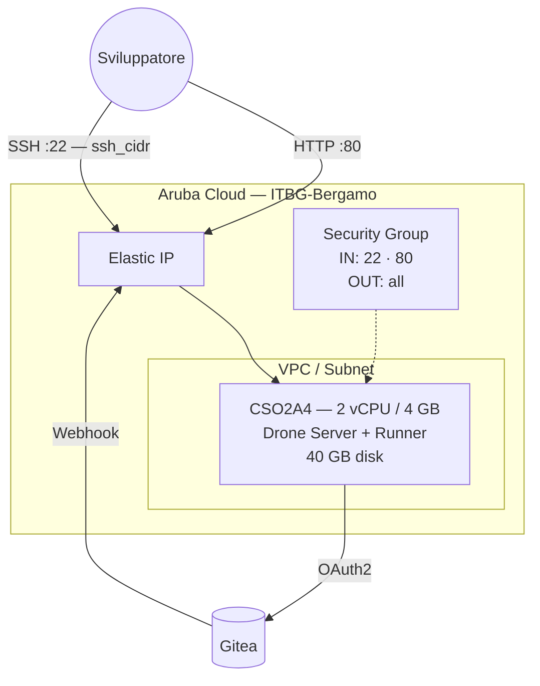

# Drone CI su Aruba Cloud

Esegui il deployment di [Drone CI](https://www.drone.io) — una piattaforma di integrazione continua self-hosted — su Aruba Cloud tramite Terraform e cloud-init. Drone si integra con Gitea tramite OAuth2 ed esegue le pipeline di build all'interno di container Docker.

> **Versione provider:** arubacloud/arubacloud `~> 0.5` | **Terraform:** ≥ 1.9

---

## Introduzione

Drone CI è una piattaforma CI/CD nativa per container dove ogni passo della pipeline viene eseguito in un container Docker isolato. Questo esempio esegue il provisioning di:

- **Drone Server** (container Docker) — interfaccia web, API e orchestrazione delle pipeline
- **Drone Docker Runner** (container Docker) — esegue i passi della pipeline sulla stessa VM
- **Docker** installato dal repository apt Docker ufficiale
- **Integrazione OAuth2 con Gitea** — gli utenti accedono a Drone con i loro account Gitea
- Porta 80 per l'interfaccia web di Drone

> **Prerequisito:** È richiesta un'istanza Gitea in esecuzione. Usa l'[esempio Gitea](gitea.md) o l'[esempio Forgejo](forgejo.md) da questo repository, quindi segui i passaggi di configurazione OAuth2 descritti di seguito prima di eseguire `terraform apply`.

---

## Panoramica dell'architettura



---

## Infrastruttura creata

| Risorsa | Pattern del nome | Descrizione |
|---------|-----------------|-------------|
| `arubacloud_project` | `drone-prod` | Contenitore del progetto |
| `arubacloud_vpc` | `drone-prod-vpc` | Virtual Private Cloud |
| `arubacloud_subnet` | `drone-prod-subnet` | Subnet base |
| `arubacloud_securitygroup` | `drone-prod-vm-sg` | Security group |
| `arubacloud_securityrule` | `drone-prod-vm-ssh` | Regola ingress SSH |
| `arubacloud_securityrule` | `drone-prod-vm-http` | Regola ingress HTTP TCP 80 |
| `arubacloud_elasticip` | `drone-prod-vm-eip` | IP pubblico della VM |
| `arubacloud_blockstorage` | `drone-prod-boot` | Disco di boot da 40 GB (Performance) |
| `arubacloud_keypair` | `drone-prod-keypair` | Chiave pubblica SSH |
| `arubacloud_cloudserver` | `drone-prod-vm` | VM CloudServer |

---

## Costo mensile stimato

| Risorsa | Specifiche | Costo stimato/mese |
|---------|-----------|-------------------|
| VM CloudServer | CSO2A4 — 2 vCPU / 4 GB | ~€18 |
| Disco di boot | 40 GB Performance | ~€6 |
| Elastic IP | — | ~€3 |
| **Totale** | | **~€27/mese** |

---

## Requisiti

- Terraform ≥ 1.9
- ArubaCloud Terraform Provider `~> 0.5`
- Un account ArubaCloud con credenziali API OAuth2
- Una coppia di chiavi SSH
- Un'istanza **Gitea** (o Forgejo) raggiungibile dalla VM Drone

---

## Variabili

### Obbligatorie

| Variabile | Descrizione |
|-----------|-------------|
| `arubacloud_client_id` | Client ID OAuth2 di ArubaCloud |
| `arubacloud_client_secret` | Client secret OAuth2 di ArubaCloud |
| `ssh_public_key` | Contenuto della chiave pubblica SSH |
| `gitea_url` | URL base della tua istanza Gitea (es. `http://1.2.3.4:3000`) |
| `gitea_client_id` | Client ID OAuth2 dall'applicazione OAuth Gitea |
| `gitea_client_secret` | Client secret OAuth2 dall'applicazione OAuth Gitea |
| `drone_rpc_secret` | Segreto condiviso tra il server Drone e il runner |
| `drone_admin_user` | Nome utente Gitea a cui concedere privilegi di admin Drone |

### Opzionali

| Variabile | Default | Descrizione |
|-----------|---------|-------------|
| `app_name` | `"drone"` | Nome breve usato in tutti i nomi delle risorse |
| `environment` | `"prod"` | Etichetta dell'ambiente |
| `location` | `"ITBG-Bergamo"` | Regione ArubaCloud |
| `zone` | `"ITBG-1"` | Zona di disponibilità |
| `billing_period` | `"Hour"` | `"Hour"` o `"Month"` |
| `vm_flavor` | `"CSO2A4"` | Flavor del CloudServer |
| `vm_image` | `"LU22-001"` | Immagine del disco di boot (Ubuntu 22.04 LTS) |
| `vm_disk_size_gb` | `40` | Dimensione del disco di boot in GB |
| `ssh_cidr` | `"0.0.0.0/0"` | CIDR per SSH |
| `web_cidr` | `"0.0.0.0/0"` | CIDR per l'interfaccia web Drone porta 80 |

---

## Output

| Output | Descrizione |
|--------|-------------|
| `drone_url` | URL dell'interfaccia web di Drone CI |
| `gitea_oauth_redirect_url` | URL di redirect da inserire quando si crea l'applicazione OAuth Gitea |
| `vm_public_ip` | Indirizzo IP pubblico della VM |
| `ssh_command` | Comando SSH per connettersi alla VM |

---

## Istruzioni di deployment

Drone CI richiede un'applicazione OAuth2 Gitea prima del deployment. L'URL di redirect include l'IP Elastico della VM Drone, che non è noto fino al primo `terraform apply`. Usa l'**approccio in due fasi** di seguito.

### Fase 1 — Ottieni l'IP Elastico

Applica con valori Gitea segnaposto per eseguire il provisioning della VM e ottenere il suo IP:

```bash
cp terraform.tfvars.example terraform.tfvars
# Compila le credenziali ArubaCloud, ssh_public_key, e valori segnaposto temporanei:
# gitea_url           = "http://placeholder"
# gitea_client_id     = "placeholder"
# gitea_client_secret = "placeholder"
# drone_rpc_secret    = "placeholderplaceholder"
# drone_admin_user    = "placeholder"

terraform init
terraform apply
terraform output gitea_oauth_redirect_url
# → http://<drone-ip>/login
```

### Fase 2 — Crea l'applicazione OAuth Gitea

Nella tua istanza Gitea: **Impostazioni → Applicazioni → Applicazioni OAuth2 → Crea**

- **Nome applicazione:** Drone CI
- **URI di redirect:** `http://<drone-ip>/login` (dall'output della Fase 1)

Copia il **Client ID** e il **Client Secret**.

### Fase 3 — Ri-applica con le credenziali reali

Aggiorna `terraform.tfvars` con i valori reali:

```hcl
gitea_url           = "http://your-gitea-ip:3000"
gitea_client_id     = "real-client-id"
gitea_client_secret = "real-client-secret"
drone_rpc_secret    = "$(openssl rand -hex 16)"
drone_admin_user    = "your-gitea-username"
```

```bash
terraform apply
```

Terraform sostituisce il user_data della VM e la VM viene ricreata con la configurazione corretta. Il bootstrap richiede circa **3–5 minuti**.

### Fase 4 — Accedi a Drone

```bash
terraform output drone_url
```

Apri l'URL nel browser e accedi con il tuo account Gitea. Il `drone_admin_user` riceve automaticamente i privilegi di amministratore.

---

## La tua prima pipeline

Aggiungi un file `.drone.yml` a qualsiasi repository Gitea:

```yaml
kind: pipeline
type: docker
name: default

steps:
  - name: test
    image: alpine
    commands:
      - echo "Hello from Drone CI!"
      - uname -a
```

Esegui un push su Gitea — Drone riceve il webhook ed esegue automaticamente la pipeline.

---

## Risoluzione dei problemi

### L'interfaccia di Drone non si carica

```bash
ssh ubuntu@$(terraform output -raw vm_public_ip)
docker compose -f /opt/drone/docker-compose.yml ps
docker compose -f /opt/drone/docker-compose.yml logs drone-server
```

### Il login OAuth fallisce (redirect URI mismatch)

L'URI di redirect in Gitea deve corrispondere esattamente a `http://<drone-ip>/login`. Verifica:

1. Gitea → Impostazioni → Applicazioni → la tua app OAuth → URI di redirect
2. Il valore deve essere `http://<drone-ip>/login` (senza slash finale, IP corretto)

### Il runner non preleva i job

```bash
docker compose -f /opt/drone/docker-compose.yml logs drone-runner
```

Il runner si connette al server tramite la rete interna Docker (hostname `drone-server`). Verifica che entrambi i container siano in esecuzione:

```bash
docker compose -f /opt/drone/docker-compose.yml ps
```

---

## Riferimenti

- [Documentazione Drone CI](https://docs.drone.io)
- [Integrazione Drone Gitea](https://docs.drone.io/server/provider/gitea/)
- [Esempio Gitea](gitea.md)
- [Esempio Forgejo](forgejo.md)
- [Provider Terraform ArubaCloud](https://registry.terraform.io/providers/arubacloud/arubacloud/latest/docs)
