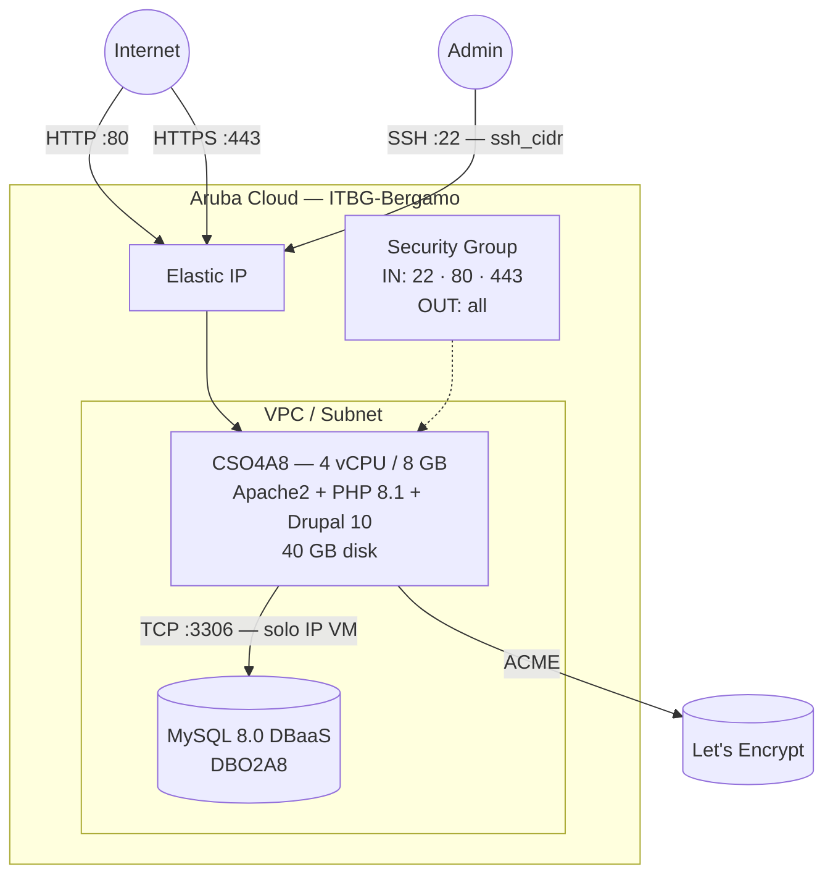

# Drupal su Aruba Cloud

Esegui il deployment di [Drupal 10](https://www.drupal.org) — un CMS open-source flessibile e di livello enterprise — su Aruba Cloud tramite Terraform e cloud-init. Drupal viene installato tramite Composer con un backend MySQL 8.0 DBaaS gestito, seguendo lo stesso pattern di produzione dell'esempio WordPress.

> **Versione provider:** arubacloud/arubacloud `~> 0.5` | **Terraform:** ≥ 1.9

---

## Introduzione

Drupal 10 è basato sul template Composer `drupal/recommended-project`, che include Drupal core, Drush (la CLI di Drupal) e impostazioni predefinite sensate per la produzione. Questo esempio esegue il provisioning di:

- **Apache2 + PHP 8.1** con tutte le estensioni richieste da Drupal
- **Drupal 10** installato tramite Composer + Drush in modalità completamente non presidiata
- **MySQL 8.0 gestito** tramite ArubaCloud DBaaS — Drupal non interagisce mai con SQL grezzo
- Porte 80 e 443 aperte a internet
- **HTTPS opzionale** tramite Let's Encrypt quando `domain` è impostato

> **Tempo di bootstrap:** Composer scarica ~80 MB di pacchetti PHP. Prevedi **15–20 minuti** prima che il sito sia raggiungibile.

---

## Panoramica dell'architettura



---

## Infrastruttura creata

| Risorsa | Pattern del nome | Descrizione |
|---------|-----------------|-------------|
| `arubacloud_project` | `drupal-prod` | Contenitore del progetto |
| `arubacloud_vpc` | `drupal-prod-vpc` | Virtual Private Cloud |
| `arubacloud_subnet` | `drupal-prod-subnet` | Subnet base |
| `arubacloud_securitygroup` | `drupal-prod-vm-sg` | Security group VM |
| `arubacloud_securitygroup` | `drupal-prod-dbaas-sg` | Security group DBaaS |
| `arubacloud_securityrule` | `drupal-prod-vm-ssh` | Regola ingress SSH |
| `arubacloud_securityrule` | `drupal-prod-vm-http` | Regola ingress HTTP TCP 80 |
| `arubacloud_securityrule` | `drupal-prod-vm-https` | Regola ingress HTTPS TCP 443 |
| `arubacloud_securityrule` | `drupal-prod-db-mysql` | Regola ingress MySQL solo dall'IP VM |
| `arubacloud_elasticip` | `drupal-prod-vm-eip` | IP pubblico VM |
| `arubacloud_elasticip` | `drupal-prod-dbaas-eip` | IP pubblico DBaaS |
| `arubacloud_blockstorage` | `drupal-prod-boot` | Disco di boot da 40 GB (Performance) |
| `arubacloud_keypair` | `drupal-prod-keypair` | Chiave pubblica SSH |
| `arubacloud_dbaas` | `drupal-prod-dbaas` | MySQL 8.0 gestito |
| `arubacloud_database` | `drupal` | Database Drupal |
| `arubacloud_dbaasuser` | `drupal` | Utente DB Drupal |
| `arubacloud_cloudserver` | `drupal-prod-vm` | VM CloudServer |

---

## Costo mensile stimato

| Risorsa | Specifiche | Costo stimato/mese |
|---------|-----------|-------------------|
| VM CloudServer | CSO4A8 — 4 vCPU / 8 GB | ~€35 |
| Disco di boot | 40 GB Performance | ~€6 |
| Elastic IP (VM) | — | ~€3 |
| MySQL DBaaS | DBO2A8 + 20 GB | ~€30 |
| Elastic IP (DBaaS) | — | ~€3 |
| **Totale** | | **~€77/mese** |

---

## Requisiti

- Terraform ≥ 1.9
- ArubaCloud Terraform Provider `~> 0.5`
- Un account ArubaCloud con credenziali API OAuth2
- Una coppia di chiavi SSH

---

## Variabili

### Obbligatorie

| Variabile | Descrizione |
|-----------|-------------|
| `arubacloud_client_id` | Client ID OAuth2 di ArubaCloud |
| `arubacloud_client_secret` | Client secret OAuth2 di ArubaCloud |
| `ssh_public_key` | Contenuto della chiave pubblica SSH |
| `db_password` | Password utente MySQL Drupal (min 16 caratteri) |
| `admin_email` | Indirizzo email dell'amministratore Drupal |
| `admin_password` | Password amministratore Drupal (min 16 caratteri) |

### Opzionali

| Variabile | Default | Descrizione |
|-----------|---------|-------------|
| `app_name` | `"drupal"` | Nome breve usato in tutti i nomi delle risorse |
| `environment` | `"prod"` | Etichetta dell'ambiente |
| `location` | `"ITBG-Bergamo"` | Regione ArubaCloud |
| `zone` | `"ITBG-1"` | Zona di disponibilità |
| `billing_period` | `"Hour"` | `"Hour"` o `"Month"` |
| `vm_flavor` | `"CSO4A8"` | Flavor del CloudServer |
| `vm_image` | `"LU22-001"` | Immagine del disco di boot (Ubuntu 22.04 LTS) |
| `vm_disk_size_gb` | `40` | Dimensione del disco di boot in GB |
| `ssh_cidr` | `"0.0.0.0/0"` | CIDR per SSH — limita in produzione |
| `dbaas_flavor` | `"DBO2A8"` | Flavor istanza DBaaS |
| `db_storage_gb` | `20` | Dimensione storage iniziale DBaaS in GB |
| `site_name` | `"My Drupal Site"` | Nome visualizzato del sito |
| `admin_user` | `"admin"` | Nome utente amministratore Drupal |
| `domain` | `""` | Dominio per HTTPS automatico con Let's Encrypt |

---

## Output

| Output | Descrizione |
|--------|-------------|
| `site_url` | URL del sito Drupal |
| `admin_url` | URL di accesso admin Drupal |
| `vm_public_ip` | Indirizzo IP pubblico della VM |
| `ssh_command` | Comando SSH per connettersi alla VM |
| `db_host` | Indirizzo host MySQL DBaaS |

---

## Istruzioni di deployment

### 1. Clona e naviga

```bash
git clone https://github.com/arubacloud/terraform-arubacloud-examples.git
cd terraform-arubacloud-examples/drupal
```

### 2. Configura le variabili

```bash
cp terraform.tfvars.example terraform.tfvars
```

Imposta credenziali, password ed email admin:

```hcl
db_password    = "your-strong-db-password"
admin_email    = "admin@example.com"
admin_password = "your-strong-admin-password"
```

### 3. Esegui il deployment

```bash
terraform init
terraform plan
terraform apply
```

Il bootstrap richiede **15–20 minuti** — il download di Composer e il provisioning del DBaaS vengono eseguiti in parallelo.

### 4. Accedi a Drupal

```bash
terraform output site_url
terraform output admin_url
```

Accedi con `admin_user` e `admin_password`.

---

## Risoluzione dei problemi

### Il sito non si carica dopo apply

Il bootstrap è ancora in esecuzione. Controlla il progresso:

```bash
ssh ubuntu@$(terraform output -raw vm_public_ip)
sudo tail -f /var/log/cloud-init-output.log
```

### Installazione Drush site:install fallita

Verifica se il DBaaS era raggiungibile:

```bash
nc -zv $(terraform output -raw db_host) 3306
sudo cat /var/log/cloud-init-output.log | grep -A5 "ERROR\|Waiting"
```

---

## Riferimenti

- [Documentazione Drupal](https://www.drupal.org/docs)
- [Documentazione Drush](https://www.drush.org)
- [Provider Terraform ArubaCloud](https://registry.terraform.io/providers/arubacloud/arubacloud/latest/docs)
