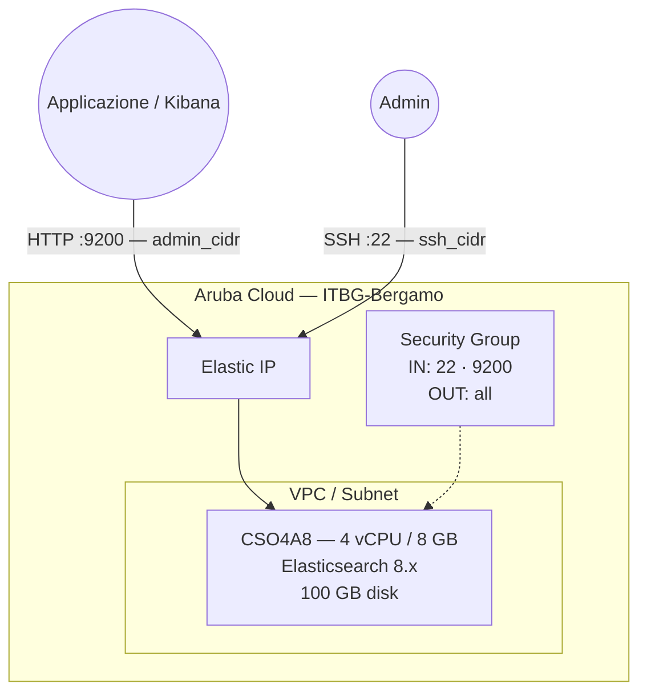

# Elasticsearch su Aruba Cloud

Esegui il deployment di [Elasticsearch 8.x](https://www.elastic.co/elasticsearch/) — il motore di ricerca e analytics distribuito open-source leader — su Aruba Cloud tramite Terraform e cloud-init. Installato dal repository apt Elastic ufficiale con sicurezza x-pack abilitata e la password del superutente `elastic` configurata al momento del bootstrap.

> **Versione provider:** arubacloud/arubacloud `~> 0.5` | **Terraform:** ≥ 1.9

---

## Introduzione

Elasticsearch è il cuore dell'Elastic Stack (ELK/ELK+APM), che fornisce ricerca full-text, analisi dei log ed esplorazione dei dati in tempo reale su larga scala. Questo esempio esegue il provisioning di un'istanza Elasticsearch **single-node** con:

- **Elasticsearch 8.x** installato dal repository apt Elastic ufficiale
- **Sicurezza x-pack abilitata** — tutte le richieste API richiedono autenticazione
- TLS HTTP disabilitato per semplicità (termina TLS su un reverse proxy per la produzione)
- Password del superutente `elastic` impostata al momento del bootstrap — nessuna operazione manuale post-installazione
- Tuning del kernel `vm.max_map_count=262144` applicato in modo persistente
- REST API sulla porta 9200, limitata a `admin_cidr`

> **Nota su OpenSearch:** Per nuovi deployment open-source dove la licenza SSPL di Elastic è una preoccupazione, considera [OpenSearch](https://opensearch.org) — il fork mantenuto dalla community gestito da AWS. Wazuh (in questo repository) include un'istanza OpenSearch incorporata come riferimento.

---

## Panoramica dell'architettura



---

## Infrastruttura creata

| Risorsa | Pattern del nome | Descrizione |
|---------|-----------------|-------------|
| `arubacloud_project` | `es-prod` | Contenitore del progetto |
| `arubacloud_vpc` | `es-prod-vpc` | Virtual Private Cloud |
| `arubacloud_subnet` | `es-prod-subnet` | Subnet base |
| `arubacloud_securitygroup` | `es-prod-vm-sg` | Security group |
| `arubacloud_securityrule` | `es-prod-vm-ssh` | Regola ingress SSH |
| `arubacloud_securityrule` | `es-prod-vm-api` | Regola ingress REST API TCP 9200 |
| `arubacloud_elasticip` | `es-prod-vm-eip` | IP pubblico della VM |
| `arubacloud_blockstorage` | `es-prod-boot` | Disco di boot da 100 GB (Performance) |
| `arubacloud_keypair` | `es-prod-keypair` | Chiave pubblica SSH |
| `arubacloud_cloudserver` | `es-prod-vm` | VM CloudServer |

---

## Costo mensile stimato

| Risorsa | Specifiche | Costo stimato/mese |
|---------|-----------|-------------------|
| VM CloudServer | CSO4A8 — 4 vCPU / 8 GB | ~€35 |
| Disco di boot | 100 GB Performance | ~€15 |
| Elastic IP | — | ~€3 |
| **Totale** | | **~€53/mese** |

Per workload di produzione, aggiorna a CSO8A16 (8 vCPU / 16 GB, ~€95/mese).

---

## Requisiti

- Terraform ≥ 1.9
- ArubaCloud Terraform Provider `~> 0.5`
- Un account ArubaCloud con credenziali API OAuth2
- Una coppia di chiavi SSH

---

## Variabili

### Obbligatorie

| Variabile | Descrizione |
|-----------|-------------|
| `arubacloud_client_id` | Client ID OAuth2 di ArubaCloud |
| `arubacloud_client_secret` | Client secret OAuth2 di ArubaCloud |
| `ssh_public_key` | Contenuto della chiave pubblica SSH |
| `elastic_password` | Password per il superutente `elastic` (min 6 caratteri) |

### Opzionali

| Variabile | Default | Descrizione |
|-----------|---------|-------------|
| `app_name` | `"es"` | Nome breve usato in tutti i nomi delle risorse |
| `environment` | `"prod"` | Etichetta dell'ambiente |
| `location` | `"ITBG-Bergamo"` | Regione ArubaCloud |
| `zone` | `"ITBG-1"` | Zona di disponibilità |
| `billing_period` | `"Hour"` | `"Hour"` o `"Month"` |
| `vm_flavor` | `"CSO4A8"` | Flavor del CloudServer |
| `vm_image` | `"LU22-001"` | Immagine del disco di boot (Ubuntu 22.04 LTS) |
| `vm_disk_size_gb` | `100` | Dimensione del disco di boot in GB (min 50 GB) |
| `ssh_cidr` | `"0.0.0.0/0"` | CIDR per SSH |
| `admin_cidr` | `"0.0.0.0/0"` | CIDR per la REST API porta 9200 — **limita sempre** |
| `cluster_name` | `"elasticsearch"` | Nome del cluster Elasticsearch |

---

## Output

| Output | Descrizione |
|--------|-------------|
| `elasticsearch_url` | URL della REST API Elasticsearch |
| `vm_public_ip` | Indirizzo IP pubblico della VM |
| `ssh_command` | Comando SSH per connettersi alla VM |
| `health_check` | Comando `curl` per verificare che il cluster sia in salute |

---

## Istruzioni di deployment

### 1. Clona e naviga

```bash
git clone https://github.com/arubacloud/terraform-arubacloud-examples.git
cd terraform-arubacloud-examples/elasticsearch
```

### 2. Configura le variabili

```bash
cp terraform.tfvars.example terraform.tfvars
```

Imposta la password e limita l'accesso API ai tuoi server applicativi:

```hcl
elastic_password = "your-strong-password"
admin_cidr       = "10.0.0.0/8"    # CIDR del tuo server applicativo
ssh_cidr         = "203.0.113.42/32"
```

### 3. Esegui il deployment

```bash
terraform init
terraform plan
terraform apply
```

Il bootstrap richiede circa **3–5 minuti**.

### 4. Verifica

```bash
curl -u elastic:<your-password> \
  "$(terraform output -raw elasticsearch_url)/_cluster/health?pretty"
```

Output atteso:

```json
{
  "cluster_name" : "elasticsearch",
  "status" : "green",
  "number_of_nodes" : 1,
  ...
}
```

---

## Connessione di Kibana

Per visualizzare e interrogare i dati, distribuisci Kibana separatamente e puntalo verso questa istanza Elasticsearch:

```yaml
# kibana.yml
elasticsearch.hosts: ["http://<es-ip>:9200"]
elasticsearch.username: "kibana_system"
elasticsearch.password: "<generated-kibana-system-password>"
```

Crea la password dell'utente `kibana_system` dalla VM Elasticsearch:

```bash
ssh ubuntu@$(terraform output -raw vm_public_ip)
sudo /usr/share/elasticsearch/bin/elasticsearch-reset-password \
  -u kibana_system --batch
```

---

## Raccomandazioni di sicurezza

1. **Limita sempre `admin_cidr`.** Elasticsearch non ha rate limiting sull'autenticazione — lasciare la porta 9200 aperta a `0.0.0.0/0` espone i tuoi dati ad attacchi di credential-stuffing.

2. **Abilita TLS HTTP per la produzione.** Questo esempio disabilita TLS HTTP per semplicità. Per la produzione, termina TLS su NGINX o Caddy (in questo repository), oppure abilita il TLS integrato di Elasticsearch usando `xpack.security.http.ssl.enabled: true` con un certificato.

3. **Usa ruoli dedicati.** Non usare il superutente `elastic` per le connessioni applicative. Crea un ruolo con privilegi minimi:

   ```bash
   curl -u elastic:<password> -X POST \
     "http://<ip>:9200/_security/role/app_role" \
     -H "Content-Type: application/json" \
     -d '{"indices":[{"names":["app-*"],"privileges":["read","write","create_index"]}]}'
   ```

---

## Risoluzione dei problemi

### Elasticsearch non si avvia

```bash
sudo systemctl status elasticsearch
sudo journalctl -u elasticsearch -n 50
# Causa comune: vm.max_map_count insufficiente
cat /proc/sys/vm/max_map_count   # deve essere 262144
```

### Reset della password fallito

Lo strumento di reset della password richiede che il nodo sia in esecuzione. Controlla prima lo stato del servizio:

```bash
sudo systemctl status elasticsearch
sudo /usr/share/elasticsearch/bin/elasticsearch-reset-password \
  -u elastic -p "new-password" --batch
```

---

## Riferimenti

- [Documentazione Elasticsearch](https://www.elastic.co/guide/en/elasticsearch/reference/current/index.html)
- [Guida alla sicurezza di Elasticsearch](https://www.elastic.co/guide/en/elasticsearch/reference/current/secure-cluster.html)
- [OpenSearch (fork open-source)](https://opensearch.org)
- [Provider Terraform ArubaCloud](https://registry.terraform.io/providers/arubacloud/arubacloud/latest/docs)
