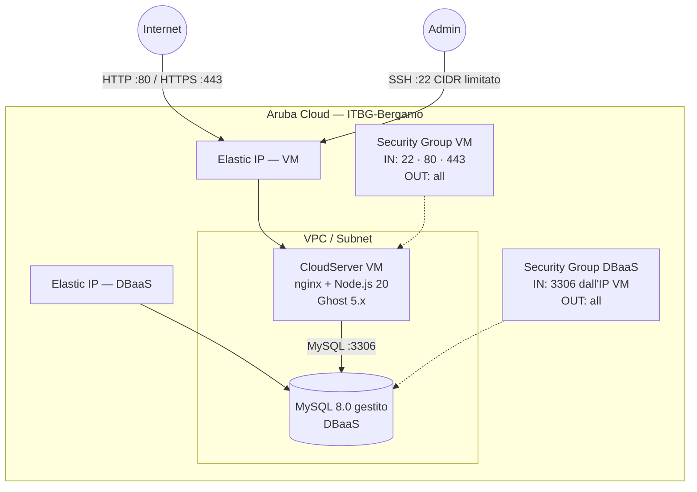

# Ghost su Aruba Cloud

Esegui il deployment di un blog [Ghost](https://ghost.org) pronto per la produzione su Aruba Cloud tramite Terraform e cloud-init. Nessuna configurazione manuale del server richiesta.

> **Versione provider:** arubacloud/arubacloud `~> 0.5` | **Terraform:** ≥ 1.9

---

## Introduzione

Ghost è una moderna piattaforma di pubblicazione open-source costruita con Node.js, progettata per blogger professionisti, newsletter e siti con abbonamento. Questo esempio esegue il provisioning di uno stack Ghost completo su Aruba Cloud con:

- Una **VM CloudServer** che esegue Node.js 20 e Ghost dietro nginx, completamente avviata da cloud-init
- Un'istanza **MySQL 8.0 DBaaS gestita** — nessun server database autogestito
- Una **VPC, subnet e security group** dedicati tramite il modulo di rete condiviso
- **Elastic IP** per la VM e DBaaS
- **HTTPS Let's Encrypt opzionale** quando viene fornito un dominio personalizzato

L'account admin Ghost viene creato alla prima visita del browser su `/ghost` — nessuna password viene impostata durante il provisioning.

---

## Panoramica dell'architettura

Ghost è in ascolto sulla porta 2368 ed è proxy di nginx sulle porte 80/443. Il database è eseguito su un'istanza DBaaS gestita separata nella stessa VPC. Il security group MySQL consente connessioni inbound solo dall'Elastic IP della VM.



---

## Infrastruttura creata

| Risorsa | Pattern del nome | Descrizione |
|---------|-----------------|-------------|
| `arubacloud_project` | `ghost-prod` | Contenitore del progetto |
| `arubacloud_vpc` | `ghost-prod-vpc` | Virtual Private Cloud |
| `arubacloud_subnet` | `ghost-prod-subnet` | Subnet base |
| `arubacloud_securitygroup` | `ghost-prod-vm-sg` | Security group VM |
| `arubacloud_securitygroup` | `ghost-prod-db-sg` | Security group DBaaS |
| `arubacloud_securityrule` | `ghost-prod-vm-ssh` | Regola ingress SSH (CIDR limitato) |
| `arubacloud_securityrule` | `ghost-prod-vm-http` | Regola ingress HTTP (0.0.0.0/0) |
| `arubacloud_securityrule` | `ghost-prod-vm-https` | Regola ingress HTTPS (0.0.0.0/0) |
| `arubacloud_securityrule` | `ghost-prod-db-mysql` | Regola ingress MySQL solo dall'IP VM |
| `arubacloud_elasticip` | `ghost-prod-vm-eip` | IP pubblico VM |
| `arubacloud_elasticip` | `ghost-prod-db-eip` | IP pubblico DBaaS |
| `arubacloud_blockstorage` | `ghost-prod-boot` | Disco di boot da 30 GB (Performance) |
| `arubacloud_keypair` | `ghost-prod-keypair` | Chiave pubblica SSH |
| `arubacloud_dbaas` | `ghost-prod-dbaas` | MySQL 8.0 gestito |
| `arubacloud_database` | `ghost` | Database logico Ghost |
| `arubacloud_dbaasuser` | `ghost` | Utente applicativo MySQL |
| `arubacloud_databasegrant` | — | Grant liteadmin |
| `arubacloud_cloudserver` | `ghost-prod-vm` | VM CloudServer |

---

## Raccomandazione dimensionamento VM

| Workload | vCPU | RAM | Disco | Flavor |
|---------|------|-----|-------|--------|
| Blog personale / newsletter | 2 | 4 GB | 30 GB | `CSO2A4` *(default)* |
| Sito ad alto traffico / con abbonamento | 4 | 8 GB | 40 GB | `CSO4A8` |

Per il DBaaS: `DBO2A8` (2 vCPU / 8 GB) copre la maggior parte dei siti Ghost. Ghost è basato su Node.js ed è più efficiente in termini di memoria rispetto agli stack PHP, quindi il livello VM 2 vCPU / 4 GB gestisce bene i workload tipici di blog e newsletter.

---

## Costo mensile stimato

> Prezzi approssimativi per ITBG-Bergamo, fatturazione oraria. I prezzi effettivi possono variare — verifica nella [console ArubaCloud](https://www.cloud.it).

| Risorsa | Specifiche | Costo stimato/mese |
|---------|-----------|-------------------|
| VM CloudServer | CSO2A4 — 2 vCPU / 4 GB | ~€18 |
| Disco di boot | 30 GB Performance | ~€4 |
| MySQL gestito | DBO2A8 — 2 vCPU / 8 GB | ~€35 |
| Storage DBaaS | 20 GB | ~€3 |
| Elastic IP × 2 | — | ~€5 |
| **Totale** | | **~€65/mese** |

---

## Requisiti

- Terraform ≥ 1.9
- ArubaCloud Terraform Provider `~> 0.5`
- Un account ArubaCloud con credenziali API OAuth2
- Una coppia di chiavi SSH

---

## Variabili

### Obbligatorie

| Variabile | Descrizione |
|-----------|-------------|
| `arubacloud_client_id` | Client ID OAuth2 di ArubaCloud |
| `arubacloud_client_secret` | Client secret OAuth2 di ArubaCloud |
| `ssh_public_key` | Contenuto della chiave pubblica SSH (es. contenuto di `~/.ssh/id_ed25519.pub`) |
| `db_password` | Password MySQL per l'utente Ghost (min 16 caratteri, senza newline) |

### Opzionali

| Variabile | Default | Descrizione |
|-----------|---------|-------------|
| `app_name` | `"ghost"` | Nome breve usato in tutti i nomi delle risorse |
| `environment` | `"prod"` | Etichetta dell'ambiente (`prod`, `staging`, `dev`) |
| `location` | `"ITBG-Bergamo"` | Regione ArubaCloud |
| `zone` | `"ITBG-1"` | Zona di disponibilità |
| `billing_period` | `"Hour"` | `"Hour"` o `"Month"` |
| `vm_flavor` | `"CSO2A4"` | Flavor del CloudServer |
| `vm_image` | `"LU22-001"` | Immagine del disco di boot (Ubuntu 22.04 LTS) |
| `vm_disk_size_gb` | `30` | Dimensione del disco di boot in GB |
| `ssh_cidr` | `"0.0.0.0/0"` | CIDR per accesso SSH — **limita al tuo IP in produzione** |
| `dbaas_flavor` | `"DBO2A8"` | Flavor DBaaS |
| `db_storage_gb` | `20` | Storage iniziale DBaaS in GB |
| `domain` | `""` | Dominio personalizzato per HTTPS — lascia vuoto per usare l'Elastic IP |

---

## Istruzioni di deployment

### 1. Clona e naviga

```bash
git clone https://github.com/arubacloud/terraform-arubacloud-examples.git
cd terraform-arubacloud-examples/ghost
```

### 2. Configura le variabili

```bash
cp terraform.tfvars.example terraform.tfvars
```

Modifica `terraform.tfvars` con le tue credenziali e la password del database.

### 3. Inizializza e distribuisci

```bash
terraform init
terraform plan   # rivedi il piano di esecuzione
terraform apply
```

### 4. Accedi a Ghost

Dopo il completamento dell'apply (tipicamente 10–15 minuti per cloud-init):

```bash
terraform output site_url          # es. http://203.0.113.10
terraform output ghost_admin_url   # es. http://203.0.113.10/ghost
```

Apri l'URL admin nel browser. La **prima visita** registra il tuo account admin — inserisci nome, email e password. Questo è l'unico utente creato durante la configurazione.

---

## Raccomandazioni di sicurezza

1. **Limita SSH al tuo IP.** Imposta `ssh_cidr = "your.ip.address/32"` in `terraform.tfvars`.

2. **Usa un dominio personalizzato con HTTPS.** Imposta la variabile `domain`. Certbot provvederà automaticamente al provisioning e al rinnovo del certificato Let's Encrypt.

3. **Scegli una password admin robusta.** Al momento della registrazione dell'account admin alla prima visita, usa una password univoca di almeno 16 caratteri.

4. **Mantieni Ghost aggiornato.** Accedi alla VM via SSH ed esegui `ghost update --dir /var/www/ghost` come utente ghost (vedi Considerazioni sull'aggiornamento di seguito).

5. **Non esporre MySQL pubblicamente.** Il security group DBaaS limita già MySQL all'IP della VM. Non aggiungere regole ingress `0.0.0.0/0` al security group DBaaS.

---

## Risoluzione dei problemi

### Ghost non è raggiungibile dopo apply

1. **cloud-init ancora in esecuzione.** L'installazione di Ghost richiede 10–15 minuti dopo l'avvio della VM. Controlla il log:

   ```bash
   ssh ubuntu@$(terraform output -raw vm_public_ip)
   sudo tail -f /var/log/cloud-init-output.log
   ```

2. **DBaaS non ancora pronto.** cloud-init attende fino a 15 minuti per MySQL.

3. **Servizio Ghost non avviato.** Verifica che Ghost sia in esecuzione:

   ```bash
   sudo -u ghost ghost status --dir /var/www/ghost
   ```

### nginx restituisce 502 Bad Gateway

Ghost non è in esecuzione o non è in ascolto sulla porta 2368:

```bash
sudo -u ghost ghost status --dir /var/www/ghost
sudo -u ghost ghost start --dir /var/www/ghost
```

---

## Riferimenti

- [Documentazione Ghost](https://ghost.org/docs/)
- [Riferimento Ghost CLI](https://ghost.org/docs/ghost-cli/)
- [Provider Terraform ArubaCloud](https://registry.terraform.io/providers/arubacloud/arubacloud/latest/docs)
- [Riferimento cloud-init](https://cloudinit.readthedocs.io/)
- [Documentazione Certbot](https://certbot.eff.org/docs/)
