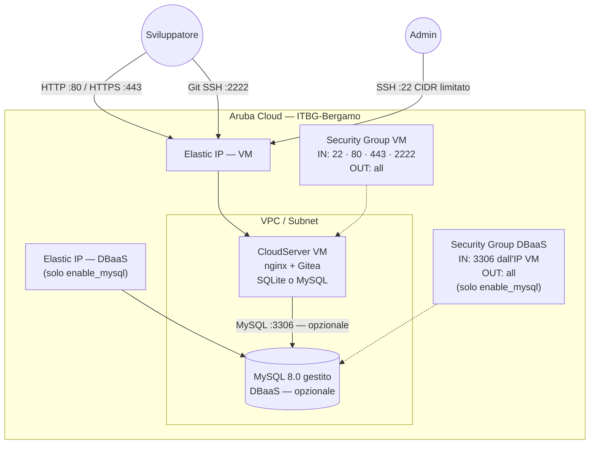

# Gitea su Aruba Cloud

Esegui il deployment di un servizio Git self-hosted [Gitea](https://gitea.com) pronto per la produzione su Aruba Cloud tramite Terraform e cloud-init. Nessuna configurazione manuale del server richiesta.

> **Versione provider:** arubacloud/arubacloud `~> 0.5` | **Terraform:** ≥ 1.9

---

## Introduzione

Gitea è un servizio Git self-hosted leggero scritto in Go. Fornisce un'interfaccia simile a GitHub per ospitare repository, gestire issue e pull request ed eseguire CI/CD tramite Gitea Actions. Questo esempio esegue il provisioning di uno stack Gitea completo su Aruba Cloud con:

- Una **VM CloudServer** che esegue il binario Gitea dietro un reverse proxy nginx, completamente avviata da cloud-init
- La scelta tra **SQLite** (default, costo zero aggiuntivo) o **MySQL 8.0 DBaaS gestito** per team più grandi
- Una **VPC, subnet e security group** dedicati tramite il modulo di rete condiviso
- **Elastic IP** per la VM (e DBaaS quando MySQL è abilitato)
- **HTTPS Let's Encrypt opzionale** quando viene fornito un dominio personalizzato
- **Accesso SSH Git sulla porta 2222** in modo che il server SSH integrato di Gitea non entri in conflitto con SSH admin sulla porta 22

Il primo utente che si registra tramite l'interfaccia web diventa automaticamente l'amministratore dell'istanza — nessuna credenziale viene preimpostata durante il provisioning.

---

## Panoramica dell'architettura

Gitea viene eseguito come servizio systemd in ascolto su `127.0.0.1:3000`. nginx termina il traffico HTTP/HTTPS pubblico e lo inoltra a Gitea. Il server SSH integrato di Gitea è in ascolto sulla porta 2222 per le operazioni `git clone` / `git push`.



---

## Infrastruttura creata

Le risorse con *(solo MySQL)* vengono create solo quando `enable_mysql = true`.

| Risorsa | Pattern del nome | Descrizione |
|---------|-----------------|-------------|
| `arubacloud_project` | `gitea-prod` | Contenitore del progetto |
| `arubacloud_vpc` | `gitea-prod-vpc` | Virtual Private Cloud |
| `arubacloud_subnet` | `gitea-prod-subnet` | Subnet base |
| `arubacloud_securitygroup` | `gitea-prod-vm-sg` | Security group VM |
| `arubacloud_securitygroup` | `gitea-prod-db-sg` | Security group DBaaS *(solo MySQL)* |
| `arubacloud_securityrule` | `gitea-prod-vm-ssh` | Regola ingress SSH (CIDR limitato) |
| `arubacloud_securityrule` | `gitea-prod-vm-http` | Regola ingress HTTP |
| `arubacloud_securityrule` | `gitea-prod-vm-https` | Regola ingress HTTPS |
| `arubacloud_securityrule` | `gitea-prod-vm-git-ssh` | Regola ingress Git SSH (porta 2222) |
| `arubacloud_securityrule` | `gitea-prod-db-mysql` | Regola ingress MySQL dall'IP VM *(solo MySQL)* |
| `arubacloud_elasticip` | `gitea-prod-vm-eip` | IP pubblico VM |
| `arubacloud_elasticip` | `gitea-prod-db-eip` | IP pubblico DBaaS *(solo MySQL)* |
| `arubacloud_blockstorage` | `gitea-prod-boot` | Disco di boot da 30 GB (Performance) |
| `arubacloud_keypair` | `gitea-prod-keypair` | Chiave pubblica SSH |
| `arubacloud_dbaas` | `gitea-prod-dbaas` | MySQL 8.0 gestito *(solo MySQL)* |
| `arubacloud_database` | `gitea` | Database logico Gitea *(solo MySQL)* |
| `arubacloud_dbaasuser` | `gitea` | Utente applicativo MySQL *(solo MySQL)* |
| `arubacloud_databasegrant` | — | Grant liteadmin *(solo MySQL)* |
| `arubacloud_cloudserver` | `gitea-prod-vm` | VM CloudServer |

---

## Raccomandazione dimensionamento VM

| Workload | vCPU | RAM | Disco | Flavor | Database |
|---------|------|-----|-------|--------|----------|
| Personale / team piccolo (≤ 10 utenti) | 2 | 4 GB | 30 GB | `CSO2A4` *(default)* | SQLite |
| Organizzazione piccola (≤ 50 utenti) | 2 | 4 GB | 50 GB | `CSO2A4` | MySQL `DBO2A8` |
| Organizzazione media (≤ 200 utenti) | 4 | 8 GB | 50 GB | `CSO4A8` | MySQL `DBO4A16` |

Per i deployment SQLite, i repository risiedono sul disco di boot — aumenta `vm_disk_size_gb` per adattarsi alle dimensioni attese dei repository.

---

## Costo mensile stimato

> Prezzi approssimativi per ITBG-Bergamo, fatturazione oraria. I prezzi effettivi possono variare — verifica nella [console ArubaCloud](https://www.cloud.it).

### SQLite (default)

| Risorsa | Specifiche | Costo stimato/mese |
|---------|-----------|-------------------|
| VM CloudServer | CSO2A4 — 2 vCPU / 4 GB | ~€18 |
| Disco di boot | 30 GB Performance | ~€4 |
| Elastic IP | — | ~€3 |
| **Totale** | | **~€25/mese** |

### MySQL (enable_mysql = true)

| Risorsa | Specifiche | Costo stimato/mese |
|---------|-----------|-------------------|
| VM CloudServer | CSO2A4 — 2 vCPU / 4 GB | ~€18 |
| Disco di boot | 30 GB Performance | ~€4 |
| MySQL gestito | DBO2A8 — 2 vCPU / 8 GB | ~€35 |
| Storage DBaaS | 20 GB | ~€3 |
| Elastic IP × 2 | — | ~€5 |
| **Totale** | | **~€65/mese** |

---

## Requisiti

- Terraform ≥ 1.9
- ArubaCloud Terraform Provider `~> 0.5`
- Un account ArubaCloud con credenziali API OAuth2
- Una coppia di chiavi SSH
- `db_password` (min 16 caratteri) — solo quando `enable_mysql = true`

---

## Variabili

### Obbligatorie

| Variabile | Descrizione |
|-----------|-------------|
| `arubacloud_client_id` | Client ID OAuth2 di ArubaCloud |
| `arubacloud_client_secret` | Client secret OAuth2 di ArubaCloud |
| `ssh_public_key` | Contenuto della chiave pubblica SSH (es. contenuto di `~/.ssh/id_ed25519.pub`) |

### Opzionali

| Variabile | Default | Descrizione |
|-----------|---------|-------------|
| `app_name` | `"gitea"` | Nome breve usato in tutti i nomi delle risorse |
| `environment` | `"prod"` | Etichetta dell'ambiente (`prod`, `staging`, `dev`) |
| `location` | `"ITBG-Bergamo"` | Regione ArubaCloud |
| `zone` | `"ITBG-1"` | Zona di disponibilità |
| `billing_period` | `"Hour"` | `"Hour"` o `"Month"` |
| `vm_flavor` | `"CSO2A4"` | Flavor del CloudServer |
| `vm_image` | `"LU22-001"` | Immagine del disco di boot (Ubuntu 22.04 LTS) |
| `vm_disk_size_gb` | `30` | Dimensione del disco di boot in GB |
| `ssh_cidr` | `"0.0.0.0/0"` | CIDR per accesso SSH — **limita al tuo IP in produzione** |
| `enable_mysql` | `false` | Provisioning di MySQL gestito invece di SQLite |
| `dbaas_flavor` | `"DBO2A8"` | Flavor DBaaS (solo quando `enable_mysql = true`) |
| `db_storage_gb` | `20` | Storage iniziale DBaaS in GB (solo quando `enable_mysql = true`) |
| `db_password` | `""` | Password MySQL (obbligatoria quando `enable_mysql = true`, min 16 caratteri) |
| `gitea_version` | `"1.23.5"` | Versione di Gitea — controlla [dl.gitea.com](https://dl.gitea.com/gitea/) |
| `domain` | `""` | Dominio personalizzato per HTTPS — lascia vuoto per usare l'Elastic IP |

---

## Output

| Output | Descrizione |
|--------|-------------|
| `web_url` | URL dell'interfaccia web di Gitea |
| `ssh_clone_base` | URL base per clone SSH (aggiungi `/<owner>/<repo>.git`) |
| `vm_public_ip` | Indirizzo IP pubblico della VM |
| `ssh_command` | Comando SSH per connettersi alla VM |
| `dbaas_host` | Endpoint DBaaS (null quando `enable_mysql = false`) |

---

## Istruzioni di deployment

### 1. Clona e naviga

```bash
git clone https://github.com/arubacloud/terraform-arubacloud-examples.git
cd terraform-arubacloud-examples/gitea
```

### 2. Configura le variabili

```bash
cp terraform.tfvars.example terraform.tfvars
```

Modifica `terraform.tfvars` con le tue credenziali. Come minimo imposta `arubacloud_client_id`, `arubacloud_client_secret` e `ssh_public_key`.

### 3. Inizializza e distribuisci

```bash
terraform init
terraform plan   # rivedi il piano di esecuzione
terraform apply
```

### 4. Accedi a Gitea

Dopo il completamento dell'apply (tipicamente 5–10 minuti per cloud-init con SQLite, 15–20 minuti con MySQL):

```bash
terraform output web_url
```

Apri l'URL nel browser. **Il primo utente che si registra diventa amministratore dell'istanza.**

---

## Raccomandazioni di sicurezza

1. **Limita SSH al tuo IP.** Imposta `ssh_cidr = "your.ip.address/32"` in `terraform.tfvars`.

2. **Usa un dominio personalizzato con HTTPS.** Imposta la variabile `domain`. Certbot provvede e rinnova automaticamente il certificato Let's Encrypt.

3. **Disabilita la registrazione pubblica dopo la configurazione.** Una volta che il tuo team si è registrato, vai su Amministrazione del sito → Configurazione e imposta `DISABLE_REGISTRATION = true`.

4. **Imposta una password admin robusta** al momento della registrazione del primo account.

5. **Non esporre MySQL pubblicamente** (già applicato — il security group DBaaS consente l'ingress solo dall'Elastic IP della VM).

---

## Riferimenti

- [Documentazione Gitea](https://docs.gitea.com)
- [Download Gitea](https://dl.gitea.com/gitea/)
- [Provider Terraform ArubaCloud](https://registry.terraform.io/providers/arubacloud/arubacloud/latest/docs)
- [Riferimento cloud-init](https://cloudinit.readthedocs.io/)
- [Documentazione Certbot](https://certbot.eff.org/docs/)
