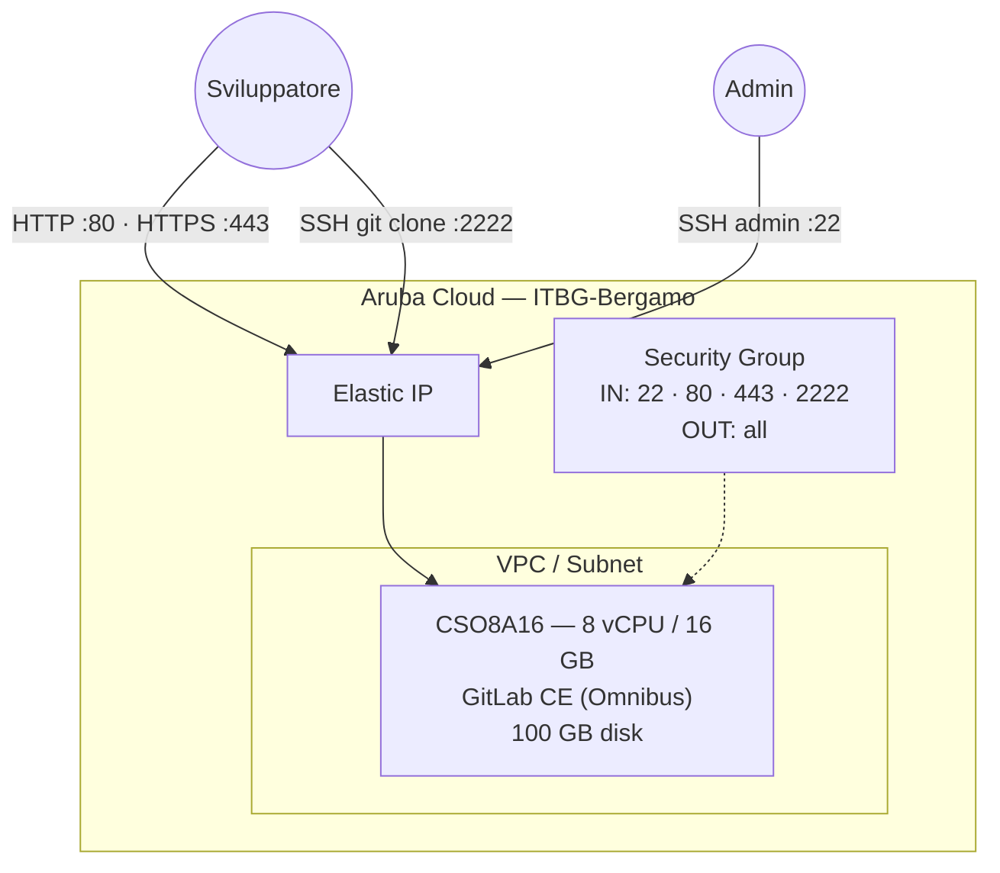

# GitLab CE su Aruba Cloud

Esegui il deployment di [GitLab Community Edition](https://gitlab.com/oss/gitlab-ce) — una piattaforma DevOps completa con hosting Git, CI/CD, issue tracking e container registry — su Aruba Cloud tramite Terraform e cloud-init.

> **Versione provider:** arubacloud/arubacloud `~> 0.5` | **Terraform:** ≥ 1.9

---

## Introduzione

GitLab CE è un'alternativa self-hosted a GitHub e GitHub Actions. Questo esempio distribuisce:

- **GitLab CE** tramite il pacchetto Omnibus ufficiale su una singola VM
- **TLS Let's Encrypt automatico** quando viene fornita una `letsencrypt_email`
- Porta SSH separata **2222** per le operazioni git (la porta 22 è riservata all'accesso admin)
- Interfaccia web, runner CI/CD (da configurare separatamente) e container registry pronti all'uso

> **Prima il DNS:** Con HTTPS, GitLab richiede un certificato Let's Encrypt durante l'installazione. Imposta il tuo record `A` per `gitlab_hostname` → IP pubblico della VM prima di eseguire `terraform apply`.

---

## Panoramica dell'architettura



---

## Infrastruttura creata

| Risorsa | Pattern del nome | Descrizione |
|---------|-----------------|-------------|
| `arubacloud_project` | `gitlab-prod` | Contenitore del progetto |
| `arubacloud_vpc` | `gitlab-prod-vpc` | Virtual Private Cloud |
| `arubacloud_subnet` | `gitlab-prod-subnet` | Subnet base |
| `arubacloud_securitygroup` | `gitlab-prod-vm-sg` | Security group |
| `arubacloud_securityrule` | `gitlab-prod-vm-ssh` | Regola ingress SSH admin (22) |
| `arubacloud_securityrule` | `gitlab-prod-vm-http` | Regola ingress HTTP (80) |
| `arubacloud_securityrule` | `gitlab-prod-vm-https` | Regola ingress HTTPS (443) |
| `arubacloud_securityrule` | `gitlab-prod-vm-gitssh` | Regola ingress Git SSH (2222) |
| `arubacloud_elasticip` | `gitlab-prod-vm-eip` | IP pubblico della VM |
| `arubacloud_blockstorage` | `gitlab-prod-boot` | Disco di boot da 100 GB (Performance) |
| `arubacloud_keypair` | `gitlab-prod-keypair` | Chiave pubblica SSH |
| `arubacloud_cloudserver` | `gitlab-prod-vm` | VM CloudServer |

---

## Costo mensile stimato

| Risorsa | Specifiche | Costo stimato/mese |
|---------|-----------|-------------------|
| VM CloudServer | CSO8A16 — 8 vCPU / 16 GB | ~€80 |
| Disco di boot | 100 GB Performance | ~€15 |
| Elastic IP | — | ~€3 |
| **Totale** | | **~€98/mese** |

---

## Requisiti

- Terraform ≥ 1.9
- ArubaCloud Terraform Provider `~> 0.5`
- Un account ArubaCloud con credenziali API OAuth2
- Una coppia di chiavi SSH
- Un nome di dominio con controllo DNS (necessario per HTTPS / Let's Encrypt)

---

## Variabili

### Obbligatorie

| Variabile | Descrizione |
|-----------|-------------|
| `arubacloud_client_id` | Client ID OAuth2 di ArubaCloud |
| `arubacloud_client_secret` | Client secret OAuth2 di ArubaCloud |
| `ssh_public_key` | Contenuto della chiave pubblica SSH |
| `gitlab_hostname` | FQDN pubblico per GitLab (es. `gitlab.example.com`) |
| `gitlab_root_password` | Password iniziale per l'utente `root` (min 8 caratteri) |

### Opzionali

| Variabile | Default | Descrizione |
|-----------|---------|-------------|
| `letsencrypt_email` | `""` | Email per Let's Encrypt — abilita TLS automatico quando impostato |
| `app_name` | `"gitlab"` | Nome breve usato in tutti i nomi delle risorse |
| `environment` | `"prod"` | Etichetta dell'ambiente |
| `location` | `"ITBG-Bergamo"` | Regione ArubaCloud |
| `zone` | `"ITBG-1"` | Zona di disponibilità |
| `billing_period` | `"Hour"` | `"Hour"` o `"Month"` |
| `vm_flavor` | `"CSO8A16"` | Flavor del CloudServer (minimo consigliato) |
| `vm_disk_size_gb` | `100` | Dimensione del disco di boot in GB (min 50) |
| `ssh_cidr` | `"0.0.0.0/0"` | CIDR per accesso SSH admin |

---

## Output

| Output | Descrizione |
|--------|-------------|
| `gitlab_url` | URL dell'interfaccia web di GitLab |
| `vm_public_ip` | Indirizzo IP pubblico della VM |
| `ssh_command` | Comando SSH admin |
| `git_ssh_clone` | Esempio URL clone SSH (porta 2222) |

---

## Istruzioni di deployment

### 1. Clona e naviga

```bash
git clone https://github.com/arubacloud/terraform-arubacloud-examples.git
cd terraform-arubacloud-examples/gitlab
```

### 2. Configura le variabili

```bash
cp terraform.tfvars.example terraform.tfvars
```

Imposta `gitlab_hostname` sul tuo FQDN. Imposta `letsencrypt_email` per abilitare HTTPS con TLS automatico.

### 3. Configura il DNS prima dell'apply (solo HTTPS)

Se usi `letsencrypt_email`, crea il record DNS `A` per `gitlab_hostname` → Elastic IP prima di eseguire apply.

### 4. Esegui il deployment

```bash
terraform init
terraform plan
terraform apply
```

Il bootstrap richiede circa **5–10 minuti** (più lungo con Let's Encrypt).

### 5. Accedi

Naviga all'output `gitlab_url` e accedi con:

- Nome utente: `root`
- Password: valore di `gitlab_root_password`

---

## Clone Git via SSH

GitLab CE è in ascolto per le operazioni git SSH sulla porta **2222** (la porta 22 è riservata per SSH admin). Configura il tuo client SSH:

```text
Host gitlab.example.com
  HostName gitlab.example.com
  Port 2222
  User git
```

Poi clona normalmente con `git clone git@gitlab.example.com:<user>/<project>.git`.

---

## Riferimenti

- [Documentazione GitLab CE](https://docs.gitlab.com/ee/)
- [Guida all'installazione GitLab Omnibus](https://docs.gitlab.com/omnibus/installation/)
- [Provider Terraform ArubaCloud](https://registry.terraform.io/providers/arubacloud/arubacloud/latest/docs)
