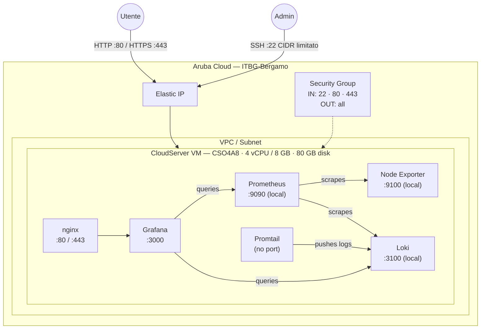

# Grafana + Prometheus + Loki su Aruba Cloud

Esegui il deployment di uno stack di osservabilità self-hosted completo — [Grafana](https://grafana.com), [Prometheus](https://prometheus.io), [Loki](https://grafana.com/oss/loki/) e [Promtail](https://grafana.com/docs/loki/latest/send-data/promtail/) — su Aruba Cloud tramite Terraform e cloud-init. Le sorgenti dati sono preconfigurate; accedi e inizia subito a costruire dashboard.

> **Versione provider:** arubacloud/arubacloud `~> 0.5` | **Terraform:** ≥ 1.9

---

## Introduzione

Questo esempio esegue il provisioning di uno stack di osservabilità pronto per la produzione su una singola VM Aruba Cloud con cinque componenti che girano come servizi systemd:

| Componente | Ruolo | Porta |
|-----------|-------|-------|
| **Grafana** | Dashboard, alerting e interfaccia di visualizzazione | 3000 (proxy nginx su 80/443) |
| **Prometheus** | Raccolta e archiviazione metriche (TSDB) | 9090 (solo localhost) |
| **Node Exporter** | Metriche di sistema dell'host (CPU, RAM, disco, rete) | 9100 (solo localhost) |
| **Loki** | Aggregazione e archiviazione log | 3100 (solo localhost) |
| **Promtail** | Spedizioniere log — segue `/var/log` e invia a Loki | — |

Prometheus e Loki sono legati a `127.0.0.1` e **non** sono raggiungibili da internet. Tutto il traffico esterno passa attraverso nginx (porta 80/443) verso Grafana sulla porta 3000.

Al primo accesso, Prometheus e Loki sono già configurati come sorgenti dati Grafana — nessuna configurazione manuale richiesta.

---

## Panoramica dell'architettura



---

## Infrastruttura creata

| Risorsa | Pattern del nome | Descrizione |
|---------|-----------------|-------------|
| `arubacloud_project` | `grafana-prod` | Contenitore del progetto |
| `arubacloud_vpc` | `grafana-prod-vpc` | Virtual Private Cloud |
| `arubacloud_subnet` | `grafana-prod-subnet` | Subnet base |
| `arubacloud_securitygroup` | `grafana-prod-vm-sg` | Security group |
| `arubacloud_securityrule` | `grafana-prod-vm-ssh` | Regola ingress SSH (CIDR limitato) |
| `arubacloud_securityrule` | `grafana-prod-vm-http` | Regola ingress HTTP |
| `arubacloud_securityrule` | `grafana-prod-vm-https` | Regola ingress HTTPS |
| `arubacloud_elasticip` | `grafana-prod-vm-eip` | IP pubblico della VM |
| `arubacloud_blockstorage` | `grafana-prod-boot` | Disco di boot da 80 GB (Performance) |
| `arubacloud_keypair` | `grafana-prod-keypair` | Chiave pubblica SSH |
| `arubacloud_cloudserver` | `grafana-prod-vm` | VM CloudServer |

---

## Costo mensile stimato

> Prezzi approssimativi per ITBG-Bergamo, fatturazione oraria.

| Risorsa | Specifiche | Costo stimato/mese |
|---------|-----------|-------------------|
| VM CloudServer | CSO4A8 — 4 vCPU / 8 GB | ~€36 |
| Disco di boot | 80 GB Performance | ~€10 |
| Elastic IP | — | ~€3 |
| **Totale** | | **~€49/mese** |

L'utilizzo del disco cresce nel tempo man mano che si accumulano il TSDB di Prometheus e i chunk di Loki. La conservazione predefinita è **30 giorni** per Prometheus e **31 giorni** (744 h) per Loki. Aumenta `vm_disk_size_gb` o riduci la conservazione per ambienti ad alto volume.

---

## Requisiti

- Terraform ≥ 1.9
- ArubaCloud Terraform Provider `~> 0.5`
- Un account ArubaCloud con credenziali API OAuth2
- Una coppia di chiavi SSH

---

## Variabili

### Obbligatorie

| Variabile | Descrizione |
|-----------|-------------|
| `arubacloud_client_id` | Client ID OAuth2 di ArubaCloud |
| `arubacloud_client_secret` | Client secret OAuth2 di ArubaCloud |
| `ssh_public_key` | Contenuto della chiave pubblica SSH |
| `grafana_admin_password` | Password admin Grafana (min 8 caratteri) |

### Opzionali

| Variabile | Default | Descrizione |
|-----------|---------|-------------|
| `app_name` | `"grafana"` | Nome breve usato in tutti i nomi delle risorse |
| `environment` | `"prod"` | Etichetta dell'ambiente |
| `location` | `"ITBG-Bergamo"` | Regione ArubaCloud |
| `zone` | `"ITBG-1"` | Zona di disponibilità |
| `billing_period` | `"Hour"` | `"Hour"` o `"Month"` |
| `vm_flavor` | `"CSO4A8"` | Flavor del CloudServer |
| `vm_image` | `"LU22-001"` | Immagine del disco di boot (Ubuntu 22.04 LTS) |
| `vm_disk_size_gb` | `80` | Dimensione del disco di boot in GB |
| `ssh_cidr` | `"0.0.0.0/0"` | CIDR per SSH — **limita al tuo IP in produzione** |
| `domain` | `""` | Dominio personalizzato per HTTPS — lascia vuoto per usare l'Elastic IP |
| `prometheus_version` | `"3.0.1"` | Versione del binario Prometheus |
| `loki_version` | `"3.4.2"` | Versione dei binari Loki + Promtail |
| `node_exporter_version` | `"1.8.2"` | Versione del binario Node Exporter |

---

## Output

| Output | Descrizione |
|--------|-------------|
| `grafana_url` | URL dell'interfaccia web di Grafana |
| `vm_public_ip` | Indirizzo IP pubblico della VM |
| `ssh_command` | Comando SSH per connettersi alla VM |
| `grafana_admin_password` | Password admin Grafana (sensibile) |

---

## Istruzioni di deployment

### 1. Clona e naviga

```bash
git clone https://github.com/arubacloud/terraform-arubacloud-examples.git
cd terraform-arubacloud-examples/grafana
```

### 2. Configura le variabili

```bash
cp terraform.tfvars.example terraform.tfvars
```

Imposta `grafana_admin_password` su un valore robusto, insieme alle credenziali e alla chiave SSH.

### 3. Esegui il deployment

```bash
terraform init
terraform plan
terraform apply
```

Il bootstrap richiede circa **8–12 minuti** (Grafana si installa tramite APT; Prometheus, Loki, Promtail e Node Exporter vengono scaricati come binari).

### 4. Accedi a Grafana

```bash
terraform output grafana_url
```

Apri l'URL nel browser e accedi con:

- **Nome utente:** `admin`
- **Password:** il valore di `grafana_admin_password`

### 5. Esplora i tuoi dati

- Vai su **Esplora** → seleziona la sorgente dati **Prometheus** → interroga `node_cpu_seconds_total` o `node_memory_MemAvailable_bytes` per le metriche dell'host.
- Vai su **Esplora** → seleziona la sorgente dati **Loki** → interroga `{job="varlogs"}` per vedere i log di sistema.

---

## Raccomandazioni di sicurezza

1. **Limita SSH al tuo IP.** Imposta `ssh_cidr = "your.ip/32"`.

2. **Usa un dominio personalizzato con HTTPS.** Imposta la variabile `domain`. Senza TLS, la password Grafana viene trasmessa in chiaro.

3. **Cambia la password admin** dopo il primo accesso tramite **Profilo → Cambia Password**.

4. **Non esporre direttamente Prometheus o Loki.** Entrambi i servizi si legano a `127.0.0.1` di default in questo esempio. Non aggiungere mai indirizzi listener `0.0.0.0` senza middleware di autenticazione.

---

## Risoluzione dei problemi

### Grafana mostra "sorgente dati non trovata"

```bash
ssh ubuntu@$(terraform output -raw vm_public_ip)
cat /etc/grafana/provisioning/datasources/observability.yaml
sudo systemctl restart grafana-server
```

### Prometheus non ha target

```bash
# Verifica che la configurazione prometheus sia valida:
promtool check config /etc/prometheus/prometheus.yml

# Visualizza i target Prometheus nell'interfaccia (tramite tunnel SSH):
ssh -L 9090:localhost:9090 ubuntu@$(terraform output -raw vm_public_ip)
# Poi apri http://localhost:9090/targets nel browser
```

### Loki non restituisce log in Grafana

```bash
sudo systemctl status promtail
sudo journalctl -u promtail -n 30
# Verifica che Loki abbia ricevuto dati:
curl -s http://localhost:3100/ready
```

---

## Riferimenti

- [Documentazione Grafana](https://grafana.com/docs/grafana/latest/)
- [Documentazione Prometheus](https://prometheus.io/docs/)
- [Documentazione Loki](https://grafana.com/docs/loki/latest/)
- [Documentazione Promtail](https://grafana.com/docs/loki/latest/send-data/promtail/)
- [Node Exporter](https://github.com/prometheus/node_exporter)
- [Provider Terraform ArubaCloud](https://registry.terraform.io/providers/arubacloud/arubacloud/latest/docs)
- [Riferimento cloud-init](https://cloudinit.readthedocs.io/)
