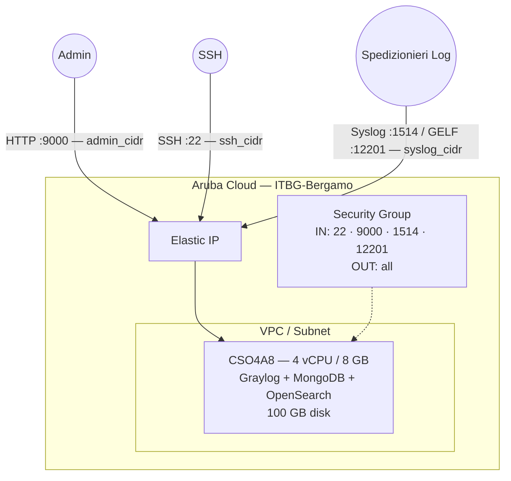

# Graylog su Aruba Cloud

Esegui il deployment di [Graylog](https://graylog.org/) — gestione centralizzata dei log con ricerca e alerting — su Aruba Cloud tramite Terraform e cloud-init. Distribuito via Docker Compose con MongoDB e OpenSearch co-locati su un singolo nodo.

> **Versione provider:** arubacloud/arubacloud `~> 0.5` | **Terraform:** ≥ 1.9

---

## Introduzione

Graylog fornisce una potente piattaforma di aggregazione log con ricerca strutturata, dashboard, alerting ed elaborazione degli stream. Richiede MongoDB (metadati) e OpenSearch (indice dei log). Questo esempio esegue il provisioning di:

- **Graylog** tramite l'immagine Docker ufficiale
- **MongoDB 6** per l'archiviazione della configurazione
- **OpenSearch 2** per l'indicizzazione e la ricerca dei log
- Interfaccia web sulla porta 9000, input Syslog sulla 1514, input GELF sulla 12201

---

## Panoramica dell'architettura



---

## Infrastruttura creata

| Risorsa | Pattern del nome | Descrizione |
|---------|-----------------|-------------|
| `arubacloud_project` | `gl-prod` | Contenitore del progetto |
| `arubacloud_vpc` | `gl-prod-vpc` | Virtual Private Cloud |
| `arubacloud_subnet` | `gl-prod-subnet` | Subnet base |
| `arubacloud_securitygroup` | `gl-prod-vm-sg` | Security group |
| `arubacloud_securityrule` | `gl-prod-vm-ssh` | Regola ingress SSH |
| `arubacloud_securityrule` | `gl-prod-vm-webui` | Interfaccia web Graylog TCP 9000 |
| `arubacloud_securityrule` | `gl-prod-vm-syslog` | Syslog TCP/UDP 1514 |
| `arubacloud_securityrule` | `gl-prod-vm-gelf` | GELF UDP 12201 |
| `arubacloud_elasticip` | `gl-prod-vm-eip` | IP pubblico della VM |
| `arubacloud_blockstorage` | `gl-prod-boot` | Disco di boot da 100 GB (Performance) |
| `arubacloud_keypair` | `gl-prod-keypair` | Chiave pubblica SSH |
| `arubacloud_cloudserver` | `gl-prod-vm` | VM CloudServer |

---

## Costo mensile stimato

| Risorsa | Specifiche | Costo stimato/mese |
|---------|-----------|-------------------|
| VM CloudServer | CSO4A8 — 4 vCPU / 8 GB | ~€35 |
| Disco di boot | 100 GB Performance | ~€15 |
| Elastic IP | — | ~€3 |
| **Totale** | | **~€53/mese** |

Per volumi di log in produzione, aggiorna a CSO8A16 (8 vCPU / 16 GB, ~€95/mese).

---

## Requisiti

- Terraform ≥ 1.9
- ArubaCloud Terraform Provider `~> 0.5`
- Un account ArubaCloud con credenziali API OAuth2
- Una coppia di chiavi SSH

---

## Variabili

### Obbligatorie

| Variabile | Descrizione |
|-----------|-------------|
| `arubacloud_client_id` | Client ID OAuth2 di ArubaCloud |
| `arubacloud_client_secret` | Client secret OAuth2 di ArubaCloud |
| `ssh_public_key` | Contenuto della chiave pubblica SSH |
| `graylog_admin_password` | Password admin Graylog (min 8 caratteri) |
| `graylog_secret` | Segreto password Graylog (min 16 caratteri — genera con `pwgen -N 1 -s 96`) |

### Opzionali

| Variabile | Default | Descrizione |
|-----------|---------|-------------|
| `app_name` | `"gl"` | Nome breve usato in tutti i nomi delle risorse |
| `environment` | `"prod"` | Etichetta dell'ambiente |
| `location` | `"ITBG-Bergamo"` | Regione ArubaCloud |
| `zone` | `"ITBG-1"` | Zona di disponibilità |
| `billing_period` | `"Hour"` | `"Hour"` o `"Month"` |
| `vm_flavor` | `"CSO4A8"` | Flavor del CloudServer |
| `vm_image` | `"LU22-001"` | Immagine del disco di boot (Ubuntu 22.04 LTS) |
| `vm_disk_size_gb` | `100` | Dimensione del disco di boot in GB (min 50 GB) |
| `ssh_cidr` | `"0.0.0.0/0"` | CIDR per SSH |
| `admin_cidr` | `"0.0.0.0/0"` | CIDR per l'interfaccia web porta 9000 |
| `syslog_cidr` | `"0.0.0.0/0"` | CIDR per gli input syslog/GELF |
| `graylog_version` | `"6"` | Tag immagine Docker Graylog |

---

## Output

| Output | Descrizione |
|--------|-------------|
| `graylog_url` | URL dell'interfaccia web Graylog |
| `vm_public_ip` | Indirizzo IP pubblico della VM |
| `ssh_command` | Comando SSH per connettersi alla VM |
| `syslog_endpoint` | Endpoint Syslog TCP/UDP |
| `gelf_endpoint` | Endpoint GELF UDP |

---

## Istruzioni di deployment

### 1. Clona e naviga

```bash
git clone https://github.com/arubacloud/terraform-arubacloud-examples.git
cd terraform-arubacloud-examples/graylog
```

### 2. Configura le variabili

```bash
cp terraform.tfvars.example terraform.tfvars
```

Genera un segreto robusto:

```bash
pwgen -N 1 -s 96
```

### 3. Esegui il deployment

```bash
terraform init
terraform plan
terraform apply
```

Il bootstrap richiede circa **5–10 minuti** (l'inizializzazione di OpenSearch è il passo più lento).

### 4. Accedi all'interfaccia

Naviga su `http://<IP>:9000` e accedi come `admin` con la tua `graylog_admin_password`.

### 5. Configura un input

Nell'interfaccia web: **Sistema → Input → Avvia nuovo input**. Seleziona **Syslog UDP** e associalo alla porta 1514.

---

## Invio dei log

```bash
# rsyslog: aggiungi a /etc/rsyslog.d/90-graylog.conf
*.* @<graylog-ip>:1514;RSYSLOG_SyslogProtocol23Format

# filebeat: in filebeat.yml
output.logstash:
  hosts: ["<graylog-ip>:5044"]
```

---

## Riferimenti

- [Documentazione Graylog](https://docs.graylog.org/)
- [Configurazione Docker Graylog](https://docs.graylog.org/docs/docker)
- [Provider Terraform ArubaCloud](https://registry.terraform.io/providers/arubacloud/arubacloud/latest/docs)
