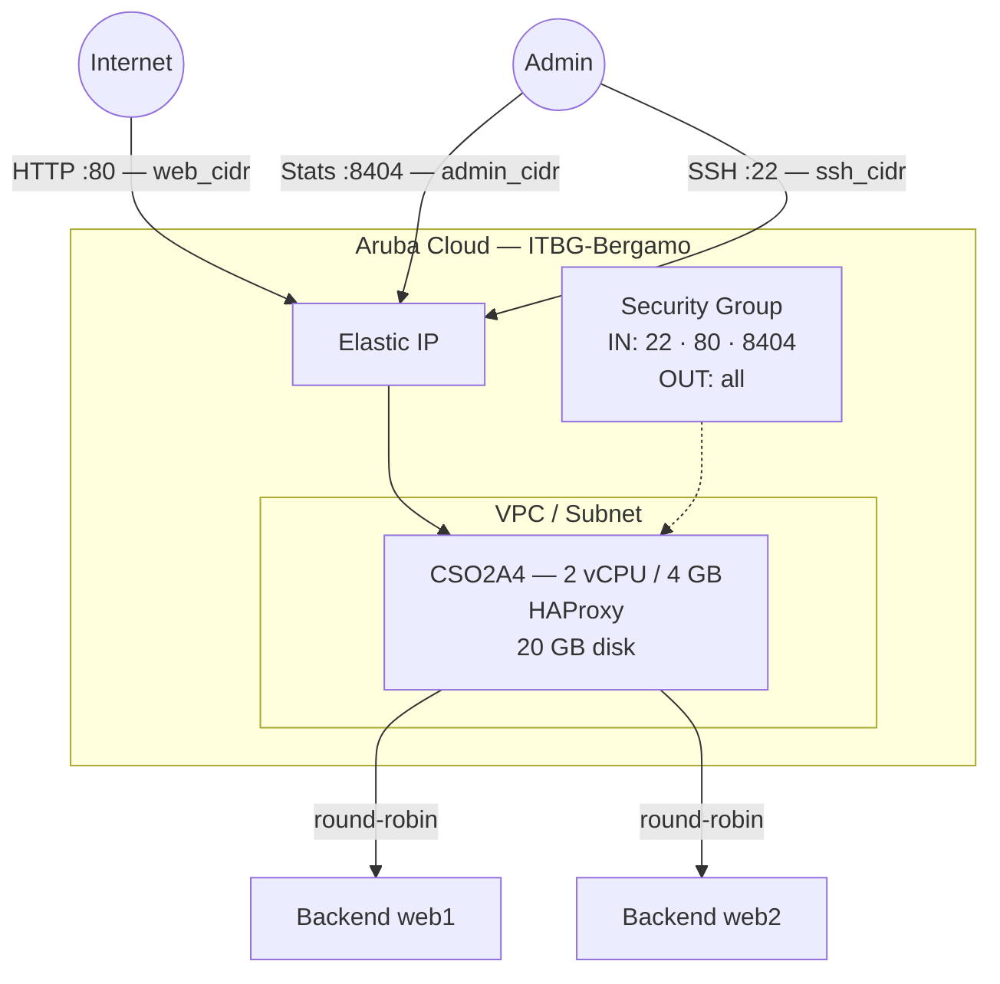

# HAProxy su Aruba Cloud

Esegui il deployment di [HAProxy](https://www.haproxy.org) — un load balancer e proxy TCP/HTTP ad alte prestazioni — su Aruba Cloud tramite Terraform e cloud-init. I server backend sono configurati direttamente come variabile Terraform, rendendo facile collegare HAProxy agli altri esempi di questo repository.

> **Versione provider:** arubacloud/arubacloud `~> 0.5` | **Terraform:** ≥ 1.9

---

## Introduzione

HAProxy è il load balancer open-source de-facto per applicazioni web ad alta disponibilità. Questo esempio esegue il provisioning di:

- **HAProxy** installato dai pacchetti Ubuntu 22.04
- **Frontend HTTP** sulla porta 80 con backend round-robin configurabili
- **Pagina statistiche** sulla porta 8404 (limitata a `admin_cidr`) con autenticazione tramite password
- Server backend forniti tramite la variabile Terraform `backends` — aggiungi o rimuovi server con `terraform apply`

> **Nessun backend?** Distribuisci senza backend e HAProxy restituirà 503 sulla porta 80. Aggiungi IP backend in seguito aggiornando `backends` e ri-applicando.

---

## Panoramica dell'architettura



---

## Infrastruttura creata

| Risorsa | Pattern del nome | Descrizione |
|---------|-----------------|-------------|
| `arubacloud_project` | `haproxy-prod` | Contenitore del progetto |
| `arubacloud_vpc` | `haproxy-prod-vpc` | Virtual Private Cloud |
| `arubacloud_subnet` | `haproxy-prod-subnet` | Subnet base |
| `arubacloud_securitygroup` | `haproxy-prod-vm-sg` | Security group |
| `arubacloud_securityrule` | `haproxy-prod-vm-ssh` | Regola ingress SSH |
| `arubacloud_securityrule` | `haproxy-prod-vm-http` | Regola ingress HTTP TCP 80 |
| `arubacloud_securityrule` | `haproxy-prod-vm-stats` | Pagina statistiche TCP 8404 |
| `arubacloud_elasticip` | `haproxy-prod-vm-eip` | IP pubblico della VM |
| `arubacloud_blockstorage` | `haproxy-prod-boot` | Disco di boot da 20 GB (Performance) |
| `arubacloud_keypair` | `haproxy-prod-keypair` | Chiave pubblica SSH |
| `arubacloud_cloudserver` | `haproxy-prod-vm` | VM CloudServer |

---

## Costo mensile stimato

| Risorsa | Specifiche | Costo stimato/mese |
|---------|-----------|-------------------|
| VM CloudServer | CSO2A4 — 2 vCPU / 4 GB | ~€18 |
| Disco di boot | 20 GB Performance | ~€3 |
| Elastic IP | — | ~€3 |
| **Totale** | | **~€24/mese** |

---

## Requisiti

- Terraform ≥ 1.9
- ArubaCloud Terraform Provider `~> 0.5`
- Un account ArubaCloud con credenziali API OAuth2
- Una coppia di chiavi SSH

---

## Variabili

### Obbligatorie

| Variabile | Descrizione |
|-----------|-------------|
| `arubacloud_client_id` | Client ID OAuth2 di ArubaCloud |
| `arubacloud_client_secret` | Client secret OAuth2 di ArubaCloud |
| `ssh_public_key` | Contenuto della chiave pubblica SSH |
| `stats_password` | Password per la pagina statistiche HAProxy (nome utente: `admin`) |

### Opzionali

| Variabile | Default | Descrizione |
|-----------|---------|-------------|
| `app_name` | `"haproxy"` | Nome breve usato in tutti i nomi delle risorse |
| `environment` | `"prod"` | Etichetta dell'ambiente |
| `location` | `"ITBG-Bergamo"` | Regione ArubaCloud |
| `zone` | `"ITBG-1"` | Zona di disponibilità |
| `billing_period` | `"Hour"` | `"Hour"` o `"Month"` |
| `vm_flavor` | `"CSO2A4"` | Flavor del CloudServer |
| `vm_image` | `"LU22-001"` | Immagine del disco di boot (Ubuntu 22.04 LTS) |
| `vm_disk_size_gb` | `20` | Dimensione del disco di boot in GB |
| `ssh_cidr` | `"0.0.0.0/0"` | CIDR per SSH |
| `web_cidr` | `"0.0.0.0/0"` | CIDR per il frontend HTTP porta 80 |
| `admin_cidr` | `"0.0.0.0/0"` | CIDR per la pagina statistiche porta 8404 — limita in produzione |
| `backends` | `[]` | Lista server backend nel formato `host:port` |

---

## Output

| Output | Descrizione |
|--------|-------------|
| `proxy_url` | URL del frontend HTTP HAProxy |
| `stats_url` | URL della pagina statistiche HAProxy |
| `vm_public_ip` | Indirizzo IP pubblico della VM |
| `ssh_command` | Comando SSH per connettersi alla VM |

---

## Istruzioni di deployment

### 1. Clona e naviga

```bash
git clone https://github.com/arubacloud/terraform-arubacloud-examples.git
cd terraform-arubacloud-examples/haproxy
```

### 2. Configura le variabili

```bash
cp terraform.tfvars.example terraform.tfvars
```

Imposta la password delle statistiche e opzionalmente i tuoi server backend:

```hcl
stats_password = "your-stats-password"
backends       = ["10.0.0.1:80", "10.0.0.2:80"]
```

### 3. Esegui il deployment

```bash
terraform init
terraform plan
terraform apply
```

Il bootstrap richiede circa **1–2 minuti**.

### 4. Accedi alla pagina statistiche

```bash
terraform output stats_url
```

Accedi con `admin` / `stats_password` per visualizzare conteggi di connessioni live, tassi di traffico e stato dei backend.

### 5. Aggiungi o rimuovi backend

Aggiorna la variabile `backends` e ri-applica — nessun riavvio della VM necessario:

```bash
# terraform.tfvars
backends = ["10.0.0.1:80", "10.0.0.2:80", "10.0.0.3:80"]
```

```bash
terraform apply
```

HAProxy si ricarica in modo corretto senza interrompere le connessioni attive.

---

## Raccomandazioni di sicurezza

1. **Limita `admin_cidr`** al tuo IP di gestione. La pagina statistiche espone IP dei server, conteggi delle connessioni e dettagli della configurazione.

2. **Usa HTTPS per la produzione.** Abbina HAProxy a un terminatore TLS (es. Caddy o NGINX davanti) oppure configura HAProxy per terminare SSL direttamente usando un certificato in `/etc/ssl/`.

---

## Risoluzione dei problemi

### HAProxy non si avvia

```bash
sudo haproxy -c -f /etc/haproxy/haproxy.cfg   # controllo configurazione
sudo systemctl status haproxy
sudo journalctl -u haproxy -n 30
```

### I server backend mostrano DOWN nelle statistiche

HAProxy esegue health check `GET /` su ogni backend. Assicurati che:

- I backend siano raggiungibili dalla VM HAProxy sulla porta configurata
- Il server HTTP backend restituisca 2xx su `GET /`

Verifica la connettività:

```bash
curl -sv http://<backend-ip>:<port>/
```

---

## Riferimenti

- [Documentazione HAProxy](https://docs.haproxy.org)
- [Manuale di configurazione HAProxy](https://docs.haproxy.org/2.8/configuration.html)
- [Provider Terraform ArubaCloud](https://registry.terraform.io/providers/arubacloud/arubacloud/latest/docs)
