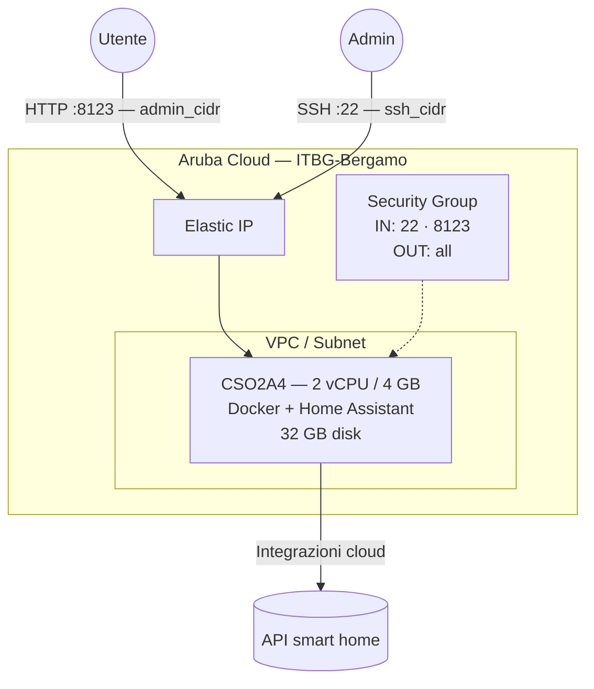

# Home Assistant su Aruba Cloud

Esegui il deployment di [Home Assistant](https://www.home-assistant.io) — la principale piattaforma open-source per la domotica — su Aruba Cloud tramite Terraform e cloud-init. Home Assistant viene eseguito come container Docker (edizione Home Assistant Container) con archiviazione persistente della configurazione.

> **Versione provider:** arubacloud/arubacloud `~> 0.5` | **Terraform:** ≥ 1.9

---

## Introduzione

Home Assistant è un hub di automazione domestica focalizzato sulla privacy che si integra con migliaia di dispositivi smart home. Questo esempio distribuisce l'edizione **Home Assistant Container**, che fornisce l'esperienza completa di Home Assistant core in un container Docker. Esegue il provisioning di:

- **Docker** installato dal repository apt Docker ufficiale
- **Home Assistant Container** (`ghcr.io/home-assistant/home-assistant:stable`) gestito da Docker Compose
- Configurazione persistente salvata in `/opt/homeassistant/config`
- Un servizio systemd che avvia Home Assistant automaticamente all'avvio
- Porta 8123 per l'interfaccia web, limitata a `admin_cidr`
- Timezone configurabile

> **Configurazione iniziale:** La prima visita all'interfaccia di Home Assistant avvia il wizard di onboarding dove crei il tuo account admin e configuri la posizione della tua casa. Nessuna credenziale viene preimpostata da Terraform.

---

## Panoramica dell'architettura



---

## Infrastruttura creata

| Risorsa | Pattern del nome | Descrizione |
|---------|-----------------|-------------|
| `arubacloud_project` | `ha-prod` | Contenitore del progetto |
| `arubacloud_vpc` | `ha-prod-vpc` | Virtual Private Cloud |
| `arubacloud_subnet` | `ha-prod-subnet` | Subnet base |
| `arubacloud_securitygroup` | `ha-prod-vm-sg` | Security group |
| `arubacloud_securityrule` | `ha-prod-vm-ssh` | Regola ingress SSH |
| `arubacloud_securityrule` | `ha-prod-vm-admin-ui` | Regola ingress interfaccia web TCP 8123 |
| `arubacloud_elasticip` | `ha-prod-vm-eip` | IP pubblico della VM |
| `arubacloud_blockstorage` | `ha-prod-boot` | Disco di boot da 32 GB (Performance) |
| `arubacloud_keypair` | `ha-prod-keypair` | Chiave pubblica SSH |
| `arubacloud_cloudserver` | `ha-prod-vm` | VM CloudServer |

---

## Costo mensile stimato

| Risorsa | Specifiche | Costo stimato/mese |
|---------|-----------|-------------------|
| VM CloudServer | CSO2A4 — 2 vCPU / 4 GB | ~€18 |
| Disco di boot | 32 GB Performance | ~€5 |
| Elastic IP | — | ~€3 |
| **Totale** | | **~€26/mese** |

---

## Requisiti

- Terraform ≥ 1.9
- ArubaCloud Terraform Provider `~> 0.5`
- Un account ArubaCloud con credenziali API OAuth2
- Una coppia di chiavi SSH

---

## Variabili

### Obbligatorie

| Variabile | Descrizione |
|-----------|-------------|
| `arubacloud_client_id` | Client ID OAuth2 di ArubaCloud |
| `arubacloud_client_secret` | Client secret OAuth2 di ArubaCloud |
| `ssh_public_key` | Contenuto della chiave pubblica SSH |

### Opzionali

| Variabile | Default | Descrizione |
|-----------|---------|-------------|
| `app_name` | `"ha"` | Nome breve usato in tutti i nomi delle risorse |
| `environment` | `"prod"` | Etichetta dell'ambiente |
| `location` | `"ITBG-Bergamo"` | Regione ArubaCloud |
| `zone` | `"ITBG-1"` | Zona di disponibilità |
| `billing_period` | `"Hour"` | `"Hour"` o `"Month"` |
| `vm_flavor` | `"CSO2A4"` | Flavor del CloudServer |
| `vm_image` | `"LU22-001"` | Immagine del disco di boot (Ubuntu 22.04 LTS) |
| `vm_disk_size_gb` | `32` | Dimensione del disco di boot in GB |
| `ssh_cidr` | `"0.0.0.0/0"` | CIDR per SSH |
| `admin_cidr` | `"0.0.0.0/0"` | CIDR per l'interfaccia web porta 8123 — limita in produzione |
| `timezone` | `"UTC"` | Timezone per Home Assistant |

---

## Output

| Output | Descrizione |
|--------|-------------|
| `home_assistant_url` | URL dell'interfaccia web Home Assistant |
| `vm_public_ip` | Indirizzo IP pubblico della VM |
| `ssh_command` | Comando SSH per connettersi alla VM |

---

## Istruzioni di deployment

### 1. Clona e naviga

```bash
git clone https://github.com/arubacloud/terraform-arubacloud-examples.git
cd terraform-arubacloud-examples/home-assistant
```

### 2. Configura le variabili

```bash
cp terraform.tfvars.example terraform.tfvars
```

Imposta credenziali, timezone e limita l'interfaccia al tuo IP:

```hcl
timezone   = "Europe/Rome"
admin_cidr = "203.0.113.42/32"
ssh_cidr   = "203.0.113.42/32"
```

### 3. Esegui il deployment

```bash
terraform init
terraform plan
terraform apply
```

Il bootstrap richiede circa **3–5 minuti** (installazione Docker + download immagine).

### 4. Completa l'onboarding

```bash
terraform output home_assistant_url
```

Apri l'URL — la prima visita mostra il wizard di onboarding. Crea il tuo account admin, imposta la posizione della tua casa e inizia ad aggiungere integrazioni.

---

## Raccomandazioni di sicurezza

1. **Limita `admin_cidr`** al tuo IP o al CIDR del tunnel VPN. Home Assistant su `0.0.0.0/0` è accettabile per la configurazione iniziale, ma dovrebbe essere bloccato prima di connettere qualsiasi dispositivo reale.

2. **Abilita HTTPS.** Home Assistant supporta TLS nativamente. Dopo l'onboarding, vai su **Impostazioni → Sistema → Rete** e configura una rete attendibile o abilita il proxy HTTPS integrato. In alternativa, posizionalo dietro Caddy o NGINX (da questo repository) per TLS automatico.

3. **Usa una VPN.** La configurazione a lungo termine consigliata è: limita `admin_cidr` al CIDR del tunnel WireGuard e accedi a Home Assistant esclusivamente tramite VPN.

---

## Risoluzione dei problemi

### Home Assistant non si carica dopo il deployment

```bash
ssh ubuntu@$(terraform output -raw vm_public_ip)
docker logs homeassistant --tail 50
sudo systemctl status homeassistant
```

Il primo avvio scarica ~200 MB da GitHub Container Registry — attendi 3–5 minuti.

### Aggiornamento di Home Assistant

```bash
ssh ubuntu@$(terraform output -raw vm_public_ip)
cd /opt/homeassistant
docker compose pull
docker compose up -d
```

Home Assistant rilascia nuove versioni mensilmente. Considera l'abilitazione di **Impostazioni → Sistema → Aggiornamenti** nell'interfaccia HA per aggiornamenti in-place.

---

## Riferimenti

- [Installazione Home Assistant Container](https://www.home-assistant.io/installation/linux#docker-compose)
- [Integrazioni Home Assistant](https://www.home-assistant.io/integrations/)
- [Esempio WireGuard](wireguard.md)
- [Provider Terraform ArubaCloud](https://registry.terraform.io/providers/arubacloud/arubacloud/latest/docs)
