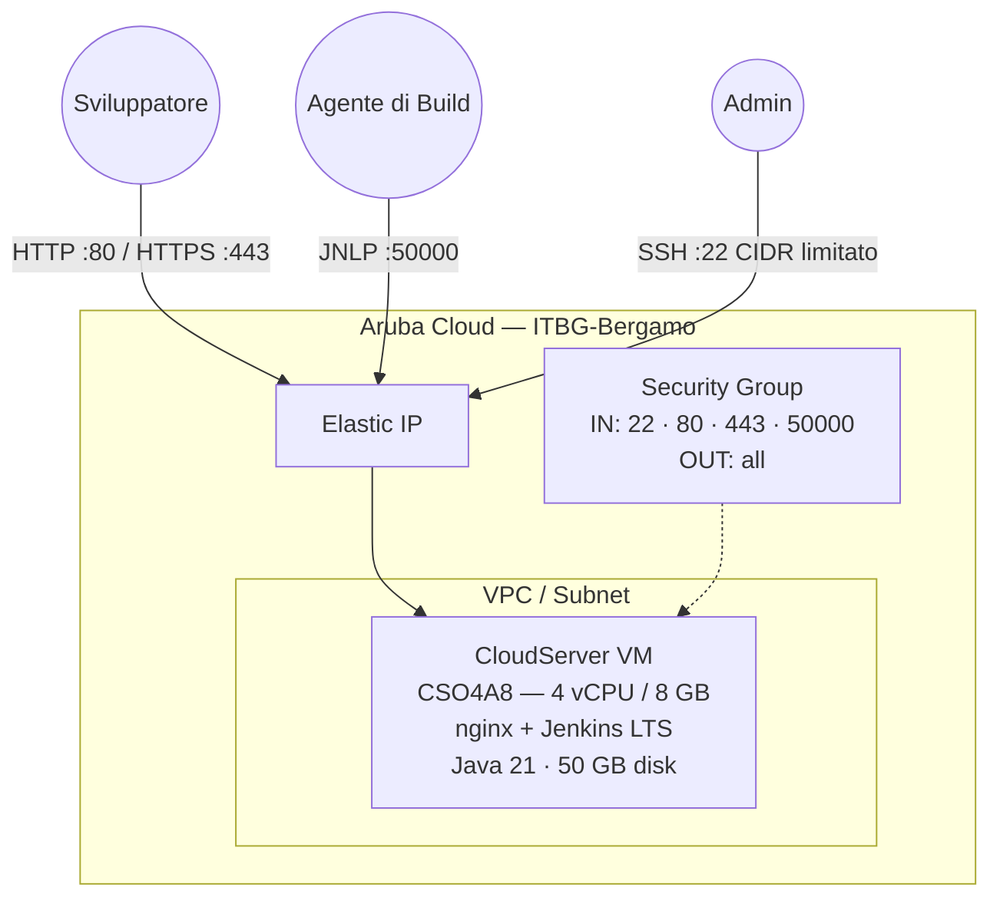

# Jenkins su Aruba Cloud

Esegui il deployment di un server di automazione CI/CD [Jenkins](https://www.jenkins.io) LTS pronto per la produzione su Aruba Cloud tramite Terraform e cloud-init. Java 21 + Jenkins LTS installati dal repository APT ufficiale — nessuna configurazione manuale richiesta.

> **Versione provider:** arubacloud/arubacloud `~> 0.5` | **Terraform:** ≥ 1.9

---

## Introduzione

Jenkins è il server di automazione open-source più diffuso per la build, il test e il deployment del software. Questo esempio esegue il provisioning di uno stack Jenkins LTS completo su Aruba Cloud con:

- Una **VM CloudServer** (CSO4A8 — 4 vCPU / 8 GB) che esegue Jenkins LTS dietro un reverse proxy nginx, completamente avviata da cloud-init
- **Java 21 (OpenJDK)** — la JVM raccomandata per Jenkins LTS
- Una **VPC, subnet e security group** dedicati tramite il modulo di rete condiviso
- Un **Elastic IP** per un accesso esterno stabile
- Porta **50000** aperta per gli agenti di build remoti che si connettono tramite il protocollo JNLP
- **HTTPS Let's Encrypt opzionale** quando viene fornito un dominio personalizzato

La password admin iniziale viene generata automaticamente e stampata nel log di bootstrap. Il primo accesso completa il wizard di configurazione di Jenkins.

---

## Panoramica dell'architettura

Jenkins è in ascolto sulla porta 8080. nginx fa il proxy di tutto il traffico HTTP/HTTPS verso Jenkins sullo stesso host, con `proxy_buffering off` per supportare lo streaming dei log della pipeline. Gli agenti remoti si connettono direttamente sulla porta 50000.



---

## Infrastruttura creata

| Risorsa | Pattern del nome | Descrizione |
|---------|-----------------|-------------|
| `arubacloud_project` | `jenkins-prod` | Contenitore del progetto |
| `arubacloud_vpc` | `jenkins-prod-vpc` | Virtual Private Cloud |
| `arubacloud_subnet` | `jenkins-prod-subnet` | Subnet base |
| `arubacloud_securitygroup` | `jenkins-prod-vm-sg` | Security group |
| `arubacloud_securityrule` | `jenkins-prod-vm-ssh` | Regola ingress SSH (CIDR limitato) |
| `arubacloud_securityrule` | `jenkins-prod-vm-http` | Regola ingress HTTP |
| `arubacloud_securityrule` | `jenkins-prod-vm-https` | Regola ingress HTTPS |
| `arubacloud_securityrule` | `jenkins-prod-vm-jnlp` | Regola ingress agente JNLP (porta 50000) |
| `arubacloud_elasticip` | `jenkins-prod-vm-eip` | IP pubblico della VM |
| `arubacloud_blockstorage` | `jenkins-prod-boot` | Disco di boot da 50 GB (Performance) |
| `arubacloud_keypair` | `jenkins-prod-keypair` | Chiave pubblica SSH |
| `arubacloud_cloudserver` | `jenkins-prod-vm` | VM CloudServer |

---

## Costo mensile stimato

> Prezzi approssimativi per ITBG-Bergamo, fatturazione oraria.

| Risorsa | Specifiche | Costo stimato/mese |
|---------|-----------|-------------------|
| VM CloudServer | CSO4A8 — 4 vCPU / 8 GB | ~€36 |
| Disco di boot | 50 GB Performance | ~€6 |
| Elastic IP | — | ~€3 |
| **Totale** | | **~€45/mese** |

---

## Requisiti

- Terraform ≥ 1.9
- ArubaCloud Terraform Provider `~> 0.5`
- Un account ArubaCloud con credenziali API OAuth2
- Una coppia di chiavi SSH

---

## Variabili

### Obbligatorie

| Variabile | Descrizione |
|-----------|-------------|
| `arubacloud_client_id` | Client ID OAuth2 di ArubaCloud |
| `arubacloud_client_secret` | Client secret OAuth2 di ArubaCloud |
| `ssh_public_key` | Contenuto della chiave pubblica SSH |

### Opzionali

| Variabile | Default | Descrizione |
|-----------|---------|-------------|
| `app_name` | `"jenkins"` | Nome breve usato in tutti i nomi delle risorse |
| `environment` | `"prod"` | Etichetta dell'ambiente |
| `location` | `"ITBG-Bergamo"` | Regione ArubaCloud |
| `zone` | `"ITBG-1"` | Zona di disponibilità |
| `billing_period` | `"Hour"` | `"Hour"` o `"Month"` |
| `vm_flavor` | `"CSO4A8"` | Flavor del CloudServer |
| `vm_image` | `"LU22-001"` | Immagine del disco di boot (Ubuntu 22.04 LTS) |
| `vm_disk_size_gb` | `50` | Dimensione del disco di boot in GB |
| `ssh_cidr` | `"0.0.0.0/0"` | CIDR per SSH — **limita al tuo IP in produzione** |
| `agent_cidr` | `"0.0.0.0/0"` | CIDR per la porta agente JNLP 50000 — limita alla rete dei tuoi agenti |
| `domain` | `""` | Dominio personalizzato per HTTPS — lascia vuoto per usare l'Elastic IP |

---

## Output

| Output | Descrizione |
|--------|-------------|
| `jenkins_url` | URL dell'interfaccia web di Jenkins |
| `vm_public_ip` | Indirizzo IP pubblico della VM |
| `ssh_command` | Comando SSH per connettersi alla VM |
| `initial_password_cmd` | Comando per recuperare la password admin iniziale |
| `jnlp_agent_port` | Porta JNLP per gli agenti di build remoti (50000) |

---

## Istruzioni di deployment

### 1. Clona e naviga

```bash
git clone https://github.com/arubacloud/terraform-arubacloud-examples.git
cd terraform-arubacloud-examples/jenkins
```

### 2. Configura le variabili

```bash
cp terraform.tfvars.example terraform.tfvars
```

Modifica `terraform.tfvars` con le tue credenziali e chiave SSH.

### 3. Inizializza e distribuisci

```bash
terraform init
terraform plan
terraform apply
```

Il bootstrap richiede circa **5–8 minuti** (installazione Java e Jenkins da APT).

### 4. Recupera la password admin iniziale

```bash
terraform output -raw initial_password_cmd | bash
```

### 5. Completa il wizard di configurazione

Apri l'URL Jenkins nel browser:

```bash
terraform output jenkins_url
```

Incolla la password admin iniziale, installa i plugin suggeriti e crea il tuo account admin.

---

## Raccomandazioni di sicurezza

1. **Limita SSH al tuo IP.** Imposta `ssh_cidr = "your.ip/32"`.

2. **Limita JNLP alla rete dei tuoi agenti.** Imposta `agent_cidr` sull'intervallo IP dei tuoi agenti di build. Esporre la porta 50000 pubblicamente consente a chiunque di tentare la registrazione di agenti.

3. **Usa un dominio personalizzato con HTTPS.** Imposta la variabile `domain` per abilitare TLS. Senza HTTPS, le credenziali inviate tramite l'interfaccia web vengono trasmesse in chiaro.

4. **Disabilita il bypass della sicurezza agente-controller.** In Jenkins → Gestisci Jenkins → Sicurezza, assicurati che "Sicurezza Agente → Controller" sia abilitata.

5. **Crea un account di servizio non-admin** per le pipeline. Evita di eseguire pipeline come admin Jenkins.

6. **Esegui backup di `JENKINS_HOME`.** Tutta la configurazione dei job, le credenziali e la cronologia delle build si trovano in `/var/lib/jenkins`. Pianifica snapshot regolari.

---

## Risoluzione dei problemi

### Jenkins non raggiungibile dopo apply

```bash
ssh ubuntu@$(terraform output -raw vm_public_ip)
sudo systemctl status jenkins
sudo journalctl -u jenkins -n 50
sudo tail -f /var/log/cloud-init-output.log
```

### nginx restituisce 502 Bad Gateway

Jenkins sta ancora avviandosi. Jenkins impiega 1–2 minuti per inizializzarsi al primo avvio:

```bash
sudo systemctl status jenkins
# Attendi "Jenkins is fully up and running" nei log:
sudo journalctl -u jenkins -f
```

---

## Riferimenti

- [Documentazione Jenkins](https://www.jenkins.io/doc/)
- [Release Jenkins LTS](https://www.jenkins.io/changelog-stable/)
- [Jenkins su Ubuntu/Debian](https://www.jenkins.io/doc/book/installing/linux/#debianubuntu)
- [Provider Terraform ArubaCloud](https://registry.terraform.io/providers/arubacloud/arubacloud/latest/docs)
- [Riferimento cloud-init](https://cloudinit.readthedocs.io/)
